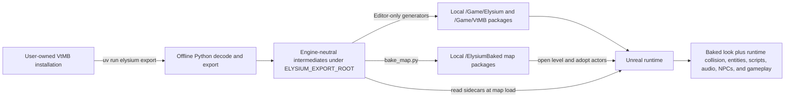

# Elysium-Unreal

*Vampire: The Masquerade – Bloodlines* rebuilt as a playable remaster on Unreal
Engine 5.8 and C++.

Elysium is a from-data reconstruction, not a port of the original engine. This
repository contains an offline Python pipeline that decodes a user's own VtMB
installation, an Unreal runtime that reproduces the game's systems, generated-content
tooling, repeatable reverse-engineering instruments, tests, and the design documents
that connect them.

> [!IMPORTANT]
> Elysium is under active development. It is not yet an end-to-end playable release,
> and this repository does not contain the original game or any game-derived assets.

The short version is:

- the pipeline reads a locally installed copy of VtMB and exports engine-neutral data;
- an Unreal Editor commandlet bakes each map's static visual layer into native,
  gitignored `.uasset` and `.umap` packages;
- the running game opens the baked level, adopts its visual actors, and constructs
  collision, entities, scripting, audio, NPCs, and gameplay from exported sidecars;
- all game-derived and generated content stays outside Git and can be rebuilt from the
  user's installation.

## Project direction

The target is a **remaster**, not a pixel-perfect recreation and not a redesign. The
project divides changes into three layers:

| Layer | Policy |
|---|---|
| Presentation | Modernize UI, typography, materials, textures, and post-processing when it preserves VtMB's grimy gothic-punk direction or fixes a technical limitation. |
| Feel | Reproduce the reverse-engineered movement, camera, combat, animation, and mix first; keep the faithful behavior comparable; polish only through an explicit owner decision. |
| Logic and content | Reproduce entity semantics, I/O, scripts, dialogue, stats, quests, saves, and authored content. |

The governing rule is: **only change what is understood, and only on an explicit
call**. Unknown behavior defaults to reproduction rather than invention. The complete
charter is [remaster-direction.md](docs/project/remaster-direction.md), and the build
strategy is [rebuild-strategy.md](docs/project/rebuild-strategy.md).

The UI is the main presentation exception: it keeps VtMB's screen structure and visual
language but is rebuilt with resolution-independent Slate/CommonUI and vector type. It
does not ship a 640×480 VGUI or bitmap-font “classic mode.” The world keeps a faithful
baseline, with optional asset enhancement designed as an A/B layer over that baseline.

## Bring your own game

Nothing sourced from VtMB is committed. The repository contains decoders, runtime code,
generators, tests built from game-independent fixtures, and research specifications. It
does **not** contain:

- VtMB maps, models, textures, audio, dialogue, scripts, saves, or archives;
- generated Unreal packages;
- decompilation, Ghidra projects, dumps, captures, or other research evidence;
- downloaded third-party plugin source.

The pipeline reads `ELYSIUM_VTMB_ROOT` as a read-only source. Exports, captures, caches,
logs, and research results live below `ELYSIUM_WORK_ROOT`; generated Unreal packages are
written into ignored local mounts. Git LFS is not an exception to this boundary. See
[repository policy](docs/operations/repository.md) for the enforced file rules.

## Current status

[The master roadmap](docs/project/roadmap.md) is the canonical project tracker, with three
declared scoped subtrackers: [retail capture](docs/project/retail-capture-roadmap.md),
[skeletal animation](docs/project/animation-roadmap.md), and
[Character/Camera/Controls](docs/project/three-cs-roadmap.md). This section is a readable
summary, not a second checklist.

| Area | State |
|---|---|
| Playable path | New Game, character generation, and Genesis are complete as PP1. Work is concentrated on PP2: making the complete `sp_theatre` intro play with choreography, camera, audio, subtitles, facial animation, eyelids, and lipsync. |
| Runtime spine | App/session/map lifetimes, the retail-ordered frame, one game clock, the player entity, input scopes, the command bus, camera, presentation seam, save/load, and the map activation barrier are implemented. The real played-input automation tier remains open. |
| Maps and world | Export, native map baking, hard travel, baked-actor adoption, runtime collision, lights, sky/fog, decals, ropes, props, NPC bodies, and landmark placement are implemented. Async construction, packaged content paths, complete scale-out, and hardware-floor validation remain open. |
| Entities and interaction | The plain-C++ entity world, class registry, I/O queue, triggers, doors, buttons, `+use`, tutorial logic classes, Source movement, changelevel travel, and debug inspection are in place. The rest of the rotating/linear/elevator family and faithful mover pushing are incomplete. |
| Scripting and game state | The expression host, embedded CPython level-script host, native `vampire` bindings, script filesystem, dialogue parser/runner, character sheet, quests/XP, character generation, Genesis, and saves are implemented. Inventory, NPC reactions, economy, the dice resolver, and the remaining script action surface are open. |
| Audio, characters, and UI | WAV/MP3 decoding, `ambient_generic`, SoundSchemes, mover sounds, runtime glTF skeletal characters, dynamic/physics props, the menu/New Game path, and the UI foundation exist. The final loose-audio service and mixer policy, conversation presentation, HUD migration, options/accessibility, and remaining player-body work are incomplete. |
| Theatre and retail capture | Choreography, authored camera tracks, actor/prop binding, scene timing, save restoration, and the theatre export/bake are implemented but task 12.1 remains partial pending its remaining reverse-engineering work and live acceptance. Scene audio/subtitles and facial/lip runtime evaluation are open. The capture program has completed its baseline, first acquisition/calibration, pose-generation identity, model/skeleton census, and actor lifetime work; per-contribution source attribution is next. |

The immediate unblocked front is the theatre capture/decode/compare loop, the played-input
test tier, and the durable inventory/reaction/economy systems. Graphics and performance
polish are intentionally frozen until the playable path reaches the end of the tutorial.

What this means in practical terms: the project has a substantial working engine and
content path, but it is still a development build. The complete theatre, the handoff to
Jack, the full tutorial mechanics, horizontal map coverage, packaging, and validation on
the minimum GPU are not finished.

## How the project works

Elysium has two deliberately clean halves joined by files on disk:



### 1. Offline decode and export

`uv run elysium export ...` coordinates the Python package under `pipeline/`. Format
readers decode the user's install and exporters write map geometry, textures, models,
scripts, dialogue, audio metadata, UI references, and gameplay sidecars beneath
`ELYSIUM_EXPORT_ROOT`.

Important map products include:

- world and sky geometry (`.obj`/`.mtl`) plus decoded textures;
- entity records and Source I/O (`.ents`);
- world and displacement collision (`.hulls`, `.dispcol`);
- props, lights, decals, ropes, sky/fog, LUT, water, and spawn sidecars;
- skeletal characters and animations as glTF plus facial/animation indexes;
- copied scripts, dialogue, scene, lip, sound, configuration, and `vdata` products.

The pipeline is a build-time tool. It is never imported or executed by the running game.
The embedded CPython 2.7 VM in the C++ runtime is a separate system used to run VtMB's own
level scripts.

### 2. Native Unreal bake

Runtime-built meshes do not receive all of Unreal's editor-built rendering data. In
particular, they miss the fitted Lumen surface-cache cards, Nanite data, distance fields,
LODs, and native texture compression that the target render path depends on.

For that reason, `pipeline/unreal/bake_map.py` runs in an Unreal Editor commandlet and
turns each exported map's **look** into a native level at
`/ElysiumBaked/<map>/<map>`. The bake includes world and sky geometry, materials,
textures, static props, movable-brush mesh assets, decals, lights, sky light, and height
fog. The result is local, ignored, and reproducible. There is no fallback runtime-rendered
version of the static world.

Global generators also produce the boot shell and shared packages under `/Game/Elysium`
and `/Game/VtMB/**`. These virtual package paths are runtime contracts and must not be
renamed.

### 3. Runtime map construction

Travel uses standard Unreal hard travel. `UElysiumMapSubsystem` opens the generated level,
then one `AElysiumMapActor` owns that map epoch. It adopts baked actors by tags and builds
the dynamic half from exported files:

- `.hulls` and `.dispcol` become the walkable collision surface;
- `.ents` becomes a plain-C++ entity world with class descriptors, fields, inputs,
  outputs, thinks, and one deterministic event queue;
- entity-driven brush bodies, props, NPC skeletal bodies, and the player body are created
  as disposable Unreal embodiments;
- ropes, sky cubemap/backdrop, live light calibration, audio, dialogue, and level scripts
  are attached to the map epoch;
- session state is hydrated into the map's player entity and written back before travel
  or save.

`BeginPlay` does not mean the map is ready. The map actor progresses through
`Building → WaitingForPrerequisites → Activating → Active|Failed`. Collision, player
placement, tick prerequisites, runtime records, and initial overlaps must all be ready
before the entity world activates and the loading screen is released.

### 4. Coordinates cross the boundary once

Source-to-Unreal conversion is owned only by
[`pipeline/src/elysium_pipeline/formats/bsp.py`](pipeline/src/elysium_pipeline/formats/bsp.py).
Coordinate-bearing exporters use the `UE_` prefix and emit centimetres, Z-up,
left-handed data with winding already reversed for the Y reflection. Runtime readers use
those coordinates verbatim. Standard glTF is the one exemption because the format is
self-describing and glTFRuntime performs its import transform.

### 5. Runtime ownership and frame order

State is divided by lifetime so travel and save/load remain deterministic:

| Lifetime | Main owner | Examples |
|---|---|---|
| Application | `UElysiumGameInstance` and its subsystems | settings, UI screens, input scopes, audio decode cache, CPython VM, map and flow services |
| Session | `FElysiumSessionRecord` | `G`, quests, player sheet/inventory/counters, game clock, RNG streams, per-map snapshots |
| Map epoch | `AElysiumMapActor` and `FElysiumEntityWorld` | entities, I/O queue, collision bodies, light rig, sound schemes, per-map asset caches |
| Frame | recomputed data | user command, camera/view state, look cursor, presentation events |

The active gameplay frame follows the recovered retail order: sample input, advance the
single game clock, run the player's think, move the pawn, run entity thinks, service queued
I/O and scripts, let physics/overlaps resolve, update use/camera state, solve the camera,
then publish one `FElysiumViewState` for the UI. Tick prerequisites pin that order rather
than relying on Unreal registration order.

### 6. Entity logic is separate from Unreal bodies

Every gameplay entity is a plain C++ `FElysiumEntity`. Unreal actors and components are
optional bodies for rendering, collision, audio, and overlap delivery; they do not own the
game state. A single class descriptor table provides key fields, script access, input
dispatch, save enumeration, and debug inspection. All input delivery passes through
`FElysiumEntityWorld::AcceptInput`, and all delayed work goes through the serializable
`FElysiumEventQueue` on the game clock—never `FTimerManager`.

That separation is what allows headless substrate tests, deterministic saves, map-epoch
teardown, and faithful Source I/O without turning every logical record into an Unreal
actor.

## Rendering target

The current render path requires:

- Windows, DirectX 12, and Shader Model 6;
- a DXR-capable NVIDIA GPU;
- hardware-ray-traced Lumen GI/reflections, MegaLights, and Virtual Shadow Maps;
- a minimum target of an RTX 4060-class desktop GPU with 16 GB at native 1440p;
- an RTX 4070/5070-class GPU as the recommended tier.

Lumen is not optional polish here: VtMB's look is dominated by indirect bounce, and the
native bake exists largely to give Lumen the representations it needs. The minimum target
is still an extrapolated floor; measurements currently come from an RTX 5070 Ti. The game
window must report `PCD3D_SM6`; a fallback to SM5 silently disables the intended render
path. See [rendering performance](docs/architecture/rendering-perf.md) for the evidence,
configuration, and profiling procedure.

## Repository map

| Path | Purpose |
|---|---|
| [`Source/ElysiumUE/`](Source/ElysiumUE/) | The UE 5.8 runtime module. `Public/` is the module API; `Private/` is grouped by architecture layer. |
| [`Config/`](Config/) | Engine, render, project, and input configuration. |
| [`pipeline/src/elysium_pipeline/`](pipeline/src/elysium_pipeline/) | Python CLI, path/config ownership, task orchestration, format readers, exporters, enhancement tools, and validators. |
| [`pipeline/unreal/`](pipeline/unreal/) | Editor-only package generators, map bake, and bake verification. |
| [`pipeline/tests/`](pipeline/tests/) | Game-independent Python contract and orchestration tests. |
| [`research/`](research/) | Reproducible cases and authored Ghidra, probe, and live-capture tooling; generated evidence stays outside Git. |
| [`docs/project/`](docs/project/) | Roadmaps, strategy, and remaster direction. |
| [`docs/architecture/`](docs/architecture/) | Unreal designs and integration seams. |
| [`docs/vtmb/`](docs/vtmb/) | Confirmed engine-neutral VtMB formats and behavior. |
| [`docs/recovered/`](docs/recovered/) | Explicitly uncertain reconstructions and their confidence. |
| [`docs/operations/`](docs/operations/) | Repository, build, research, and Git procedures. |
| [`Content/Fonts/`](Content/Fonts/) | The only tracked content inputs: licensed, game-independent loose font sources. |
| [`Plugins/ElysiumBaked/`](Plugins/ElysiumBaked/) | The tracked mount descriptor; its generated `Content/` directory is ignored. |
| [`dev/`](dev/) | Dependency lock, patches, local-path template, and repository-policy support. |

Generated directories such as `Binaries/`, `Intermediate/`, `Saved/`,
`Content/VtMB/`, `Content/Elysium.umap`, `Plugins/External/`, and
`Plugins/ElysiumBaked/Content/` are local products, not authored source.

## Developer source guide

### Read these first

1. [The master roadmap](docs/project/roadmap.md) for current priority, acceptance
   criteria, and project status.
2. [The rebuild strategy](docs/project/rebuild-strategy.md) and
   [remaster direction](docs/project/remaster-direction.md) for the project contract.
3. [The runtime source guide](Source/ElysiumUE/CLAUDE.md) and
   [pipeline source guide](pipeline/CLAUDE.md) for the folder-to-layer maps and local
   invariants.
4. [Runtime architecture](docs/architecture/runtime-architecture.md),
   [map architecture](docs/architecture/map-architecture.md), and
   [the native bake](docs/architecture/uasset-bake-spike.md) for the end-to-end object and
   content flow.
5. [Engine core](docs/architecture/engine-core.md) before changing entities, I/O, time,
   scripting, save state, or debug inspection.
6. [`docs/index.yaml`](docs/index.yaml) to find the one document that owns a design or
   recovered VtMB fact. Do not create a second owner for the same fact.

Directory-scoped `CLAUDE.md`/`AGENTS.md` files are part of the development contract. Read
the nearest one before changing files in that directory.

### Where to start in the code

| If you are tracing… | Start here | Then follow |
|---|---|---|
| CLI/configuration | [`pipeline/src/elysium_pipeline/cli.py`](pipeline/src/elysium_pipeline/cli.py) | `config.py`, `paths.py`, `tasking.py`, `export_manager.py` |
| A VtMB file format | [`pipeline/src/elysium_pipeline/formats/`](pipeline/src/elysium_pipeline/formats/) | the owning format document under `docs/vtmb/`, then its exporter/tests |
| Map export | [`UE_bsp_to_scene.py`](pipeline/src/elysium_pipeline/exporters/UE_bsp_to_scene.py) | `formats/bsp.py`, `export_manager.py`, `profiles.toml` |
| Native package generation | [`pipeline/unreal/build_content.py`](pipeline/unreal/build_content.py) | `make_*.py`, `bake_map.py`, `bake_lib.py`, `bake_verify.py` |
| Boot and application flow | [`ElysiumGameFlowSubsystem.cpp`](Source/ElysiumUE/Private/Session/ElysiumGameFlowSubsystem.cpp) | `ElysiumGameStateSubsystem.cpp`, `ElysiumGameMode.cpp`, runtime architecture |
| Travel and map readiness | [`ElysiumMapSubsystem.cpp`](Source/ElysiumUE/Private/Map/ElysiumMapSubsystem.cpp) | `ElysiumMapActor.cpp`, `ElysiumMapCollision.cpp`, map architecture |
| Entity parsing and I/O | [`ElysiumEntityWorld.cpp`](Source/ElysiumUE/Private/Substrate/ElysiumEntityWorld.cpp) | `ElysiumEntityDefs.cpp`, `ElysiumClassRegistry.cpp`, `ElysiumEventQueue.h` |
| An entity classname | [`ElysiumClassRegistry.cpp`](Source/ElysiumUE/Private/Substrate/ElysiumClassRegistry.cpp) | the matching `*Classes.cpp` or specialized implementation in `Substrate/` |
| Level scripts/dialogue | [`ElysiumPythonVM.cpp`](Source/ElysiumUE/Private/Scripting/ElysiumPythonVM.cpp) | `ElysiumScriptHost.cpp`, `ElysiumScriptNatives.cpp`, `ElysiumPythonEntity.cpp`, `ElysiumDlg.cpp` |
| Input and movement | [`ElysiumInputRouter.cpp`](Source/ElysiumUE/Private/Player/ElysiumInputRouter.cpp) | `ElysiumCommandBus.cpp`, `ElysiumUserCmd.cpp`, `ElysiumMovementComponent.cpp`, `ElysiumMoveSolve.h` |
| Rendering and map visuals | [`ElysiumMapVisuals.cpp`](Source/ElysiumUE/Private/Visual/ElysiumMapVisuals.cpp) | light, material, texture, environment, decal, rope, prop, and NPC code in `Visual/` |
| Audio | [`ElysiumAudioSubsystem.cpp`](Source/ElysiumUE/Private/Audio/ElysiumAudioSubsystem.cpp) | `ElysiumLineService.cpp`, `ElysiumSoundCache.cpp`, `ElysiumSoundScheme.cpp` |
| UI and presentation | [`ElysiumPresentationSubsystem.cpp`](Source/ElysiumUE/Private/UI/ElysiumPresentationSubsystem.cpp) | `ElysiumUISubsystem.cpp`, screen/widget classes, `ElysiumViewState.h` |
| Save/load | [`ElysiumSaveSubsystem.cpp`](Source/ElysiumUE/Private/Session/ElysiumSaveSubsystem.cpp) | `ElysiumSaveArchive.cpp`, public save types, save architecture |
| Runtime tests/debugging | [`Source/ElysiumUE/Private/Tests/`](Source/ElysiumUE/Private/Tests/) | `Private/Debug/`, [debug-tooling.md](docs/architecture/debug-tooling.md) |
| Retail investigation | [`research/cases/`](research/cases/) | authored instruments under `research/tooling/`; evidence under `ELYSIUM_WORK_ROOT/research` |

### Runtime layer map

`Source/ElysiumUE/Private/` is arranged by dependency-visible layers:

| Folder | Responsibility |
|---|---|
| `Map/` | Map actor/subsystem, runtime collision, brush components. |
| `Substrate/` | Plain-C++ entities, registry, fields/inputs, I/O, movers, expressions, rules, quests, character state. |
| `Scripting/` | CPython VM and hosts, native bindings, script filesystem, dialogue machine. |
| `Visual/` | Adopted/built visuals, materials, textures, lights, sky/fog, decals, props, NPC meshes/animation, ropes. |
| `Audio/` | Media decoding, sound cache, voice/line service, SoundSchemes. |
| `Player/` | Pawn, movement, input router/scopes, user commands, camera, binds. |
| `UI/` | CommonUI/Slate screens, HUD, design system, view-state presentation. |
| `Session/` | App/game state, clock/time control, save/load, RNG. |
| `Debug/` | Cog windows, console, MCP tools, profilers, probes, screenshots, movement and model harnesses. |
| `Tests/` | Content-free substrate tests and export-backed content tests. |

`Public/` remains flat because it is the module API rather than another architecture
layer. Private headers are included with their layer path so cross-layer dependencies are
visible at the top of each file.

### Load-bearing implementation rules

- Keep game-derived data, generated packages, research evidence, third-party source, and
  scratch output out of Git.
- Use `uv run elysium` as the public command surface; do not make internal exporters or
  editor scripts into competing entrypoints.
- Resolve offline paths only through `elysium_pipeline.paths`; runtime content paths go
  through `FElysiumContentPaths`.
- Never run the offline Python pipeline from gameplay code.
- Never hand-edit generated `.uasset` or `.umap` files. Change the generator and rebuild.
- Keep `/Game/Elysium`, `/Game/VtMB/**`, and `/ElysiumBaked/**` stable.
- Perform Source-to-Unreal coordinate conversion only in the pipeline. Runtime readers do
  not convert coordinates.
- Keep gameplay state on plain C++ entities and session records; Unreal bodies are
  replaceable embodiments.
- Use the one game clock and serializable event queue for game-visible timing. Do not use
  Unreal timers for entity logic.
- Route all entity input through `FElysiumEntityWorld::AcceptInput` and all deferral
  through `FElysiumEventQueue::Add` so scripting, save/load, logs, and debugging observe
  the same behavior.
- A freshly loaded entity world is dormant. Activation happens only after map
  prerequisites are satisfied.
- UI reads the published `FElysiumViewState`; it does not reach into the entity world.
- Put implementation in source, design in `docs/architecture/`, VtMB facts in
  `docs/vtmb/`, uncertain reconstruction in `docs/recovered/`, and status only in the
  master roadmap or one of its three declared scoped subtrackers.

## Getting started

### Requirements

- Windows 64-bit;
- Unreal Engine 5.8;
- Visual Studio with the components declared in [`.vsconfig`](.vsconfig);
- [`uv`](https://docs.astral.sh/uv/) and Python 3.12 (the project pins Python through
  [`.python-version`](.python-version));
- a legally obtained local VtMB installation;
- an external work directory for generated data;
- DX12/SM6 and a DXR-capable GPU for rendered play.

The build fetches pinned Cog and glTFRuntime sources into `Plugins/External/` and a pinned
CPython 2.7.18 SDK into `Source/ElysiumUE/ThirdParty/CPython27/`. These are managed,
gitignored dependencies declared in [`dev/dependencies.lock.json`](dev/dependencies.lock.json).

### Configure local paths

Copy the template and edit it for the current machine:

```powershell
Copy-Item dev/paths.example.env .elysium.local.env
```

```text
ELYSIUM_UE_ROOT=D:\Epic\UE_5.8
ELYSIUM_VTMB_ROOT=E:\Games\Vampire The Masquerade - Bloodlines
ELYSIUM_WORK_ROOT=E:\elysium-work
```

`ELYSIUM_EXPORT_ROOT` may optionally override the default
`$ELYSIUM_WORK_ROOT/exports`. Command-line path options override environment variables;
environment variables override `.elysium.local.env`. VtMB and work paths are never
guessed relative to the checkout.

### Restore and verify the workspace

```powershell
uv sync --locked
uv run elysium deps sync
uv run elysium doctor
```

`deps sync` restores pinned external dependencies and applies their tracked patches.
`doctor` verifies local paths, dependency ownership, generated prerequisites, and the Git
boundary.

For a clean checkout, the complete reconstruction path is:

```powershell
uv run elysium reconstruct --clean --rebuild
```

That command restores dependencies, rebuilds Unreal, exports and bakes the configured
corpus, verifies the products, and runs the required tests. `--clean` is ownership-guarded
and only applies to configured generated targets, but it is intentionally the expensive
full reconstruction path.

### Focused development loop

```powershell
# Build the Unreal runtime.
uv run elysium build

# Export, bake, and verify one or more maps.
uv run elysium export map sp_tutorial_1
uv run elysium export map sp_theatre sm_pawnshop_1

# Export a map without invoking the editor bake.
uv run elysium export map sp_tutorial_1 --intermediate-only

# Run Unreal automation tiers.
uv run elysium test Substrate
uv run elysium test Content

# Launch development surfaces.
uv run elysium run editor
uv run elysium run play sp_tutorial_1
```

Use `Substrate` for changes to plain C++ gameplay, scripting, session, player, or UI
logic. Use `Content` when the behavior reads the real export corpus; it self-skips when
that corpus is unavailable. Test JSON and HTML reports are written below
`$ELYSIUM_EXPORT_ROOT/_tests/`, and the command propagates the test exit code.

The repository-policy CI checks can also be run locally:

```powershell
uv run elysium doctor --repo-only
uv run python -m compileall -q pipeline/src research dev
uv run python -m unittest discover -s pipeline/tests -v
```

### Export profiles and development harnesses

```powershell
# Canonical multi-map test corpus or the complete corpus.
uv run elysium export grid
uv run elysium export all

# Profiling, probes, screenshot regression, movement, and rendered asset checks.
uv run elysium debug profile
uv run elysium debug probe
uv run elysium debug shots
uv run elysium debug move
uv run elysium debug greenroom
uv run elysium debug modelroom

# Reproducible reverse-engineering cases and engine control tooling.
uv run elysium research <case>
uv run elysium mcp
```

Run `uv run elysium <command> --help` for focused arguments. `play.bat [map]` is the
small standalone convenience launch: it uses the same local path configuration, passes
the export root and DX12 to Unreal, opens the live log console, and does not enable a
development harness.

## Documentation ownership

The documentation set is intentionally split by what each kind of fact means:

| Question | Canonical location |
|---|---|
| What is next, in progress, or verified? | [Master roadmap](docs/project/roadmap.md), plus the [retail-capture](docs/project/retail-capture-roadmap.md), [animation](docs/project/animation-roadmap.md) and [3 C's](docs/project/three-cs-roadmap.md) subtrackers |
| What is the project's strategy? | [Rebuild strategy](docs/project/rebuild-strategy.md) |
| What may be modernized? | [Remaster direction](docs/project/remaster-direction.md) |
| How should an Unreal system be designed? | [`docs/architecture/`](docs/architecture/) |
| What has been confirmed about VtMB? | [`docs/vtmb/`](docs/vtmb/) |
| What is reconstructed but still uncertain? | [`docs/recovered/`](docs/recovered/) |
| How is the repository operated? | [`docs/operations/`](docs/operations/) |
| Where does a subject belong? | [`docs/index.yaml`](docs/index.yaml) |

Source code is the as-built record. Documentation owns design intent, recovered behavior,
and the two declared status surfaces; Git history owns change history.

## License

The authored source and documentation in this repository are available under the
[MIT License](LICENSE). VtMB game content is not included and is not covered by that
license.
