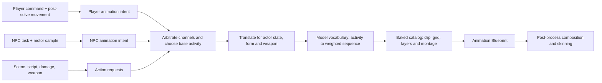

# Animation architecture — VtMB animation content on the Unreal animation system

This document owns the Unreal design of Elysium's character animation path. The engine-neutral
facts it consumes live in `docs/vtmb/animation_and_movers.md` (channel decode, the per-bone mask,
split inheritance, hierarchy composition, the root/entity transform, the autolayer binding),
`docs/vtmb/procedural_bones.md` (the axis-interpolation rule and the persistent pose array) and
`docs/vtmb/mdl_v2531.md` (the format those rules read). Status and implementation order live only in
`docs/project/roadmap.md` — the LIFE programme, which owns the asset stack, the resolver seam
and the player graph.

The goal is not to reimplement Source's animation system inside Unreal. It is to let Unreal own
decoding, blending, skinning and LOD, and to add only the composition stages Unreal has no
equivalent for.

## 1. The two pipelines have the same shape

This is the load-bearing observation, because it is what makes a bespoke evaluator unnecessary:

| Retail | Unreal |
|---|---|
| decode locals | `UAnimSequence` evaluation |
| blend sequences, layers, transitions | blend spaces, layered blends, the blend stack, montages |
| compose hierarchy, including split inheritance | ordinary FK over locals re-expressed at bake |
| apply the procedural rule and engine-native secondary controls | post-compose tail, component space |
| skin | skinning |

A post-process Anim Blueprint runs once per component after the anim graph and before skinning,
which is retail's slot exactly. Both engines blend **locals** and then compose, so the ordering VtMB
requires falls out of Unreal's existing pipeline rather than having to be recreated inside it.

Only the *procedural* row survives into that slot as a VtMB evaluator. Engine-native secondary
controls may also run there from a complete baked recipe; they do not interpret a VtMB rule.
Everything above it is resolved at bake, under
the root `CLAUDE.md` rule **"Poses are baked native"**: a clip on the mount is a complete,
self-describing Unreal-native local pose, and the frame path applies no VtMB rule. Where a clip's
meaning depends on state stored outside it, the bake resolves that state rather than forwarding the
question.

A rule that is non-linear across a blend has a residual when it is baked per clip: evaluating per
clip and blending the results is not the same as blending first and evaluating once. **That residual
is the accepted cost of the rule, and it is bounded and confined to crossfades** — over genuinely
crossfadeable clips of a real body's own locomotion bank, 77.3% of bone samples land within 0.5°,
99.7% within 5°, none above 10°, for the length of a fade. It is not a reason to keep the rule in the
frame path; it is what baking one costs.

### 1.1 Rotation provenance is closed

Every rotation that reaches a baked asset or an actor has one named source:

1. an authored MDL bind transform, animation sample, attachment, or entity placement;
2. the single formal Source-to-Unreal change of basis performed by the `UE_` exporter; or
3. a semantic re-expression required to make Unreal evaluate the same pose, such as resolving split
   inheritance into parent-relative locals or conjugating a VtMB post-multiplied additive into
   Unreal's pre-multiplied form.

There is no fourth category. In particular, the pipeline and runtime carry no fixed quarter-turn,
per-model facing correction, reference-pose flattening, asset-name exception, or corrective
rest-pose transform. The mesh reference skeleton and the `USkeleton` both preserve the converted
MDL bind transforms, and entity placement is the converted entity placement alone.

This makes a visible quarter-turn a useful failure. A raw bind-pose inspection may be sideways
because the bind frame is storage, not necessarily the pose retail displays. A placed runtime model
that remains sideways after its selected sequence has been evaluated is missing a semantic input or
stage; it is not repaired by adding another rotation. The diagnostic records, in order, the entity
placement, selected sequence and frame, decoded local pose, and final component transform.

Every placed MDL is classified from its fully evaluated authored rest candidates. A model remains
skeletal whenever any candidate differs from the stored mesh, including animated props and rigid
one-bone models. A static placement is permitted only when all candidates are proven equivalent;
that proof preserves rather than erases the distinction between authored bind and authored rest.

### 1.2 A placed model is posed before it is visible

The v7 character index owns a `placed_models` catalogue for every non-character MDL referenced by
an exported `.ents` or GAME_LUMP `.props` placement. Records are keyed by normalized full-path
model stem and state the source model, ESKM, static-mesh stem, clip policy, ordered sequence
metadata, resting candidates, and static-equivalence result. A missing record, skeletal asset, or
selected clip makes a v7 map incomplete; it never licenses a visible storage pose. Older indices
remain a developer-only stale-export fallback and do not satisfy content readiness.

Rest selection is deterministic. Every `ACT_IDLE` sequence participates in declaration order with
weight `max(1, activity_weight)`; sequence 0 is the sole fallback when the activity has no member.
The weighted choice is the 32-bit FNV-1a hash of normalized model path plus the placement token,
modulo total weight. Live entities use their stable handle index and GAME_LUMP placements use their
`.props` ordinal, so reload and save restore choose the same pose without coupling this resolver to
NPC disposition or player activity policy.

Runtime construction is a visibility transaction: create hidden, assign skeletal mesh and map
materials by slot name, install the selected clip, seek frame 0, force pose evaluation, disable
ticking for a held rest-only body, then reveal. Characters use the same hidden-until-first-pose
boundary while retaining their disposition, activity and cinematic intent. `SetModel` rebuilds
through the same transaction and preserves the entity token, skin, attachment, collision mode and
any later `LoopSequence` intent. Generic model-backed entities inherit this body before
`PostSpawn()` only when their leaf class did not provide one; this inheritance adds no use anchor.

Static equivalence is evaluated from fully skinned positions and normals for every possible rest
candidate. Topology must match, position delta must not exceed 0.01 cm, and normal delta must not
exceed 0.1 degrees; missing or undecidable data means non-equivalent. An equivalent GAME_LUMP model
uses the existing map static actor. A non-equivalent one uses `AElysiumPlacedModelActor`: its paused
skeletal visual is attached at identity to an invisible static collision proxy. Dynamic physics and
hinge authority likewise remain on the invisible static or Chaos proxy, never on the skeletal
visual. This composition reuses the map's material instances and does not duplicate the placed-model
texture corpus in the character package.

### 1.3 The between-key read is Unreal's own

A baked clip carries one key per authored MDL frame at the authored rate, and the host reads between
those keys. **Retail's between-key read and Unreal's LINEAR are the same rule** — measured against
the banked capture corpus rather than assumed, and separated there from the spherical alternative
(`docs/vtmb/animation_and_movers.md` A.4b owns retail's half and the numbers). The export therefore
defers nothing when it leaves the read to the host, and there is no divergence to record here.

Both halves land on the same pair of keys with the same alpha. Retail takes
`floor((numframes − 1) · cycle)` and hands the remainder to its channel decoders; Unreal's
`AnimEncoding::TimeToIndex` computes `KeyPos = RelativePos · (NumKeys − 1)`, takes its floor as the
first key and `min(first + 1, NumKeys − 1)` as the second, and passes the remainder as alpha —
including the same clamp at the last key, because the bake writes `NumberOfFrames` as one less than
the key count at the authored rate. Between that pair Unreal mixes rotation with `FQuat::FastLerp` +
`Normalize` — the second quaternion flipped to the nearer hemisphere, the four components mixed
linearly, the result normalized — and position with `FMath::Lerp`, which is retail's mixer component
for component. ACL's decompression applies `quat_lerp` and `vector_lerp` over the same uniform key
grid, so the codec does not change the answer.

The measurement covers one map's cast — 53 distinct clips over 34 owner identities — which samples
the content rather than the rule: retail decodes every cell of every model through the one channel
path A.4b names.

## 2. The asset set is baked, not built at runtime

Characters are baked into native assets on the `/ElysiumBaked` mount by an editor commandlet beside
the map bake, under the same gitignored, regenerable posture. What the bake produces:

- **Shared banks are assets, not copies per body.** Every model carries its own `USkeleton`,
  seeded from its own container alone; nothing about one model's skeleton depends on any other
  model's. Each shared bank is built once on the smallest compatible bank-family skeleton, and
  every body's skeleton declares that bank skeleton compatible. A body's own clips live on its
  own skeleton, at `Anims/<stem>/`; a bank's clips live once, at `Anims/_banks/<bank>/`. Bank
  storage therefore scales with the number of source clips, never with the number of bodies.
  Cinematic actor banks are likewise emitted once in the shared namespace; no body, biped or
  otherwise, receives an empty scene-package copy.
- **A `USkeletalMesh` per model**, morph targets preserved. A face spans several material primitives
  and glTF morph weights are mesh-level, so a target that spans two materials arrives as one
  same-named piece per primitive; those pieces are **merged**, never first-wins, or a jaw moves and
  leaves its teeth behind.
- **A compressed `UAnimSequence` per clip.** Every clip is written as an ordinary parent-relative
  local pose: a bone carrying `Flags & 0x2` stores a rotation VtMB reads as model-space, and the
  bake re-expresses it against the parent's composed rotation from that clip's own frame, so
  ordinary FK reproduces the pose retail draws. The mesh needs nothing — VtMB's own `poseToBone`
  inverse binds are already conventional, so only the live pose ever disagreed.

- **The `_delta` family ships raw, and composes at runtime.** The composition order does not carry
  over: every `EAdditiveAnimationType` pre-multiplies the delta (`Delta * Base`, in
  `AccumulateLocalSpaceAdditivePoseInternal` and the mesh-space path alike), while VtMB
  post-multiplies it (`Base * Delta`, `docs/vtmb/animation_and_movers.md`). The difference is a
  conjugation by the rotation of the pose the delta lands on — which is **not** something the clip
  carries, because the same delta rides every cell of a fan and every gait a host stands. So this
  one is a runtime rule, `FAnimNode_ElysiumPostAdditive`, and §5 states why no reference-pose
  setting substitutes for it.

  What ships is the difference as the container states it — a pure delta, with no bind in either
  channel (`docs/vtmb/animation_and_movers.md` A.4 carries the measurement). The clip carries
  **no additive stamp** — an `AdditiveAnimType` would make the compressor subtract a base
  out of keys that already are the difference — and no `RefPoseSeq`, so it names nothing. It
  carries `UElysiumAnimPostAdditive` instead, which is what every reader keys on:
  `IsValidAdditive()` answers false for the whole family, so a consumer keyed on the engine
  predicate drops the delta while the rest of the frame still looks right.

  **Every bone the delta does not animate is written at the additive identity** — zero translation,
  identity rotation — over the whole reference skeleton rather than the donor's own bones. An
  untracked bone evaluates to the reference pose, not to nothing, and the composition
  post-multiplies whatever it evaluates to; a bank delta declares 60 bones against an 88-bone body,
  so without those tracks the face and hair chains turn every frame on top of a pose that was
  already correct.

  The exporter still writes the host-composed `<delta>@<host>` form, and the bake deliberately does
  **not** build it. It is a pose rather than a difference, and every resolver asks for
  `<label>@<host>` before the plain label, so one surviving on the mount silently wins.
- **Blend profiles** in blend-mask mode, one per distinct per-bone mask. The mask is binary in the
  source data and there are only a handful of distinct masks per bank, so this is a small table on
  the skeleton rather than per-clip data. A profile is named for the bones it owns rather than for
  the clip or the slice that first reached it, so the same mask arriving from two banks resolves to
  one asset and a re-bake cannot rename one out from under a sequence pointing at it.

  **Which mask a clip owns is carried on the clip**, as animation metadata naming the profile. A
  sequence that states which bones it owns can be composed correctly by anything that opens it,
  including the animation editor, which is the same reason the assets are baked at all.

  A clip also needs one thing written that the source file states by omission: for every bone the
  clip owns, each absent position or rotation channel holds the **donor MDL bind value**. The
  exporter therefore materializes that value as a constant track. A bone the mask does not own
  remains absent and leaves the base pose untouched. This preserves VtMB's distinction without
  making Unreal consult either a donor file or an arbitrary shared reference pose at evaluation.
- **The one overlay mask that owns the split bone derives once per declaring host.** Of the distinct
  per-bone masks a bank ships, exactly one contains `Bip01 Spine1` — the 49-bone upper-body gate the
  `*_aim_layer` and `*_bobble_layer` families carry. Those clips are the one place the split bone
  cannot be re-expressed against its parent *from the clip alone*, because the mask excludes the
  parent chain: the ancestors carry no rotation record, so the composed parent rotation the
  correction divides by is not in that clip.

  **Substituting the bind chain is not available, and the reason is measured.** The chain above the
  split bone is `Bip01`, `Bip01 Pelvis`, `Bip01 Spine`, and retail's rule declines all three —
  `Bip01` is an ordinary animated bone, not the entity transform. Every clip turns it: 63° from
  bind on a weapon idle, 82–99° on a walk or run. An overlay normalised against the bind chain
  therefore arrives rotated by the character's own root rotation, which is a larger error than the
  model-space value it was correcting.

  So the base has to be a real pose, and the autolayer table names one: the **host**. The family is
  emitted once per declaring host, composed onto that host's own pose, exactly as the `_delta`
  family above is. The two differ in how the clip combines with the host — an overlay *replaces* the
  bones it owns, an additive accumulates — and therefore in what ships: an additive is differenced
  against its base and names it, while **an overlay is not additive at all**. It is a plain masked
  local pose, composed toward its own result rather than differenced, and the host is what supplied
  the ancestor chain rather than something the asset points at. A grid's cells each derive against
  the same host, so the grid stays one thing.

  The correction is therefore **spent at bake**. Nothing about the split bone survives into the
  frame path, which is the rule rather than an optimization: a runtime that had to know the host's
  chain in order to evaluate a cell would be the failure "Poses are baked native" names.

  Two things fall out. The family needs **no blend profile**: an additive's untouched bones are
  written at the additive identity, where `q ⊗ I = q` and `pos += 0`, so masked-out and
  bind-holding are both a zero delta and the three-state distinction the mask table exists to
  preserve does not arise. Retail agrees from the other side, skipping a bone whose per-bone weight
  zeroes the scale. And the remaining masks need **no split correction at all**, because none of
  them owns the split bone — they are ordinary parent-relative overlays composed by a stock layered
  blend.
- **Blend spaces** from the exported grids: `UBlendSpace1D` for a `move_yaw` fan and a plain
  `UBlendSpace` for an aim grid. An aim grid is **not** a `UAimOffsetBlendSpace`: that asset wants
  mesh-space additive samples, and an aim layer's cells are ordinary masked local poses whose split
  bone was already resolved at bake. The sample placement is the same arithmetic for both. A sample
  sits at the axis value its cell declares —
  `paramstart + k·(paramend − paramstart)/(groupsize − 1)` — and the axis spans the grid's own
  range with one grid division per gap between cells, so every cell lands on a division. The pose
  parameter's own range does not enter: it cancels out of retail's axis resolution exactly, leaving
  the grid's range alone, and is consulted only for the wrap.

  **The wrapping axis is authored as duplicate endpoints, and that is how it is baked.** A
  `move_yaw` fan runs −180..180 with the same clip at both ends, so ordinary clamped interpolation
  reproduces retail across the seam. Marking the axis as cyclic instead would make the two ends one
  point carrying two samples, which the engine rejects — silently, by declining the second. Wrapping
  the parameter into range is the caller's job, which is what the parameter's own `loop` states.

  **A grid composes as one thing, so its cells must agree about what they are.** The cells of a
  partial-body aim grid carry the same per-bone mask, which is what lets the whole grid sit behind a
  single layered blend — no blend node masks per sample. The bake refuses to write a grid whose
  cells disagree, because such a grid could not be layered at all and the failure would otherwise
  surface only when the graph was built over it.
- **Morph-target curve metadata**, authored at bake. Registering it at runtime transacts by default
  and reaches an editor transaction buffer that does not exist under the editor executable in game
  mode; authoring it at bake removes both that hazard and its workaround.

The commandlet consumes the Unreal-native ESKM container directly. Standard glTF remains an
inspection product only and participates in neither the baked pose nor runtime placement.

### 2.1 What ships under which name

A layer whose meaning depends on its host is emitted **once per declaring host**, so one label can
produce several assets and the plain label names none of them. The container carries the derived
clip's own label, the label of the clip it is a difference from, and the tracks. The separator is
`@`, which no VtMB label contains:

```text
<layer>@<host>        the derived clip, as the container names it
A_<layer>_<host>      the sequence asset, after the illegal character is folded
BS_<label>@<host>     a grid whose cells ship only in derived form
```

**Which forms exist is not uniform, and a resolver has to know it.** A raw additive still appears in
the container — it is the label the model's own table references — but is not built as an asset,
because an additive no host declares has no base to be a difference from. A raw overlay is suppressed
when nothing else reaches it under its plain label, and kept when something does: a cell can belong
to two grids at once, one bound to a host and one declared by nobody, and the unbound grid still has
to be self-consistent. **Asking for the bare label finds nothing for a grid that ships only per
host**, and a miss there looks exactly like an unexported stem.

**The host a derived form is asked for is the sequence the body is standing on.** Lab and shipping
resolver share one rule: `Selection.SequenceLabel` first (or the lab's standing clip when no
selection is published); when that is empty, the first sorted host in the owner's autolayer table
that declares the layer. A miss names the label, the owner, each attempted form (`<label>@<host>`
and the plain label) and the host that was tried; when the host is one the table does not bind the
layer to, the line says so and names the hosts that do, because no bake would ever have written
that derived form and looking for the asset is the wrong repair. `gr_layer` and `gr_grid` report
which form armed — derived, plain-label fallback, or nothing — and never report a ride over a miss.

**A grid label stands as a blend space or it does not stand.** The plain-sequence ladder is not a
fallback for a grid, in either resolver: resolving a grid label as a clip answers it through the
grid at the neutral pose, which freezes the whole fan onto one cell no pose parameter can move
again, and loads that cell in its raw host-less form — for an aim layer, the split-bone pose
ordinary FK reads as the arms folded over the head. Both present as a body posed wrong rather than
as a lookup that failed, so a grid whose blend space is absent is a named miss instead.

### 2.2 Two guards, and what each refuses

**A body's own clips never bake short.** Before writing a single clip, the bake checks every bone of
a container that carries geometry — the whole bone list, not only the animated ones — against the
skeleton, and fails the whole owner naming the missing bones. It deliberately does not name a cause:
the mesh build for the same stem may have failed earlier in the same run, in which case the skeleton
never saw those bones. A *bank's* unresolved bones are dropped and counted instead, because a bank
recorded on another clan's rig legitimately names hair chains this family never had.

**A stale container is refused rather than misread.** The exporter and the runtime reader carry the
same version constant, and the loader rejects a container it does not recognise instead of reading an
older layout as the current one. Each version is a change in what a clip may state about itself —
whether its split bone is normalized, whether it indexes a de-duplicated mask table, and whether it
names the clip it is a difference from — so an older layout read as the current one is silently wrong
rather than absent.

### 2.3 Two channel details that are not obvious

- **Ownership and channel presence are independent.** A weighted animation record owns its bone;
  an absent channel on that record reads the donor bind value. A zero-weight record does not own the
  bone and must not acquire a synthesized track. The exported mask preserves the first distinction
  and complete owned tracks preserve the second.
- **A split bone can be resolved only from a complete sampled pose.** The exporter composes the
  donor bind fallback before re-expressing the flagged rotation. It never treats an absent channel
  as identity or as an unreadable quaternion.

### 2.4 Skeleton compatibility is rotation-neutral

Every `USkeletalMesh` carries its exact converted MDL bind skeleton. The `USkeleton` assets used to
share banks have a separate job: name and index the compatible tree. Their common reference
rotations are identity, so Unreal's automatic compatible-skeleton remap has an identity rotation
delta. This metadata frame never changes a mesh bind, an animation rotation, or an actor transform.
Rotation keys pass verbatim. A visible quarter-turn is therefore still evidence of a missing
authored animation or a decode defect; it is not repaired by a per-model, model-name, or
asset-type rotation exception.

**Compatible-skeleton remapping always reads both skeleton reference rotations.** Any valid pair
can make `DecompressPose` apply that rotation delta even without an explicit retarget node, so
every skeleton that shares a bank uses identity common-bone reference rotations. The mesh keeps
its exact authored bind and rotation keys pass verbatim. A bone no ordinary sequence tracks
resolves to the playing **mesh's** reference pose, not the `USkeleton`'s. Never restore a per-body
bank copy to avoid this engine path; bank package count is independent of body count.

VtMB's include-model position rule is represented once per **composed bank closure**, after the
base sequence and its autolayers or one overlay slot and its autolayers have combined. Each bank
sequence names a `RetargetSource` containing its donor bind pose. The bake sets skeleton translation
retargeting to `Animation`, so Unreal leaves those translations in bank space; the graph then runs
`FAnimNode_ElysiumBankRemap` at each of the five closure tails. Rotation and scale are never changed.

`UElysiumAnimSubsystem` builds the immutable table on demand from the playing sequence's
bank-family `USkeleton` and the playing mesh's reference skeleton. The sequence skeleton is
load-bearing: that is where `AnimRetargetSources[Sequence->RetargetSource]` is registered. The
cache key is `(mesh, source skeleton, retarget-source name)`, because a source name is not a global
skeleton identity. Optional donor bones absent from the target are dropped by name, as VtMB's outer
mapping skips absent targets. There is no sidecar or per-body bank copy, so script-selected
cinematic banks take the same path as ordinary bodies.

The table carries retail's four observable outcomes, using the recovered `0.01` squared-Source-unit
threshold (`0.1 in`, `0.254 cm`): binds within the copy threshold copy; exactly one bind within the
origin threshold adds `targetBind - sourceBind`; both binds within the origin threshold copy; every
other pair applies the shortest-arc source-to-target bind rotation and their length ratio to the
translation. Applying the affine origin branch once after closure composition is load-bearing:
applying it separately to a base and additive would add the constant offset twice.

Owned missing channels have already become donor-bind constants (§2.3), while unowned bones remain
on the playing mesh's reference pose. The former pass through the same declared translation rule;
the latter acquire no synthesized track. The bake has a cardinality invariant: a source bank clip
may produce its declared base/overlay derivatives, but changing the number of compatible bodies
must not multiply the bank's base sequences or packages.

A preflight proves that before an editor commandlet starts, and proves it over the packages
themselves rather than over the folders holding them. It projects the exact set each bank
produces — one sequence per clip payload the container carries, less the payloads the bake
declines to build, plus one blend space per grid or per declaring host — from the containers'
payload headers and the blend sidecars alone. The projection is therefore the bake's own
arithmetic rather than an estimate of it, and it takes no model partition as an input, so a new
body cannot move a bank's package count. It refuses a package addressed outside
`Anims/_banks/<bank>`, two payload labels folding onto one package name, a packaged clip the
manifest does not account for on either half of a `<layer>@<host>` name, a payload carrying no
frame or no track, and a source bank clip that reaches no package at all — excusing only the raw
additive no host declares, which the container itself marks and which has nothing to be a
difference from (§2.1).

**The count proves a clip reaches a package; the census proves a body reaches the clip.** A body
resolves a label through its own include tree and the first model in tree order to define one owns
it, so a bank clip whose label an earlier model also defines is never resolved to that bank —
and the shared banks repeat labels by the family (`docs/vtmb/animation_and_movers.md` A.7). The
census runs in the same preflight and gives every bank clip and grid exactly one route: the label
a body resolves here, the autolayer host that declares it, or a cell of a grid that is itself
reached. **A cell is the distinction that needs the DAG.** A plain-label clip no host declares
ships because a grid names it, and whether that is content the game plays or residue depends
entirely on whether anything reaches the grid — the container cannot tell, because it holds one
model's answer to a question the whole tree decides.

Two answers refuse the bake, because both leave an asset addressed through something that is not
there: a **declaring host no body reaches**, whose layers ship only as `<layer>@<host>` with the
plain form withheld on purpose (§2.1), and a **grid a body reaches that stands as no blend
space**, which is §2.1's grid rule proved before an editor starts rather than named as a runtime
miss. A clip that reaches no body is reported rather than refused: authored content the game
itself cannot reach is VtMB's fact, not a defect of the bake, and naming its count every run is
what keeps a regression that multiplies it from reading as normal.

The census measures over the manifest's **whole** body catalogue, never the slice a run plans — a
body left out is a route it cannot see — and it declines to judge at all unless the manifest
states a clip map for every body the declared partition names. Cinematic banks are excluded: a
scene reaches one through its anim-set bone root rather than through any body's clip map, so no
include DAG has anything to say about it.

### 2.5 Engine behaviours the bake and its readers depend on

Each of these fails silently — the asset saves clean, or the read answers plausibly — and a
source read of the caller does not surface it.

- **A morph target only drives when its curve is flagged on the skeleton.**
  `USkeletalMeshComponent::ActiveMorphTargets` is populated from the bone container's flags, and
  those come from `FCurveMetaData::Type.bMorphtarget` — so a curve registered without the flag
  evaluates to the right weight on a face that cannot receive it. `RegisterMorphTargetCurves` sets
  both halves; the character verifier guards the contract.
- **A `UBlendProfile`'s mode has to be set before its bone scales.** An entry equal to the mode's own
  default is not stored, and that default is 0 for `EBlendProfileMode::BlendMask` against 1 for every
  other mode. A profile still in its constructed `WeightFactor` mode therefore discards every 1.0
  written into it and saves empty — which reads at evaluation as owning the whole rig, the exact
  opposite of the mask that was asked for, with nothing logged.
- **`UBlendSpace::AddSample` reports failure only through its return value.** It validates the
  sample against the blend space's own skeleton and axis bounds and returns `INDEX_NONE` without
  logging, so a skeleton set *after* the first sample — or a value placed outside the axis range —
  yields an asset that saves clean and carries fewer samples than it was given. Set the skeleton
  before the first add and check every return. The related trap is `ExpandRangeForSample`, which
  runs inside `AddSample` and quietly widens the axis to fit whatever it is handed: an axis range
  that no longer matches what was written is the symptom of a misplaced sample, not a cosmetic
  difference.
- **A blend space with samples and no `ResampleData()` poses nothing.** That call builds the
  segments or triangulation the evaluator reads and is not implied by adding samples or by
  `PostEditChange`. Without it the asset lists its samples correctly everywhere that counts them and
  evaluates to an empty blend; `GetBlendSpaceData().IsEmpty()` is how a caller tells. Dimensionality
  is inferred there too, from the samples' bounding box rather than from the class, so a
  `UBlendSpace` whose samples all share one axis value takes the 1D path regardless.
- **`UAnimSequence::GetAnimationPose` silently falls back to the raw data model** whenever the
  compressed data for the current platform is not resident yet, and compression runs asynchronously
  after a bake. So the same call answers out of two different representations depending on how much
  work happened earlier in the same process, and a test that reads an additive can pass and fail on
  the same assets across runs. Call `WaitOnExistingCompression()` first when the assertion is about
  what a cooked build ships; `IsCompressedDataValid()` is how a caller tells which one it got.
- **`UAnimSequence::GetBoneTransform` never performs the additive conversion.** It is a plain track
  read, so a raw evaluation hands back the keys as written — and a baked `_delta`'s keys are the
  delta already composed onto its base, because the compressor subtracts that base back out. A test
  built on it reports a correct additive as broken by exactly one base pose, and would pass just as
  happily if the subtraction had never run. `GetAnimationPose` is the door the runtime uses;
  `EvaluateAdditiveFrame` in `ElysiumBakedCharacterTests.cpp` is the worked example.
- **A bone a sequence carries no track for evaluates to identity rather than to the reference pose —
  on an additive.** The reset differs by kind: `ResetToAdditiveIdentity` for an additive against
  `ResetToRefPose` for an ordinary sequence, so the single signature "the error equals that bone's
  full bind transform" means a dropped track on one and the exact opposite on the other. Read the
  additive stamp before hunting a rotation bug. On an additive that magnitude is ambiguous between
  three causes — a dropped track, the additive round-trip above, and compressed data that is not
  resident — so check `IsCompressedDataValid()` before reading anything into it.

## 3. Gameplay actions are resolved before the graph

A key press never selects an animation asset. The player command says what the player asked for;
movement decides what the body actually did; gameplay decides whether an attack, reaction or
script owns the body; only then does animation select an activity and resolve that activity through
the current model. NPCs enter the same path from an AI task or entity behaviour rather than from a
user command.

That distinction is load-bearing. Mapping `W` directly to `walk` would animate while a wall stops
the player, choose walk during an airborne frame, and give NPC movement a second implementation.
The animation layer reads the **post-solve body state** and the gameplay request, never raw input.

The terms used by the layer are deliberately separate:

| Term | Meaning | Example |
|---|---|---|
| command | one frame of requested player input | forward + slow gait + attack |
| body sample | the movement result after collision and state transitions | grounded, 92 cm/s, ducked |
| action request | a gameplay or script request that may own a channel | reload, light hit, scene gesture |
| activity | the stable VtMB semantic key | `ACT_WALK`, `ACT_RELOAD_GLOCK` |
| sequence | one model-vocabulary choice for an activity | `walk`, selected by `actweight` |
| animation asset | the clip, blend space, layer or montage Unreal evaluates | baked `walk` blend space |

The retail path and the remake path therefore have the same high-level shape:



### 3.1 It is code around authored tables, not one hardcoded table

Retail splits responsibility across three places (`docs/vtmb/animation_and_movers.md` A.3):

- **The game DLL contains policy.** The player state classifier and mode router, NPC schedules and
  task handlers, the 4,460-entry activity registry, per-class translations, and each weapon's
  activity-override table are compiled code or static data in `vampire.dll`.
- **The model contains choices.** `StudioSeqDesc` supplies the stable activity literal, sequence
  label, `actweight`, flags, transition duration, events, blend grid and autolayer binding. The
  include DAG says which shared bank owns the chosen sequence.
- **Live state supplies context.** Velocity, facing, ground/water/duck/jump state, current weapon,
  AI task, damage direction, form, scene ownership and other state decide which policy branch is
  active.

The remake preserves that separation without reproducing the binary's class layout. Generic
classification, arbitration and resolution are code; the activity registry, weapon translations,
model choices and layer bindings are generated data. There is no per-model switch in the player,
NPC motor or Anim Blueprint, and there is no manually maintained list of thousands of clips.

### 3.2 One contract, two producers

The shared boundary is an engine-neutral **animation intent**. Its implementation type is
`FElysiumAnimationIntent`; it carries no `UObject` and contains:

- the logical character handle, model stem and source (`Player`, `Npc`, `Scene`, `Damage`,
  `Interaction` or `Debug`);
- a channel (`Base`, `FullBody`, `UpperBody`, `Additive`, `Gesture`), plus a request generation so
  a completed one-shot cannot cancel its replacement;
- either a stable `ACT_*` name or an explicit sequence label, never both;
- the repeatable variant/RNG token used by weighted selection;
- local velocity, speed, facing-relative movement yaw, aim yaw/pitch, ground/water/duck/air state,
  and the current form/weapon tags needed by translation;
- loop/one-shot intent and the request's completion owner, but no hand-authored blend time or asset
  reference.

An explicit sequence is an escape hatch for content that actually names one: choreographed-scene
events, `scripted_sequence`, `SetAnimation`, and the retail `player_sequence` developer command.
Ordinary locomotion, combat and reactions use activities. A gameplay system naming `walk_0` is a
layer violation: it has skipped weighted choice, include ownership and the blend grid.

A model selection is neither kind of animation request. `SetModel`, `MorphModel` and transform
lifecycle tasks change the model/include graph that owns every later activity or exact-label
answer. They update the intent's model identity and invalidate any selection tied to the old owner;
they do not synthesize an idle or transform clip unless a separate task requests one.

The two producers are different only before this boundary:

- **Player.** `FElysiumUserCmd` remains the input record, not an animation record. After
  `UElysiumMovementComponent` (or the A/B `UCharacterMovementComponent`) has moved, the player body
  publishes the realized velocity and its ground, water, duck and jump phase. The player entity
  contributes weapon, attack, feed, use, discipline, damage and scripted state. Camera/body yaw
  supplies the unambiguous `move_yaw` relationship.
- **NPC.** The substrate publishes the desired activity or explicit scripted action; the motor
  publishes realized velocity, facing and move status after its tick. Patrol, interesting-place,
  dialogue and scripted-sequence behaviour are request producers, not clip players. Later combat AI
  uses the same seam rather than growing an animation path inside a controller.

`FElysiumLocomotionSample` is the smaller shared result both bodies publish: local planar velocity,
speed, facing yaw, `move_yaw`, grounded/air/water state, stance, the jump phase, and the
surfaceprop name under the foot (`GroundSurface`, retail's cached `surfacedata_t` — `NAME_None` when
the body is standing on nothing, `default` on a floor that names no surface;
`docs/architecture/footstep-architecture.md` §4.1). It is sampled
after movement and merged with the current action requests into the intent. The Anim Blueprint never
reads input, AI controllers, entity fields or weapons directly.

**`move_yaw` is three angles, not one.** The sample carries the commanded yaw and the realized one
raw, and the **pose parameter** as a third field that follows the realized yaw through a 720 °/s
slew, a 0.3 s re-arm and a hold at a standstill. The filter belongs to `FElysiumAnimationDriver`
rather than to the sample, because it is a rate and a producer's sample is a getter a reader may
take twice a frame; a producer therefore seeds the pose field unfiltered and the driver replaces it.
The mover reads the *commanded* yaw for its speed cell and never the filtered one, or a turning
body's speed would lag its direction.

**The driver also owns the body's gait speed tables** (`docs/architecture/movement-architecture.md` →
"The speed authority"). They key on the body — stem, weapon, form, variant — rather than on the
frame, so they are re-resolved only when that key moves and pushed to the mover on change; a weapon
swap therefore carries one frame of latency, which is deliberate and less than the network lag
retail carries. The same tables build `FElysiumGaitReference`, so the classifier's walk/run threshold
and the mover's commanded speed cannot come from two different numbers.

**The cast's mover is commanded with the number the record publishes.** Each anim pass hands the
NPC motor's `MaxWalkSpeed` the cell the selection it just published names (`GroundSpeedCmPerSecond`)
whenever the projected graph state is a gait, so what the body travels at and what its record says
it plays are one number; the travel order's own gait kind carries only a leg's opening frames,
before a gait has been published, and a gait state whose fan resolves no cell warns once per gait
per body before falling back. A caller-authored speed — the scripted Walk and Custom gaits — keeps
exactly the number it was handed. The pass order is sample → resolve → re-command, which leaves one
frame between the record and the mover: a row's velocity was realized under the previous row's
cell, and any check comparing a recorded speed to a recorded stride aligns to that.

**It is sampled in the post-move pass** — the one the camera director and the eye tick already run
in — so no consumer reads a half-integrated frame. One struct, two producers, deliberately: the
player's mover and the NPC motor fill the same record, so the cast's locomotion and the player's
cannot become two systems that happen to play the same files.

### 3.3 Resolution and arbitration

One resolver consumes the intent and the baked character catalog. It performs these steps in order
and emits an `FElysiumAnimationSelection` diagnostic record:

1. **Arbitrate requests by channel.** A full-body scene or paired interaction can own the base while
   a dialogue gesture owns only its slot. Death, damage, combat and locomotion do not become an
   accidental ordering of `if` statements inside an Anim Instance. The priority table is explicit,
   data-tested and capture-verified before it is labelled retail behaviour.

   **The arbitration decides who ends a clip, so no producer ends another's.** Locomotion is
   published every tick by every body that has a mover, including one standing still, so a
   locomotion publish that clears whatever else is playing silently outranks every other channel and
   the ambient, scripted and reaction families cannot hold a frame. A request ends a clip only where
   the table says it wins.

   The priority order is declared once (`EElysiumAnimPriority`, order-is-the-table). Of its rows,
   two relationships are recovered behaviour: ambient-versus-locomotion, and the **tie** between a
   melee swing and a scripted beat, which both claim `Scripted`. Retail's attack path consults no
   cine handle and `ForcePreTranslatedSequenceAndActivity` refuses nothing, so a player's swing
   overwrites a beat's pose there as it does here, and an NPC's is suppressed by the beat owning its
   schedule rather than by an animation test (`docs/vtmb/animation_and_movers.md` → "Protected
   activities and player paired-action modes"). Every other ranking is this project's own pending
   capture verification, and labelling any of it retail requires that capture. Two rules of the slot are deliberate: an expired claim is no claim — a non-looping
   claim holds for its clip's play length, so the standing publish that takes over lands
   structurally after the blend-out — and a holder releases on every stop path (a cinematic stop
   releases its claim before the idle reset that follows it, through the embodiment seam), so a
   claim can never outlive its producer.

   **One table, two comparisons, and each decides a different contest.** `ArbitrateBase` weighs the
   standing claim against the locomotion publish's own rank and **keeps the holder on a tie** — the
   base stays claimed while `Slot.Request.Priority >= LocomotionPriority(GraphState)` — so a
   publisher that merely equals a claim never churns it. `SubmitRequest` refuses only a strictly
   lower claim (`Request.Priority < Slot.Request.Priority`), so between two claims **an equal one
   displaces the standing one**. Claim-versus-claim contention is decided by the second rule, which
   is what lets the first blocked hit take the base from a reaction already playing at the same
   band — and, at the shared `Scripted` band, what lets a melee swing take it from a standing
   scripted beat, which is the faithful outcome and not a gap.

   **A reaction claim's length is its release condition, never a wall clock.**
   `EElysiumReactionRelease` states the three shapes the combat families have, and each names both
   how long the claim stands and what the graph does while it stands:

   - `ClipCompletion` — the resolved cell's own length less its out-fade, so the fade completes on
     the clip's end. A cell shorter than its own out-fade answers zero and fades straight back out,
     which is the honest reading of a clip that ends inside its own transition. This is what every
     struck reaction means: a blocked recoil, a defender's block, a grounded knockback.
   - `Envelope` — the stated blend-in and nothing after it. Retail's `DamageFlinch` is a linear
     weight triangle evaluated against a static pose (`docs/vtmb/combat-and-damage.md` § "Damage
     flinch"), so the clip's own length decides nothing: a two-frame hit cell and a long one occupy
     the channel for exactly the same span. A stated pair that sums to nothing describes no reaction
     at all and is refused by name rather than parked.
   - `Predicate` — no duration whatever. The producer re-checks its own condition and hands the
     claim back through the release seam, and the branch **repeats** its clip for as long as the
     claim stands, because a pose that must be on screen for an unbounded hold cannot be a
     one-shot's terminal frame.

   The claim takes the condition's whole life — the hold plus the out-fade that follows it — from
   one expression, so a claim cannot expire while the branch is still fading.

   **A held claim can be lost without its predicate ending, and that is not an error.** An equal or
   higher band takes the base channel on `>=`, which is exactly what the first blocked hit does when
   it plays `ACT_BLOCK` on the same body at the same Reaction band. Retail has no such gap — it
   re-derives the ideal activity every frame, so the pose and the classification fall and resume
   together (`docs/vtmb/combat-and-damage.md` § "Block and stagger reactions"). The producer
   reproduces that by polling one three-valued answer: **held**, **free**, or
   **displaced**. On *free* it replays the **cached cell** straight at the play seam — no
   re-resolution, no weighted pick, and therefore no second `Reaction` stream draw, so a resume can
   never land on a different variant than the pose it is resuming. On *displaced* it waits instead
   of fighting for the channel, because re-claiming at an equal band would cut short the very
   reaction that displaced it; the next think asks again, silently, because a contested channel is
   an ordinary state and reporting it per think would be a log line per frame for as long as a
   button is held. Either way the classification never moves. Releasing clears the cached cell with
   the claim: a hold whose predicate is over is not resumable, and a record left behind would let
   the next poll re-take a dead pose.

   **A montage-slot run is one claim across many clips.** `scripted_sequence`'s
   `m_iszIdle → m_iszCustomMove → m_iszPlay → m_iszPostIdle` and an interesting place's
   enter/hold/leave are the same shape, so they are one mechanism and not two:
   `FElysiumClipSegment` is what a producer hands the clip funnel, and the segments of a run pass
   the body's single `DefaultSlot` dynamic montage to each other under one claim that only the
   run's own stop path gives back. A claim that expired with each segment's clip would drop the
   channel — and the pose with it — in the gap between two segments of one beat.

   **The band is the whole difference between the two families, which is why a segment is a record
   rather than a flag.** A scripted beat claims `Scripted`, which outranks the travelling body's own
   locomotion publish; that is what lets `m_iszCustomMove` play over a body walking to its mark,
   where an `Ambient` claim would be consumed by the travel publish the instant the body left. An
   interesting place claims `Ambient`, which deliberately does not outrank it — an ambient stance
   yields the moment the body travels, and that is the one recovered relationship in the priority
   table. Every caller outside a run means the band-less form: the ambient band, one clip, and a
   claim that goes when the clip does.
2. **Choose a base activity.** Locomotion classification operates on the body sample; gameplay
   requests supply attacks, reactions and contextual actions. A direct-sequence request bypasses
   only this and activity translation.

   The player's grounded stand and gait come off the **committed retail gait ladder walked live**
   (`PlayerGaitLadder()`/`SelectRule` — the rows recovered from the pinned binary fire directly);
   water, the air phases and the whole cast stay with the hand-written `Classify`, and the
   live/reference split is declared beside each artifact. The ladder's `CombatReady` is armed past
   `item_w_unarmed` ∧ `IsInCombatStance()` ∧ ¬morphed (morph constant-false until Protean exists);
   `Relaxed` is an active weapon with the stance false. The stance clock is written by the melee
   transaction on both bodies at contact — contact, not outcome — and holds 5 s; it is runtime
   state, not save-persisted. A combat-ready stand requests `ACT_AIM`, which the weapon tables
   rename per family; `ACT_AIM` has no compact code, so it projects to graph state `Idle` at
   stride 0.
3. **Translate the activity.** Apply the recovered actor/form and weapon tables in their witnessed
   order. Weapon rows remain ordered because a later duplicate-base row is a model-availability
   fallback. Retain the authored `required` bit as provenance and a diagnostic only: the pinned
   VtMB server translator never reads it, so optional and flagged rows follow the same path.

   **This step needs the model vocabulary, so it lives with the resolver rather than beside the
   intent.** `ActivityOverride` walks a weapon's ladder front to back and accepts the first rung the
   body can actually play, so a translation that cannot ask the body what it carries is not this
   translation — it would hand a glock-armed body `ACT_WALK_RELAXED_GLOCK`, which no shipped model
   answers, instead of the pistol rung that does.

   The two orders are different chains, not one parameterised chain, and the request's source is
   what selects between them. The player's is a single pass, `+0x5f4` then `+0x5e0`, with no
   availability probe after it. The cast's is `+0x5dc`, the weapon translator whose first answer is
   retained separately, up to five (`+0x5e0`, `+0x5f4`) alternations, then the four-way availability
   probe — final weapon answer, remembered class answer, first weapon answer, original request —
   and finally the recovered `ACT_RUN` → `ACT_WALK` last resort. A caller whose contract predates the
   ladder clears `bAllowFallbackLadder` and gets the miss instead of a substitution, because a gait
   resolved through a fallback rung is not that gait.
4. **Resolve the model vocabulary.** Find every sequence carrying the final activity, apply
   `actweight` using the supplied selection token, and retain the exact model/sequence identity.
   The chosen label then resolves through the include DAG to its owning bank.
5. **Resolve the asset shape.** A plain label becomes a sequence, a movement fan or aim grid becomes
   its baked blend space, and the exported base-to-layer binding supplies overlays/additives. A
   masked sequence is rejected from the base channel.
6. **Publish graph parameters.** The graph receives state-machine state, speed, `move_yaw`, aim
   parameters, selected assets/slots and authored transition metadata. It does not repeat selection.

The selection record contains the request source/channel, logical requested activity, VtMB
pre-translation, first weapon activity, each NPC/class → weapon iteration, resolved activity,
weapon activity, target sequence, transition sequence/state, variant token, sequence label and raw
index, selected model and owner stem, selected asset kind, **the graph state it resolved to**,
active layer labels, pose parameters, and a success/fallback reason.

**The graph state is projected once, here, and carried rather than re-derived.** Step 6 writes it
from the *logical* request before any route runs, so every exit names a state — a miss holds its
pose somewhere, and a record that named no state would make that somewhere "nowhere". Every reader
downstream — the Anim Instance's `RequestedState`, the Cog locomotion row, the `act_state` channel,
the MCP surface — reads that field. A reader deriving its own would be a second answer to the
question the record exists to settle, visible the day a readout and the pose on screen disagree.
The coverage rule over it is one predicate, `StateCanPlay(state, asset kind)`: a miss is playable in
every state, a sequence in all eight, a grid only where the authored pair carries a blend-space
player, and a masked layer nowhere — the same rule that refuses an additive from the base channel. The same record is rendered in Cog and written by headless acceptance
runs. Without it, a wrong pose can be blamed on input, AI, translation, model data or blending with
no way to distinguish them.

**The fallback ladder belongs to step 4, and it is the cast's alone.** `CAI_BaseNPC` retries a
missing translated `ACT_RUN` as weighted `ACT_WALK`, then the whole request as `ACT_DISPOSITION`,
then sequence index 0. The player's chain has no ladder — the controlled corpus records a ducked
phase-8 `ACT_LAND_CROUCH` request simply returning −1 — so a player miss resolves to nothing and is
reported as a **named** miss with the activity and the body in the record. Substituting `ACT_LAND`
for it would be inventing behaviour; naming the miss is what lets the graph declare a fallback.

**The locomotion ladder is recovered, and ours matches its shape.** Retail's runs ahead of the
compact-code dispatch rather than inside code 1, and it is
`ducked ? (speed2D > 5 u/s ? ACT_SNEAK : ACT_CROUCH) : (speed2D > T || commanded > T ? run : walk)`
with `T` the body's own forward walk cell plus one unit
(`docs/vtmb/animation_and_movers.md` → "The gait ladder runs ahead of the compact-code dispatch").

- **`ACT_SNEAK` from ducked-and-moving is faithful**, including the flat 5 u/s cut and the absence of
  a walk/run split or a relaxed form below it.
- **The walk/run split reads both speeds**, realized and commanded, which is retail's own
  disjunction. The commanded term is what selects the run on the first frame of a full input instead
  of after the body has accelerated into it. The body sample carries `CommandedSpeed` for it: the
  player's mover reports its command, and an NPC motor reports the `MaxWalkSpeed` it holds while a
  travel leg is in flight and zero otherwise — so the cast's split is the same disjunction and a
  commanded run classifies as a run on its first frame.
- **No gait memory.** `HysteresisFraction` defaults to zero because retail holds none and the
  commanded term removed the flicker the margin existed to damp.

Neither classifier threshold is an absolute speed: every one is a fraction of an injected walk/run
reference, so the speed authority moving takes them with it rather than leaving numbers to find.

**The air phases belong to the producer that commands jumps, which is the player alone.** The latch
exists to separate a jump press from a fall, and its whole discriminator is the rising edge of a
jump command; a cast body carries none. Retail draws the same line — the compact-code classifier
reads the player's own jump-phase field, while the NPC chain consults no ground state at all and its
air activities are requested outright by named tasks (`docs/vtmb/animation_and_movers.md` → "Nothing
in the NPC chain reads a ground or air state"). `AdvanceJumpLatch` therefore holds `Grounded` for a
producer with no jump command, and `ACT_LEAP`/`ACT_FALLING`/`ACT_LAND` are unreachable for the cast
from a body sample. They remain reachable the way retail reaches them: as an explicit activity
request through the intent seam, which is the door a reaction or a scripted beat already uses.

Two consequences are deliberate. A cast member walking off a ledge holds its gait instead of playing
a fall, exactly as retail's does. And the sample's grounded flag stops being load-bearing for the
cast, which matters because an NPC mover reports itself airborne for reasons that are never a jump —
a body on a lift, a frame mid-teleport, or a body standing on a floor whose movement mode no
controller has ever set.

**The landing one-shot's hold is provisional rather than chosen.** A still, grounded body has to
leave `ACT_LAND` somehow, and the classifier is content-free — it must not read the clip it is about
to describe. A latch-local duration holds it until the graph can report a finished one-shot, at which
point the completion callback replaces the timer.

### 3.4 The action tables are project source

**A translation table is a game rule, not an export product.** It is the same category as the
`CGameMovement` constants in `ElysiumMoveSolve.h`, the compiled slot tables in
`ElysiumSheetSlots.h`, and the dice and disposition tables — all of which this repository already
commits, and all of which "Bring-your-own-game" governs by governing decoder *output* rather than
recovered rules. So the tables are written down once, reviewed as text, and maintained here.
Nobody re-derives them, no build reads `vampire.dll`, and there is no per-install action export.

| Artifact | Home |
|---|---|
| weapon activity translation | `Private/Visual/ElysiumWeaponActivityTables.cpp` (generated, committed) |
| actor/form + NPC class translation | `ElysiumNpcActivityTables.cpp` (generated, committed) |
| player action rules | `ElysiumPlayerActionRules.cpp` (generated, committed) |
| per-model sequence events | `npc/blends/<stem>.json`, beside the blend grids |

Each generated `.cpp` holds its arrays in an anonymous namespace behind accessors declared in
`Private/Visual/ElysiumActionTables.h` — the shape `ElysiumGymSpec` already uses. The generator is
`research/tooling/gen_action_tables.py`, run as `uv run elysium research gen_action_tables`: it
reads the pinned binary through the existing probes, asserts its own round trip, and writes the
source. It is **owner-run archaeology and part of no build**; `--check` re-derives the model and
compares it against the committed file without writing.

**The tables are stored compressed, and they round-trip.** The 9,214 weapon rows over 61 classes
are ladder-major — blocks of an ordered base sequence walked under one animation family — so what
is stored is 18 shared base sequences (792 entries), 110 block headers, 595 exception rows, 57
`required` flags, 3 rename rules and 8 substitute bases: 1,565 units, 17% of the row stream.
Blocks are found structurally, a block ending where a base repeats, which is also what makes
retail's front-to-back `ActivityOverride` walk legible: block 1 is the weapon's own animation set,
block 2 the shared class set, block 3 a cousin weapon.

**Rows are never materialised.** The resolver never indexes a row; it synthesizes one candidate per
rung and tests it against the body's own clip vocabulary, which is what retail does:

```
for (family, bases) in Ladder(Weapon):
    if base not in bases: continue
    candidate = Exception(weapon, block, base) ?? Rewrite(base, family)
    if ModelHasSequenceFor(candidate): return candidate
return base                                    // untranslated
```

`FName` cannot be `constexpr`, so the tables are `const TCHAR*` literals in `.rdata`, interned once
at subsystem init into the plain-C++ table the resolver reads. `static_assert` guards array sizes
and ladder arity, so a malformed regeneration fails the build rather than a pose.

**The player rules are the same posture over a different shape.** VtMB's player selector is code
rather than a table, so what is stored is that code as **ordered predicate rows**: an eight-row gait
ladder that runs ahead of the compact-code dispatch, one arm per `PLAYER_*` code, the three pose
writes, the two player-side translations and the effective `Player_Anim` fields. A row is an
`Always`-padded conjunction of at most three predicates plus a base activity, an additive layer, or
neither; first match wins, and no match leaves the ladder's answer standing. `EPlayerPredicate` is
the closed vocabulary those rows draw on, each enumerator naming the field it reads, and the
generated file `static_assert`s on its `Count`, so editing the header without regenerating stops
compiling. Every activity carries its ID from the binary's own registration table, which is what
joins a row to VtMB's vocabulary rather than to a spelling.

**The NPC surface is that same posture over a third shape.** Its unit is not a ladder or a
selector but an inherited **body**: the binary's 77 `CAI_BaseNPC` descendants collapse to ten
`+0x5dc` pre-translation bodies, five `+0x5e0` class-translation bodies and two implementations
each of the `+0x8e4` cover and `+0x8e8` reload delegates, plus the one non-virtual
`NPC_EarlyTranslateActivity` tail the Troika body finishes through. A body is ordered predicate
rows plus a `ChainTo` naming the body it inherits, before or after its own rows — which is what
carries the two facts a row list cannot: that a leaf's `RewriteAndReturn` outranks the common body
it would otherwise fall into, and that one class reads the *translated* request rather than the raw
one. The class ledger is the join: 77 rows of four body columns and two task-handler columns, with
63 entity classnames resolved to their most-derived claimant. Beside it sit the 100 task policies
over 111 task routes, keyed by `(handler, task)` because a task name is reused across bodies. The
232 paired-action variants are **generated, not stored**: 29 registered bases, a per-base role
order and the `+1`…`+8` arithmetic, with the generator requiring that order to reproduce all eight
registered names before it emits a base.

Where the recovered reading names a *family* of requests without enumerating it — the two movement
policy branches — the row carries the family name instead of a literal and the walk reports itself
unresolved. Guessing a membership there is the one failure these tables exist to prevent, so the
residual is a counted census field rather than a silent gap.

The **activity registry is not committed**. The runtime keys on names and never on IDs, and 4,460
registrations — most unreachable in gameplay — is a binary dump rather than a rule. It stays a
research artifact; the reachable names appear in the tables that use them.

What genuinely varies per install stays derived: the per-model sequence events and autolayer
bindings come from the user's own `.mdl` files and land in the existing
`npc/clips`, blend and index sidecars rather than in a parallel clip inventory. The
sequence-transition graph is not among them — it is unauthored on every shipped model, so no
sidecar carries it and the resolver publishes no transition sequence
(`docs/vtmb/animation_and_movers.md` → "The transition graph is unauthored"). The disposable raw
player inventory produced by `research/tooling/capture/inventory_player_animations.py` preserves
the full 764-byte sequence and 72-byte animation descriptors for research, while the public export
carries only decoded fields the runtime uses.

**The NPC class bodies are answered only where the decode is confirmed.** Their predicates read
live character state, and this runtime publishes two of what the human body's armed/alert branch
needs: whether a weapon is active, and the body's own `m_NPCState`. Those two decide the branch for
every state this runtime can produce — an idle armed body resolves the relaxed set and an alert one
the weapon's own — while a body in combat answers neither arm and keeps its untranslated request.
Every remaining term is a flag no system here can set, so no rung it gates is reachable. The
faithful behaviour, the recovered chain and the divergence are recorded together in
`docs/vtmb/animation_and_movers.md` → the human pre-translation body.

**Nothing about actions is baked.** Every artifact is either committed source or a per-install
sidecar the runtime already reads, so there is no install-varying action data for an editor pass to
produce and no action catalog on `/ElysiumBaked`.

Because the tables are ours to maintain, a wrong row is a bug we fix rather than a binary we
re-diff, and two levels of test stand where the diff used to. `Elysium.Substrate.WeaponActivityTables`
is content-free: it expands the committed model and requires the recovered row stream back — the
generator stamps a digest of the *retail decode* into the source and the test recomputes it from the
*committed model*, so the two agree only if the compression is lossless. `Elysium.Content.ActionTableConformance`
walks every ladder against the exported clip vocabulary and requires the behaviour the decode was
read for: a substantial share of resolutions arriving from rung 2 or later, so the fallback order is
load-bearing rather than decoration, and no rewrite kind naming activities that no shipped model
carries. That second level is strictly stronger than a byte diff — a table transcribed perfectly and
interpreted wrongly passes a diff and fails here.

The NPC surface takes the same two levels, and the content-free one is where its weight sits.
`Elysium.Substrate.NpcActivityTables` walks every body, class column and task handler against the
census, then asserts the **orders** a count cannot see: the dog's leaf keeping the fidget the common
Troika body would idle, forced low cover rewriting the context before the context rows read it, the
Tzimisce runner's chain delegating a cover request before its own variant selection ever runs.
`Elysium.Content.NpcActivityConformance` asks the corpus the three-way question the tables join —
resolved directly, through the weapon table that stands between the class translator and the model,
or, for a paired-action base, through the role arithmetic that is the only way one is ever played.
Its residual stays a named list because there it measures how much of the cast the work root
carries, not whether a rule is right.

The player rules take the same two levels. `Elysium.Substrate.PlayerActionRules` is content-free and
tests the property a row count cannot: that the *order* survives, since a ladder whose unconditional
row moved up answers the same activity for every state and a landing arm that lost its gait deferral
drops a running body into a land. It walks the ladder and every arm against constructed states, steps
both retained chains end to end, and requires the codes, dormancy and census the generator emitted.
`Elysium.Content.PlayerActionConformance` asks the corpus whether every activity the surface can
request is one a shipped model can answer — directly, or through the weapon tables that stand between
the selector and the body, which is where the two committed tables join. What resolves nowhere stays
a named list rather than a count, because that is the difference between content the corpus does not
carry and a rule read wrongly.

“All actions” is defined by **reachability**, not by copying every name in the global registry. It
is the union of:

- every action request and activity translation reachable from player input, movement, weapons,
  disciplines, damage, forms and scripts;
- every desired activity/direct sequence reachable from NPC schedules, tasks, dispositions,
  interesting places, dialogue, damage, combat, scripted sequences and choreographed scenes;
- every model sequence reachable through the 56 player bodies and every exported NPC's include DAG;
- every emitted activity or direct label seen by the retail trace, including a population that no
  static call-graph seed predicted.

**The conformance runs report that coverage themselves; there is no separate report.** Each one
walks its own surface against the export corpus and names its residual — the family that resolves
nothing, the activity no shipped model carries, the class the work root does not stock — so the
closure is read where it is measured rather than restated. An unresolved row stays named with its
provenance; it is never dropped because a clip appears unused.

### 3.5 Extraction and proof loop

The working case is `research/cases/animation-pose/specs/gameplay_actions.json`. It uses the existing
Ghidra driver and retail capture harness rather than a second hook project. The loop is:

1. Run the player-model inventory and the ordinary NPC exporter to establish exact model/sequence
   identities, weights, grids, movement records and include reachability.
2. Reproduce the completed player ordinary, compact and paired-action extraction from the
   hash-pinned Ghidra pack: the 17-entry `PLAYER_*` table, all 15 genuine `+0x704` calls, both
   effective discipline `Player_Anim` rows, shared player RTTI policy bodies, ordinary apply/select
   order, full activity registry, forced-sequence command, nine-entry paired initial-activity table,
   protected-first mode router, five paired producer sites, six continuation leaves, role/size/side
   translation and two-actor commit. Keep the four dormant compiled codes distinct from reachable
   gameplay. A sustained unarmed crouch repeats its non-looping sequence only after the server
   finished flag is set: an unchanged request reuses the current sequence before completion, then
   reselects it and resets cycle/finished state on the next policy frame.
3. Reproduce the completed NPC-class extraction from the recovered
   `SetIdealActivity/SetActivity → TranslateActivity → ResolveActivityToSequence →
   SetActivityAndSequence` chain: PE32 RTTI collapses 77 descendants to 10 pre-translation, five
   class-translation and two cover/reload delegate bodies, including all 29 paired-action bases and
   their 232 role variants. The companion task-slot extraction reduces the same surface to 29
   StartTask and 24 RunTask bodies and materializes all 111 custom animation task routes. The
   sequence-event extraction separately validates 1,872 records and all server/client dispatch
   bodies; the layer extraction fixes all 685 model bindings at full caller weight and the four
   combat slots at their 0.1 networked weight. Event/layer emission remains a catalog/evaluator
   input rather than a task-override guess.
4. Reproduce the completed hash-pinned weapon extraction: PE32 RTTI and each vtable's table/count
   pair recover all 169 subclasses and 9,214 ordered per-class rows; keep retail `activitydump` as
   an independent textual oracle rather than a source for invented `required`-flag behavior.
5. Extend the existing retail trace with one compact record at each boundary: producer/action code,
   base activity, each translation result, selected model/sequence, pose parameters and active
   layers. Join on the full serial-bearing entity handle and model identity, as the pose capture
   already does; entity index alone is reusable and is not an identity key.
6. Drive a controlled action matrix and compare the retail selection record with the remake's
   `FElysiumAnimationSelection`. Add a seed or rule for every unexplained transition; never patch the
   expected output by clip name.

Static extraction proves table completeness; live capture proves branch reachability and ordering.
Neither replaces the other. A trace that did not happen to use a weapon cannot prove its table is
empty, and a decompiled branch cannot prove gameplay reaches it.

### 3.6 First playable slices

The layer is implemented vertically so walking begins before all combat is decoded:

1. **Shared locomotion.** Player and NPC idle/walk/run/sneak/crouch/air/land requests, post-solve
   speed, `move_yaw`, authored ground speed and transition metadata. Existing NPC patrol and
   scripted travel become callers of the shared intent seam; the player stops holding its spawn
   idle while moving.
2. **Reactions.** Directional light/heavy hit, knockback, death/ragdoll handoff and interruption.
   This is the minimum for NPCs to visibly react to gameplay.
3. **Weapons and interactions.** Draw/holster, aim, attack, reload/dryfire, block, feed/use and
   paired actions, with weapon activity tables and partial-body layers.
4. **Full behavior coverage.** NPC combat schedules, disciplines/forms and every remaining
   contextual action in that reachable union.

A slice is accepted only when every request it can emit resolves for its declared model set or
names an explicit fallback. Runtime failure is visible but non-fatal: the body keeps its previous
safe pose and emits a once-per-key diagnostic. Content tests fail any missing mapping inside an
accepted slice, any required weapon override that misses, any masked sequence selected as a base,
or any sequence whose owner/asset cannot be found.

### 3.7 Integration with the current runtime

The implementation grows the path already serving both actor kinds:

- `UElysiumAnimSubsystem` **is** the character catalog and resolver, serving every body rather than
  the cast alone; a second player-only clip cache would duplicate the same model vocabulary and
  shared banks.
- `FElysiumNpcClipSet`, `ResolveActivityClip`, the baked blend spaces and the current player visual
  are migration inputs. There is **one activity door**: every producer — patrol, scripted travel,
  ambient, schedules and the weapon path alike — reaches the resolver through
  `FElysiumAnimationIntent` with classname, weapon and state, so nothing picks a clip off a raw
  `ACT_*` without a selection record or a named miss.
- `IElysiumEmbodiment` carries the engine-neutral intent across the substrate boundary. NPC entity
  behaviour can request an activity without knowing about an Anim Instance; player gameplay state
  uses the same call. Body-local movement sampling stays on the engine side.
- The per-body driver resolves once when discrete request/model/weapon state changes and updates
  continuous locomotion parameters every animation frame. Asset lookup and weighted choice do not
  repeat every tick.
- The Animation Blueprint consumes only the resolved selection and continuous parameters. Its
  graph owns the blend stack, blend spaces, layer nodes and montages; the native post-compose tail
  owns the one custom evaluator and any stock Unreal secondary controls configured by the mesh.

Both movement implementations and both actor kinds must produce the same trace schema. That is the
architectural test that this is one gameplay-animation layer rather than four paths that happen to
play the same files.

## 4. The animation graph

An Animation Blueprint per body archetype — biped, animal, skeletal prop — rather than a
hand-written instance:

- **One `FAnimNode_BlendStack` as the locomotion source**, fed whatever asset the resolved
  selection names. The eight-state vocabulary — idle, walk, run, sneak, crouch, leap, falling and
  land — survives on the selection record as `GraphState`, which the trace, the Cog row
  and the MCP surface read; the graph itself holds no state machine and no transition rules, so a
  readout and a pose cannot disagree. VtMB's stance banks ship almost no authored transitions (of
  the gendered disposition banks, one carries a single transition clip), so the crossfade the
  stack runs **is** the original's transition rather than invented polish.

  `ElysiumAnimGraph::TransitionSeconds` is that crossfade's sole authority. It answers retail's
  `max(fade(outgoing), fade(incoming))` and reaches the node's `BlendTime` pin whole, capped by
  nothing — so a `flags & 0x2` clip's zero falls out of the same call as a hard cut instead of
  needing a branch — and it refuses a null outgoing record exactly where retail's `FUN_1008de30`
  refuses one (`docs/vtmb/animation_and_movers.md` A.4c). A record that resolved no asset is not
  an outgoing operand: without that refusal the first real clip fades up out of the bind pose for
  the whole duration. The decision is reported once per real transition, on the blend report and
  the log, because downstream it is indistinguishable from an authored hard cut.

  **There is no Inertialization node in the graph.** The stack's own crossfade *is* the transition,
  so an inertializer would be a second answer to a question already settled — and, sitting
  downstream of a stack that never requests inertialization, an unreached one. Anything that wants
  a blend duration states it as a pin on the node that consumes it.

  **Three divergences of this reproduction, each an explicit owner call taken with the
  restore-faithful blend cutover**, recorded here beside the faithful record they depart from:

  1. **nlerp where retail provably slerps.** `FAnimNode_BlendStack_Standalone::BlendWithPose`
     accumulates the incoming pose with `AccumulateWithShortestRotation` and normalizes
     afterwards, which is a normalized linear blend; retail's transitioner interpolates the two
     quaternions spherically. The paths differ only in the middle of a fade and only by the
     chord-versus-arc error — measured over the corpus's transitions, a median per-bone deviation
     of `1.6e-6` radians against slerp's own `3.5e-8` rounding floor
     (`docs/vtmb/animation_and_movers.md` A.4c).
  2. **Inverted tail nesting at depth three or more.** The stack seeds its accumulation
     oldest-player-first and blends forward; retail folds newest-previous-first. With two players
     standing — every ordinary transition — the two orders are identical. They part only when a
     third request lands while two are still fading, and there the intermediate weights differ
     while both endpoints and the settled pose do not.
  3. **A four-deep blend cap where retail's insert is unbounded.** Retail evicts a previous
     sequence only when its own weight reaches zero and bounds the list nowhere. The node requires
     a number, and it takes four — the deepest stack the capture ever observed, not a rule the
     engine enforces. A fifth request accumulates the overflow into a stored pose rather than
     discarding a player mid-fade, which would be a pop retail never produces.
- **Layered blend per bone** over the baked blend profiles. This is where VtMB's partial-body layers
  land, and it is what makes a masked bone come from the base pose rather than from the reference
  pose. The binding — which layer rides which base — is exported data the graph consults, not a
  mechanism the graph implements.

  The arithmetic underneath is a **complementary-weight** blend gated per bone by the mask —
  `nlerp(base, layer, s)` on rotation and the matching lerp on translation, `s` the layer's weight
  times the bone's mask bit. An overlay therefore *replaces* the bones it owns rather than adding to
  them, which is what separates it from the additive below and why the two are never the same node.
- **`FAnimNode_ElysiumPostAdditive`** for the `_delta` family — VtMB's own combine order, over
  whatever pose the branch has composed so far rather than over a base the asset names (§5).
- **A second layered bone blend** for the upper-body overlay family, over a plain blend-space player
  standing the aim grid. Every cell of a grid carries the same mask, so one node holds the whole
  grid. It is deliberately not an aim-offset node: that node's samples are mesh-space additives,
  and this family bakes as masked local poses with the split bone already resolved against its
  declaring host. The property VtMB's split bone supplied is spent at bake, not reproduced here.
- **A reaction branch** over the locomotion source, switched by one active flag and fed exactly one
  of a sequence or a blend space — the same "exactly one of these two" shape the base channel and
  the upper-body overlay take, because a directional hit resolves to its baked fan and a plain
  reaction label to a single clip. Its blend-in and blend-out are **pins, not constants**, so a
  producer's stated envelope (the flinch's recovered 0.1 in / 0.3 out) reaches the graph as data.
  One **loop pin** drives both players from the same value, which is what lets a held pose repeat
  where a struck one-shot holds its terminal frame. A fan's length is the engine's own answer for
  the axis value the branch is sampling, because a fan's cells do not share a length and the pose
  the graph strikes is the blend of two of them.

  The branch **replaces** the locomotion pose without stopping the stack under it, and it composes
  concurrently with the montage slot below and the proxy's cinematic clip player above. All of those
  clocks keep running while only one of them is the body's published timeline, so which arm
  publishes changes while none of them ends.
- **Montage slots** for one-shots: scripted-sequence clips, scene gestures, disciplines, and the
  cinematic playback path. A slot is also what keeps a gesture layered over a sequence instead of
  replacing it.
- **A post-compose tail** carrying the one custom evaluator below and the stock secondary-control
  proof described in §8.

Two properties the graph must preserve. A **masked sequence is never selectable as a base clip** —
retail composes those as layers and never selects one, so a base-clip path that can reach one is a
defect. That extends to a whole grid: an aim grid's cells are overlays, so it feeds the layer input
of a masked blend and is never a body pose. And **pose parameters drive the blend spaces**, so a nine-cell fan
resolves off its neutral cell only when something writes the parameter.

That neutral cell is correct **by construction rather than by any rule**: reading every parameter as
zero lands a `move_yaw` fan on the forward cell, which is what a body standing still should play.
The moment something writes `move_yaw`, that construction is what moves — so a graph whose parameter
is never written and one whose parameter is written correctly look identical at rest and diverge
only in motion.

### 4.1 Engine behaviours the graph depends on

Each of these fails silently — a node holds a frame, a mask resolves against the wrong skeleton,
a readout answers the previous frame — and a source read of the caller does not surface it.

- **A proxy owning nodes outside the compiled graph must implement `UpdateAnimationNode`** —
  `FElysiumBipedAnimProxy`'s cinematic clip player is not in the graph, so the base call cannot
  reach it, and a sequence player never `Update_AnyThread`'d holds its start frame forever.
- **A layered blend's bone mask is not a pin.** `FAnimNode_LayeredBoneBlend::BlendMasks` is
  edit-time state, so a mask that changes per selection cannot be driven by a graph pin the way
  every other asset on `ABP_ElysiumBiped` is. It is written at runtime instead — the node is found
  by `FAnimSubsystem_Tag` under `ElysiumAnimGraph::UpperBodyLayerTag` and set through
  `SetBlendMask`, which is what Epic's own `ULayeredBoneBlendLibrary` does. Two consequences:
  a **null** mask is legal only because the graph is a *template* Animation Blueprint
  (`ValidateAnimNodeDuringCompilation` exempts one), which is what keeps a generated profile asset
  out of the tracked graph text; and the mask must be resolved by NAME against the **playing**
  skeleton, because the profile a bank's own skeleton hands back gates a shifted set of bones and
  logs nothing.
- **The Content Browser preview runs no anim graph, so it applies no axis interpolation.** A rig
  whose bones are procedurally driven previews with untwisted forearms: the stage evaluates over the
  blended pose rather than being baked into the clip, so the preview is showing what the asset says
  and not a bake defect. The same blind spot belongs to **any** graph-less evaluation, including a
  test that poses a `UPoseableMeshComponent` and skins it: every driven helper holds its bind while
  its control swings, so deformation measured that way tears at the deltoid and elbow and blames
  bones nothing drove. The seam was closed as a measurement rather than a bake defect (`e347ebb`),
  which measured both variants — the pose as skinned, and the same pose with
  `FElysiumCompositionRig` applied.
- **`FAnimNode_BlendStack`'s defaults are a minefield, and four of them fail silently.**
  `BlendspaceUpdateMode` defaults to `InitialOnly`, which samples a hosted blend space's xy once at
  `BlendTo` and never again — a gait fan freezes at the steering value it was entered with.
  `BlendParametersDeltaThreshold` defaults to `0`, and a plain *sequence* player answers
  `GetBlendParameters()` with the zero vector, so any non-zero requested parameter pushes a new
  player every frame; a threshold no steering value can reach is what turns the comparison off.
  `bResetOnBecomingRelevant` defaults to `true`, and it pairs with `FAnimNode_BlendListBase`'s
  `ZERO_ANIMWEIGHT_THRESH` child skip: a full-weight blend-list sibling makes the stack
  non-relevant, so the default `Reset()`s it and restarts the clip at frame 0 the moment the
  sibling releases. And `bLoop` is read only inside `BlendTo` — `ConditionalBlendTo` returns early
  when the requested asset matches the playing one, so a loop flip on the *same* asset holds the
  pin and changes nothing; `ForceBlendNextUpdate()` is the door, and it must not be called on an
  empty stack, where the flag survives the blend and forces a second one.
- **`EAlphaBlendOption::HermiteCubic` is the engine's own default, so it never appears in exported
  T3D.** A graph text round-trip cannot prove the curve, and `UAnimGraphNode_BlendStack::Serialize`
  carries a downgrade-to-`Linear` path on an old custom version — only an assertion against the
  compiled node proves what is actually running.
- **`GetSlotMontageGlobalWeight` is filled during graph *evaluation*, not `TickAnimation`.** Read
  in a tick-time path it answers the previous frame's weight or zero.
- **`GetRelevantAnimTimeFraction` returns `0.0` both at the start of a clip and when there is no
  relevant player at all.** The two are indistinguishable from that call alone;
  `GetRelevantAnimLength` is what disambiguates them.

## 5. Three custom evaluators, and only three

**Axis interpolation.** For each bone the model declares as procedurally driven, read the control
bone's local rotation, evaluate the six-entry three-way blend, and replace the driven bone's local
transform outright. The rule is `docs/vtmb/procedural_bones.md`. It derives
`FAnimNode_SkeletalControlBase` and runs in the post-process graph.

It reads a *live* control-bone orientation, so its input is the blended pose rather than anything a
file states. That makes it a rig rule of the same kind as an IK or look-at node, not a frame
conversion.

**The additive combine.** `FAnimNode_ElysiumPostAdditive`
(`Source/ElysiumUE/Public/ElysiumPostAdditiveNode.h`) composes a `_delta` onto the pose beneath it
as `q = normalize(q ⊗ scale(D, s))`, `pos += D.pos · s` — retail's `QuaternionMA` at
`vampire.dll 0x100c12b0`, twin `client.dll 0x10088d60`, selected by the sequence descriptor's
`0x10`, which all 118 shipped `_delta` sequences carry. `scale` is a shortest-arc slerp from
identity (`0x1013add0`), so the node reads `FQuat::Slerp(FQuat::Identity, D, s)`; Unreal's `*` is
the Hamilton product in retail's own order, so `Base * Scaled` **is** the post-multiply.

It earns its place on a different property: the answer depends on **which pose the delta lands on**,
and that pose is not a property of the clip. Every `EAdditiveAnimationType` composes `D ⊗ q`, and
the difference between the two orders is a conjugation by the base rotation — so converting at bake
would be exact over exactly one base and wrong over every other pose the same delta rides. Three
conventions were measured against the capture before this node existed: `ABPT_AnimScaled` fixed the
arm's mean and destroyed the grip (hand-to-hand peak-to-peak 17.12 cm against retail's 0.99), and
`ABPT_AnimFrame 0` reproduced the defect to three digits. No reference-pose setting reaches the
answer, which is what makes this a runtime rule rather than a bake input.

The family therefore ships **raw**: a `_delta` is an ordinary sequence holding the difference VtMB
decodes, tagged `UElysiumAnimPostAdditive`, with every bone of its skeleton it does not animate
written at the additive identity — because an untracked bone evaluates to the reference pose, and
the composition would turn it. A body plays a shared bank with bones the bank never declares (a
face, a hair chain, a prop helper), which no bake against the bank can write; those evaluate to
the body's compact reference pose bit-for-bit, and the node skips a bone that does — the engine's
own "no track" signal, and retail's own skip-at-zero-weight from the other side. The clip carries
no additive stamp, so `IsValidAdditive()` is false on every one of them and the tag is what every
reader keys on.

**The bank-closure remap.** `FAnimNode_ElysiumBankRemap`
(`Source/ElysiumUE/Public/ElysiumBankRemapNode.h`) applies the translation rule in §2.4 after each
closure has composed. This is a runtime rule because the closure is live graph state and the
origin branch is affine: no per-sequence bake or stock translation-retargeting mode can apply its
constant exactly once over a base-plus-additive result. The graph-identity gate on
`tremere_male_armor_3` moved from a rigid `3.113 cm` pelvis offset to `0.009 cm` median over 480
frames; the all-copy Malkavian control remains `0.009 cm`. `BakedCharacterParity` and
`OracleIdentity` remain green.

The remaining evidence boundary is explicit: no retail capture carries both pose and layer oracles
for a differing-bind body. The rule is confirmed by disassembly, synthetic branch tests, the
running-graph identity against the compositor and the unchanged all-copy control; a capture of Ash
or a Tremere is still required for direct retail acceptance of that body class.

Those three are the whole set. Every other VtMB rule — split inheritance, the per-bone mask, the
blend-grid resolution — names a value the file carries somewhere, so each is a bake input and none
reaches the graph.

Split inheritance in particular is **not** a stage. `Flags & 0x2` is a 2004 toolchain defect the
engine was taught to tolerate: the flagged bone's rotation is stored in model space while every
other bone's is parent-relative, and `docs/vtmb/animation_and_movers.md` records that all 373
flagged bones' `poseToBone` inverse binds are ordinary hierarchy FK — the animators authored a
conventional pose and only the storage frame disagreed. Under
`docs/project/reconstruction-direction.md`'s Behaviour test that is a defect fixed at bake, and §2 says
how each of the two cases is written.

This stage is **correctness, not feel** — the irreducible delta between reading VtMB's rigs and not
reading them. Its size is measurable on the cast: through `A_dance01` on `goth_female`, an arm
swung 71 degrees from bind drives `Bip01 L Shoulder` 47 degrees and `Bip01 L Elbow` 46, and those
same helpers are what a graph-less pose holds at bind — which is why they carry the skin weight of
the deltoid seam whenever an evaluation skips this node.

Stock Unreal skeletal controls do not count as another VtMB evaluator. They may consume a
baked-native rig recipe, just as an IK node consumes targets, provided the frame path needs no
knowledge of the source format or retail arithmetic. The AnimDynamics hair proof in §8 satisfies
that boundary: the exporter spends the record selection and provisional parameter mapping, and the
runtime receives only bone names plus native node settings.

**There is one build of a character, and it is the baked one.** No runtime path constructs a
character from a source container, so no unresolved VtMB storage rule reaches the graph and there is
no split-inheritance node to gate. A stem the character export has not covered cannot stand at all
and fails by name — a missing export rather than a silent substitution.

**The engine's pose-driver node is the wrong tool** for it. Its shape matches — a driver
bone, an evaluation space, target poses — but it interpolates with a radial basis function rather
than the sign-selected three-way slerp the rule uses. It would approximate a stage that reproduces
retail to `1e-4`.

Practical shape: twelve to twenty-one driven bones per character, each a few dot products and two
slerps, against a skinning pass over the same mesh — the cost is negligible. Resolve bone indices
once in `InitializeBoneReferences`, never by name per evaluation. `LODThreshold` drops the
correction on distant characters, where limb twist is not resolvable. Skeletal controls evaluate in
component space while the axis rule reads a **local** rotation; deriving it as
`parentComponent⁻¹ · boneComponent` is cheap and the base class supplies the conversion. Declare it
thread-safe so it evaluates on animation worker threads with the rest of the graph.

## 6. What the export carries, and the basis boundary

Exported clips store **resolved** locals, not raw decoded ones: the split bone's model-space
rotation re-expressed against its parent. The one exception is the `_delta` family, which ships as
decoded because its combine order is a runtime rule (§5) rather than a conversion the file could
carry. A channel retail decodes and then overrides is carried as what the override produces,
because nothing downstream does the overriding any more. Beside the clips the export must carry the procedural rule
table, the per-bone mask inventory, the layer binding, and the blend grids.

The boundary is basis. The rule's six entries and its **axis index** are expressed in VtMB's basis,
and a change of basis conjugates bone locals: the axis a rule names is not the same axis after
conversion, and may be negated.

So the rule table is converted by **the same exporter and the same conversion functions that write
the character's mesh and clips**, making the two consistent by construction rather than by
agreement. A separately authored native exporter reintroduces exactly the reconciliation this
avoids. One exporter emitting a companion table beside the artifact it already writes is the
arrangement that holds.

**The axis survives as a direction, not as an index.** A carried-through Source axis index can name
the wrong Unreal axis or sign. Folding the change into the entry ordering does not work either:
terms 1 and 2 are interchangeable under the inner slerp, but term 3 is distinguished as both the
`a1 + a2 == 0` fallback and the outer slerp target. The table therefore ships the axis as a converted
direction plus the three converted Source axes, and the runtime takes each term's signed weight as a
dot product. Entry order is the raw record's, and the rule body stays retail's verbatim.

**There is no import-side transform.** ESKM writes centimetres, Unreal handedness and Unreal-native
local rotations by calling the same `source_to_unreal`, `source_dir_to_unreal` and quaternion basis
conversion used for the mesh and clips. The commandlet reads those values 1:1, and the runtime reads
the resulting assets 1:1. A fixed yaw or scale at either consumer would be a second coordinate
conversion and violates §1.1.

The mask ships **inside the character container**, as a de-duplicated table the clips index into,
rather than beside it: it is per animation record, so a sidecar would restate the clip list to say
which row belongs to which clip. It is carried as bone **names** rather than indices by the time it
reaches an asset, for the same reason retargeting works by name: a bank's bone order is not a
character's.

**It cannot be reconstructed from the tracks, which is why it has to ship.** A bone the clip does
not own animates nothing, and a bone the clip owns and leaves at its bind pose animates nothing
either, so both reach the exporter with no channel and would arrive as the same absence. The two are
opposite results when the clip is composed as a layer — the first keeps the base pose, the second
replaces it with a bind pose the overlay authored.

## 7. The face is a curve interface

The facial rig writes named float curves flagged as morph-target curves over whatever pose the body
produced; it writes no bones. The eyes read an eyeball bone's transform to build an aim basis and
then write shader parameters, so they write no bones either. The body and the face therefore never
interact — a crossfade between two stances does not touch the face, and a blink does not touch the
pose — and nothing in the graph above changes that.

What the bake owes the face is only this: the morph targets present, the duplicate-target pieces
merged, and the curve metadata authored. `docs/vtmb/facial_animation.md` owns everything else.

## 8. Adjacent stages

**The garment simulation** consumes VtMB's authored renderer-cloth payload as generated Chaos
cloth assets. Retail selects the payload with `MDLHeader.Flags & 0x400`, skins its pinned
attachment particles, then simulates and substitutes selected render vertices after ordinary
skinning; Jeanette's skirt and Sheriff's coat both use it, and the exact carrier and solve are
`docs/vtmb/secondary_motion.md`. Offline, `UE_mdl_cloth.py` writes an Unreal-native
`npc/garment/<stem>.json` sidecar and `UElysiumClothBuildLibrary::BuildClothAssetsFromSidecar`
(driven by `pipeline/unreal/make_cloth_assets.py`, after the character bake) builds
`/ElysiumBaked/Characters/Cloth/CLOTH_<stem>` — generated and gitignored, because its payload is
decoded from the user's own VtMB install and is game-derived geometry bound to a baked mesh. The
material and solver judgment values are the one authored
layer: the tracked `/Game/ElysiumAuthored/Cloth/DA_ClothTuning` (`UElysiumClothTuningConfig`),
edited in the editor. At runtime `ElysiumNpcVisual::InstallGarment` attaches the garment as a
leader-pose `UChaosClothComponent` follower of the body and hides the duplicated body sections.

**Bone-chain secondary motion is another independent stage.** VtMB simulates hair, ponytail, mane
and breast chains from an authored table in the model header, with gravity, damping, a spring
coefficient and a maximum angle. It corrects bone-to-world matrices before skinning; renderer cloth
instead consumes the finished palette only for its anchors and writes particle-derived vertices
afterward. Both retail solves are decoded; game-independent numeric replays and a post-skin cloth
capture still gate faithful reproductions.

The bounded hair proof uses Unreal's stock
[`AnimDynamics`](https://dev.epicgames.com/documentation/unreal-engine/animation-blueprint-animdynamics-in-unreal-engine)
control, not a port of retail's point/segment solver. It runs in the body proxy's component-space
tail after axis interpolation and before skinning, the same ordering Epic documents for a
[`PostProcessAnimBlueprint`](https://dev.epicgames.com/documentation/unreal-engine/API/Runtime/Engine/Engine/USkeletalMesh/PostProcessAnimBlueprint):

1. the chain set and every parameter are owner-authored presentation in the tracked
   `/Game/ElysiumAuthored/Hair/DA_HairDynamics` (`UElysiumHairDynamicsConfig`), edited in the
   editor. A stem's entry is the whole opt-in — no allow-list exists in code, and a stem with no
   entry simulates nothing, silently. The current table carries
   `malkavian_female_armor_0`'s `Bone05` → `Bone09` route and Jeanette's `Bone01` → `Bone07` and
   `Bone09` → `Bone13` routes, seeded from the retail decode and owned by hand from here on;
2. `ElysiumNpcVisual::InstallHairDynamics` reads that asset per stood body, re-validates each
   chain against the mesh's own reference skeleton (bone existence, descent, numeric ranges), and
   skips only the failing chain, with one warning naming stem and chain. The offline decode of
   retail's chain table (`mdl_secondary_motion.py`, the `.eskm` `DYNM` chunk) remains as
   reference data the runtime and bake no longer consume;
3. one chain node takes the first and last bone, allowing AnimDynamics to generate the intermediate
   bodies. It simulates relative to the first moving bone's animated parent (`Bip01 Head` on the
   admitted chains), so a blended head pose moves the simulation frame instead of sweeping the
   chain constraints through component space;
4. constraints use the authored maximum as a cone limit, the reference segment to size each narrow
   body, locked linear motion, an X-axis angular target, 8 pre-update and 2 post-update iterations,
   no wind, and LOD threshold 2. The 4:1 iteration ratio follows Epic's solver guidance. A cone
   limits swing but leaves roll around its own axis free, so the native tail keeps the simulated
   bone direction while inheriting axial roll from the incoming pose. It also rebuilds every chain
   target with the incoming pose's parent-relative translation and scale before alpha blending, so
   neither free twist nor an unconverged solver frame can produce propeller motion or lengthen a
   hair segment;
5. a validated authored entry runs unconditionally when its body poses. There is no feature flag
   or A/B toggle. A stable proxy-owned custom node participates in Unreal's dynamics-reset registry
   and forwards component teleports and explicit `ResetDynamics` requests to the current manually
   hosted nodes. The node has no planar ground or spherical collision: AnimDynamics supplies
   constraints rather than actual collision geometry, so head/shoulder intersection remains a
   known proof limitation.

The hair-chain node applies the authored table's gravity, damping, spring coefficient and
maximum angle. It admits `0.15` of component linear acceleration, clamped to `200 cm/s²` per axis,
and `0.25` of bone-relative angular motion, with the source frame clamped to `3 rad/s` and
`25 rad/s²`. Component velocity drag remains zero. The animated parent therefore carries most of
the frame while a bounded share produces visible follow-through inside it. Single-body dynamics
keep their separate component-space mapping. This presentation choice prevents clip and blend-grid
acceleration from becoming an unbounded physics impulse; it is not an equivalence statement. The
parked calibration slice (LIFE9) supplies fitted settings, and cannot promote AnimDynamics into a
faithful solver without the game-independent retail replay.

**Eye tuning is the fourth authored layer, R4.5** (`docs/project/seam_migration.md`). Retail's own
`eyeball_size`/eye-shift offsets have no per-model authored source in the installed data
(`docs/vtmb/facial_animation.md` -> Eyes); before this task the corpus-wide baseline for both was an
implicit zero on `FElysiumEyeTuning`'s own C++ default (`ElysiumEyeRig.h`), reachable from nowhere
but the Green Room's "Reset tuning" button — a permanent nudge had no home short of a hand-edited
literal and a rebuild. `/Game/ElysiumAuthored/Eyes/DA_EyeTuning` (`UElysiumEyeTuningConfig`), beside
`Cloth/DA_ClothTuning`, is that home: two fields, `EyeSize` and `EyeShift`, both `0` at ship (the
same neutral the implicit default carried). `ElysiumEyes::ComposeTuning` (pure, `ElysiumEyeRig.h`)
adds the asset's baseline to the Green Room's own live debug nudge (`FElysiumEyeDebug::Tuning`)
component-wise, so an untouched asset and an untouched debug state both compose to exactly what
rendered before this asset existed; `FElysiumEyePass::TickEyes` is the one caller, so the baseline
reaches every rendered eye, player and NPC alike, not only the lab. `bEyeMove` stays the Green
Room's own gaze-mode switch — a debug concern, not a size/shift value the asset carries.

**The persistent partial-update behaviour is a divergence.** Retail refreshes only the bones a mask
selects, so bones legitimately carry matrices composed against older roots; those mask bits are
loader-written and cannot be recovered from the installed file
(`docs/vtmb/procedural_bones.md`). Computing every bone each frame is the divergence this design
takes, and it is recorded as one in the owning topic.

**Blend-space interpolation is a divergence.** The authored grid states its cells and the parameter
range each axis spans; Unreal interpolates between samples by its own scheme rather than by retail's
cell selection. The authored content is reproduced; the interpolation between authored values is
Unreal's. Tracked with the rest of the LIFE programme's divergences in
`docs/project/plans/animation.md`.
