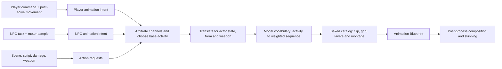

# Animation architecture — VtMB animation content on the Unreal animation system

This document owns the Unreal design of Elysium's character animation path. The engine-neutral
facts it consumes live in `docs/vtmb/animation_and_movers.md` (channel decode, the per-bone mask,
split inheritance, hierarchy composition, the root/entity transform, the autolayer binding),
`docs/vtmb/procedural_bones.md` (the axis-interpolation rule and the persistent pose array) and
`docs/vtmb/mdl_v2531.md` (the format those rules read). Status and implementation order live only in
`docs/project/roadmap.md` — the ANM programme for the asset stack, the CCC slice for the
resolver seam and the player graph.

The goal is not to reimplement Source's animation system inside Unreal. It is to let Unreal own
decoding, blending, skinning and LOD, and to add only the composition stages Unreal has no
equivalent for.

## 1. The two pipelines have the same shape

This is the load-bearing observation, because it is what makes a bespoke evaluator unnecessary:

| Retail | Unreal |
|---|---|
| decode locals | `UAnimSequence` evaluation |
| blend sequences, layers, transitions | blend spaces, layered blends, state machines, montages |
| compose hierarchy, including split inheritance | ordinary FK over locals re-expressed at bake |
| apply the procedural rule | post-process Anim Blueprint, component space |
| skin | skinning |

A post-process Anim Blueprint runs once per component after the anim graph and before skinning,
which is retail's slot exactly. Both engines blend **locals** and then compose, so the ordering VtMB
requires falls out of Unreal's existing pipeline rather than having to be recreated inside it.

Only the *procedural* row survives into that slot. Everything above it is resolved at bake, under
the root `CLAUDE.md` rule **"Poses are baked native"**: a clip on the mount is a complete,
self-describing Unreal-native local pose, and the frame path applies no VtMB rule. Where a clip's
meaning depends on state stored outside it, the bake resolves that state rather than forwarding the
question.

A rule that is non-linear across a blend has a residual when it is baked per clip: evaluating per
clip and blending the results is not the same as blending first and evaluating once. **That residual
is the accepted cost of the rule, and it is bounded and confined to crossfades** — over genuinely
crossfadeable clips of a real body's own locomotion bank, 77.3% of bone samples land within 0.5°,
99.7% within 5°, none above 10°, for the length of a fade. It is not a reason to keep the rule in the
frame path; it is what baking one costs.

### 1.1 Rotation provenance is closed

Every rotation that reaches a baked asset or an actor has one named source:

1. an authored MDL bind transform, animation sample, attachment, or entity placement;
2. the single formal Source-to-Unreal change of basis performed by the `UE_` exporter; or
3. a semantic re-expression required to make Unreal evaluate the same pose, such as resolving split
   inheritance into parent-relative locals or conjugating a VtMB post-multiplied additive into
   Unreal's pre-multiplied form.

There is no fourth category. In particular, the pipeline and runtime carry no fixed quarter-turn,
model-family facing correction, reference-pose flattening, asset-name exception, or rest-pose bake.
The mesh reference skeleton and the `USkeleton` both preserve the converted MDL bind transforms,
and entity placement is the converted entity placement alone.

This makes a visible quarter-turn a useful failure. A raw bind-pose inspection may be sideways
because the bind frame is storage, not necessarily the pose retail displays. A placed runtime model
that remains sideways after its selected sequence has been evaluated is missing a semantic input or
stage; it is not repaired by adding another rotation. The diagnostic records, in order, the entity
placement, selected sequence and frame, decoded local pose, and final component transform.

Any MDL retail evaluates through `CBaseAnimating` remains skeletal at runtime, including animated
props and rigid one-bone models. At rest it evaluates the same held sequence and frame retail chose;
converting that result into a static mesh would erase the distinction between authored bind and
authored rest.

## 2. The asset set is baked, not built at runtime

Characters are baked into native assets on the `/ElysiumBaked` mount by an editor commandlet beside
the map bake, under the same gitignored, regenerable posture. What the bake produces:

- **One authored `USkeleton` per compatible rig family.** Each skeleton is built from the converted
  MDL bind locals of its family, not from an identity-rotation surrogate. VtMB's shared animation
  banks are decoded once but their Unreal sequences are authored once per compatible model family,
  on that family's exact skeleton. This avoids Unreal's cross-skeleton reference-pose remapper
  without altering either side's rotations. Models outside the biped convention — animals,
  skeletal props and the wolf form — naturally form their own families.
- **A `USkeletalMesh` per model**, morph targets preserved. A face spans several material primitives
  and glTF morph weights are mesh-level, so a target that spans two materials arrives as one
  same-named piece per primitive; those pieces are **merged**, never first-wins, or a jaw moves and
  leaves its teeth behind.
- **A compressed `UAnimSequence` per clip.** Every clip is written as an ordinary parent-relative
  local pose: a bone carrying `Flags & 0x2` stores a rotation VtMB reads as model-space, and the
  bake re-expresses it against the parent's composed rotation from that clip's own frame, so
  ordinary FK reproduces the pose retail draws. The mesh needs nothing — VtMB's own `poseToBone`
  inverse binds are already conventional, so only the live pose ever disagreed.

- **The `_delta` family is additive against the base the file names.** The composition order does
  not carry over: every `EAdditiveAnimationType` pre-multiplies the delta (`Delta * Base`, in
  `AccumulateLocalSpaceAdditivePoseInternal` and the mesh-space path alike), while VtMB
  post-multiplies it (`Base * Delta`, `docs/vtmb/animation_and_movers.md`). The correction is a
  conjugation by the base rotation, `Delta' = Base · Delta · Base⁻¹`, and **the base is a bake
  input rather than a runtime one**: a delta is only meaningful over its own base, and the
  autolayer table states which that is. **The pairing is the table's, not a naming convention** — a
  host can declare a delta from another weapon's family entirely, which no name would predict, so a
  bake that pairs by name silently conjugates against the wrong pose. Conjugation commutes with
  Unreal's blend-from-identity, so a
  conjugated delta is exact at any weight over the base it declares, and degrades away from it
  exactly as any additive does.

  The asset therefore names its own base: `RefPoseType = ABPT_AnimFrame` pointing at that clip,
  not `ABPT_RefPose`. **An additive sequence's raw keys are not what ships** — setting the additive
  type makes the compressor bake the sequence down by subtracting its base before compressing, so
  the delta has to be written *composed onto* the same pose the conjugation used. The two are one
  decision: change what is subtracted without changing what is conjugated and every layered bone
  ships rotated by its own inverse bind, from a run that logs nothing wrong.
- **Blend profiles** in blend-mask mode, one per distinct per-bone mask. The mask is binary in the
  source data and there are only a handful of distinct masks per bank, so this is a small table on
  the skeleton rather than per-clip data. A profile is named for the bones it owns rather than for
  the clip or the slice that first reached it, so the same mask arriving from two banks resolves to
  one asset and a re-bake cannot rename one out from under a sequence pointing at it.

  **Which mask a clip owns is carried on the clip**, as animation metadata naming the profile. A
  sequence that states which bones it owns can be composed correctly by anything that opens it,
  including the animation editor, which is the same reason the assets are baked at all.

  A clip also needs one thing written that the source file states by omission: for every bone the
  clip owns, each absent position or rotation channel holds the **donor MDL bind value**. The
  exporter therefore materializes that value as a constant track. A bone the mask does not own
  remains absent and leaves the base pose untouched. This preserves VtMB's distinction without
  making Unreal consult either a donor file or an arbitrary family reference pose at evaluation.
- **The one overlay mask that owns the split bone derives once per declaring host.** Of the distinct
  per-bone masks a bank ships, exactly one contains `Bip01 Spine1` — the 49-bone upper-body gate the
  `*_aim_layer` and `*_bobble_layer` families carry. Those clips are the one place the split bone
  cannot be re-expressed against its parent *from the clip alone*, because the mask excludes the
  parent chain: the ancestors carry no rotation record, so the composed parent rotation the
  correction divides by is not in that clip.

  **Substituting the bind chain is not available, and the reason is measured.** The chain above the
  split bone is `Bip01`, `Bip01 Pelvis`, `Bip01 Spine`, and retail's rule declines all three —
  `Bip01` is an ordinary animated bone, not the entity transform. Every clip turns it: 63° from
  bind on a weapon idle, 82–99° on a walk or run. An overlay normalised against the bind chain
  therefore arrives rotated by the character's own root rotation, which is a larger error than the
  model-space value it was correcting.

  So the base has to be a real pose, and the autolayer table names one: the **host**. The family is
  emitted once per declaring host, composed onto that host's own pose, exactly as the `_delta`
  family above is. The two differ in how the clip combines with the host — an overlay *replaces* the
  bones it owns, an additive accumulates — and therefore in what ships: an additive is differenced
  against its base and names it, while **an overlay is not additive at all**. It is a plain masked
  local pose, composed toward its own result rather than differenced, and the host is what supplied
  the ancestor chain rather than something the asset points at. A grid's cells each derive against
  the same host, so the grid stays one thing.

  The correction is therefore **spent at bake**. Nothing about the split bone survives into the
  frame path, which is the rule rather than an optimization: a runtime that had to know the host's
  chain in order to evaluate a cell would be the failure "Poses are baked native" names.

  Two things fall out. The family needs **no blend profile**: an additive's untouched bones
  contribute the additive identity, so masked-out and bind-holding are both a zero delta and the
  three-state distinction the mask table exists to preserve does not arise. And the remaining masks
  need **no split correction at all**, because none of them owns the split bone — they are ordinary
  parent-relative overlays composed by a stock layered blend.
- **Blend spaces** from the exported grids: `UBlendSpace1D` for a `move_yaw` fan and a plain
  `UBlendSpace` for an aim grid. An aim grid is **not** a `UAimOffsetBlendSpace`: that asset wants
  mesh-space additive samples, and an aim layer's cells are ordinary masked local poses whose split
  bone was already resolved at bake. The sample placement is the same arithmetic for both. A sample
  sits at the axis value its cell declares —
  `paramstart + k·(paramend − paramstart)/(groupsize − 1)` — and the axis spans the grid's own
  range with one grid division per gap between cells, so every cell lands on a division. The pose
  parameter's own range does not enter: it cancels out of retail's axis resolution exactly, leaving
  the grid's range alone, and is consulted only for the wrap.

  **The wrapping axis is authored as duplicate endpoints, and that is how it is baked.** A
  `move_yaw` fan runs −180..180 with the same clip at both ends, so ordinary clamped interpolation
  reproduces retail across the seam. Marking the axis as cyclic instead would make the two ends one
  point carrying two samples, which the engine rejects — silently, by declining the second. Wrapping
  the parameter into range is the caller's job, which is what the parameter's own `loop` states.

  **A grid composes as one thing, so its cells must agree about what they are.** The cells of a
  partial-body aim grid carry the same per-bone mask, which is what lets the whole grid sit behind a
  single layered blend — no blend node masks per sample. The bake refuses to write a grid whose
  cells disagree, because such a grid could not be layered at all and the failure would otherwise
  surface only when the graph was built over it.
- **Morph-target curve metadata**, authored at bake. Registering it at runtime transacts by default
  and reaches an editor transaction buffer that does not exist under the editor executable in game
  mode; authoring it at bake removes both that hazard and its workaround.

The commandlet consumes the Unreal-native ESKM container directly. Standard glTF remains an
inspection product only and participates in neither the baked pose nor runtime placement.

### 2.1 What ships under which name

A layer whose meaning depends on its host is emitted **once per declaring host**, so one label can
produce several assets and the plain label names none of them. The container carries the derived
clip's own label, the label of the clip it is a difference from, and the tracks. The separator is
`@`, which no VtMB label contains:

```text
<layer>@<host>        the derived clip, as the container names it
A_<layer>_<host>      the sequence asset, after the illegal character is folded
BS_<label>@<host>     a grid whose cells ship only in derived form
```

**Which forms exist is not uniform, and a resolver has to know it.** A raw additive still appears in
the container — it is the label the model's own table references — but is not built as an asset,
because an additive no host declares has no base to be a difference from. A raw overlay is suppressed
when nothing else reaches it under its plain label, and kept when something does: a cell can belong
to two grids at once, one bound to a host and one declared by nobody, and the unbound grid still has
to be self-consistent. **Asking for the bare label finds nothing for a grid that ships only per
host**, and a miss there looks exactly like an unexported stem.

### 2.2 Two guards, and what each refuses

**A body's own clips never bake short.** Before writing a single clip, the bake checks every bone of
a container that carries geometry — the whole bone list, not only the animated ones — against the
skeleton, and fails the whole owner naming the missing bones. It deliberately does not name a cause:
the mesh build for the same stem may have failed earlier in the same run, in which case the skeleton
never saw those bones. A *bank's* unresolved bones are dropped and counted instead, because a bank
recorded on another clan's rig legitimately names hair chains this family never had.

**A stale container is refused rather than misread.** The exporter and the runtime reader carry the
same version constant, and the loader rejects a container it does not recognise instead of reading an
older layout as the current one. Each version is a change in what a clip may state about itself —
whether its split bone is normalized, whether it indexes a de-duplicated mask table, and whether it
names the clip it is a difference from — so an older layout read as the current one is silently wrong
rather than absent.

### 2.3 Two channel details that are not obvious

- **Ownership and channel presence are independent.** A weighted animation record owns its bone;
  an absent channel on that record reads the donor bind value. A zero-weight record does not own the
  bone and must not acquire a synthesized track. The exported mask preserves the first distinction
  and complete owned tracks preserve the second.
- **A split bone can be resolved only from a complete sampled pose.** The exporter composes the
  donor bind fallback before re-expressing the flagged rotation. It never treats an absent channel
  as identity or as an unreadable quaternion.

### 2.4 The skeleton reference pose is authored

Every baked family `USkeleton` carries the converted MDL local transform for every bone, including
rotation. The mesh carries its own converted bind skeleton. No build step substitutes identity
rotations, and no runtime step counter-rotates the result.

A bank `UAnimSequence` is built on each model family skeleton that consumes it. The sequence and the
mesh therefore present the same `USkeleton` pointer to Unreal, so `FSkeletonRemapping` never enters
the path. Optional donor bones that the family lacks are dropped by name, exactly as VtMB's outer
mapping skips absent targets. This is deliberately generated duplication: sharing one bank sequence
across distinct `USkeleton`s would save disk by introducing an engine rotation stage Troika did not
have.

`OrientAndScale` remains only for VtMB's authored donor-to-target **translation** mapping. Each
container registers its converted bind as the sequence's retarget source; rotation tracks pass
verbatim. Owned missing channels have already become donor-bind constants (§2.3), while unowned
bones remain on the playing mesh's pose. Thus neither fallback depends on which family member seeded
the `USkeleton` reference pose.

## 3. Gameplay actions are resolved before the graph

A key press never selects an animation asset. The player command says what the player asked for;
movement decides what the body actually did; gameplay decides whether an attack, reaction or
script owns the body; only then does animation select an activity and resolve that activity through
the current model. NPCs enter the same path from an AI task or entity behaviour rather than from a
user command.

That distinction is load-bearing. Mapping `W` directly to `walk` would animate while a wall stops
the player, choose walk during an airborne frame, and give NPC movement a second implementation.
The animation layer reads the **post-solve body state** and the gameplay request, never raw input.

The terms used by the layer are deliberately separate:

| Term | Meaning | Example |
|---|---|---|
| command | one frame of requested player input | forward + slow gait + attack |
| body sample | the movement result after collision and state transitions | grounded, 92 cm/s, ducked |
| action request | a gameplay or script request that may own a channel | reload, light hit, scene gesture |
| activity | the stable VtMB semantic key | `ACT_WALK`, `ACT_RELOAD_GLOCK` |
| sequence | one model-vocabulary choice for an activity | `walk`, selected by `actweight` |
| animation asset | the clip, blend space, layer or montage Unreal evaluates | baked `walk` blend space |

The retail path and the remake path therefore have the same high-level shape:



### 3.1 It is code around authored tables, not one hardcoded table

Retail splits responsibility across three places (`docs/vtmb/animation_and_movers.md` A.3):

- **The game DLL contains policy.** The player state classifier and mode router, NPC schedules and
  task handlers, the 4,460-entry activity registry, per-class translations, and each weapon's
  activity-override table are compiled code or static data in `vampire.dll`.
- **The model contains choices.** `StudioSeqDesc` supplies the stable activity literal, sequence
  label, `actweight`, flags, transition duration, events, blend grid and autolayer binding. The
  include DAG says which shared bank owns the chosen sequence.
- **Live state supplies context.** Velocity, facing, ground/water/duck/jump state, current weapon,
  AI task, damage direction, form, scene ownership and other state decide which policy branch is
  active.

The remake preserves that separation without reproducing the binary's class layout. Generic
classification, arbitration and resolution are code; the activity registry, weapon translations,
model choices and layer bindings are generated data. There is no per-model switch in the player,
NPC motor or Anim Blueprint, and there is no manually maintained list of thousands of clips.

### 3.2 One contract, two producers

The shared boundary is an engine-neutral **animation intent**. Its implementation type is
`FElysiumAnimationIntent`; it carries no `UObject` and contains:

- the logical character handle, model stem and source (`Player`, `Npc`, `Scene`, `Damage`,
  `Interaction` or `Debug`);
- a channel (`Base`, `FullBody`, `UpperBody`, `Additive`, `Gesture`), plus a request generation so
  a completed one-shot cannot cancel its replacement;
- either a stable `ACT_*` name or an explicit sequence label, never both;
- the repeatable variant/RNG token used by weighted selection;
- local velocity, speed, facing-relative movement yaw, aim yaw/pitch, ground/water/duck/air state,
  and the current form/weapon tags needed by translation;
- loop/one-shot intent and the request's completion owner, but no hand-authored blend time or asset
  reference.

An explicit sequence is an escape hatch for content that actually names one: choreographed-scene
events, `scripted_sequence`, `SetAnimation`, and the retail `player_sequence` developer command.
Ordinary locomotion, combat and reactions use activities. A gameplay system naming `walk_0` is a
layer violation: it has skipped weighted choice, include ownership and the blend grid.

A model selection is neither kind of animation request. `SetModel`, `MorphModel` and transform
lifecycle tasks change the model/include graph that owns every later activity or exact-label
answer. They update the intent's model identity and invalidate any selection tied to the old owner;
they do not synthesize an idle or transform clip unless a separate task requests one.

The two producers are different only before this boundary:

- **Player.** `FElysiumUserCmd` remains the input record, not an animation record. After
  `UElysiumMovementComponent` (or the A/B `UCharacterMovementComponent`) has moved, the player body
  publishes the realized velocity and its ground, water, duck and jump phase. The player entity
  contributes weapon, attack, feed, use, discipline, damage and scripted state. Camera/body yaw
  supplies the unambiguous `move_yaw` relationship.
- **NPC.** The substrate publishes the desired activity or explicit scripted action; the motor
  publishes realized velocity, facing and move status after its tick. Patrol, interesting-place,
  dialogue and scripted-sequence behaviour are request producers, not clip players. Later combat AI
  uses the same seam rather than growing an animation path inside a controller.

`FElysiumLocomotionSample` is the smaller shared result both bodies publish: local planar velocity,
speed, facing yaw, `move_yaw`, grounded/air/water state, stance, and the jump phase. It is sampled
after movement and merged with the current action requests into the intent. The Anim Blueprint never
reads input, AI controllers, entity fields or weapons directly.

**`move_yaw` is three angles, not one.** The sample carries the commanded yaw and the realized one
raw, and the **pose parameter** as a third field that follows the realized yaw through a 720 °/s
slew, a 0.3 s re-arm and a hold at a standstill. The filter belongs to `FElysiumAnimationDriver`
rather than to the sample, because it is a rate and a producer's sample is a getter a reader may
take twice a frame; a producer therefore seeds the pose field unfiltered and the driver replaces it.
The mover reads the *commanded* yaw for its speed cell and never the filtered one, or a turning
body's speed would lag its direction.

**The driver also owns the body's gait speed tables** (`docs/architecture/movement-architecture.md` →
"The speed authority"). They key on the body — stem, weapon, form, variant — rather than on the
frame, so they are re-resolved only when that key moves and pushed to the mover on change; a weapon
swap therefore carries one frame of latency, which is deliberate and less than the network lag
retail carries. The same tables build `FElysiumGaitReference`, so the classifier's walk/run threshold
and the mover's commanded speed cannot come from two different numbers.

**It is sampled in the post-move pass** — the one the camera director and the eye tick already run
in — so no consumer reads a half-integrated frame. One struct, two producers, deliberately: the
player's mover and the NPC motor fill the same record, so the cast's locomotion and the player's
cannot become two systems that happen to play the same files.

### 3.3 Resolution and arbitration

One resolver consumes the intent and the baked character catalog. It performs these steps in order
and emits an `FElysiumAnimationSelection` diagnostic record:

1. **Arbitrate requests by channel.** A full-body scene or paired interaction can own the base while
   a dialogue gesture owns only its slot. Death, damage, combat and locomotion do not become an
   accidental ordering of `if` statements inside an Anim Instance. The priority table is explicit,
   data-tested and capture-verified before it is labelled retail behaviour.
2. **Choose a base activity.** Locomotion classification operates on the body sample; gameplay
   requests supply attacks, reactions and contextual actions. A direct-sequence request bypasses
   only this and activity translation.
3. **Translate the activity.** Apply the recovered actor/form and weapon tables in their witnessed
   order. Weapon rows remain ordered because a later duplicate-base row is a model-availability
   fallback. Retain the authored `required` bit as provenance and a diagnostic only: the pinned
   VtMB server translator never reads it, so optional and flagged rows follow the same path.
4. **Resolve the model vocabulary.** Find every sequence carrying the final activity, apply
   `actweight` using the supplied selection token, and retain the exact model/sequence identity.
   The chosen label then resolves through the include DAG to its owning bank.
5. **Resolve the asset shape.** A plain label becomes a sequence, a movement fan or aim grid becomes
   its baked blend space, and the exported base-to-layer binding supplies overlays/additives. A
   masked sequence is rejected from the base channel.
6. **Publish graph parameters.** The graph receives state-machine state, speed, `move_yaw`, aim
   parameters, selected assets/slots and authored transition metadata. It does not repeat selection.

The selection record contains the request source/channel, logical requested activity, VtMB
pre-translation, first weapon activity, each NPC/class → weapon iteration, resolved activity,
weapon activity, target sequence, transition sequence/state, variant token, sequence label and raw
index, selected model and owner stem, selected asset kind, active layer labels, pose parameters, and a
success/fallback reason. The same record is rendered in Cog and written by headless acceptance
runs. Without it, a wrong pose can be blamed on input, AI, translation, model data or blending with
no way to distinguish them.

**The fallback ladder belongs to step 4, and it is the cast's alone.** `CAI_BaseNPC` retries a
missing translated `ACT_RUN` as weighted `ACT_WALK`, then the whole request as `ACT_DISPOSITION`,
then sequence index 0. The player's chain has no ladder — the controlled corpus records a ducked
phase-8 `ACT_LAND_CROUCH` request simply returning −1 — so a player miss resolves to nothing and is
reported as a **named** miss with the activity and the body in the record. Substituting `ACT_LAND`
for it would be inventing behaviour; naming the miss is what lets the graph declare a fallback.

**The locomotion ladder is recovered, and ours matches its shape.** Retail's runs ahead of the
compact-code dispatch rather than inside code 1, and it is
`ducked ? (speed2D > 5 u/s ? ACT_SNEAK : ACT_CROUCH) : (speed2D > T || commanded > T ? run : walk)`
with `T` the body's own forward walk cell plus one unit
(`docs/vtmb/animation_and_movers.md` → "The gait ladder runs ahead of the compact-code dispatch").

- **`ACT_SNEAK` from ducked-and-moving is faithful**, including the flat 5 u/s cut and the absence of
  a walk/run split or a relaxed form below it.
- **The walk/run split reads both speeds**, realized and commanded, which is retail's own
  disjunction. The commanded term is what selects the run on the first frame of a full input instead
  of after the body has accelerated into it. The body sample carries `CommandedSpeed` for it and
  reports zero on a producer with no command, which is every NPC — so the cast is judged on realized
  speed alone, as it must be.
- **No gait memory.** `HysteresisFraction` defaults to zero because retail holds none and the
  commanded term removed the flicker the margin existed to damp.

Neither classifier threshold is an absolute speed: every one is a fraction of an injected walk/run
reference, so the speed authority moving takes them with it rather than leaving numbers to find.

**The landing one-shot's hold is provisional rather than chosen.** A still, grounded body has to
leave `ACT_LAND` somehow, and the classifier is content-free — it must not read the clip it is about
to describe. A latch-local duration holds it until the graph can report a finished one-shot, at which
point the completion callback replaces the timer.

### 3.4 The generated action corpus

Game-derived output remains local and regenerable. Static/decompiler/capture evidence lives below
`$ELYSIUM_WORK_ROOT/research/gameplay-actions/<run>/`; the normalized engine-neutral export lives
below `$ELYSIUM_EXPORT_ROOT/out/animation/actions/`; the character bake turns it into a catalog on
the gitignored `/ElysiumBaked` mount. Only the extractor, schemas and hash-pinned research
specification are tracked.

The normalized corpus has these logical artifacts. Their filenames are a file seam, not a second
status tracker:

| Artifact | Required contents | Source |
|---|---|---|
| `activity_registry.json` | stable name, pinned-build numeric ID, registration ordinal | `vampire.dll` activity registration |
| `player_action_rules.json` | mode, compact action code, tested predicates, base activity, pose-parameter writes, confidence/evidence | player `PostThink` classifier/router and retail trace |
| `npc_action_rules.json` | class, schedule/task or entity request, desired activity/direct label/model change, base-versus-layer route, interrupt/completion rules, confidence/evidence | NPC class/schedule call graph, map/Python producer survey and retail trace |
| `weapon_activity_tables.json` | weapon/RTTI/entity class, base activity, translated activity, inert authored `required`, table ordinal, shared-table identity | hash-pinned PE32 RTTI and each weapon's `acttable_t`; retail `activitydump` is an independent oracle |
| character catalog | exact owner model and raw sequence index, label, activity, weight, flags, fade, events, grid, movement, autolayers, target compatibility | existing MDL/include exporters and player inventory |
| `action_coverage.json` | reachable rule → translation → sequence/asset closure per supported player body and NPC class/model | deterministic join of all artifacts above |

The character catalog extends the existing `npc/clips`, blend and index sidecars; it does not
invent a parallel clip inventory. The disposable raw player inventory produced by
`research/tooling/capture/inventory_player_animations.py` preserves the full 764-byte sequence and
72-byte animation descriptors for research, while the public export carries only decoded fields
the runtime uses. Sequence events are decoded in the model reader and across the complete native
server/client handler surface; ANM4b must emit them into this existing path. Autolayers and the
sequence-transition graph likewise belong in the catalog rather than being recovered later from
baked assets.

“All actions” is defined by **reachability**, not by copying every name in the global registry. It
is the union of:

- every action request and activity translation reachable from player input, movement, weapons,
  disciplines, damage, forms and scripts;
- every desired activity/direct sequence reachable from NPC schedules, tasks, dispositions,
  interesting places, dialogue, damage, combat, scripted sequences and choreographed scenes;
- every model sequence reachable through the 56 player bodies and every exported NPC's include DAG;
- every emitted activity or direct label seen by the retail trace, including a population that no
  static call-graph seed predicted.

The coverage report groups that union into locomotion, stance/ambient/dialogue, combat, reactions
and death, contextual/paired interactions, forms/disciplines, and scripted/cinematic overrides. An
unresolved row remains named with its provenance; it is never dropped because a clip appears
unused.

### 3.5 Extraction and proof loop

The working case is `research/cases/animation-pose/specs/gameplay_actions.json`. It uses the existing
Ghidra driver and retail capture harness rather than a second hook project. The loop is:

1. Run the player-model inventory and the ordinary NPC exporter to establish exact model/sequence
   identities, weights, grids, movement records and include reachability.
2. Reproduce the completed player ordinary, compact and paired-action extraction from the
   hash-pinned Ghidra pack: the 17-entry `PLAYER_*` table, all 15 genuine `+0x704` calls, both
   effective discipline `Player_Anim` rows, shared player RTTI policy bodies, ordinary apply/select
   order, full activity registry, forced-sequence command, nine-entry paired initial-activity table,
   protected-first mode router, five paired producer sites, six continuation leaves, role/size/side
   translation and two-actor commit. Keep the four dormant compiled codes distinct from reachable
   gameplay. A sustained unarmed crouch repeats its non-looping sequence only after the server
   finished flag is set: an unchanged request reuses the current sequence before completion, then
   reselects it and resets cycle/finished state on the next policy frame.
3. Reproduce the completed NPC-class extraction from the recovered
   `SetIdealActivity/SetActivity → TranslateActivity → ResolveActivityToSequence →
   SetActivityAndSequence` chain: PE32 RTTI collapses 77 descendants to 10 pre-translation, five
   class-translation and two cover/reload delegate bodies, including all 29 paired-action bases and
   their 232 role variants. The companion task-slot extraction reduces the same surface to 29
   StartTask and 24 RunTask bodies and materializes all 111 custom animation task routes. The
   sequence-event extraction separately validates 1,872 records and all server/client dispatch
   bodies; the layer extraction fixes all 685 model bindings at full caller weight and the four
   combat slots at their 0.1 networked weight. Event/layer emission remains a catalog/evaluator
   input rather than a task-override guess.
4. Reproduce the completed hash-pinned weapon extraction: PE32 RTTI and each vtable's table/count
   pair recover all 169 subclasses and 9,214 ordered per-class rows; keep retail `activitydump` as
   an independent textual oracle rather than a source for invented `required`-flag behavior.
5. Extend the existing retail trace with one compact record at each boundary: producer/action code,
   base activity, each translation result, selected model/sequence, pose parameters and active
   layers. Join on the full serial-bearing entity handle and model identity, as the pose capture
   already does; entity index alone is reusable and is not an identity key.
6. Drive a controlled action matrix and compare the retail selection record with the remake's
   `FElysiumAnimationSelection`. Add a seed or rule for every unexplained transition; never patch the
   expected output by clip name.

Static extraction proves table completeness; live capture proves branch reachability and ordering.
Neither replaces the other. A trace that did not happen to use a weapon cannot prove its table is
empty, and a decompiled branch cannot prove gameplay reaches it.

### 3.6 First playable slices

The layer is implemented vertically so walking begins before all combat is decoded:

1. **Shared locomotion.** Player and NPC idle/walk/run/sneak/crouch/air/land requests, post-solve
   speed, `move_yaw`, authored ground speed and transition metadata. Existing NPC patrol and
   scripted travel become callers of the shared intent seam; the player stops holding its spawn
   idle while moving.
2. **Reactions.** Directional light/heavy hit, knockback, death/ragdoll handoff and interruption.
   This is the minimum for NPCs to visibly react to gameplay.
3. **Weapons and interactions.** Draw/holster, aim, attack, reload/dryfire, block, feed/use and
   paired actions, with weapon activity tables and partial-body layers.
4. **Full behavior coverage.** NPC combat schedules, disciplines/forms and every remaining
   contextual action in the coverage report.

A slice is accepted only when every request it can emit resolves for its declared model set or
names an explicit fallback. Runtime failure is visible but non-fatal: the body keeps its previous
safe pose and emits a once-per-key diagnostic. Content tests fail any missing mapping inside an
accepted slice, any required weapon override that misses, any masked sequence selected as a base,
or any sequence whose owner/asset cannot be found.

### 3.7 Integration with the current runtime

The implementation grows the path already serving both actor kinds:

- `UElysiumAnimSubsystem` **is** the character catalog and resolver, serving every body rather than
  the cast alone; a second player-only clip cache would duplicate the same model vocabulary and
  shared banks.
- `FElysiumNpcClipSet`, `ResolveActivityClip`, the baked blend spaces and the current player visual
  are migration inputs. `PlayNpcActivity` remains a compatibility adapter while patrol/scripted
  callers move to `FElysiumAnimationIntent`.
- `IElysiumEmbodiment` carries the engine-neutral intent across the substrate boundary. NPC entity
  behaviour can request an activity without knowing about an Anim Instance; player gameplay state
  uses the same call. Body-local movement sampling stays on the engine side.
- The per-body driver resolves once when discrete request/model/weapon state changes and updates
  continuous locomotion parameters every animation frame. Asset lookup and weighted choice do not
  repeat every tick.
- The Animation Blueprint consumes only the resolved selection and continuous parameters. Its
  graph owns state machines, blend spaces, layer nodes and montages; the post-process graph remains
  the only custom pose stage.

Both movement implementations and both actor kinds must produce the same trace schema. That is the
architectural test that this is one gameplay-animation layer rather than four paths that happen to
play the same files.

## 4. The animation graph

An Animation Blueprint per body archetype — biped, animal, skeletal prop — rather than a
hand-written instance:

- **A locomotion state machine** over idle, walk, run, sneak, crouch and air, with real transition
  rules. VtMB's stance banks ship almost no authored transitions (of the gendered disposition
  banks, one carries a single transition clip), so a short engine blend is what reproduces the
  original's feel rather than inventing polish — but it belongs in a transition rule, not in a
  hand-integrated scalar.
- **Layered blend per bone** over the baked blend profiles. This is where VtMB's partial-body layers
  land, and it is what makes a masked bone come from the base pose rather than from the reference
  pose. The binding — which layer rides which base — is exported data the graph consults, not a
  mechanism the graph implements.

  The arithmetic underneath is a **complementary-weight** blend gated per bone by the mask —
  `nlerp(base, layer, s)` on rotation and the matching lerp on translation, `s` the layer's weight
  times the bone's mask bit. An overlay therefore *replaces* the bones it owns rather than adding to
  them, which is what separates it from the additive below and why the two are never the same node.
- **Additive nodes** for the `_delta` family, each over the base clip its asset names.
- **A second layered bone blend** for the upper-body overlay family, over a plain blend-space player
  standing the aim grid. Every cell of a grid carries the same mask, so one node holds the whole
  grid. It is deliberately not an aim-offset node: that node's samples are mesh-space additives,
  and this family bakes as masked local poses with the split bone already resolved against its
  declaring host. The property VtMB's split bone supplied is spent at bake, not reproduced here.
- **Montage slots** for one-shots: scripted-sequence clips, scene gestures, disciplines, and the
  cinematic playback path. A slot is also what keeps a gesture layered over a sequence instead of
  replacing it.
- **A post-process graph** carrying the one custom stage below.

Two properties the graph must preserve. A **masked sequence is never selectable as a base clip** —
retail composes those as layers and never selects one, so a base-clip path that can reach one is a
defect. That extends to a whole grid: an aim grid's cells are overlays, so it feeds the layer input
of a masked blend and is never a body pose. And **pose parameters drive the blend spaces**, so a nine-cell fan
resolves off its neutral cell only when something writes the parameter.

That neutral cell is correct **by construction rather than by any rule**: reading every parameter as
zero lands a `move_yaw` fan on the forward cell, which is what a body standing still should play.
The moment something writes `move_yaw`, that construction is what moves — so a graph whose parameter
is never written and one whose parameter is written correctly look identical at rest and diverge
only in motion.

## 5. One custom stage, and only one

**Axis interpolation.** For each bone the model declares as procedurally driven, read the control
bone's local rotation, evaluate the six-entry three-way blend, and replace the driven bone's local
transform outright. The rule is `docs/vtmb/procedural_bones.md`. It derives
`FAnimNode_SkeletalControlBase` and runs in the post-process graph.

**It is the standing exemption to "poses are baked native", and it earns that on one property:** it
reads a *live* control-bone orientation, so its input is the blended pose rather than anything a
file states. That makes it a rig rule of the same kind as an IK or look-at node, not a frame
conversion. Every other VtMB rule — split inheritance, the additive combine order, the per-bone mask
— names a value the file carries somewhere, so each is a bake input and none reaches the graph.

Split inheritance in particular is **not** a stage. `Flags & 0x2` is a 2004 toolchain defect the
engine was taught to tolerate: the flagged bone's rotation is stored in model space while every
other bone's is parent-relative, and `docs/vtmb/animation_and_movers.md` records that all 373
flagged bones' `poseToBone` inverse binds are ordinary hierarchy FK — the animators authored a
conventional pose and only the storage frame disagreed. Under
`docs/project/remaster-direction.md`'s Behaviour test that is a defect fixed at bake, and §2 says
how each of the two cases is written.

This stage is **correctness, not feel** — the irreducible delta between reading VtMB's rigs and not
reading them.

**There is one build of a character, and it is the baked one.** No runtime path constructs a
character from `.glb` or `.eskm`, so no unresolved VtMB storage rule reaches the graph and there is
no split-inheritance node to gate. A stem the character export has not covered cannot stand at all
and fails by name — a missing export rather than a silent substitution.

**The engine's pose-driver node is the wrong tool** for it. Its shape matches — a driver
bone, an evaluation space, target poses — but it interpolates with a radial basis function rather
than the sign-selected three-way slerp the rule uses. It would approximate a stage that reproduces
retail to `1e-4`.

Practical shape: twelve to twenty-one driven bones per character, each a few dot products and two
slerps, against a skinning pass over the same mesh — the cost is negligible. Resolve bone indices
once in `InitializeBoneReferences`, never by name per evaluation. `LODThreshold` drops the
correction on distant characters, where limb twist is not resolvable. Skeletal controls evaluate in
component space while the axis rule reads a **local** rotation; deriving it as
`parentComponent⁻¹ · boneComponent` is cheap and the base class supplies the conversion. Declare it
thread-safe so it evaluates on animation worker threads with the rest of the graph.

## 6. What the export carries, and the basis boundary

Exported clips store **resolved** locals, not raw decoded ones: the split bone's model-space
rotation re-expressed against its parent, and a delta conjugated into Unreal's combine order. A
channel retail decodes and then overrides is carried as what the override produces, because nothing
downstream does the overriding any more. Beside the clips the export must carry the procedural rule
table, the per-bone mask inventory, the layer binding, and the blend grids.

The boundary is basis. The rule's six entries and its **axis index** are expressed in VtMB's basis,
and a change of basis conjugates bone locals: the axis a rule names is not the same axis after
conversion, and may be negated.

So the rule table is converted by **the same exporter and the same conversion functions that write
the character's mesh and clips**, making the two consistent by construction rather than by
agreement. A separately authored native exporter reintroduces exactly the reconciliation this
avoids. One exporter emitting a companion table beside the artifact it already writes is the
arrangement that holds.

**The axis survives as a direction, not as an index.** A carried-through Source axis index can name
the wrong Unreal axis or sign. Folding the change into the entry ordering does not work either:
terms 1 and 2 are interchangeable under the inner slerp, but term 3 is distinguished as both the
`a1 + a2 == 0` fallback and the outer slerp target. The table therefore ships the axis as a converted
direction plus the three converted Source axes, and the runtime takes each term's signed weight as a
dot product. Entry order is the raw record's, and the rule body stays retail's verbatim.

**There is no import-side transform.** ESKM writes centimetres, Unreal handedness and Unreal-native
local rotations by calling the same `source_to_unreal`, `source_dir_to_unreal` and quaternion basis
conversion used for the mesh and clips. The commandlet reads those values 1:1, and the runtime reads
the resulting assets 1:1. A fixed yaw or scale at either consumer would be a second coordinate
conversion and violates §1.1.

The mask ships **inside the character container**, as a de-duplicated table the clips index into,
rather than beside it: it is per animation record, so a sidecar would restate the clip list to say
which row belongs to which clip. It is carried as bone **names** rather than indices by the time it
reaches an asset, for the same reason retargeting works by name: a bank's bone order is not a
character's.

**It cannot be reconstructed from the tracks, which is why it has to ship.** A bone the clip does
not own animates nothing, and a bone the clip owns and leaves at its bind pose animates nothing
either, so both reach the exporter with no channel and would arrive as the same absence. The two are
opposite results when the clip is composed as a layer — the first keeps the base pose, the second
replaces it with a bind pose the overlay authored.

## 7. The face is a curve interface

The facial rig writes named float curves flagged as morph-target curves over whatever pose the body
produced; it writes no bones. The eyes read an eyeball bone's transform to build an aim basis and
then write shader parameters, so they write no bones either. The body and the face therefore never
interact — a crossfade between two stances does not touch the face, and a blink does not touch the
pose — and nothing in the graph above changes that.

What the bake owes the face is only this: the morph targets present, the duplicate-target pieces
merged, and the curve metadata authored. `docs/vtmb/facial_animation.md` owns everything else.

## 8. Adjacent stages

**The garment simulation** (`pipeline/src/elysium_pipeline/enhancement/cloth.py` writes its rig) runs
after the composition stage, so the simulation sees the finished skeleton. It is an enhancement
rather than a reproduction because it synthesizes a bone lattice instead of consuming VtMB's
authored renderer-cloth payload. Retail selects that second payload with `MDLHeader.Flags & 0x400`,
skins its pinned attachment particles, then simulates and substitutes selected render vertices
after ordinary skinning. Jeanette's skirt and Sheriff's coat both use it. The exact carrier and
solve are `docs/vtmb/secondary_motion.md`.

It is **off** (`elysium.Cloth 0`) and it no longer selects a mesh. A garment rig names lattice
bones the shared baked skeleton does not carry, so with the cvar on the chains resolve nothing;
every body comes off the mount either way.

**Bone-chain secondary motion is another independent stage.** VtMB simulates hair, ponytail, mane
and breast chains from an authored table in the model header, with gravity, damping, a spring
coefficient and a maximum angle. It corrects bone-to-world matrices before skinning; renderer cloth
instead consumes the finished palette only for its anchors and writes particle-derived vertices
afterward. Both retail solves are decoded; game-independent numeric replays and a post-skin cloth
capture still gate faithful implementations.

**The persistent partial-update behaviour is a divergence.** Retail refreshes only the bones a mask
selects, so bones legitimately carry matrices composed against older roots; those mask bits are
loader-written and cannot be recovered from the installed file
(`docs/vtmb/procedural_bones.md`). Computing every bone each frame is the divergence this design
takes, and it is recorded as one in the owning topic.

**Blend-space interpolation is a divergence.** The authored grid states its cells and the parameter
range each axis spans; Unreal interpolates between samples by its own scheme rather than by retail's
cell selection. The authored content is reproduced; the interpolation between authored values is
Unreal's. Tracked with the rest of the ANM programme's divergences in
`docs/project/plans/animation.md`.
