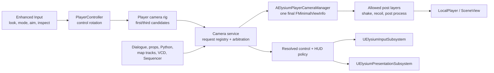

# Camera architecture

This document owns the Unreal-side camera design for the remaster: player view modes, third-person
behaviour, dialogue framing, prop focus, camera triggers, scripted shots, and authored cinematics.
`docs/vtmb/camera-view-modes.md` owns the recovered VtMB behaviour and source-data contracts.
`docs/project/remaster-direction.md` owns the deliberate divergence from that behaviour, and
`docs/project/roadmap.md` owns implementation status and sequencing.

The camera is a player-facing system, not a pawn feature with a growing list of exceptions. The
stable shape is one final authority per local player, a request API for every producer, and separate
owners for movement, input scope, presentation, and authored timelines.

## Direction

The shipped target is a modern camera with two complete, persistent player choices:

- **First person** is the new-game default and keeps VtMB's intimate exploration and conversation
  scale. It is not a temporary state the weapon system silently selects.
- **Third person** is a fully supported exploration and combat view, not a forced animation shot.
  The player can orbit without rotating the character, and camera obstruction never changes
  gameplay movement.
- `CyclePlayerView` toggles only the two persistent player choices. Direct `FirstPerson` and
  `ThirdPerson` actions remain bindable. Aim, inspect, dialogue, feeding, scripted shots, and
  cinematics are scoped overrides; they never overwrite the saved choice.
- When a scoped override ends, the camera restores the exact prior player mode, control rotation,
  shoulder, and zoom state unless the override explicitly returns a new state.
- VtMB's recovered camera stays executable as a development A/B reference and as the compatibility
  evaluator for original scripts and map camera tracks. It is not the shipped feel target.

This is a deliberate feel divergence. It removes the original's weapon-class camera arbitration,
forced perspective churn, character-coupled third-person orbit, and reliance on one 2004 boom solve
for gameplay, dialogue, feeding, and cinematics. It does not change original game logic, map I/O,
shot-file grammar, or camera-track timing.

## Non-negotiable rules

1. **One final authority per local player.** `AElysiumPlayerCameraManager` produces the one
   `FMinimalViewInfo` that reaches the renderer. No subsystem independently calls
   `SetViewTargetWithBlend` or modifies the view after it.
2. **Producers request; the director arbitrates.** Player modes, props, dialogue, map entities,
   embedded Python, VCD playback, feed/death states, and Sequencer all use the same handle-based
   service. They do not know about one another.
3. **Camera rotation is not character rotation.** The camera reports an aim/facing policy to the
   player controller and movement layer. It never rotates or navigates the pawn directly.
4. **One timeline owns every blend.** The camera service owns gameplay/request blends; Sequencer
   owns authored cinematic timing; the recovered camera-track evaluator owns VtMB track timing.
   An adapter publishes the sampled result and never eases it a second time.
5. **Cuts are first-class.** A hard cut resets camera lag, spring history, motion vectors, and
   temporal history through `bGameCameraCutThisFrame`. A zero-duration request is not a very fast
   blend.
6. **Input and presentation stay outside the camera.** The input subsystem owns mapping contexts,
   scopes, cursor and control suppression. The presentation subsystem owns HUD, reticle,
   letterbox, prompts, and subtitles.
7. **Original data stays data.** Game-derived `camerashots/`, map entities, VCDs, and scripts remain
   exported external inputs. Project-owned camera profiles and Level Sequences may be authored as
   Unreal assets under `/Game/ElysiumAuthored/**`.
8. **Every override has an owner and a lifetime.** Requests are released explicitly, invalidated by
   map epoch, or bounded by a timeout. There is no global "current special camera" boolean.

## Unreal responsibility chain

The design follows Unreal's camera responsibility chain while keeping VtMB's runtime substrate
engine-neutral:



### `AElysiumPlayerCameraManager` — final authority

The custom `APlayerCameraManager` is transient and per local player, matching Unreal's intended
owner for the final viewpoint. It:

- asks the camera service for the resolved base request;
- evaluates or consumes that request into `FMinimalViewInfo`;
- applies only the post layers allowed by the request;
- marks cuts and resets transient camera state;
- publishes a read-only resolved state for diagnostics and presentation;
- never owns quest state, dialogue state, entities, or save data.

The player controller sets `PlayerCameraManagerClass` once. View-target changes are an internal
adapter detail, not the public camera API.

### `UElysiumCameraService` — requests and arbitration

The service is local-player scoped. It owns active request values and generation-checked handles;
world objects own the handles. The engine-neutral substrate reaches it through a narrow
`IElysiumCameraService` value interface installed with the other world services.

The public surface is:

```cpp
FElysiumCameraHandle PushRequest(const FElysiumCameraRequest& Request);
bool UpdateRequest(FElysiumCameraHandle Handle, const FElysiumCameraRequest& Request);
bool ReleaseRequest(FElysiumCameraHandle Handle, float BlendOutSeconds);
void CutTo(FElysiumCameraHandle Handle);

void SetPlayerViewMode(EElysiumPlayerViewMode Mode);
void CyclePlayerViewMode();
FElysiumResolvedCameraState GetResolvedState() const;
```

`FElysiumCameraHandle` contains an id, generation, local-player id, and map epoch. Updating or
releasing a stale handle is a no-op with a diagnostic. Handles are never serialized as durable
identity.

### `FElysiumCameraRequest` — one value contract

A request contains values, not actor ownership:

| Group | Fields |
|---|---|
| Identity | debug name, source kind, priority class, owner epoch |
| Pose | optional world pose, eye/player-relative pose, or resolved target anchors |
| Lens | horizontal FOV or cine lens, near-plane policy, post-process contribution |
| Transition | cut/blend, duration, curve, interruption rule, return rule |
| Tracking | one or two anchors, local offsets, position/rotation tracking rates and tolerances |
| Control | look permission, movement permission, facing policy, recenter policy |
| Presentation | HUD, reticle, subtitles, letterbox, player-body and viewmodel visibility |
| Composition | additive layers allowed during the request, camera-collision policy |

The request never carries a raw substrate pointer. `FElysiumCameraAnchor` names either a world
transform or an entity handle plus an attachment kind (`Origin`, bounds centre/top/bottom, eye,
bone, socket) and local offset. A world-side resolver converts anchors to transforms immediately
before camera evaluation. Missing targets select the request's declared fallback; they never
dereference a dead actor.

## Arbitration and composition

Only one **base request** supplies the viewpoint. Priority is semantic, not a collection of magic
integers:

| Priority class | Typical owners | Default control |
|---|---|---|
| `Player` | first/third player rig | gameplay look and movement |
| `Focus` | prop inspect, map point of interest | inspect look; movement policy is explicit |
| `Dialogue` | active conversation | dialogue input; movement suppressed |
| `GameplayEvent` | feeding, death, takedown | event-specific |
| `LegacyShot` | `SetCamera`, VCD camera event | source contract |
| `LegacyTrack` | `camera_track` / `camera_keyframe` | cinematic suppression |
| `Sequence` | project-authored Level Sequence | sequence policy |
| `Emergency` | loading/failure/debug possession | no gameplay input |

The highest active class wins. Within a class, the most recently activated request wins and the
stack reports contention in diagnostics. Releasing any handle re-resolves the winner without LIFO
assumptions, so a dialogue can end behind a still-running cutscene.

Post layers are separate from base arbitration and execute in a fixed order:

1. authored/base pose and lens;
2. locomotion response or head motion;
3. recoil;
4. camera shake;
5. damage/status response;
6. post-process blend.

Every base request has an allow mask. Legacy tracks and Sequencer disable locomotion, recoil, shake,
auto-tracking, and gameplay motion blur by default so authored edits remain exact. Accessibility
scales motion layers at the source rather than damping the final pose after a cut.

## Project-authored camera assets

Original project packages live under the explicit Git/LFS namespace
`Content/ElysiumAuthored/**`, mounted as `/Game/ElysiumAuthored/**`. Camera assets use:

```text
Content/ElysiumAuthored/
  Camera/
    Profiles/       DA_CameraProfile_*.uasset
    Dialogue/       DA_DialogueCameraSet_*.uasset
    Curves/         Curve_*.uasset
    Shakes/         CS_*.uasset
    Triggers/       BP_CameraTrigger_*.uasset
  Cinematics/
    Sequences/      LS_*.uasset
    Shots/          LS_Shot_*.uasset
```

These packages contain only original project-authored logic, transforms, timings, curves, and
settings. A package derived from the user's VtMB install remains prohibited even if copied into
this namespace. Generated `/Game/VtMB/**`, `/Game/Elysium`, and `/ElysiumBaked/**` packages keep
their existing ignored/regenerable contracts.

`UElysiumCameraProfile : UPrimaryDataAsset` is the designer-facing tuning unit. It carries:

- first-person eye offsets, FOV limits, head-motion response, and body/viewmodel visibility;
- third-person arm length, socket offset, shoulder sides, orbit limits, lag, obstruction probe,
  obstruction recovery, and aim offsets;
- mode and request transition curves;
- focus framing limits and dialogue composition defaults;
- allowed post layers and accessibility scaling categories.

Runtime code references profiles through soft object paths or Primary Asset ids. A small project
settings object identifies the default profile and generic fallback sets; gameplay code does not
hard-load named packages or embed designer tuning.

`UElysiumDialogueCameraSet` carries reusable shot grammar rather than one asset per retail line:
single, close-up, over-shoulder, two-shot, and fallback profiles with screen-space margins and lens
ranges. `UCurveFloat` owns intentional blend shapes. `UCameraShakeBase` assets own reusable shakes.
Project-authored multi-shot scenes use Level Sequence and Cine Camera Actors.

Authored sequences bind runtime characters and props through the sequence bridge's project-owned
binding ids. They do not hard-reference `/Game/VtMB/**` or `/ElysiumBaked/**` packages. The bridge
resolves those ids to the current map's runtime actors when playback starts; a missing binding
fails the sequence validation or chooses an explicitly authored fallback.

The experimental Gameplay Camera System is not the production foundation. It can be evaluated
behind an adapter when Epic marks it production-ready; the request contract and asset library do
not depend on it.

## Player camera rig

`UElysiumPlayerCameraRigComponent` lives on each player body and evaluates the `Player` base
request. `UElysiumCameraBoomComponent : USpringArmComponent` supplies Unreal's standard obstruction
probe and retract/recover behaviour for the modern third-person path. One `UCameraComponent`
carries projection and post-process settings; the rig supplies candidate poses rather than
activating multiple cameras.

The recovered Hooke-spring evaluator remains in the legacy/A-B path. It is not reimplemented inside
the modern boom merely to preserve a disliked result.

### Player modes

```cpp
enum class EElysiumPlayerViewMode : uint8
{
    FirstPerson,
    ThirdPerson,
};
```

Aim is a control state within the selected mode, not a third persistent view. `CyclePlayerViewMode`
therefore cannot accidentally cycle through aim, inspect, dialogue, or a scripted camera.

| State | Camera control | Character facing | Locomotion |
|---|---|---|---|
| First-person explore | direct look | follows view while moving; stationary torso policy belongs to animation | forward-relative |
| First-person aim | direct look | aim yaw | strafe-capable |
| Third-person explore | independent orbit | movement velocity | camera-relative movement; no forced camera recenter |
| Third-person aim | shoulder aim | aim yaw | strafe-capable |
| Inspect/dialogue/scripted | request-defined | unchanged unless gameplay/scene logic asks | input policy from request |

The camera never calls `SetActorRotation`, writes movement input, starts navigation, or asks an AI
controller to turn the player. The player controller resolves the winning facing policy and passes
it to movement/animation. Camera-relative movement uses the flattened control yaw, not the spring
arm's collision-adjusted direction.

Automatic recenter is off by default. A bindable recenter action is immediate and deterministic;
an accessibility option may enable a delayed soft recenter while moving, with strength and delay
stored in user settings. Shoulder swap is a separate bind and preference.

### Obstruction and transitions

- The boom probes on a dedicated camera collision channel with a sphere, ignoring the player,
  attached equipment, held props, triggers, and non-blocking FX.
- Obstruction shortens or offsets the camera. It never pushes the player, changes facing, or feeds
  a new movement direction back into navigation.
- Recovery is damped and frame-rate independent. Teleport, possession, load, view-mode cut, and
  hard camera cut reset boom and lag history before the next view.
- A shoulder fallback may try the opposite shoulder only when the profile permits it; it does not
  oscillate every frame. Hysteresis keeps the chosen side until the original side is safely clear.
- Near-player body fade uses the masked/dithered player material path. World obstruction prefers
  camera retraction or a designed fade interface; it never makes arbitrary world geometry
  translucent globally.

## Prop focus and points of interest

Selection, interaction, and camera framing are three distinct concerns:

1. the interaction system chooses a candidate and exposes its entity handle;
2. a focus target provider resolves useful anchors from bounds, socket, bone, or authored offset;
3. the camera service frames that target through a `Focus` request.

Runtime props expose `UElysiumCameraFocusableComponent` or the engine-neutral equivalent
`FElysiumCameraTargetSpec`. The spec contains only anchor choice, framing radius, preferred side,
minimum/maximum distance, orbit limits, and fallback. It does not hold a camera, input component,
or widget.

Two focus forms cover the remaster:

- **Soft focus** keeps the player's base position and applies a capped look-at/framing assist. It is
  suitable for a map trigger briefly drawing attention to a door, NPC, or event and is always
  player-interruptible.
- **Inspect** acquires the inspect input scope, frames the prop, and maps look/zoom to a bounded
  orbit. It never moves or rotates the player. Losing the target or pressing cancel releases the
  request and restores the exact previous view.

Candidate validation uses camera-channel sweeps and target visibility. Selection traces do not run
inside camera code, and framing failure falls back to the normal player view plus the ordinary
interaction prompt.

## Dialogue camera director

The dialogue runner owns one `Dialogue` request for the lifetime of the conversation. It provides
speaker, listener, player, line metadata, and optional source shot information; the dialogue camera
director chooses a shot from `UElysiumDialogueCameraSet` and updates the request.

The default grammar is restrained:

- establish with a safe two-shot when space permits;
- prefer eye-line singles or over-shoulders for alternating lines;
- keep the speaker's eyes inside stable screen-space margins and preserve the established screen
  side;
- cut on line or beat boundaries, not on every speaker change;
- reserve push-ins and close-ups for authored emphasis;
- keep subtitles and facial performance readable;
- fall back to the player's current view when no candidate passes collision, near-plane,
  target-visibility, and framing tests.

Candidate tests run when selecting a shot, not as a per-frame search. Once selected, anchors track
through the shared request contract with bounded translation/turn rates. The director never rotates
an NPC or the player; gaze, facing, gestures, and lipsync remain owned by dialogue/scene/animation.

Original `vdata/camerashots/` definitions are parsed by the legacy-shot adapter. They do not become
authored Data Assets, and their documented `DialogPOV`, attachment, visibility, and tracking
semantics remain available to original scripts.

## Camera triggers and public adapters

All adapters terminate at `IElysiumCameraService`; none contains a second camera stack.

### C++ and props

`UElysiumCameraFocusableComponent` exposes target metadata. `UElysiumCameraTriggerComponent` and
`AElysiumCameraTriggerVolume` expose a request template, activation policy, target bindings,
priority, blend, one-shot/retrigger policy, and restore behaviour. Project-authored levels may place
the Blueprint trigger asset. Generated VtMB maps spawn trigger behaviour from entities, sidecars,
or script calls rather than hand-editing `/ElysiumBaked` maps.

### Embedded Python 2.7

The runtime Python bridge exposes primitives and opaque handles, not UObjects:

```python
handle = camera.FocusEntity(entity, profile="InspectDefault", blend=0.25)
handle = camera.PlayShot("ProjectShotId", target=entity, blend=0.2)
camera.Update(handle, target=other_entity)
camera.Release(handle, blend=0.2)
camera.SetPlayerView("first" | "third")
```

The exact Python method names are registered beside the existing script API and accept entity
handles already valid in that VM. A map-epoch teardown releases every handle created by that map.
Offline editor Python is never invoked by these runtime calls.

The original `SetCamera(character, shotfile)` and `RemoveCamera()` surface remains a compatibility
adapter with one replaceable named-shot slot. `RemoveCamera` releases only that slot; it cannot pop
dialogue, a map track, or a project-authored sequence.

### VCD and map camera tracks

The existing `camera_track` / `camera_keyframe` evaluator remains the timing authority for original
Worldcraft cameras. It publishes the sampled position/target/FOV/roll as a `LegacyTrack` request.
Its independent position and target owners, short-edit cut fold, outputs, holds, restores, and map
snapshot state remain exactly as specified in `docs/vtmb/camera-view-modes.md`.

VCD camera events use the same adapter: a recovered CameraMove or Restore action acquires, updates,
or releases a legacy request. Unsupported original event kinds stay explicit diagnostics rather
than being guessed into new cinematography.

### Sequencer and project-authored cutscenes

New remaster cinematics use `ULevelSequence` with spawnable Cine Camera Actors and a Camera Cut
Track. `UElysiumSequenceCameraBridge` acquires one `Sequence` request when playback gains camera
authority and releases it on stop, abort, skip, travel, or owner destruction.

Sequencer owns shot transforms, lenses, focus, cuts, and its own blends. The bridge samples the
active camera into the request without a second interpolation. Camera Cut sections set the cut flag;
blends to or from gameplay are authored in the Camera Cut Track or delegated to one service blend,
never both. The sequence also publishes its input/HUD policy through the request.

Original VCDs and Worldcraft tracks are not bulk-converted to Level Sequences. That would replace
known timing and I/O semantics with authored approximations. Sequencer is the authoring surface for
new project-owned scenes and deliberate remaster overrides only.

## Input, settings, and presentation

Camera actions are commands in the normal input catalog:

- look, zoom, first person, third person, cycle view, recenter, shoulder swap;
- aim/target as gameplay state;
- inspect, inspect orbit/zoom, cancel;
- cinematic skip where the scene permits it.

The camera service may publish a desired control policy, but `UElysiumInputSubsystem` owns the
handle-based scope and mapping-context changes. The camera manager never calls `SetInputMode`, shows
the cursor, consumes raw keys, or owns pause.

The resolved camera state is copied into `FElysiumViewState` once per frame. HUD code consumes that
projection to choose reticle, interaction prompt, body/viewmodel visibility, letterbox, and HUD
visibility. Widgets never query the pawn or camera manager.

User settings persist independently of a save slot:

- preferred first-/third-person mode and shoulder;
- separate first- and third-person horizontal FOV;
- mouse/pad sensitivity and inversion;
- automatic recenter enabled, delay, and strength;
- camera shake, head motion, recoil response, and motion-blur intensity;
- dialogue camera enabled where a player-view fallback exists.

Save data retains story-authoritative owners, not transient handles. On load, dialogue, map track,
feed/death, or sequence state republishes its request from its own snapshot. The player preference
then remains underneath it. Travel invalidates every map-scoped request before the new map publishes
readiness.

## Diagnostics, tests, and performance

### Diagnostics

One camera dump reports:

- player mode and saved preference;
- active base requests in priority order, owner, age, epoch, and blend state;
- winning request and resolved pose/lens/control/presentation policy;
- boom desired length, obstruction hit, actual length, shoulder and lag-reset reason;
- target resolution failures and fallback chosen;
- cut flag and allowed post layers.

The existing `elysium.camera` diagnostic grows into this view. Cog/MCP expose the same read-only
state rather than maintaining separate camera truth. Debug drawing can show the target anchor,
desired pose, collision probe, final pose, safe framing bounds, and dialogue candidates.

### Automated contracts

- request arbitration, out-of-order release, stale handles, equal-priority contention, map-epoch
  invalidation, interruption, exact restore, cut versus blend;
- first/third cycle with aim, inspect, dialogue, and sequence overrides active;
- third-person independent orbit, facing-policy output, obstruction, shoulder hysteresis,
  teleport/load resets, and frame-rate-independent recovery;
- prop focus success/fallback and target destruction;
- dialogue two-shot/single selection, screen side, visibility rejection, subtitle-safe framing, and
  player-view fallback;
- Python/C++/entity trigger ownership and teardown;
- Sequencer cut/blend/abort/skip/travel with no double interpolation;
- every existing legacy shot and `camera_track` timing test, including the theatre's live acceptance.

The played acceptance matrix covers mouse and gamepad in first person, third-person exploration,
third-person aim, a narrow interior obstruction, a prop inspect, a multi-speaker dialogue, an
original map track, and a project-authored Level Sequence. Each override must return to the exact
chosen player view without rotating or navigating the character.

### Runtime budget

Camera evaluation happens once per rendered local-player view. Inactive triggers do not tick.
Dialogue candidate searches happen only at shot-selection boundaries. The player boom performs its
one active obstruction query; inactive player candidates and losing requests do not trace. Target
resolution is proportional to the small active request set, never to all entities in a map.

## Build order

The construction path keeps the theatre's verified legacy camera intact while replacing the player
experience around it:

1. Install `AElysiumPlayerCameraManager`, `UElysiumCameraService`, request values/handles,
   diagnostics, and cut handling. Wrap the current `UElysiumCameraComponent` shot stack as the first
   legacy adapter.
2. Add the project-authored asset namespace, default `UElysiumCameraProfile`, soft-loading library,
   and validation that rejects missing or game-derived dependencies.
3. Add `UElysiumPlayerCameraRigComponent`, the modern Spring Arm path, direct first/third commands,
   independent orbit/facing policies, settings, and exact override restoration.
4. Route input and `FElysiumViewState` through the resolved control/presentation policy. Remove any
   camera-owned input-mode or widget changes.
5. Add focus target/trigger components, prop inspect, map point-of-interest requests, and the C++ /
   embedded-Python adapters.
6. Add the dialogue director and reusable dialogue camera assets; validate it on the first tutorial
   conversation before scaling across the corpus.
7. Add the Sequencer bridge and one small project-authored acceptance sequence. Preserve VCD and
   Worldcraft timing in their existing evaluator.
8. Migrate feed/death and remaining direct producers, then make the remaster path the production
   default while retaining the faithful player evaluator as a developer A/B mode.

## References

- [Unreal Engine 5.8 camera responsibility chain](https://dev.epicgames.com/documentation/en-us/unreal-engine/cameras-in-unreal-engine?application_version=5.8)
- [`APlayerCameraManager` API](https://dev.epicgames.com/documentation/en-us/unreal-engine/API/Runtime/Engine/APlayerCameraManager?application_version=5.8)
- [`USpringArmComponent` API](https://dev.epicgames.com/documentation/en-us/unreal-engine/API/Runtime/Engine/USpringArmComponent?application_version=5.8)
- [Camera Cut Track in Sequencer](https://dev.epicgames.com/documentation/en-us/unreal-engine/cinematic-camera-cut-track-in-unreal-engine?application_version=5.8)
- [Cine Camera Actor](https://dev.epicgames.com/documentation/en-us/unreal-engine/cinematic-cameras-in-unreal-engine?application_version=5.8)
- [Gameplay Camera System overview — Experimental](https://dev.epicgames.com/documentation/en-us/unreal-engine/gameplay-camera-system-overview?application_version=5.8)
