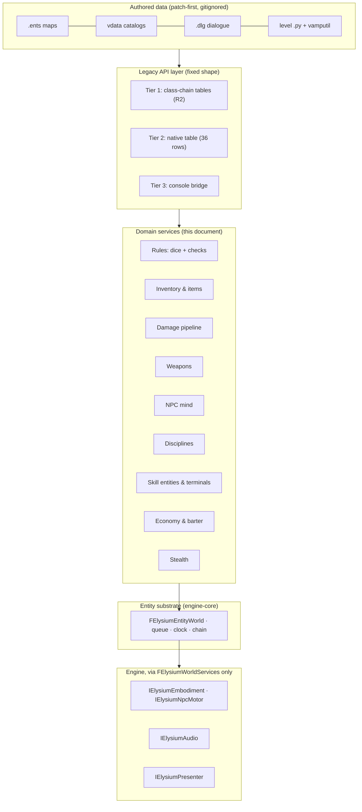

# Gameplay systems — the legacy API layer and the domain decomposition

This document owns the architecture of the **game-rule layer**: the defined API surface that
answers VtMB's legacy script/entity/dialogue calls, and the decomposition of the gameplay domains
behind it — rules and dice, inventory, damage and weapons, the NPC mind, disciplines, skill
entities and terminals, economy, and stealth. It states, per domain, the design, the seams it
joins, and the concrete refactor each one requires of the current runtime.

It builds strictly on top of two existing designs and never restates them:

- `docs/architecture/engine-core.md` — the object language **R1–R8** (entities are plain C++,
  one name table per class, one clock and one queue, the two chokepoints, dormancy, handles).
- `docs/architecture/runtime-architecture.md` — the spine **S1–S12** (the four lifetimes, the
  frame, the player entity, world services, input, presentation, the save walk, the
  engine/game ownership line).

The VtMB behavior this layer must answer is owned by the `docs/vtmb/` fact set —
`script_api.md` (the action inventory), `python_bridge.md` (the binding mechanism),
`entity_io.md` (I/O), `npc-ai-reverse-engineering.md` (the NPC), `combat-and-damage.md`
(damage), `skills-and-checks.md` (check policy), `inventory.md` (items),
`disciplines.md` (powers), `computer-terminals.md` (terminals), `game_runtime.md` (the RPG
model). Where a fact there is still open, this design carries the seam and refuses to guess the
body. Task sequencing and status live only in `docs/project/roadmap.md`.

This document's own rules are numbered **K1–K13** — a fresh namespace beside R and S.

## 1. The problem, stated once

The shipped content drives the game through **16,860 executable call sites over 676 names**
(`docs/vtmb/script_api.md`), plus 24,081 authored entity output wires. That demand does not
arrive through one API: it arrives through five surfaces (output field 6, `logic_pythoncheck`,
dialogue conditions/actions, `ScheduleTask`, and level scripts), it addresses three binding
kinds (module globals, Character methods, datamap inputs/fields), and it lands on systems of
very different maturity — the sheet, quests, dialogue and movers are real; inventory, dice,
combat, disciplines, the NPC mind and the skill/terminal entities are stubs or absent.

The architecture problem is therefore **not** designing a new API. VtMB itself proves there is
no big API: `Entity.__getattr__` is a datamap walk, and the substrate's class registry (R2)
already reproduces it. The problem is (a) freezing the *shape* of the legacy layer so every new
system lands behind an existing name rather than minting a dispatcher, and (b) decomposing the
missing domains so each one has exactly one home, one data source, one event posture, and one
save story.

## 2. The legacy API layer — three tiers, five surfaces, one rule

The legacy API layer **already exists in shape**; this section fixes it as a contract. It has
exactly three tiers, and no gameplay system may add a fourth.

### 2.1 Tier 1 — the class-chain tables (the datamap mirror)

`FElysiumClassRegistry`'s per-class input and field tables (engine-core R2) are the primary
legacy surface. One case-folded, derived-shadows-base chain walk serves Hammer I/O wires,
Python attribute get/set/call, keyvalue application, the save-field walk, and the inspector.
The character chain mirrors VtMB's own:

```text
FElysiumEntity            CBaseEntity           keyfields, dormancy, I/O, think, Use
 └ FElysiumAnimating      CBaseAnimating        body follow, clips, skin, disposition
    └ FElysiumCombatCharacter  CBaseCombatCharacter  sheet, money, blood, humanity,
      │                                          masquerade, damage/death, inventory
      ├ FElysiumNpc       CAI_BaseNPC           relationships, senses, mind, NPC outputs
      └ FElysiumPlayer    CBasePlayer           player inputs, law state, XP, body link
```

Every domain in §5 lands on this chain as registered fields (which makes it savable, S9),
registered inputs (which makes it wire- and script-reachable), and registered outputs (which
makes it authorable). The interim standard for a registered-but-unbacked input is the shared
`ELYSIUM_PENDING_INPUT` macro (`Substrate/ElysiumPendingInput.h`, with a declaring-class form
so a chain-level input reports one work-list row) — the frenzy family,
`ClearActiveDisciplines`, `BarterBegin`/`End`, the camera-target quartet, and the recovered
NPC-chain `SetScriptedDiscipline` input. Each
row is retired by the domain that owns it, never by a generic sweep, and
`Elysium.Content.ScriptApiCoverage` asserts every corpus-called name resolves backed-or-pending.

### 2.2 Tier 2 — the shared native table (globals + Character methods)

`Scripting/ElysiumScriptNatives.cpp` holds the **one** binding table (`GNativeBindings`, 36
rows: 12 module globals + 24 Character methods) that both script hosts dispatch through
(`FElysiumCPythonScriptHost` via `ElysiumPythonEntity.cpp`, the expr fallback via
`ElysiumExpr.cpp`). This is the entire bespoke surface VtMB adds beyond the datamap —
`docs/vtmb/script_api.md` is its per-row specification. The table's rules:

- **Membership is closed by the retail evidence.** A name enters the table only if VtMB bound
  it in a `PyMethodDef` table. `Whisper` and `FrenzyTrigger` stay out deliberately: their bare
  spellings must resolve to `vamputil.py` in `__main__` while their receiver-qualified
  spellings walk the datamap (K1). `Elysium.Substrate.OneOfSet` guards the split.
- **Every row resolves its receiver through one helper** (`ResolveCharacter`) and reports
  through one funnel (`Record()` → `ElysiumStub::Fired` for stubs), so `elysium.stubs` and the
  Cog Scripting window are always a live, complete gap report (K3).
- **A stub returns the retail-shaped default** (`CharMethodStubResult`: false/0/None), never a
  guessed success.

Domain services in §5 give real bodies to the stub rows: 9.8 takes `HasItem`/`GiveItem`/
`RemoveItem`/`AmmoCount`/`GiveAmmo`/`HasWeaponEquipped`/`StartBarter`; 9.9 completes
`SetDisposition` and takes `React`/`SetExpression`; 13.2 takes `DialogDiscipline` and
`SeductiveFeed`'s power half; the terminal work takes nothing here (terminals are Tier 1
entities). The table itself never grows a second dispatch path.

### 2.3 Tier 3 — the console bridge

`FElysiumConsole` with its fixed precedence — **registered command → alias expansion → cvar
set → Python fallthrough** — is the third tier, serving `ccmd.<name>` script calls and the
`.cfg` alias vocabulary. It is complete; new systems only *declare verbs* in
`FElysiumCommands` (S7) and install implementations (`vbarter`, `inven_drop`, `save`,
discipline selection verbs land here as their domains arrive).

### 2.4 The five surfaces converge, and stay converged

Output field 6, `logic_pythoncheck`, dialogue conditions/actions (through the `dlgexpr`
normalizer `ElysiumDlgExpr::ConditionToPython`/`ActionToPython`), `ScheduleTask` source
strings on the one queue, and the level scripts all execute through the installed
`IElysiumScriptHost` against the same `__main__`. A domain service is therefore reachable from
all five surfaces the moment it backs its Tier 1/Tier 2 names — no per-surface work exists,
and none may be added.

### 2.5 Events — the resolution contract

The shipped maps are authored against an exact resolution order — the tutorial's porch, fade,
feeding, safe, terminal and elevator chains each depend on which of two equal-time actions lands
first (`docs/vtmb/sp_tutorial_1-event-surface.md` §11; map-wide,
`docs/vtmb/exported-map-event-surface.md`). "Handling all events" is therefore two commitments,
not one: a single transport, and a single deterministic order on it. This section is that
contract; K11 and K12 make it reviewable.

#### 2.5.1 One transport, one order

Every authored or domain event resolves through `FElysiumEventQueue` under the recovered
delivery contract. The queue mechanics are engine-core R4's; the retail facts are owned by
`docs/vtmb/entity_io.md` → "Output-list and queue order" and `docs/vtmb/game_runtime.md` →
"Queue service order, recursion and starvation". The load-bearing consequences for this layer:

- **Firing** enumerates an output's repeated rows in **reverse parsed order** (retail prepends)
  and enqueues one record per live row, counting down the def row's `times` (authored `0` and
  `-1` both mean unlimited).
- **Ordering** is deadline sort with **equal-time FIFO**; zero-delay work produced by a receiver
  drains in the same pass **breadth-first**, behind the equal-time cohort already pending —
  never depth-first.
- **Service of one record** delivers the input to every name match in stable entity order, then
  executes its field-6 Python, then the direct handle if still valid. Stale activator/caller
  handles become null; they cancel nothing.
- **Binding is late.** A target name resolves at service time against the live entity set —
  maker children and script-spawned entities make statically absent names valid — and is never
  prebound at parse. Missing-at-service is a counted non-fatal drop, not a retry.
- **Validity is parse-time.** A row exists only if the producer's class chain declares that
  output; an unknown key is dropped and can never fire. The corpus contains such rows
  (`trigger_player_activity_level.OnTrigger`), and they are not gaps.

Producers **enqueue**; only queue service **delivers**. No domain dispatches an input
synchronously from a producer site, and none installs a private timer, latent action, or second
scheduler — timed behavior is a substrate think or an owned queue event (R4). Three recovered
seams look synchronous and are not exceptions, because each is a call made *inside* a handler
the queue or script host is already executing, not a transport of its own: a script's reflected
entity-input call (`docs/vtmb/python_bridge.md` → "Synchronous calls versus queued Python"),
`logic_pythoncheck`'s `Test` evaluation, and a terminal Function's `runscript`
(`docs/vtmb/computer-terminals.md`). Outputs fired inside any of them rejoin the queue behind
the pending equal-time cohort.

#### 2.5.2 Producers — the frame slot decides *when*, never *how*

Every producer runs in a declared stage of the frame (S2) and does nothing at that site but
fire outputs into the one queue. The recovered producer families:

| Producer family | Frame slot (S2) | Examples |
|---|---|---|
| Collision edges and occupancy | movement/contact + overlap routing | trigger begin/end/`OnTrigger`, per-touch level refresh, discipline-context bits, hurt cadence |
| Held-use sessions | `+use` focus + session callbacks | signs, terminals, containers, bomb site, feeding — begin/end/completion outputs |
| Explicit query inputs | queue service (they *are* inputs) | `trigger_checkvolume.CheckNow`, `point_teleport.Teleport` |
| Substrate thinks | think pass | `logic_timer`, movers, scripted sequences, VCD scenes, prop animation, the NPC mind, leaf thinks (`trigger_push` acceleration) |
| Domain transitions | wherever the owning service commits | damage commit → `OnDamaged`; feed end → `OnFedUponEnd`; sense contact → `OnFoundPlayer` |
| Scheduled Python | queue service | `ScheduleTask` source strings (same queue, live `__main__`) |
| Map activation | the activation transaction | `logic_auto`; landmark placement fires **no** arrival output |

Discovering a new authored output therefore never implies a new tick or dispatcher: the owning
subsystem decides *when* the output object fires, and the transport is always the same queue —
the seven trigger leaves recovered beyond the tutorial all reduce to collision, input, or
held-use producers over it (`docs/vtmb/exported-map-event-surface.md`).

#### 2.5.3 The four kinds — what a domain event rides

Every domain in §5 classifies its events into these and adds no fifth transport:

| Kind | Transport | Examples |
|---|---|---|
| Entity I/O output | the def's parsed `outputs[]` rows through `FElysiumEventQueue` | `OnTrigger`, `OnDeath`, `OnSkillSuccess`, `OnTrigger0..7`, `OnFedUponEnd` |
| Domain transition that *fires* an output | the domain service calls `FireOutput` on its owning entity at the real producer site | damage commit → `OnDamaged`; feed end → `OnFedUponEnd`; sense contact → `OnFoundPlayer` |
| Game-sound stimulus | **new**: the substrate sound-event bus (§5.5) — `FElysiumEntityWorld::EmitGameSound(pos, category, radius, source)` | gunshots, `NPC_TAKE_DAMAGE`, footsteps, `NPC_DISCIPLINE_ALERT` |
| Presentation announcement | `IElysiumPresenter` / `FElysiumViewState` (S8) | fade started, dialog opened, vitals changed |

The second kind is the load-bearing one: acceptance fires outputs **from their real
producers** (the tutorial brief's rule), so a domain lands only when its transitions raise the
authored outputs itself — debug injection never counts.

#### 2.5.4 Diagnostics — the two failure kinds stay distinct

A wire naming no live entity and a resolved receiver lacking the input are different conditions
with different meanings — only the second is a reimplementation gap — and the chokepoint sinks
count them separately (K3). Authored dead wires, invalid rows, and dangling Python names are
preserved as counted no-ops, never repaired or silenced by inventing receivers (K2).

#### 2.5.5 In-flight events are save state

Pending queue records (with their Python source and remaining `times`), relay refire locks,
trigger wait gates, consumed one-shots, scene clocks, and the `!playercontroller` relationship
restore with the map epoch, and restore rebinds the controller relationship before service
resumes (K8; mechanics in `docs/architecture/save-architecture.md`). A domain whose event state
lives anywhere else has already broken a mid-beat save.

#### 2.5.6 Divergences from retail resolution are a closed set

The runtime's visible departures from retail event resolution are enumerated, owner-called, and
recorded beside the faithful behavior in their owning docs: the **10,000-delivery service cap**
(retail drains unbounded and can hang the frame on a zero-delay cycle; the cap defers a due
tail across a think boundary retail never observes — engine-core R4), the **deterministic
post-movement containment diff** (all old ends, then all new begins, stable entity order — a
port rule, `docs/vtmb/entity_io.md`), and the frame's declared stage boundaries (S2). Any other
observed ordering difference is a defect, not a tolerance (K12).

## 3. The compatibility contract — K1–K13

Every domain service and every refactor in this document satisfies all thirteen. They are the
review checklist for gameplay-layer code.

- **K1 — A name is backed at its retail binding kind.** A Character method stays a Tier 2 row;
  a datamap input stays a Tier 1 chain input; a script helper stays Python in `__main__`. The
  receiver decides between same-named surfaces (`pc.Whisper` vs `Whisper`), never a merged
  implementation. `GiveItem` exists twice (method and player input) and the two need not share
  a body.
- **K2 — Failure postures are reproduced, not repaired.** Script errors print and evaluate
  false; a missing I/O target is a counted no-op; a zero `MoneyAdd` is silent; `SetGesture`'s
  label miss is a silent `None`; authored defects (`spawnKeycard` on the wrong receiver, the
  five dangling tutorial callbacks) stay defects. A "fix" here is a divergence and needs the
  owner call in the owning VtMB doc.
- **K3 — Absent is visible.** Every unbacked surface routes through `ElysiumStub::Fired` (or
  `ELYSIUM_PENDING_INPUT`, or a stub class row); `elysium.stubs` and `elysium.classes` are the
  live work list. A silently-succeeding stub is the bug.
- **K4 — The three social domains never merge.** The combat relationship table
  (`SetRelationship`, `D_HT/D_FR/D_LI/D_NU`), the emotional disposition
  (`SetDisposition`, `DispositionTable.txt`), and the RPG reaction score (`reaction.txt`,
  `reactions000.txt`) are three stores with three writers. No code path derives one from
  another.
- **K5 — A rating is not a roll.** `CalcFeat` returns the integer rating; only the dice
  resolver rolls, it returns the whole result (successes, botches, net, tier), and the
  *consumer* owns threshold/opposed/pacing policy (`docs/vtmb/skills-and-checks.md`'s
  seven-step contract). Dialogue compares; locks roll; feeding opposes a rating to a roll.
- **K6 — Damage is a descriptor.** Typed damage travels as the `FElysiumDmg` value object
  through one shared apply path; the scalar `TakeDamage(float)` remains the compatibility
  fallback and never grows semantics. Both commit through one typed health commit.
- **K7 — Body ownership is explicit.** A character's motor has one owner at a time from a
  closed set (§5.5); transfer, failure and restoration go through the owner arbiter, and the
  owner serializes. The three solidity switches (enabled / frozen / character-ignoring) stay
  independent.
- **K8 — State has one of three homes.** A registered Save-flagged chain field, a member of
  the session record, or a declared save block — nothing else (restates S4/S9 for the gameplay
  layer). A domain that stores state anywhere else has already broken save/load.
- **K9 — Rules are data, loaded once.** Every catalog this layer consumes —
  `vdata/items/*`, `DiceRolls.txt`, `npctemplate*.txt`, `DispositionTable.txt`,
  `reaction*.txt`, `disciplinetgt_*.txt`, `stealth.txt`, `interestingplacetypelist.txt`,
  `hackterminals/*` — loads patch-first through `FElysiumRulebook`/`ElysiumKeyValues` readers
  into typed tables. No constant recovered from a data file is re-typed into C++.
- **K10 — Every domain runs headless.** Each service is plain C++ in `Substrate/` (or
  `Scripting/`), reaches the engine only through `FElysiumWorldServices`, and lands with a
  Substrate-tier test against the recording stub (`Private/Tests/ElysiumTestServices.h`)
  before it is proven live (restates S10).
- **K11 — Producers enqueue; only queue service delivers.** Every event resolves through the
  one queue under §2.5.1's order contract. No domain dispatches an input synchronously from a
  producer site, installs a private timer/latent action/second scheduler, or prebinds a target
  name at parse time. The three recovered synchronous seams (§2.5.1) are calls inside an
  already-executing handler, not transports, and their fired outputs rejoin the queue tail.
- **K12 — Determinism divergences are enumerated, or they are bugs.** The runtime's visible
  departures from retail event resolution are exactly §2.5.6's closed set, each recorded beside
  the faithful behavior in the doc owning the system. An ordering difference outside that set —
  a domain reordering equal-time work, delivering depth-first, retrying a missed target, or
  firing rows in export order — is a defect to fix, never a tolerance to document around.
- **K13 — A domain asks the engine questions and answers them itself** (restates S11 for this
  layer). A gameplay domain reaches `FElysiumWorldServices` for geometry, visibility or
  reachability, and decides on what comes back. The authored half of every question is a rulebook
  value (K9) resolved in the substrate, never a parameter handed to an engine subsystem to
  arbitrate: the `cover`/`walk`/`flank`/`chase` occlusion weights, `player_reaction`, the
  `investigate_mode` policies, the `pl_criminal_*`/`pl_supernatural_*` thresholds and the
  perception tuning are all decisions. A perception component that owns *who is my enemy*, or a
  spatial query returning *the cover to take* rather than the reachable points to choose among,
  has moved a decision across the seam. The failure is symmetric and both halves are defects:
  importing an engine subsystem's policy, and reimplementing in substrate arithmetic a question the
  live world should have been asked. S12 owns the coarser cut — which side of the seam a whole
  system lives on; K13 governs the questions a substrate-owned domain asks across it.

## 4. The system map



Homes, by lifetime (S4): the rulebook tables and the sound-event category catalog are
application-lifetime; the player record's inventory/journal/law halves are session-lifetime;
every domain's live state (an NPC's schedule, a terminal's session, an item's owner) is
map-epoch state on chain entities; a frame's sense queries and roll results are frame-local.

## 5. The domain services

Ordered by dependency: each subsection names the design, the data source (K9), the events
(§2.5 classification), the save story (K8), and the refactor of the current source.

### 5.1 Rules service — the dice resolver and check policy

**Design.** `Substrate/ElysiumDice.{h,cpp}`, a pure namespace beside `ElysiumSheetMath`:

```cpp
enum class EElysiumRollTier : uint8 { Botched, Failure, PartialSuccess, Success, CriticalSuccess };
struct FElysiumRollResult { int32 Successes; int32 Botches; int32 Net; int32 Tens;
                            EElysiumRollTier Tier; };
FElysiumRollResult ElysiumDice::Roll(int32 Pool, int32 Difficulty,
                                     const FElysiumDiceTable& Weighting,
                                     int32 AutomaticSuccesses = 0, int32 HealthPenalty = 0);
```

It draws only from `ElysiumRng::Stream(EElysiumRngStream::Dice)` and implements
`docs/recovered/dice-system.md` verbatim — including the recovered fields the first sketch
lacked: `Tens` (the roll struct's count of exploding 10s), the tier as a closed enum whose
names the data file's own `RollResult` block confirms, and `HealthPenalty` (the wound
modifier subtracted from the pool; the *level* a character sits at is consumer-owned).
`FElysiumDiceTables` lives on `FElysiumRulebook`, loaded from `DiceRolls.txt`
(`TableWeightings`/`HealthModifiers`, absent-entry default face 1, uniform-d10 fail-open);
`FElysiumDiceTables::ForFeat(Feat, bNpc)` joins a feat's weighting *name* to its table.
`ElysiumFeats::Calc` is untouched — it stays the rating (K5). `elysium.roll` is the headless
driver. Consumers each own their policy per the `skills-and-checks.md` matrix: dialogue keeps
its threshold compare in the dlgexpr normalizer; locks/terminals take the `>2 / 0 / 1–2`
bands; combat takes defense/soak difficulties from `rules.txt`; feeding opposes the attacker
rating to the victim roll.

**Events:** none of its own. **Save:** the RNG stream state already rides the Session block.

**Refactor:** new files only, plus the `FElysiumDiceTable` loader in
`ElysiumRulebook.{h,cpp}`. Roadmap 9.6.

### 5.2 Inventory and items

**Design** — the closed contract in `docs/vtmb/inventory.md`, on the chain:

- `FElysiumItem : FElysiumAnimating` (`Substrate/ElysiumItemClasses.{h,cpp}`), one registered
  class per `vdata/items/` definition under a `CBaseCombatWeapon` chain node — **the catalogue
  is the class list**, installed at the rulebook's first `Items()` load (which is why the
  class registry stores descriptors indirectly: a post-static-init insert must not dangle a
  live entity's descriptor pointer). Registered Save-flagged fields: owner handle,
  `m_iInvenPos` (255 = unslotted), stack count, primary ammo type, loaded magazine count.
  Item *policy* (`is_stackable`, `is_droppable`, `permanent_inventory`, ammo and magazine
  sizes, `worth`, weapon modes) comes from the parsed item record on the rulebook, never from
  the classname prefix. A loose item's ground model is the definition's `playermodel`,
  decoded by `UE_extract_items.py` and baked once onto the shared `/ElysiumBaked/items`
  scope; `FElysiumContentPaths::PropModelStem` is the one-for-one C++ twin of the pipeline's
  `mdl.sanitize`, and the prop resolver falls back from the map's package to the item scope.
- `FElysiumInventory`, a plain member on `FElysiumCombatCharacter`: a dense slot array (an
  item's position *is* its index; capacity 224), the active-weapon handle, and the
  per-ammo-type reserve pools. Its operations are distinct verbs with distinct entity-lifetime
  effects — acquisition/equip (a stackable acquisition merges and absorbs the world entity),
  `GiveNamedItem`, destructive script remove (final entity destroyed), and detach (compact +
  reindex, never destroy); player drop and container transfer arrive with the container half.
- `FElysiumKeyring : FElysiumItem` — one carried entity owning logical key records;
  `HasItem`/`RemoveItem` fall through to it after the ordinary slots, case-insensitively.
- Containers (`item_container`, `item_container_animated`,
  `item_container_one_item_filtered`) re-register on the **combat-character base** — they own
  the same 224-slot inventory, spawn their `equip0..11` seeds as real item entities, hold one
  exclusive user, and take `SpawnItemInContainer` / `AddEntityToContainer` / `DeleteItems`.
- `trigger_inventory_check` becomes real: entry-driven, player-only, ordinary slots plus
  keyring, `OnPlayerHasItem`; one-shot policy stays the map's.
- Barter/loot transfer is one server-authoritative service behind declared verbs
  (`vbarter Take|Give|Buy|Sell <slot>`, `inven_drop`); the UI only requests. Buy/sell pricing
  is §5.8's.

The six Tier 2 rows `HasItem`/`GiveItem`/`RemoveItem`/`AmmoCount`/`GiveAmmo`/
`HasWeaponEquipped` are real over this service, and `Inventory_Remove` is the entity-valued
detach (the variant type already carries handles); `StartBarter` and `BarterBegin`/`BarterEnd`
retire with the barter half. `AmmoCount` reports the loaded magazine while `GiveAmmo` grants
reserve — the asymmetry is load-bearing for the tutorial's `.38` beat.

**Events:** `OnItemRemove`/`OnItemInsert` on containers, `OnPlayerHasItem` on the trigger,
`OnSellWeapon`/`OnBarterClose` on the character — all kind-2 producers.

**Save:** items are entities, so persistence is entity persistence (save-architecture kept
this on purpose). The slot array is a *cache* of what the items' own Save-flagged fields say:
`ApplySnapshot` rebases Handle-typed field values against the live epoch and rebuilds every
combat character's slots after all records and dead flags land. Keyring records ride the leaf
`Serialize`. Still to land: `FElysiumItem::TravelsWithPlayer()` filling the snapshot's
`AbsentEntities` set, and the player record freezing the inventory as item records across map
boundaries.

**Refactor (remaining):** move the `item_container*` rows out of `BuildPropBodyClass`
(`Substrate/ElysiumPropClasses.cpp`) onto the combat-character base; the touch-pickup ingress
(retail's default item touch) and player drop; `trigger_inventory_check`. Roadmap 9.8.

### 5.3 The damage pipeline

**Design** — `docs/vtmb/combat-and-damage.md` made typed, in
`Substrate/ElysiumDamage.{h,cpp}`:

- `FElysiumDmg` mirrors the 17-word `CVDmg_t` as a value object: family
  (none/bashing/lethal/aggravated), base damage, applied damage, extra/direct input, the
  Source `DMG_*` mask, optional source stat ref, attack feat ref, source handle, forced soak,
  the filter accumulator, and the resolver flags (bit `0x8` = direct input, `0x20` =
  falling). `ElysiumDamage::ParseDmg(...)` parses the authored `Dmg` grammar off the item
  record.
- `ElysiumDamage::Apply(FElysiumDmg&, Attacker, Victim)` implements the confirmed order:
  family reject → Kindred firearm lethal→bashing conversion → damage roll at difficulty 6 (or
  direct input under flag `0x8`) → non-botch floor → automatic soak read → soak-feat selection
  (the 8-feat family/Kindred/falling table) and roll at PC 3 / NPC 7 → `max(dmg − soak, 0)`.
  The step-9 template filters and word-15 commit remain **open joins** — the accumulator field
  exists, is populated, and is *not* multiplied in; the seam is marked so closing RE evidence
  lands as one function body, not a redesign.
- The typed health commit lives once, on `FElysiumCombatCharacter::CommitDamage`:
  `HealthBuffer` absorbs first (ending `Thaumaturgy_Bloodshield` when exhausted) → the
  unkillable cap (damage counter capped at the literal 75) → the `Health` damage counter →
  aggravated tracking for Kindred under mask `0xC8000008` → `SyncHealthFromSheet` → death /
  reaction consumers.

Both entries commit through it: `TakeDamage(const FElysiumDmg&)` (weapons, disciplines) and
the existing `TakeDamage(float)` scalar fallback (`trigger_hurt`, mover crush, script) — K6.
The commit is also where the missing NPC outputs finally fire from their real producer:
`OnDamaged`, `OnHalfHealth`, and the damage stimulus into §5.5's memory.

**Events:** `OnDamaged`/`OnHalfHealth`/`OnDeath` (kind 2); `NPC_TAKE_DAMAGE` onto the sound
bus (kind 3).

**Save:** all inputs and counters are sheet slots / registered fields already.

**Refactor:** `FElysiumCombatCharacter::TakeDamage` (`Substrate/ElysiumPlayerClasses.cpp`)
splits into the two entries over one commit; `FElysiumTriggerHurt::HurtNow` also adopts the
recovered retail cadence (entry half-tick, then `damage × 3` every 3 s) in place of the
current 0.5 s loop, and fires `OnHurt`/`OnHurtPlayer`. Roadmap 13.3 / RE40.

### 5.4 Weapons

**Design.** A weapon is an `FElysiumItem` whose record carries modes (`BaseLethality`,
`SkillRequirement` stored-but-inert until its consumer is recovered, parsed `Dmg`,
`Attack_Rate`, ammo costs, `allow_autofire`, `reload_single`). `FElysiumWeapon :
FElysiumItem` owns the controller: mode dispatch, next-attack scheduling on the substrate
clock, reload transactions (bulk fill vs single-round with the interruption latch), and dry
fire. The faithful order is preserved as a seam even before full animation:
attack intent → mode/eligibility → activity request through the embodiment → **the shot/impact
commit enters on the animation event**, with the clip's authored event time supplied by the
activity resolution so the same path runs headless. Melee adds the recovered automatic combo
substitution (base-ability rank → `2COMBO` chance table) and the opposed
record/margin classifier; ranged adds the per-victim lethality → defense-roll → direct-damage
route into §5.3. Block, stagger bands, and the full fire-mode state machines phase in behind
the same seams; the tutorial's range and melee lessons are the acceptance scope, full combat
AI is §5.5's later half.

**Events:** compact player actions ride the command/user-cmd path (S5); gunshots and impacts
emit on the sound bus (kind 3).

**Refactor:** new `Substrate/ElysiumWeaponClasses.{h,cpp}` over 5.2 and 5.3; the `Holster`
pending input retires; equip/holster joins `FElysiumInventory`'s active-weapon handle.
Roadmap 13.3.

### 5.5 The NPC mind

The largest domain, built to the five-authority model in
`docs/vtmb/npc-ai-reverse-engineering.md`: authored definition, native cognition, physical
execution, scripted control, presentation. The reconstruction order there (identity →
relationships → stimulus/memory → conditions/states → schedule kernel → navigation →
combat/civilian reactions → authored controllers → presentation) is this design's build
order.

**5.5.1 Resolved identity.** `FElysiumNpcSpec` — the join of map keyvalues, the
`npctemplate*.txt` sheet inheritance (already applied by `SeedSheet`), equipment, perception
tuning, player-conduct thresholds, squad and ambient groups, and maker child inheritance —
becomes one resolved struct on `FElysiumNpc`, visible in the inspector. `FElysiumNpcMaker`
grows the full child specification (equipment, perception, relations, squad, `SpawnFrequency`,
`MaxLiveChildren`, `MaxNPCCount`) and **child output provenance**, which is built:
`FElysiumNpcMaker::InputSpawn` copies the maker's authored output wires onto each synthesized
child def (all rows, each child with its own `times` countdown), the child being the firing
entity. This is the recovered retail behavior: `CNPCMaker::Spawn` clones the maker's raw
keyvalue template through each child's ordinary parser, so every child owns fresh action lists
and its own fire counters and emits the lifecycle outputs directly — cloning, not event
forwarding (`docs/vtmb/entity_io.md` → "npc_maker output ownership"). The maker separately
fires only `OnSpawnNPC`/`OnNPCDied`/`OnLastNPCDied`.

**5.5.2 Relationships.** `FElysiumRelationships` on `FElysiumNpc`: entity-override rows and
class rows, `{target-or-class, disposition D_HT/D_FR/D_LI/D_NU, priority}`, resolved
exact-entity → class → neutral. The `SetRelationship` chain input parses repeated triples with
the trailing-`*` wildcard and the `player` special case. The map's `player_reaction` is the
authored initial row. Priority arbitration between competing rows is open at the native level;
until recovered, highest-priority-wins with insertion-order tiebreak, marked. Rows are
save-backed through the leaf `Serialize` (K8). K4 holds: this table is combat targeting only.

**5.5.3 Senses, stimulus, memory.** Two inputs and one memory:

- **Sight** — a per-think cone/range/LOS test using the spec's `vision`/`npc_perception`
  tuning; the lighting/stealth contribution joins from §5.9's scalars.
- **Hearing** — the substrate **sound-event bus**: any domain emits
  `EmitGameSound(pos, category, radius, source)` (categories and radii from
  `sound_volume_table.txt`: quiet 180 / normal 240 / loud 1200 non-occluded, plus the named
  special values); NPC hearing consumes events intersecting its range × `hearing` scalar.
- **Memory** — enemy, last enemy, last-seen-by-relation-category, last-heard, last damage,
  occlusion state, with **lost-LOS distinct from lost-target** (the four
  `OnLost*` outputs need both).

Only sight crosses the seam, and it crosses as a query (K13): the service answers whether a
line of sight exists between two points, and the cone, the range, the `vision`/`npc_perception`
scalars and §5.9's lighting contribution are all applied in the substrate on that answer.
Hearing needs no service at all — the bus, its radii and the intersection test are substrate
throughout — and memory is leaf state (K8). A service that answered *this NPC can see the
player* would have taken the decision instead of supplying its one missing term.

**5.5.4 Conditions, states, schedules.** A plain-C++ kernel in
`Substrate/ElysiumNpcMind.{h,cpp}`, owned by `FElysiumNpc`, run from its think:

- conditions gathered once per decision pass (damage, enemy, sensory, range/capability,
  squad, investigation);
- the six high-level states (idle / alert / combat / scripted / prone / dead) with current and
  ideal;
- `FElysiumSchedule` — an ordered task program with an interrupt mask, a fail schedule, and a
  `DELAY_INTERRUPTS` flag — in a registry with class-local overrides, executed task-by-task
  over thinks; tasks are the small recovered vocabulary (`SET_ACTIVITY`, `RUN_PATH`,
  `WAIT_FOR_MOVEMENT`, `FACE_ENEMY`, `SET_SCHEDULE`, …) implemented against the motor and
  activity seams.

The first kernel stage is intentionally narrower than that final vocabulary. Spawn builds the
sheet, presentation and motor; Activate arms admission; the first frozen-time think admits one
`Idle` state without selecting an activity, schedule, controller or movement goal. `Idle`,
`Scripted` and `Dead` are live state transitions. `Alert`, `Combat` and `Prone` remain named,
diagnostic refusals until their recovered producers land. This preserves the complete state surface
without filling the unknown first schedule or first-render activity with an invented choice.

**Owner call — the kernel is substrate C++, not Behavior Trees/StateTree.** Schedule identity
is script-visible API (`ChangeSchedule`/`StartSchedule` name native schedules;
`SCHED_VDOG_SNARL` appears in shipped scripts), interrupts and task progress must serialize
(K8), and decisions must run headless and deterministically (K10) — none of which a UObject
asset graph gives. Unreal's stack keeps the half it is better at: **navigation and locomotion
stay behind `IElysiumNpcMotor`** (Recast/Detour, `ACharacter` motors), exactly the existing
seam. StateTree may later host purely-native leaf behaviors *behind* a schedule task without
replacing the authored-visible seam.

**Spatial tasks split on the same line (K13), and not where instinct puts it.** Cover is authored
rather than solved: the obstruction selector claims a hint node and takes medium, low or corner
cover before it ever reaches the distance test
(`docs/vtmb/npc-ai-reverse-engineering.md` → the door-obstruction selector), so the cover task
reads `info_node_cover_*` entities filtered by the NPC's `hint_groups` out of
`FElysiumEntityWorld`. That is an entity read with no spatial query in it, and an environment
query answering *where should I take cover* would be inventing map data that the map already
carries. What a retreat task does need from the engine is reachability — a destination
extrapolated from a direction and a distance is a guess about a world the substrate cannot see —
so the reachable-point projection is a query (S11) while the direction, the distance and the
acceptance radius stay authored policy beside the task.

The mechanism differs from retail's and the behavior does not. Retail takes its retreat from the
node graph, so it never names a destination that is not there; this runtime has a navmesh instead
and asks `IElysiumNpcMotor::ProjectToNavigable` where the body could stand. Projection minimizes
distance to the point it is handed, which is a weaker question than the task is asking — the
nearest navigable point to somewhere inside a wall can lie on the obstruction's far side — so the
task re-tests the projected point against its own rule and fails when it is no longer a retreat.
Failing is the faithful outcome: retail's move-away task fails when it finds no route, and the
schedule already carries that through its fail schedule.

**5.5.5 Movement ownership (K7).** One arbiter on `FElysiumNpc`:
`EElysiumBodyOwner { None, Schedule, Patrol, Ambient, Sequence, ScriptedSchedule, Follower,
Dialogue }`. The existing patrol, interesting-place, and scripted-sequence participation
(`BeginScriptMove`/`AdvanceScriptMove`/`EndScriptMove`) become owners in this set rather than
parallel states; transfer, failure and restoration are arbiter transitions, and the owner
serializes. `aiscripted_schedule` lands here with the recovered mode table (move-to-goal /
assign-enemy-with-condition / follow-path) and the **non-identical** `forcestate` mapping
(authored 2 = combat, 3 = alert).

The arbiter issues generation-checked transient tokens. Patrol is resumable, ambient owns only a
successfully claimed place, sequence explicitly parks an autonomous owner, and dialogue releases
ambient, cancels sequence, parks patrol and stops its current request without freezing, turning or
placing either participant. Normal dialogue close releases the token before queued `EndDialog`;
silent replacement additionally clears the displaced NPC latch without firing `OnDialogEnd`.
`Schedule`, `ScriptedSchedule` and `Follower` remain rejected diagnostics until their domain
implementations arrive.

**5.5.6 Reactions, feeding, and the authored consequences.** The state machine's transitions
fire the 16 base NPC outputs from their real producers (kind 2): sense contact →
`OnFoundPlayer`/`OnFoundEnemy`/`OnHear*`; memory loss → the four `OnLost*`; §5.3's commit →
`OnDamaged`/`OnHalfHealth`/`OnDeath`; the feed interaction → `OnFedUponBegin`/`OnFedUponEnd`
plus grapple begin/end. Feeding lives in `Substrate/ElysiumFeed.{h,cpp}` on the combat character: the dedicated
`feed` button-pair transport drives a toggle action (first press acquires, release is inert, second
press requests the paired release family), the recovered acceptance order (automatic states → `ResistsFeeding`
→ Brawl rating vs Hacking roll net at difficulty 6 → a declared stealth-override seam), a
minimal pairing over the freeze seams, the accelerating `0.30 + (B+1)·0.15` pulse cadence at
the recovered field set (Save-flagged, schema-versioned), and one idempotent teardown. The
engage/bite/loop/release machine raises the 4007/4006/5116 boundaries itself from the decoded
clip cycles through `OnFeedAnimEvent` — the seam a real notify path replaces by calling it,
once the bake carries authored animation events. NPC `General.FastFood` resolves through the
inherited stat template into `ResistsFeeding == false`; it is not a tutorial special case. An
in-progress ordinary pair is saveable through the player record plus victim map snapshot.
Seductive/rat/zombie modes, presentation,
and the open retail questions are marked seams in that file. Fear/flee/cower arrive as
schedule families, not as a hardcoded "run away".

**5.5.7 Disposition and the reaction score (9.9).** On the presentation side of K4:
`DispositionTable.txt` loads into the rulebook; `SetDisposition(name, level)` becomes real on
`FElysiumAnimating` — selecting stance/fidget/expression/gaze policy (the gaze machinery
already exists) — and the native row drops its stub mark. The RPG reaction score
(`reaction.txt` bands, `reactions000.txt` modifiers) is a separate pure calculator consumed by
dialogue, never by combat targeting.

**Save:** spec is def-derived (not saved); relationships, memory, state, current
schedule/task/timers, and resumable body intent serialize on the leaf. Capability generations,
dialogue cursors and other session tokens never serialize because their sessions block saving.
`None`, `Patrol` and `Ambient` restore by revalidating their authored route or place; unsupported or
stale intent falls back to `None` diagnostically.

**Refactor:** `FElysiumNpc` (`Substrate/ElysiumNpcClasses.cpp`) grows the spec, relationship
table, senses, and mind members stage by stage; the `SetRelationship` and
`aiscripted_schedule` stub rows in `ElysiumStubClasses.cpp` retire; the sound bus lands in
`FElysiumEntityWorld`; `TeleportToEntity` joins the NPC input table (it is wired 8× in the
tutorial). That input performs the recovered late first-match destination lookup, copies absolute
origin and angles without a safe-placement or velocity reset, schedules the NPC's due think work,
and exposes the discontinuity through the embodiment/network seam. A missing destination preserves
retail's consumed no-op while emitting the project-required diagnostic warning. Roadmap: B6, 9.9,
then 10.7's promoted stages.

### 5.6 Disciplines

**Design** — `docs/vtmb/disciplines.md`'s two execution families, over existing seams:

- **Native active states**: the thirteen learned/active slot pairs are sheet slots; activation
  is a transaction (predependency gates → blood payment through the sheet → apply the
  authored trait-effect group via `FElysiumSheetEffects` → schedule the expiry as an **owned
  timed event on the one queue** (R4), keyed by character + discipline so renewal extends the
  owned event rather than stacking). Celerity's time consumer is
  `FElysiumTimeControl::SetScale`; Fortitude feeds automatic soak; Potence's floor is already
  a step in §5.3's melee commit; Obfuscate/Protean carry their extra native gates.
- **Targeted records**: `disciplinetgt_*.txt` parses into the rulebook; the cast transaction
  (record lookup → adjusted blood check → AoE target-set build with ordered filters → single
  payment → hit-mapping application) executes `HitInfo` as independent channels — health/blood
  deltas (§5.3 for damage), trait-effect groups, AI schedule assignment (§5.5 kernel),
  gestures, flinch/knockback, projectiles (deferred payload), nested `Trigger_Casting`.
  Interruption flags subscribe to the damage commit, the sound bus, and bump events. Active
  targeted effects are tracked on the affected character so `ClearActiveDisciplines` (and
  `vdiscipline_endall`) is a real teardown: remove owned queue events through their normal
  removal callbacks, clear tracked effects — the pending input retires.
- Overt/AI-sound classification emits on the sound bus; the overt→Masquerade predicate stays
  **unimplemented until recovered** (the doc explicitly refuses the help-text guess).

**Refactor:** `Substrate/ElysiumDisciplines.{h,cpp}` + the rulebook loader;
`FElysiumSheetEffects::FRow` extends to carry the payload operators it currently skips
(`Cost`/`BloodCost`/`Duration`); selection verbs (`vdiscipline_int`/`_last`/`_endall`) declare
in the command registry. Roadmap 13.2 / P13.

### 5.7 Skill entities and terminals

**Design.** One shared base delivers every lock and terminal:

- `FElysiumSkillEntity : FElysiumEntity` — the `CBaseVampireSkillEntity` mirror: skilltype →
  feat (1 = Intrusion, 2 = Hacking, preserved verbatim including the four authored anomalies),
  exact attempt cadence `(5.0 − rating·0.25) / player_scale` on the think, the deterministic
  `rating >= difficulty` verdict (tier 3 pass, tier 1 fail; no §5.1 dice roll), the shared result
  field that *is* the lock state (`<3` locked; `Lock` writes 1, `Unlock` 3), and the five outputs
  `OnSkillAttemptBegin/Cycle/Success/Fail/Botch`. The generic botch output remains declared but is
  unreachable from the normal `skilltype` 1/2 path because that caller hard-codes `doRoll=false`.
- Lock leaves: `item_container_lock` (with `delete_key` policy against §5.2's keyring),
  `prop_padlock`, and the doorknob families share this base, own their use/lock/key icons and
  forward an accepted transaction to one attached door or container owner.
- `FElysiumTerminal : FElysiumSkillEntity` — the exclusive session (one current user,
  `m_bInUse` separate from `start_enabled` separate from `StartHidden`), entry/exit through
  the ordinary `+use` focus path, and the authoritative `hackcmd` command surface.
  `FElysiumPropHacking` adds the `TerminalDefinition` parse (§K9, tolerating the
  patch-rewritten `haven_pc.txt`), directory/password/function state, the eight
  `OnTrigger0..7` outputs **enqueued before** that function's synchronous `runscript`, so target
  delivery follows the script in the queue pass (the recovered order: runtext → enqueue trigger
  → runscript → prompt; K11's seam rule), dependency evaluation through the script host, and
  the email state (per-terminal flags via leaf `Serialize`; `global_email` promotes to the
  player record's existing `EmailFlags`).
- **Presentation divergence, owner-called:** the character-cell screen renders as a modern
  CommonUI surface projected over recovered model-screen geometry instead of a rasterized 512×512
  model texture. The 36×24 grid semantics, content, command vocabulary and server authority
  reproduce. The view contract, camera/surface projection, keyboard path and semantic controller
  action palette are owned by `docs/architecture/computer-terminal-architecture.md`.

**Refactor:** `prop_hacking` leaves the model-only prop table for `FElysiumTerminal` /
`FElysiumPropHacking`. The tutorial's `tuthack` chain (typed or controller-selected `Unlock` →
`OnTrigger0` → safe lock/visibility/trigger state) is the acceptance transaction. Owned by the
tutorial-mechanics lane at 13.4.

### 5.8 Economy and barter

Money, `MoneyAdd`/`MoneyRemove`/`CurrentMoney` are real. The remaining design is one pricing
function over the item record's `worth` and the Haggle feat inside §5.2's `Buy`/`Sell`
transfer verbs — the retail formula is an open join (9.10 owns it); until closed the service
carries a marked placeholder behind the same seam.

### 5.9 Stealth

`stealth.txt`'s light-to-visibility and view-cone scalars load into the rulebook and join
§5.5.3's sight test; sneak posture is a movement/gait state publishing into the vitals view
(S8); `trigger_stealth_mod` writes zone modifiers consumed by the same sight test. No second
detection system exists — stealth is a parameter set on the one senses service. Roadmap 13.1.

## 6. The refactor ledger

The concrete deltas this decomposition requires of the current source, each owned by its
roadmap task:

| # | Refactor | Where | Owner |
|---|---|---|---|
| 1 | `item_container*` rows move from body-only props to combat-character containers; touch-pickup ingress and player drop; `trigger_inventory_check`; `TravelsWithPlayer()` absent set | `Substrate/ElysiumPropClasses.cpp`, `Substrate/ElysiumItemClasses.{h,cpp}` | 9.8 |
| 2 | Barter/loot transfer service; retire the `StartBarter` native stub and the `BarterBegin`/`End` pending inputs | `Scripting/ElysiumScriptNatives.cpp`, new barter service | 9.8/9.10 |
| 3 | `FElysiumDmg` + shared apply + typed `CommitDamage`; scalar `TakeDamage` becomes the fallback entry | new `Substrate/ElysiumDamage.{h,cpp}`, `ElysiumPlayerClasses.cpp` | 13.3 |
| 4 | Fire `OnDamaged`/`OnHalfHealth` from the commit; adopt `trigger_hurt`'s retail cadence + `OnHurt*` outputs | `ElysiumPlayerClasses.cpp`, `Substrate/ElysiumStarterClasses.cpp` | 13.3 |
| 5 | Weapon controller over item modes; equip/holster on the active-weapon handle | new `Substrate/ElysiumWeaponClasses.{h,cpp}` | 13.3 |
| 6 | `FElysiumRelationships` + a real `SetRelationship` body; `TeleportToEntity` body | `ElysiumNpcClasses.cpp` | 9.9/10.7 |
| 7 | Disposition model behind `SetDisposition` (drop the stub mark); reaction-score calculator | `ElysiumScriptNatives.cpp`, rulebook loaders | 9.9 |
| 8 | Sound-event bus (`EmitGameSound`) + NPC hearing consumer | `Substrate/ElysiumEntityWorld.{h,cpp}` | 10.7 |
| 9 | Senses/memory/conditions/state + the schedule kernel; body-owner arbiter absorbing patrol/ambient/sequence/feed states; `aiscripted_schedule` | new `Substrate/ElysiumNpcMind.{h,cpp}`, `ElysiumNpcClasses.cpp` | 10.7 |
| 10 | Discipline runtime (active events on the one queue + `DisciplineTgt` interpreter); `FElysiumSheetEffects::FRow` payload operators; retire `ClearActiveDisciplines`/frenzy pending inputs as each lands | new `Substrate/ElysiumDisciplines.{h,cpp}`, `Substrate/ElysiumSheetMath.{h,cpp}` | 13.2 |
| 11 | `FElysiumTerminal`/`FElysiumPropHacking`; terminals leave the model-only prop table | `Substrate/ElysiumSkillClasses.{h,cpp}`, `ElysiumPropClasses.cpp` | 13.x lane |
| 12 | Stealth scalars + `trigger_stealth_mod` into the senses service; sneak posture into the view state | rulebook, `ElysiumNpcMind`, movement | 13.1 |
| 13 | A runtime prop `SetModel` derives its stem with `PropModelStem`, not the basename (the same defect the item side fixed) | `Substrate/ElysiumPropClasses.cpp` | props lane |
| 14 | Carry authored MDL animation events through the character bake so `OnFeedAnimEvent` (and future combat events) bind real notifies instead of the scheduler | pipeline character export/bake, `UElysiumAnimSubsystem` | animation lane |

Nothing in the ledger adds a dispatcher, a clock, an input owner, or a save path — each row is
fields, inputs, outputs, one service, and (where player-facing) declared verbs, which is the
runtime spine's own acceptance test for a new system.

## 7. Observability and acceptance

- **The gap is always enumerable live**: `elysium.stubs` (fired unimplemented surfaces),
  `elysium.classes` (stub class rows), and the native table's per-row status render the
  remaining work without reading source (K3). The authored wire surface itself is measured the
  same way: the world keeps a per-wire tally (fired, delivered, unknown-target, unknown-input,
  `times`-exhausted, Python-forwarded), and `elysium.wires` / `elysium_wire_report` dump it —
  including the never-fired set — as a per-map JSON report, so the acceptance classification
  below starts from counts, not impressions.
- **Per-NPC decision tracing** extends the existing sink pattern: the mind reports stimulus →
  relationship result → condition delta → state transition → schedule/task → owner/activity
  through a ring buffer surfaced in the Cog NPC window — the npc-ai survey's observability
  requirement, satisfied with the same mechanism the I/O chokepoints use.
- **Acceptance is the authored demand, not a feature list**: each domain closes against
  `docs/vtmb/sp_tutorial_1-event-surface.md`'s slices (its §13 table maps one-to-one onto §5
  here) and the cross-map demand in `docs/vtmb/exported-map-event-surface.md`, fired from real
  producers, proven headlessly in the Substrate tier first (K10) and end-to-end by the Play
  tier's beat scripts.
- **Closure is a classification, not an absence of errors**: the acceptance trace records
  enough to distinguish "never produced," "target not found," "input absent," "receiver
  refused," and "side effect invisible" (the tutorial brief's schema), and the report
  classifies every wire in scope as observed, conditionally unreachable, intentionally
  dangling, blocked by an unmet prerequisite, or unexplained. A quiet log proves nothing.

## 8. Not covered here

The substrate object model (engine-core), the frame/lifetimes/input/camera/presentation
(runtime-architecture), persistence mechanics (save-architecture), animation selection and the
activity→clip path (animation-architecture), audio (audio-architecture), UI composition
(ui-architecture), and every VtMB behavioral fact (the `docs/vtmb/` owners). Open
reverse-engineering joins named in §5 close in their owning VtMB documents first; this design
reserves their seams and takes no guessed behavior.
