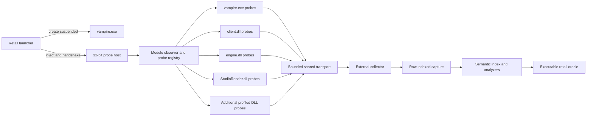

# Retail Runtime Capture Roadmap

## Purpose and ownership

This is the detailed work tracker for the original-game capture harness and the
reverse-engineering experiments that use it to close VtMB skeletal animation,
scene placement, character secondary motion and physics, facial animation, and
lip-sync runtime behavior.

`docs/project/roadmap.md` remains the master project tracker: it owns playable-path
priority and the roll-up status of the capture program. This file owns the
fine-grained task status for that program only. A change here that changes a
master parent (`0.10`, `RE32`, or `RE33`) updates its roll-up row in the master
roadmap in the same change.

This tracker does not own VtMB facts. Confirmed findings are corrected into:

- `docs/vtmb/animation_and_movers.md` for skeletal animation, movement records,
  virtual models, procedural bones, and skinning;
- `docs/vtmb/facial_animation.md` for model flexes, expressions, eyelids, and
  `.lip` playback;
- `docs/vtmb/choreographed_scenes.md` for VCD scheduling and scene-layer
  composition;
- `docs/vtmb/mdl_v2531.md` for container and structure layouts.

Tracked research specifications under `research/cases/` preserve binary hashes,
addresses, signatures, falsifiable questions, eliminated leads, and open
questions. Raw captures, decompilation, reports, indexes, and game-derived
fixtures remain under `$ELYSIUM_WORK_ROOT/research`.

## Status and completion rules

Status marks are `[ ]` open, `[~]` in progress or partially proved, `[x]`
verified, and `[P]` parked with an explicit revisit trigger.

A capture task is complete only when all of the following hold:

1. The exact executable and module hashes are recorded.
2. The controlled input and launch procedure are reproducible.
3. The capture reports record counts, dropped records, incomplete data, and hook
   health.
4. The analyzer turns the trace into a falsifiable numerical result.
5. The result survives a repeat capture or an independent byte-level check.
6. The confirmed fact is written once in its owning `docs/vtmb/` document.
7. A game-independent regression test or locally generated hash-gated fixture
   prevents the same ambiguity from returning.

A phase is not complete because a hook emitted data. It is complete when the
captured values answer the phase's questions and constrain the standalone
evaluator.

## Scope

### In scope

- A launcher-controlled, 32-bit injection path covering `vampire.exe` and its
  loaded DLLs from process startup through shutdown.
- Exact-binary probe profiles, safe hook lifecycle, bounded transport, indexed
  capture, recovery, replay, and analysis.
- MDL v2531 skeletal channels, timing, sequence selection, blends, transitions,
  layers, pose parameters, included animation models, movement, events,
  procedural bones, hierarchy construction, and final deformation.
- Choreographed-scene entry placement, stage anchors, per-frame transform
  ownership, completion/cancellation placement, collision state, and restoration.
- Shipped character secondary motion: procedural and jiggle bones, cloth, hair,
  accessories, their persistent simulation state, collision inputs, and
  animation-to-ragdoll handoff.
- MDL v2531 facial controllers, rules, flex ramps, both vertex-animation
  encodings, expressions, eyelids, amplitude-driven mouth motion, `.lip`
  phonemes, and their runtime composition.
- VCD and dialogue timing where it selects or combines body, expression,
  phoneme, or mouth state.
- Corpus-wide property tests and representative retail captures sufficient to
  implement a deterministic standalone evaluator.

### Out of scope

- Bypassing ownership checks, DRM, authentication, or unrelated security
  controls.
- Committing original game binaries, assets, captures, or decompilation.
- Building a general compiler for new native VtMB skeletons or arbitrary new
  multi-bone animations.
- Reconstructing dead Faceposer/VCD syntax that is neither present in the
  shipped corpus nor required by a live runtime path.
- Building a general modern cloth or rigid-body solver beyond behavior exercised
  by shipped VtMB content.
- Treating later Source SDK behavior as VtMB evidence without retail
  confirmation.
- Retargeting or presentation polish before source-skeleton equivalence is
  established.

## Program exit criterion

The capture program is complete when a standalone evaluator can consume the
user's original VtMB files and, for the controlled coverage suite:

- select the same skeletal and facial inputs as retail;
- produce matching local transforms at named pipeline stages;
- produce matching model/world bone matrices and final skin matrices;
- reproduce scene entry placement, stage anchoring, per-frame transform
  ownership, completion/cancellation placement, and physical-state restoration;
- reproduce root/entity motion without double application;
- reproduce shipped cloth, hair, and accessory secondary motion, including
  deterministic initialization and reset across teleports, pause/seek, scene
  restart, and save/load;
- reproduce expression, eyelid, phoneme, and amplitude-mouth controller values
  over time;
- produce matching flexdesc weights and representative final deformed vertices;
- reproduce loop, transition, layer, pause, seek, interruption, and save/load
  boundary behavior;
- explain every shipped-corpus field that affects those results, while marking
  proven no-ops and unsupported dead data explicitly;
- pass numerical retail-oracle tests before Unreal basis conversion or
  retargeting, then pass a separate Unreal presentation acceptance.

The bar is behavioral and numerical equivalence for shipped content. It is not
an instruction-by-instruction clone of the original engine.

## Capture architecture

The probe host is deliberately small. Loader notifications and hook callbacks
copy bounded records and return; they do not hash files, allocate unbounded
memory, compress data, build indexes, or perform blocking file I/O. The
collector and analyzers remain outside the retail process.

## Current baseline

| Capability | State | Durable location |
|---|---|---|
| Hash-gated read-only final-palette polling | Available | `research/tooling/capture/capture_live_pose.py` |
| Attach-time `LoadLibraryW` injector | Available | `research/tooling/capture/live_pose_injector.cpp` |
| Whole-scene `CStudioRender::DrawModel` hook | Available | `research/tooling/capture/live_pose_hook.cpp` |
| Resolver BASE/final pose hooks | Available | `research/tooling/capture/live_pose_hook.cpp` |
| Versioned `ELPOSE2` / `ELANIM2` readers | Available | `research/tooling/capture/capture_live_scene.py` |
| Cross-DLL binary proof specifications | Available | `research/cases/animation-pose/specs/` |
| Whole-scene and authored-pose analyzers | Available | `research/tooling/capture/` |
| Launcher-controlled suspended launch/bootstrap | Available | `research/tooling/capture/native/` |
| General module/probe registry | Missing | CAP2 |
| Bounded process-external transport | Missing | CAP3 |
| Unified recoverable indexed trace | Missing | CAP3 |
| Scene placement and physical-state oracle | Missing | CAP7 |
| Cloth/hair/accessory secondary-motion oracle | Missing | CAP8 |
| Complete skeletal runtime oracle | Partial | CAP5–CAP9 |
| Complete facial/lip runtime oracle | Partial | CAP10–CAP11 |

## Program ladder

| Phase | Outcome | Depends on |
|---|---|---|
| CAP0 — Contracts and retained baseline | Existing evidence and future sessions share one reproducibility contract | — |
| CAP1 — Retail launcher | The game starts suspended, receives the probe host, handshakes, and resumes reproducibly | CAP0 |
| CAP2 — Probe host and binary profiles | Known modules gain selected hooks safely; unknown binaries remain untouched | CAP1 |
| CAP3 — Transport, capture, and indexes | High-rate cross-module records survive load, truncation, and recovery | CAP1, CAP2 |
| CAP4 — Experiment controller | Controlled retail inputs and trace markers make sessions comparable | CAP1–CAP3 |
| CAP5 — Skeletal channel and time oracle | Stored bytes, decoded locals, and cycle/frame sampling agree | CAP4 |
| CAP6 — Pose composition oracle | Sequences, blends, transitions, layers, includes, and hierarchy agree | CAP5 |
| CAP7 — World placement, motion, and scene lifecycle | Initial placement, transform ownership, root motion, events, completion, and restoration agree | CAP4–CAP6 |
| CAP8 — Character secondary motion and physics | Procedural/jiggle, cloth, hair, accessories, collision, history, and ragdoll handoff agree | CAP4, CAP6, CAP7 |
| CAP9 — Final deformation oracle | Local pose through all secondary stages, skin matrices, and representative vertices agrees | CAP6–CAP8 |
| CAP10 — Facial-expression oracle | Controller values through flexdesc weights and deformed vertices agree | CAP3, CAP4, CAP9 |
| CAP11 — Lip-sync oracle | Audio/VCD time through phonemes and amplitude mouth motion agrees | CAP4, CAP10 |
| CAP12 — Corpus and whole-scene closure | Representative families and the complete theatre sequence are covered by executable tests | CAP5–CAP11 |
| CAP13 — Rebuild handoff | Engine-neutral evaluation and Unreal playback consume the verified contracts | CAP12 |

## Current front

Work proceeds in this order:

1. CAP0.2: retain one live emitted and validated session manifest from each
   current capture driver.
2. CAP1: make launcher-controlled injection the primary run path.
3. CAP2 and CAP3: move hook configuration into profiles and move capture
   transport/file work out of the game.
4. CAP4.3–CAP4.6 and CAP7.1–CAP7.5: establish stable actor identity and the
   complete scene-entry/render/completion checkpoint chain.
5. CAP6.6: run the phase-pinned moving resolver experiment that discriminates
   the cinematic composition order.
6. CAP8.1–CAP8.6: classify and capture Jeanette's skirt from source data through
   final deformed vertices before generalizing to other secondary-motion cases.
7. CAP10–CAP11: add controller/flex/phoneme checkpoints using the stable harness.

## CAP0 — Contracts and retained baseline

- [x] **CAP0.1 Existing proof chain is retained** — the hash-gated palette
  capture, whole-scene trace, BASE/final resolver trace, analyzers, and three
  cross-DLL Ghidra specifications remain the reference behavior for migration.
  → `docs/vtmb/animation_and_movers.md`.
- [~] **CAP0.2 Canonical session manifest** — one versioned manifest covers
  launch command, working directory, environment, retail distribution and patch,
  module hashes, probe profile, map, experiment, clock controls, output hashes,
  record/drop counts, and analyzer versions. Both retained capture drivers emit
  and validate the contract; live emitted-session acceptance remains.
  *Acceptance:* every new capture command emits and validates it.
- [x] **CAP0.3 Record-schema registry** — every record type has a stable numeric
  ID, schema version, explicit little-endian layout, bounds, and compatibility
  rule in `research/tooling/capture/contracts/record_schemas.json`; generated C++
  and Python constants are checked for drift. *Acceptance:* no duplicated
  handwritten `struct` layouts remain.
- [x] **CAP0.4 Experiment specification** — the tracked, game-independent
  specification shape containing one falsifiable question, controlled variables,
  required probes, expected invariants, acceptance bands, and artifact names.
  *Acceptance:* the runner rejects an underspecified experiment.
- [x] **CAP0.5 Legacy-session preservation** — readers and golden metadata are
  frozen for `ELPOSE2` and `ELANIM2`, with adapters into the unified reader
  interface. *Acceptance:* current analyzers produce equivalent summaries before
  and after conversion.
- [x] **CAP0.6 Numerical policy** — versioned per-domain reporting bands cover local
  translation, quaternion angle, model/world translation, matrix RMS, flex
  weights, and final vertex error in
  `research/tooling/capture/contracts/numerical_policy.json`. Bands report
  evidence; they are not loosened to make a case pass.

## CAP1 — Retail launcher

- [x] **CAP1.1 Native project** — create a CMake-based MSVC project under
  `research/tooling/capture/native/` with explicit Win32 Release/Debug presets,
  static runtime policy, warnings-as-errors, and deterministic output paths.
  `uv run elysium research` remains the public command surface.
- [x] **CAP1.2 Synthetic retail process** — build a 32-bit fake executable that
  loads fake `client`, `engine`, and `StudioRender` DLLs at controlled times and
  exposes safe test hook targets. *Acceptance:* launcher and lifecycle tests run
  without the game installation.
- [x] **CAP1.3 Suspended launch** — reproduce the selected retail command line,
  working directory, inherited environment, and distribution-specific startup
  while creating `vampire.exe` suspended.
- [x] **CAP1.4 Bootstrap injection** — inject the probe host through a conventional
  `LoadLibraryW` path, wait for a versioned ready/error handshake, and resume the
  primary thread only after module observation and transport are armed. Manual
  mapping is not used.
- [ ] **CAP1.5 Supervision** — own process exit, collector exit, timeout, Ctrl-C,
  crash detection, and partial-capture finalization. The launcher never leaves a
  suspended retail process or an orphaned collector.
- [ ] **CAP1.6 Attach fallback** — preserve an explicit attach-to-PID mode for
  debugger-led discovery. Session metadata distinguishes launched and attached
  captures; reproducible acceptance uses launch mode.
- [ ] **CAP1.7 Lifecycle soak** — complete 100 launch → inject → module load →
  capture → stop → process-exit cycles against the synthetic target with no
  leaked handles, stranded hooks, or corrupt trace.

## CAP2 — Probe host and binary profiles

- [ ] **CAP2.1 Module observer** — enumerate modules already present at bootstrap
  and observe later loads/unloads. Loader callbacks only enqueue base/size/path
  events; a worker performs hashing and probe activation outside loader-sensitive
  callbacks.
- [ ] **CAP2.2 Binary profile registry** — track executable/module size, SHA-256,
  PE identity, image base, RVAs, calling conventions, expected bytes, semantic
  labels, and supported record schemas. Profiles are data, not hard-coded
  constants scattered through probes.
- [ ] **CAP2.3 Fail-closed validation** — unknown hash, missing module, unexpected
  prologue, invalid vtable slot, or unsupported schema installs no hook and emits
  a diagnostic record. There is no fuzzy "near match" mode.
- [ ] **CAP2.4 Hook backends** — support validated vtable replacement and an
  instruction-aware inline detour backend. Hook declarations select the backend;
  probe code does not implement trampolines.
- [ ] **CAP2.5 Active-call lifetime** — disabling a probe stops new capture,
  restores the target, waits for active callbacks, drains committed records, and
  only then releases trampolines or unloads.
- [ ] **CAP2.6 Cross-module clock and correlation** — every record carries a
  64-bit session sequence, QPC timestamp, thread ID, probe ID, and optional
  correlation ID. Module load, entity state, local pose, final pose, and draw
  records can be joined without pointer-order guesses.
- [ ] **CAP2.7 Probe health** — emit installed/disabled state, target module and
  RVA, callback counts, rejected reads, exceptions, transport pressure, and
  drops. Health records are queryable like experiment data.
- [ ] **CAP2.8 Retail profile coverage** — begin with the currently hash-pinned
  binaries. Additional Steam/GOG/patch profiles are added only from owner-supplied
  binaries and independently verified signatures.

## CAP3 — Transport, capture, and indexes

- [ ] **CAP3.1 Bounded callback transport** — replace callback-time heap
  allocation and the unbounded linked queue with preallocated bounded storage.
  Saturation drops a whole record, increments a per-probe counter, and never
  blocks the retail thread.
- [ ] **CAP3.2 Process-external collector** — move file I/O, compression,
  checksums, and index construction into a supervised collector connected through
  named shared memory and explicit wake/stop events.
- [ ] **CAP3.3 Unified capture container** — write module, diagnostic, entity,
  skeletal, scene, secondary-motion/physics, facial, lip, and optional vertex
  channels into one timestamped, recoverable file. The implementation target is
  MCAP with versioned engine-neutral binary payloads; a custom container remains
  the fallback only if the Win32 writer/reader spike fails the throughput or
  recovery gates.
- [ ] **CAP3.4 Chunk and record integrity** — use length framing, schema IDs,
  chunk checksums, monotonic sequence checks, and an explicit incomplete-tail
  report. A killed collector preserves every complete recoverable chunk.
- [ ] **CAP3.5 Native indexes** — enable time/channel indexes and model-specific
  pose, scene-placement, and physical-instance channels so a reader can seek to
  one model and interval without scanning a whole scene.
- [ ] **CAP3.6 Semantic sidecar index** — build a generated SQLite index over
  session, module, probe, model checksum, stable entity identity, sequence,
  cycle/phase, scene actor, procedural instance, line, phoneme, and correlation
  IDs. Matrices, persistent simulation state, and vertex arrays remain in the
  capture container.
- [ ] **CAP3.7 Reader API** — expose streaming and indexed Python readers that
  return NumPy views or bounded copies and reject unknown incompatible schemas.
- [ ] **CAP3.8 Stress and recovery** — sustain at least one million mixed records,
  force transport saturation, terminate the collector mid-record and mid-chunk,
  rebuild indexes, and account exactly for written, recovered, and dropped
  records.
- [ ] **CAP3.9 Retail overhead budget** — measure callback time, memory footprint,
  collector throughput, frame-time effect, and capture volume for focused and
  whole-scene profiles. Whole-scene capture remains opt-in.

## CAP4 — Experiment controller and semantic identity

- [ ] **CAP4.1 Declarative runs** — implement `capture run --experiment <id>` so
  launch, map, console aliases, timing cvars, probe profile, arm/stop markers,
  duration, and analyzers come from the tracked experiment specification.
- [ ] **CAP4.2 Deterministic clock controls** — capture and verify `fps_max`,
  `host_timescale`, `host_framerate`, pause state, frame delta, and
  scene/audio/secondary-simulation time. A session reports drift instead of
  silently comparing different clocks.
- [ ] **CAP4.3 Stable entity identity** — capture entity index/serial or equivalent
  handle, client pointer, targetname, classname, model checksum/path, scene actor,
  and renderable identity at the lowest proven seams. Pointers remain diagnostic,
  not cross-session identities.
- [ ] **CAP4.4 Animation and entity state snapshot** — capture selected
  sequence/activity, entity cycle, playback rate, transition history, active
  layers, pose parameters, selected-bone mask, entity and render origin/angles,
  velocity, parent/ground identity, move/solid/collision state, and relevant
  scene and secondary-motion state when available.
- [ ] **CAP4.5 Exact markers** — support arm, scene pre-start, post-bind,
  post-place, first-pose, phase pin, sequence change, line start, phoneme
  boundary, expression start, pre-finish, post-`position_end`, post-restore,
  pause, seek, and stop markers on the same QPC timeline as probe records.
- [ ] **CAP4.6 Controlled matrix** — provide reusable experiments for idle
  progression, frozen-cycle entity translation/rotation, loop boundary, sequence
  change, playback rate, transition, gesture, pose parameter, locomotion,
  start/stop/turn acceleration, teleport, pause/seek, scene restart, expression,
  blink, and spoken line. Each changes one variable.
- [ ] **CAP4.7 Repeatability report** — compare two runs after removing declared
  entity/world differences and report deterministic, bounded-noise, divergent,
  culled, and missing intervals separately.

## CAP5 — Skeletal channel and time oracle

- [x] **CAP5.1 On-disk local-channel layout** — the 32-byte-per-bone, seven-offset,
  `{valid,total}` RLE layout and bind fallback rules are decoded over the shipped
  corpus. → `docs/vtmb/animation_and_movers.md`.
- [~] **CAP5.2 Runtime local-channel path** — the retail quaternion/position
  evaluators and their caller chain are located and decompiled. Add capture of
  input record, channel offsets, run headers, scales/biases, sample index, and
  output for a targeted bone/channel mismatch.
- [ ] **CAP5.3 Fractional sampling** — recover cycle-to-frame conversion,
  interpolation, frame-zero/final-frame policy, and normalized quaternion policy
  with samples between authored frames.
- [ ] **CAP5.4 Loop semantics** — measure cycle `0`, just below `1`, exactly `1`,
  wrap interpolation, non-loop completion, negative rate, and rate changes.
- [ ] **CAP5.5 Duration and events clock** — settle `frames/fps` versus
  `(frames-1)/fps`, sequence duration overrides, event boundary order, and the
  relationship between cycle, current time, and scene time.
- [ ] **CAP5.6 Partial-channel fixtures** — cover position-only, rotation-only,
  mixed animated/bind quaternion components, constant runs, multi-run boundaries,
  short clips, non-30-FPS clips, and malformed-but-shipped edge records.
- [ ] **CAP5.7 Three-way differential** — compare project decoder, pinned Crowbar
  output, and retail locals without Euler conversion in the project/retail path.
  Retail is the authority for disputes.

## CAP6 — Pose composition oracle

- [ ] **CAP6.1 Sequence and animation selection** — capture the resolved sequence,
  blend-cell animation descriptors, activities, weights, and selection reason.
  Distinguish label selection, activity selection, weighted alternatives, and
  forced/scripted sequences.
- [ ] **CAP6.2 Blend grids and pose parameters** — recover the 294 multi-blend
  sequences, parameter ranges/wrap/defaults, cell interpolation, and runtime
  setters with controlled parameter sweeps.
- [~] **CAP6.3 Transition history** — the saved/current entity-frame conversion
  and transition ordering are decompiled. Capture entry, mid-transition, chained
  transition, interruption, and completion values to close weights and lifetime.
- [ ] **CAP6.4 Layers and autolayers** — capture base, transition, autoplay,
  gesture, weighted layer, controller, and final locals with layer weight,
  priority, flags, masks, fade, and additive/override classification.
- [ ] **CAP6.5 Gesture versus sequence** — use one base idle plus one
  upper-body gesture and one conflicting full-body sequence to recover masks,
  conflict policy, fade, interruption, and `sequenceduration`.
- [ ] **CAP6.6 Moving cinematic resolver** — capture an exact-phase moving actor
  whose selected non-root bones have non-identity authored deltas. Compare all
  plausible held-entry/authored/cinematic-bind quaternion orders and position
  laws against resolver BASE locals.
- [~] **CAP6.7 Outer virtual-model remap** — quaternion copy and optional
  position-matrix application are known. Capture record identity and mapped
  source/target bones across models that exercise both position modes.
- [ ] **CAP6.8 Nested include remap** — decode and capture the nested branch's
  record layout, lookup, transforms, fallback, and recursion/dedup behavior.
- [ ] **CAP6.9 Target-only and source-only bones** — settle donor-bind fallback,
  target-only helper/attachment initialization, missing parents, topology
  differences, controllers, and post-base stages across representative divergent
  target/bank pairs.
- [~] **CAP6.10 Split inheritance** — retail `Flags & 0x2` bone-to-world behavior
  and rendered discrimination are proved. Capture post-blend moving cases and
  implement the runtime-equivalent local/component correction after all layers.
- [ ] **CAP6.11 Root/entity/cinematic composition** — classify the decoded root
  local, whole-cast `BipNN`/`Bip01` authored placement, entity transform, and
  render `rootToWorld` without double-applying any frame. CAP7 owns when and why
  the scene moves the entity itself.
- [ ] **CAP6.12 Save/load pose state** — capture restored cycle, transition
  history, active layers, cinematic phase, and entity frame so reloading does not
  introduce a different first pose.

## CAP7 — World placement, motion, and scene lifecycle

- [ ] **CAP7.1 Scene lifecycle checkpoint protocol** — capture every actor
  immediately before accepted `Start`, after binding and anim-set selection,
  after save-and-place, at the first evaluated and rendered pose, before the last
  clip is stopped, after `position_end`, and after state restoration. Completion
  and cancellation are separate paths.
- [ ] **CAP7.2 Initial placement inputs** — record the scene entity's map-authored
  origin/angles, every actor's pre-scene entity and render transforms, the
  selected actor/root binding, parent/attachment/ground identities, and the
  resulting `rootToWorld`. Initial position is a provenance chain, not one
  vector.
- [ ] **CAP7.3 Scene-owned state** — recover and capture every field saved,
  modified, and restored by scene start/finish, including origin, angles, solid
  type, solid flags, move/collision state, velocity, AI/nav ownership, visibility,
  and any physics-object state. Mark fields proven untouched rather than
  assuming a broad freeze.
- [ ] **CAP7.4 Per-frame transform ownership** — locate `position_start` re-pin
  relative to entity think, animation evaluation, character movement, physics,
  attachments, and render submission. Prove which writer wins when another
  system attempts to move an actor during a scene.
- [ ] **CAP7.5 Completion and cancellation placement** — capture all exercised
  `position_end` values, final `Bip01` caching, leave/scene/restore/settle
  behavior, clip stop order, cancellation, and state restoration without losing
  the last authored world pose.
- [ ] **CAP7.6 Movement-record format** — decode all movement-record fields,
  sectioning, flags, units, accumulated position/yaw, and sequence association
  across the 1,386 movement-bearing animations.
- [ ] **CAP7.7 Runtime movement consumption** — capture decoded movement, entity
  origin/angles, root/pelvis pose, desired/actual velocity, AI/nav displacement,
  collision result, and sequence cycle for stationary and driven locomotion.
- [ ] **CAP7.8 Root-motion policy** — determine which displacement is visual,
  which moves the entity, how movement is reconciled at loops/transitions and
  scene ownership boundaries, and how to avoid applying it twice in Unreal.
- [ ] **CAP7.9 Animation-event format and dispatch** — decode the 1,714 shipped
  events, names/types/options, cycle/time storage, loop behavior, and ordering
  against movement, scene events, and final pose evaluation.
- [ ] **CAP7.10 Scene persistence** — capture save/load during pre-roll, active
  playback, pause, and the final interval: actor bindings, original transforms
  and physical state, entity frame, root movement, scene clock, and completion
  obligations must resume without a first-frame jump.
- [ ] **CAP7.11 Theatre placement acceptance** — for all twelve `sp_theatre`
  scene controllers, reproduce the actor anchor, first rendered world pose,
  per-frame re-pin behavior, and final settlement/restoration. Courtroom
  `position_end == 3` and escort/embrace `position_end == 0` are both required.

## CAP8 — Character secondary motion and physics

This phase does not assume that an incorrect garment is a cloth-solver problem.
It first distinguishes authored skeletal tracks, procedural/jiggle bones,
rigid-body or ragdoll motion, vertex/flex deformation, and material/stream faults.

- [ ] **CAP8.1 Secondary-motion corpus map** — inventory every non-zero
  `ProcType`, `ProcIndex`, `PhysicsBone`, relevant bone flag, payload variant,
  and vertex influence by model and bone. Produce a focused Jeanette report
  naming every bone and vertex set that can affect the skirt.
- [ ] **CAP8.2 Mechanism classifier** — for each representative garment, hair,
  and accessory, prove whether visible motion comes from authored animation,
  axis/quaternion interpolation, jiggle simulation, rigid-body/ragdoll state,
  another procedural stage, vertex deformation, or a combination. No Unreal
  solver is selected before this classification.
- [ ] **CAP8.3 Runtime stage and state seam** — locate the retail evaluators and
  per-instance history buffers, then capture the driving pose, entity frame,
  pre-stage locals/matrices, procedural parameters and state, and post-stage
  locals/matrices with stable bone and instance identity.
- [ ] **CAP8.4 Integration and constraints** — recover the time step, initialization,
  gravity and acceleration frame, stiffness/damping, length/angle constraints,
  pose/entity velocity inputs, clamping, iteration/order, sleeping, and
  numerical reset policy for every shipped secondary-motion family.
- [ ] **CAP8.5 Collision and environment inputs** — determine whether each
  shipped family uses world, hitbox/capsule, bone, garment self-collision,
  contents/surface, or no collision. Capture collision shapes, transforms,
  contacts, filtering, and response only where the retail path consumes them.
- [ ] **CAP8.6 Jeanette skirt oracle** — capture Jeanette at bind/rest, idle
  settling, a theatre dialogue interval, controlled forward motion, turn,
  abrupt stop, and reverse. Join source model/payload, driving body pose,
  simulation history, skirt-bone output, skin matrices, and representative hem
  vertices. *Acceptance:* a standalone evaluator reproduces both the transient
  motion and settled shape within declared bone and vertex tolerances.
- [ ] **CAP8.7 Hair and accessory coverage** — repeat the oracle on at least one
  elaborate hair chain and one non-cloth accessory so a Jeanette-specific rule
  is not generalized to unrelated procedural types.
- [ ] **CAP8.8 Discontinuity and lifecycle behavior** — measure first spawn,
  scene start teleport/re-pin, large entity rotation, pause/resume, time-scale
  change, seek, visibility/LOD loss, scene restart, save/load, model replacement,
  and destruction. Record whether history is preserved, rebased, cleared, or
  reconstructed and detect one-frame explosions.
- [ ] **CAP8.9 Bone-to-vertex secondary-motion join** — for each physical case,
  carry pre/post procedural bones through `boneToWorld`, skin palette, weights,
  and final submitted skirt/hair/accessory vertices. This separates a correct
  simulation with wrong skinning from a wrong simulation.
- [ ] **CAP8.10 Ragdoll boundary** — classify the final animated pose handed to
  physics, `PhysicsBone` mapping, velocity initialization, collision ownership,
  detached/gib state, recovery, and transition behavior where exercised by
  shipped content.
- [ ] **CAP8.11 Props, attachments, and spawned physics** — classify animated or
  parented props, particles/effects, and any dynamically spawned rigid bodies in
  the theatre sequence. Capture their ownership and transform/velocity handoff;
  do not expand this into unused general VPhysics behavior.
- [ ] **CAP8.12 Sequence-tail IK and post-pose stages** — decode the 196-byte
  sequence tail's autolayers and IK locks, prove which fields are live in VtMB,
  and establish their order relative to secondary motion. Animdesc IK payloads
  remain corpus-proven zero.
- [ ] **CAP8.13 Bone controllers** — recover controller index/value mapping,
  clamping/wrapping, local transform application, and ordering relative to
  layers, procedural bones, secondary motion, and hierarchy construction.

## CAP9 — Final deformation oracle

- [x] **CAP9.1 Hierarchy and entity composition** — ordinary parent-local
  concatenation, root/entity composition, and split inheritance are identified
  through `BuildTransformations`. → `docs/vtmb/animation_and_movers.md`.
- [x] **CAP9.2 Skin-palette construction** — retail computes
  `skinMatrix = boneToWorld * poseToBone`; captured palettes and decompilation
  agree. → `docs/vtmb/animation_and_movers.md`.
- [x] **CAP9.3 CPU vertex skinning** — observed ordinary, flex, and packed paths
  select one to four matrices, blend by stored weights, and deform positions and
  normals on the CPU. → `docs/vtmb/animation_and_movers.md`.
- [ ] **CAP9.4 Specialized-path coverage** — classify the selector fields and all
  used dispatch-table families, proving whether any shipped path changes matrix,
  weight, packing, or deformation semantics.
- [ ] **CAP9.5 Final vertex sample capture** — record a bounded set of source
  vertices, bone indices/weights, skin matrices, flex deltas, and submitted
  positions/normals for representative ordinary, flexed, and packed models.
- [ ] **CAP9.6 Render identity join** — correlate resolver locals, entity
  identity, bone-to-world, skin palette, mesh/material, and final draw without
  relying on visibility absence as a pose sample.
- [ ] **CAP9.7 Packed-vertex/material discriminator** — isolate the theatre
  rainbow-cloth fault between packed vertex decode, stream layout, material/skin
  selection, and texture state. Keep it separate from skeletal-pose conclusions.

## CAP10 — Facial-expression oracle

- [x] **CAP10.1 On-disk facial structures** — flexdescs, controllers, RPN rules,
  mouths, flex ramps, compressed/raw vertex animations, and the unit-vector table
  are decoded over the shipped corpus. → `docs/vtmb/facial_animation.md`.
- [x] **CAP10.2 Eyeball absence** — every shipped model has zero eyeball records;
  retail-equivalent facial work covers eyelids, not authored gaze.
  → `docs/vtmb/facial_animation.md`.
- [ ] **CAP10.3 Controller checkpoint** — locate and capture named controller
  values before flex-rule evaluation, including their source, writer, range,
  clamp, and timestamp.
- [ ] **CAP10.4 Rule checkpoint** — capture RPN inputs and flexdesc outputs for
  representative expression, eyelid, phoneme, and mouth rules; compare the
  standalone evaluator operation by operation.
- [ ] **CAP10.5 Flex-ramp checkpoint** — capture flexdesc weight, selected
  `StudioFlex`, target-ramp result, and final per-mesh morph weight, including
  two-ramp eyelid hinges and flexes spanning materials.
- [ ] **CAP10.6 Expression table runtime** — recover `.vfe` load/lookup behavior,
  prove equivalence or differences from readable `.txt`, and settle value/weight
  pairs, missing keys, fallbacks, case rules, and model-stem selection.
- [ ] **CAP10.7 Expression event envelope** — capture VCD expression name,
  event-ramp sampling, fade/hold behavior, controller contributions, interruption,
  and same-controller conflicts.
- [ ] **CAP10.8 Eyelid driver** — identify the runtime writers for blink,
  half-closed, raiser, tightener, and droop; measure blink scheduling, dialogue
  interaction, pause behavior, and whether any head-bone logic exists separately.
- [ ] **CAP10.9 Facial vertex oracle** — capture representative pre-flex vertex,
  direction/magnitude decode, flex accumulation, normal handling, skinning, and
  final vertex for compressed and raw transformation rigs.
- [ ] **CAP10.10 Layer precedence** — isolate base expression, VCD expression,
  phoneme contribution, amplitude mouth, eyelid/blink, scripted expression, and
  controller defaults to recover add/override/clamp and evaluation order.

## CAP11 — Lip-sync oracle

- [x] **CAP11.1 `.lip` document grammar** — versions, word/phoneme rows,
  close-caption blocks, options, timing units, and corpus variation are decoded.
  Phoneme strings, not unstable numeric codes, are the durable key.
  → `docs/vtmb/facial_animation.md`.
- [x] **CAP11.2 Static three-file join** — `.lip` timing,
  model-specific/fallback phoneme expression tables, and `mstudiomouth_t` are
  identified. → `docs/vtmb/facial_animation.md`.
- [ ] **CAP11.3 Line asset resolution** — capture VCD/script sound request,
  `.mp3`/`.wav` selection, `.lip` lookup, expression-table selection, actor model,
  and all fallbacks on one line identity.
- [ ] **CAP11.4 Lip clock** — correlate audio start/sample position, scene or
  dialogue time, mixahead, `.lip` time, pause/resume, seek, interruption, frame
  hitch, and save/load restoration on one QPC timeline.
- [ ] **CAP11.5 Phoneme sampler** — recover active-phoneme selection, boundary
  inclusion, gaps/silence, interpolation or coarticulation, weighting, and
  transition behavior between unlike and repeated phonemes.
- [ ] **CAP11.6 Filter cvars** — measure `phoneme_delay`,
  `phonemefilter_min`, `phonemefilter_max`, and any hidden smoothing state through
  controlled impulse and step phoneme experiments.
- [ ] **CAP11.7 Expression weight pairs** — determine how each table's
  `(value, weight)` pair contributes over time and how missing controller keys,
  fallbacks, and non-unit weights behave.
- [ ] **CAP11.8 Amplitude mouth** — capture audio envelope or VCD
  `silence`/`loud` state, mouth forward/bone metadata, generated `mouth` flexdesc
  value, smoothing, and composition with phoneme jaw controllers.
- [ ] **CAP11.9 Row fields and options** — classify the phoneme row's volume and
  optional flag, `voice_duck`, `speaker_name`, close-caption timing, empty
  emphasis block, malformed codes, and missing sibling audio as consumed,
  ignored, or presentation-only.
- [ ] **CAP11.10 Overlap and interruption** — measure named expression plus lip,
  blink plus lip, a second line interrupting the first, actor reuse, scene
  cancellation, dialogue close, and model change.
- [ ] **CAP11.11 End-to-end spoken line** — for one ordinary NPC line, reproduce
  every sampled controller, flexdesc, morph weight, and representative final
  vertex from the source audio/`.lip`/expression/model inputs within declared
  tolerances.
- [ ] **CAP11.12 Coverage lines** — repeat the oracle on version 1.0/1.1/1.2
  files, MP3 and WAV fallback, model-specific and generic tables, phoneme junk,
  long lines, gaps, missing audio, and a VCD expression overlap.

## CAP12 — Corpus and whole-scene closure

- [ ] **CAP12.1 Structural property suite** — run bounds, stride, offset,
  reference, hierarchy, channel-run, sequence-grid, movement, event, procedural,
  physics-bone, vertex-influence, flex, expression-table, and `.lip` properties
  over the merged patch-first corpus.
- [ ] **CAP12.2 Representative model families** — cover ordinary male/female
  bipeds, player bodies, cinematic multi-root rigs, monsters, animals, animated
  props, cloth garments, hair chains, procedural accessories, flexed speakers,
  ragdolls, and the raw whole-body transformation rig.
- [ ] **CAP12.3 Representative behavior families** — cover idle, locomotion,
  turn, stop/reverse, teleport/reset, combat/hit, transition, activity selection,
  gesture, blend grid, pose parameter, cinematic placement/completion,
  secondary-motion settling, ragdoll handoff, dialogue, expression, blink, lip,
  and interruption.
- [ ] **CAP12.4 Unknown-field ledger** — every unknown field in the used
  animation, scene-state, procedural/physics, and facial structures has a tracked
  question, proven no-op/dead-data classification, or explicit non-blocking
  rationale. No field is silently discarded.
- [ ] **CAP12.5 Binary profile repeat** — repeat the core oracle across supported
  executable/patch profiles or prove byte-identical relevant functions. Profile
  differences remain explicit.
- [ ] **CAP12.6 Capture sufficiency audit** — an independent analyzer verifies
  that every standalone-evaluator input and every acceptance output is present in
  the traces without consulting unrecorded debugger memory.
- [ ] **CAP12.7 Executable specification** — one command regenerates local
  fixtures from a user-owned install, runs the offline evaluator, compares them
  with retail traces, and reports skipped corpus separately from regressions.
- [ ] **CAP12.8 Complete theatre oracle** — one controlled `sp_theatre` run joins
  all twelve scene controllers, actor bindings and initial placement, body pose,
  Jeanette skirt and other visible secondary motion, attachments/effects,
  camera, expression, eyelids, lip/audio clocks, completion/cancellation, and
  final actor state. Every visible mismatch is assigned to a captured stage,
  classified as presentation-only, or retained as an explicit open blocker.

## CAP13 — Rebuild handoff

- [ ] **CAP13.1 Engine-neutral evaluator** — produce skeleton, local poses,
  layers, scene/entity placement, model/world matrices, movement, procedural and
  secondary-motion state, physical handoffs, events, controller values,
  flexdesc weights, morph weights, representative final vertices, and
  provenance without Unreal dependencies.
- [ ] **CAP13.2 Canonical sidecars** — version the animation, scene-placement,
  secondary-motion/physics, and facial runtime intermediates with source hashes,
  schema versions, unsupported fields, basis, units, persistent-state
  requirements, and retail trace IDs.
- [ ] **CAP13.3 Source-skeleton acceptance** — compare the raw source skeleton and
  face before coordinate conversion, Unreal import, retargeting, or presentation
  smoothing can hide errors.
- [ ] **CAP13.4 Unreal basis and import acceptance** — verify basis/unit
  conversion, bind pose, imported keys, split inheritance, root motion,
  procedural/cloth drivers, collision shapes, events, and morph weights
  independently of retargeting.
- [ ] **CAP13.5 Runtime composition acceptance** — reproduce representative
  locomotion, cinematic placement and gesture/layering, Jeanette skirt
  secondary motion, lifecycle resets, transition, expression, blink, and
  spoken-line cases in the built game against the retail oracle.
- [ ] **CAP13.6 Residual policy** — every remaining approximation or deliberate
  modernization states the recovered faithful behavior, measured difference, and
  explicit owner call in the owning system document.
- [ ] **CAP13.7 Tracker closure** — move no history into prose. The owning fact
  documents state the final present-tense contracts, the master roadmap rolls up
  `0.10`, `RE32`, and `RE33`, and git history remains the implementation record.

## Priority experiment queue

| ID | Experiment | Primary question | Status |
|---|---|---|---|
| EXP-A01 | Phase-pinned moving cinematic actor | Which held/authored/bind composition order produces resolver BASE locals? | [ ] |
| EXP-A02 | Included-bank remap pair | How do outer and nested virtual-model maps handle positions, rotations, and missing channels? | [ ] |
| EXP-A03 | Pose-parameter blend sweep | How are blend-grid cells selected and interpolated? | [ ] |
| EXP-A04 | Idle plus upper-body gesture | What are gesture mask, priority, fade, and interruption semantics? | [ ] |
| EXP-A05 | Walk stationary versus AI-driven | How do movement records, root pose, and entity movement divide displacement? | [ ] |
| EXP-A06 | Procedural accessory/head driver | Where and how are procedural contributions applied? | [ ] |
| EXP-S01 | Theatre actor entry and exit | Which transforms and physical fields are saved, written, re-pinned, settled, and restored at each lifecycle checkpoint? | [ ] |
| EXP-P01 | Jeanette skirt mechanism classification | Which bones, payloads, stateful stages, vertex influences, and render paths produce the visible skirt? | [ ] |
| EXP-P02 | Jeanette skirt controlled trajectory | How do idle settle, acceleration, turn, stop, and reverse drive skirt bones and hem vertices over time? | [ ] |
| EXP-P03 | Jeanette skirt discontinuities | How are history and collision state handled across scene teleport/re-pin, pause, seek, restart, and save/load? | [ ] |
| EXP-P04 | Hair/accessory contrast pair | Which secondary-motion rules are shared with or distinct from the skirt mechanism? | [ ] |
| EXP-F01 | Static named expression | How do table values, event ramp, controllers, rules, and flex ramps compose? | [ ] |
| EXP-F02 | Controlled blink | Who writes eyelid controllers and how is blink timed? | [ ] |
| EXP-L01 | One isolated phoneme transition | How are adjacent phonemes filtered and interpolated? | [ ] |
| EXP-L02 | Phoneme plus named expression | How are same-controller contributions combined? | [ ] |
| EXP-L03 | Loud/silence amplitude step | How is the `mouth` flex derived and smoothed? | [ ] |
| EXP-L04 | Pause, seek, and interrupted line | Which clock owns lip state and how is it restored or cleared? | [ ] |

## Risks

| Risk | Consequence | Mitigation |
|---|---|---|
| Hooking an unknown binary | Crash or false evidence | Exact hashes, signatures, profile gating, fail closed |
| Work inside loader callbacks | Loader deadlock | Enqueue only; activate from the probe worker |
| Allocation/locks in hot callbacks | Frame stalls or reentrancy failure | Preallocated bounded transport and whole-record drops |
| Whole-scene volume | Disk/memory pressure hides drops | Focused profiles, external collector, indexed chunks, explicit budgets |
| Visibility-gated render records | Missing draw mistaken for unchanged pose | Pair render records with entity/resolver state and classify culling |
| Pointer reuse | Wrong cross-frame actor join | Stable entity handle plus model/scene identity; pointers diagnostic only |
| Captured final output lacks cause | Correct oracle but unresolved format | Trace backward only from the first isolated mismatch |
| Garment fault is misclassified as "cloth physics" | Time is spent reproducing the wrong subsystem | Join source bones/payloads, procedural stages, skinning, vertices, and material path before selecting an implementation |
| History-dependent secondary motion looks nondeterministic | Repeat captures disagree or first frames explode | Capture frame delta and persistent state; specify initialization, reset, and warm-up checkpoints |
| Physics hooks perturb the simulation | The observer changes the cloth result | Use bounded sampled records, measure overhead, and compare reduced-probe repeats |
| Debug experiment changes timing | Observer perturbs behavior | Measure overhead, repeat with reduced probes, compare clocks |
| Corpus unavailable locally | False regression | Hash-gated local generation and explicit skip diagnostics |
| Exploration expands without a stop rule | Endless engine archaeology | Program exit criterion and shipped-content coverage govern scope |
