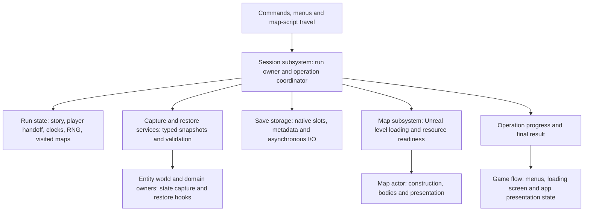

# 0011 — Complete save/load and import a VtMB run

Plan updated **2026-09-11**, based on the **2026-09-10 implementation audit**. The native save
framework exists; complete run persistence and retail-save conversion do not. This document
specifies the system and its ordered implementation slices. The [task ledger](#task-ledger)
is the only implementation-status record while this spec is active. Planning does not mark
any implementation task complete.

## Outcome

The player can issue `elysium.save <slot>` and `elysium.load <slot>` and resume the saved run,
including its next observable actions. A separate offline importer converts
`E:\elysium-work\Vampire-015.sav` into a normal Elysium slot loadable by the same command.

Use Unreal's standard **custom `USaveGame` + `UGameplayStatics` slot system**. Retain the existing
`UElysiumSaveGame` container and Elysium-owned, versioned C++ payload. Do not adopt VtMB's
binary layout, use JSON as the shipping save format, or serialize live UObject pointers.
The importer is a one-way content adapter; the runtime need not understand `JSAV`, `.HL1`,
`.HL2`, `.HL3`, Source datamaps, or Python pickles. Old Elysium saves remain disposable.

Epic documents this container and slot API as its standard save/load workflow, with asynchronous
slot writes available for saves during play:
[Saving and Loading Your Game](https://dev.epicgames.com/documentation/en-us/unreal-engine/saving-and-loading-your-game-in-unreal-engine).

## Evidence and exact witness

The binary oracle is [savegame_format.md](../../vtmb/savegame_format.md). The existing
[save_example.json](save_example.json) is a decoded **retail-engine** save, not an Elysium save.
It is useful evidence, not a production import schema or proof that every value is correctly typed.

The audit reran:

```powershell
uv run elysium research sav_to_json E:/elysium-work/Vampire-015.sav E:/elysium-work/research/saves/0011-audit/Vampire-015.json --audit
```

| Item | Verified value |
|---|---|
| Input | 320,883 bytes, `JSAV`, version 117 |
| Input SHA-256 | `3d478bdcdb863e2897968df885639af796c45b87b4b12b7f08075faef199b38d` |
| Current map / label | `sp_tutorial_1` / `safe_beat_3` |
| Header elapsed display | `03:21`; rounded display text, not a precise session clock |
| Decoded JSON | 7,288,381 bytes; regenerated output is byte-identical to `save_example.json` |
| JSON SHA-256 | `4a0b2feb6782c58f4079860078a44ded3c72097d96294433211a039a7fc10292` |
| Decoder byte coverage | 0 `_unparsed` regions / 0 unparsed bytes; name/size type fallbacks remain |
| Content provenance | `G.Patch_Plus=1`, `G.PP=1`, history `eldritch prodigy`, patched queued function |

**This is not a stock-content-only witness.** The markers and pending function identify
Unofficial Patch content, but not an exact patch release. The corpus's native `vampire.dll`
recovery and the patch's map/scripts/rulebook are distinct evidence sources. Pin the matching
resolved content and hashes before conversion. Do not strip patch globals to make the save
resemble stock retail. No game-install file was modified during this audit.

| Map | HL1 rows | HL2 rows | Pending I/O | Physics owners (with bodies) | AI squads / memories | Decals | HL3 departed ids | Map-local time |
|---|---:|---:|---:|---:|---:|---:|---|---:|
| `sp_genesisdevice_1` | 67 | 47 | 1 | 1 (0) | 0 / 0 | 0 | 22, 63, 66 | 1.0547333 |
| `sp_theatre` | 519 | 195 | 16 | 81 (26) | 0 / 49 | 25 | 512, 513, 514 | 2.1185834 |
| `sp_tutorial_1` | 1,197 | 378 | 1 | 195 (119) | 3 / 54 | 221 | empty | 201.48271 |

Rows include nine empty, zero-size server entries per map; they are not all spawnable entities.
Physics owner counts are not rigid-body counts. Each departed set contains that map's player
and two `item_w_unarmed` entities. The current map has **no departed entities**. Its server
section inflates to 979,702 bytes from **two** independent zlib chunks.

The tutorial has 31 `G` keys and four morgue entries:
`sabbat_redshirt_2_proxy`, `sabbat_redshirt_3`, `sabbat_redshirt_4`, `sabbat_redshirt_5`.
Earlier maps contain 1 and 5 globals and empty morgues. On explicit load, use the current map's
global state; unioning all three dictionaries or replaying the old maps' flags is wrong.

Concrete acceptance values:

- Player id 1153, name `Noa`, male Tremere (`clan=7`, `gender=1`), history id 72,
  armor model `models/character/pc/male/tremere/armor0/tremere_Male_Armor_0.mdl`.
- Entity health **56/100**, while both saved sheet `health` slots are **44**. Bloodpool is **15**
  with maximum **10**; humanity is 7. Preserve these distinct homes and unusual values. Do not
  clamp or reconcile them simply because they look inconsistent.
- Feet origin in Source units `(638.3923, 762.6315, -67.96875)`; view angles
  `(4.949341, 183.50464, 0)`. Body yaw is `-176.49536`, an equivalent yaw representation.
- Journal: `Tutorial`, `idxQuestTable=39`, `idxState=6`, order 1, dirty/unread true;
  selected quest-log area 1. Resolve indices through the matching quest tables.
- `G.Tut_Jack=18`, `G.Tut_Chopshop=1`, `G.Tut_Officedoor=1`, `G.Story_State=-3`.
- `G.Pos_One` is the list `[639.2242431640625, 761.9454345703125, -67.96875]`.
  The next queued record is Python type 1, source `AThingOfSomeKind()`, with remaining time
  **0.5272217 seconds** and null activator/caller/direct target.
- `tuthack` (id 89) has its first subdirectory unlocked and saved attempt state. Its outputs
  target `tutsafelock`, `trig_popup_note`, and `trig_popup_safe`; restoring cannot re-fire them.
- Jack (id 870) is in `SCHED_TROIKA_IDLE_DISPOSITION`, with `m_flWaitFinished=2.4788208`
  relative seconds. `sentry2` (id 1009) is at task **3** in
  `SCHED_TROIKA_FOLLOW_PATROL_PATH_WALK`, with the saved path flag set. Two `rat_2` entities
  (ids 450 and 678) are at task 3: targetname is demonstrably not unique.
- Tutorial decals: 118 flag-1 authored decals and **103 flag-4 runtime impacts**; 32 records
  are entity-attached. Theatre has 25 authored decals, two attached. Rebuilding only baked
  decals loses visible saved state.

The seven occupied player inventory slots are:

| Retail slot | Retail entity id | Class | Restore requirement |
|---:|---:|---|---|
| 0 (zero omitted on item) | 1160 | `item_w_fists` | last melee weapon; retain item state |
| 21 | 1157 | `item_a_lt_cloth` | worn item identity, separate from appearance |
| 28 | 1158 | `item_g_keyring` | empty key records here; do not invent the safe key from `G.Tut_Key` |
| 29 | 1159 | `item_g_wallet` | normal owned entity |
| 30 | 213 | `item_g_lockpick` / `tut_lockpicks` | authored pickup now carried; no duplicate at original location |
| 76 | 1154 | `item_w_unarmed` | active weapon and last-weapon handle |
| 77 | 1161 | `weapon_physcannon` | preserve the hidden item even if absent from weapon UI |

The saved 224-handle array is sparse. The port compacts it during `RebuildFrom`. Recover how
inventory layout, initial assignment and removal interact before mapping these positions;
sorting and renumbering is not evidence of retail equivalence. The second unarmed entity is
not automatically a second occupied player inventory slot.

## Retail save/restore contract

Addresses below are in `vampire.dll`, except where another module is stated. Matching recovery
and limitations are recorded in the save-format oracle, not inferred from Unreal code.

| Domain | Recovered entry point | Contract |
|---|---|---|
| Entity selection | `CEntitySaveRestoreBlockHandler` Save slot 2, `0x101a37c0` | Iterates the table; calls entity ObjectCaps slot 117 (`+0x1d4`); a negative result suppresses Save. It does **not** require the across-transition bit. |
| Entity chain | `CBaseEntity::Save` slot 126, `0x100a9f70`; Restore slot 127, `0x100aa140` | Datamap chain and think state; derived overrides add state. |
| Creation / fixup | handler Restore slot 7, `0x101a2e40` | Creates the identity table before a second pass restores bodies and runs capability-dependent reconstruction. Empty/departed entries do not become live entities. |
| Transition capability | `CBaseCineCam` ObjectCaps slot 117, `0x1006d8f0` | Clears bit `0x2`. Camera state still appears in normal saves. Transition exclusion is not snapshot exclusion. |
| Time | `CSave` slot 25, `0x101a0a80`; sentinel restore `0x101cf2f0` | TIME is relative to the section base; sentinels restore to `-1`, zero or max float according to field policy. |
| Delayed I/O | `0x100cfee0` → `0x100cfd00` | Pending events retain type, payload, handles and delivery time; saving is not delivery. |
| Python | Save slot 2 `0x1019adc0`, Restore slot 7 `0x1019b130`, vtable `0x10476ac8` | Stores/replaces `G` and `G.morgue`. `PyDataManager` get/set `0x1019b3d0` / `0x1019b570` gives morgue special treatment. |
| NPC program | Save `0x1027bc60`, Restore `0x1027c160`, OnRestore `0x1027bf50` | Saves schedule name/CRC, task state and navigator; restores valid progress after CRC/reference checks and takes fallback only on failure. |
| Troika NPC | Save `0x102993c0`, Restore `0x10299700`, OnRestore `0x102998c0` | Pedestrian trailer; patrol/follower/ambient rebinding and explicit post-restore updates are part of the contract. |
| Shared AI | Save slot 2 `0x1030bfd0`, Restore slot 7 `0x1030c210` | Named squads and per-NPC memory are additional to NPC datamaps. |
| Physics | Save `0x10043c70` | Objects/constraints keyed by owner and field; raw object addresses serve file-local fixup only. |
| Player trailer | `0x1016ea00` → `0x10299c60`, act-list Save `0x102ca130`, police globals `0x103707e0` | Acts and shared police/AI state exist outside the player datamap. |
| Admission | `CBasePlayer::GetSaveBlockedReason`, `0x10174f80` | Ordered refusal chain; some predicate meanings remain unrecovered. Port refusals are not automatically proven retail reasons. |

Not every raw field should become durable Unreal state. Model indices, edict slots, function
pointers, VPhysics addresses and client render caches need semantic identity or reconstruction.
Geometry, textures, baked lightmaps and rulebook files stay in the content corpus. The save is
not a copy of map assets or the Python interpreter heap.

## Audited baseline versus required behavior

Paths below are relative to `Source/ElysiumUE/`. This is the historical audit baseline:
“Present” means inspected in code, not newly verified in a live build. G01–G19 are evidence
references, not a second task ledger; current implementation progress belongs only to the
ledger entries below.

### Existing foundation to retain

| Present | Implementation | Practical limit |
|---|---|---|
| Native container and manual/quick/auto slots | `Public/ElysiumSaveGame.h`, `Private/Session/ElysiumSaveSubsystem.cpp` | `ReadSlotHeader` loads the whole SaveGame object including compressed bytes; it avoids payload inflation, not all payload I/O. |
| Four payload blocks and schema | `Public/ElysiumSaveTypes.h`, `Private/Session/ElysiumSaveArchive.cpp` | Schema and minimum supported schema are both **36** (`SoundSweep`). Format coverage does not imply state coverage. |
| Oodle payload and async disk save | `ElysiumSave::Write`, `UElysiumSaveSubsystem::Save` | Capture **and compression** currently happen synchronously before `AsyncSaveGameToSlot`. |
| Basic flow save/load | `Private/Session/ElysiumGameFlowSubsystem.cpp::RegisterCommands`, `SaveGame`, `LoadGame` | Registry verbs `save` / `load` exist. Exact console commands `elysium.save` / `elysium.load` are not registered. |
| Progression and several player domains | `Public/ElysiumPlayer.h::FElysiumPlayerRecord`, `Private/Substrate/ElysiumPlayerEntity.cpp::Hydrate/Dehydrate` | Name, sheet, health, money, effects, XP, journal, history/appearance, mail, law/police, feeding, disciplines and stealth have homes. Missing inherited state is not covered by entity capture. |
| Map deltas and delayed queue | `Private/Substrate/ElysiumEntityWorldPersistence.cpp` | Registered fields, leaves, output counts, runtime definitions, fade/weather and comfort targets exist; identity and partial-failure problems remain. |
| Durable entity leaves | `ElysiumMover.cpp`, `ElysiumTerminal.cpp`, `ElysiumItemClasses.cpp`, `ElysiumWeaponClasses.cpp`, `ElysiumNpc.cpp` | Locks/movers, terminals, keyrings, weapons and parts of AI serialize. Extend the owning state instead of adding a competing save path. |
| Unit coverage | `Private/Tests/ElysiumSaveTests.cpp` and domain tests | Useful round-trip/payload/schema tests; no proof of this imported run, every leaf, actual disk completion or full map-load lifecycle. |

### Gaps and implementation obligations

| ID / priority | Evidence of gap | Required work and witness |
|---|---|---|
| G01 / P0 | Session has only variant globals; `PyG_getattro` has no morgue branch; `PyToVariant` turns lists into `repr()` strings. | Add an owning typed script-state store and live morgue mapping proxy. Preserve list/dict operations, case-sensitive keys, unset versus stored zero and value types. `AThingOfSomeKind()` indexes `G.Pos_One`; `vamputil.MarkAsDead` / `IsDead` write/read morgue. No repr/eval round trip. |
| G02 / P0 recovery | `LoadLevelScript` uses cached `PyImport_ImportModule`, merging into existing `__main__`; `ApplyPayload` replaces only C++ stores. | Recover same-process retail load versus cold-load module lifecycle, then implement explicit-load reset/rebind separately from travel. Do not accidentally inherit abandoned-run `G_tut`, wrappers or callbacks; equally, do not invent a blanket interpreter restart if retail retains them. Neither new-game initialization nor pending saved source runs during preparation. |
| G03 / P0 | Player is excluded from map capture; PlayerRecord/archive/Hydrate/Dehydrate lack inventory active/previous/selected handles and ammo reserves. `RebuildFrom` rebuilds ownership, not saved selection. | Persist full player inventory selection/ammo and armor relationships alongside item state; rebind after all items exist. Audit NPC/container equivalents. Equip id 1154's mapped entity and retain all seven items. |
| G04 / P0 | `TravelsWithPlayer()` only has the base false implementation; PlayerRecord has no carried-item records. | Implement actual carry selection, stable item identity and origin-map tombstones. Same-map save contains items; travel moves them and marks actual departures in the old map. Eligibility alone is not departure. |
| G05 / P0 | `Freeze` drops entities lacking `AcrossTransition`; retail Save tests the sign of caps, not bit 2. Saved cameras are a witness. | Separate save eligibility from transition eligibility. Preserve admissible map-local camera/track state. Share capture machinery with explicit purpose, not one incorrect filter. |
| G06 / P0 | Runtime restore only appends at `S.Index == EntityList.Num()` and skips occupied ids; Spawn/equipment may allocate before restore. A hole prevents subsequent appends. | Allocate the full saved graph before restoring references; support holes/tombstones and suppress conflicting fresh spawns. Fix player references after allocation. Do not assume identical runtime allocation order. |
| G07 / P0 | `SerializeScheduleBlock` calls `Schedule.Clear()` / `Start`, saving no task cursor; patrol discards movement and mind restore clears scripted orders. | Restore task/status/timers, goal/path and owner under retail name/CRC/reference checks. Implement its invalid-schedule branch, not unconditional restart. Exercise `sentry2`, both `rat_2` ids and Jack's remaining wait. |
| G08 / P1 | NPC senses/enemy memory/social/witness blocks exist; no shared squad block exists in MapSnapshot. | Complete shared AI ownership, membership/focus/memory and tactical reservations read by the host. Map three squads and 54 tutorial memories; empty records still have typed defaults. |
| G09 / P1 | Map/prop persistence has no Chaos body velocity/sleep/ragdoll/constraint capture; corpse restore rebuilds the death body. | Add embodiment capture/apply for logical bodies/constraints before simulation. Cover 119 tutorial physics owners with bodies, hinge links and an already fallen corpse. Never persist VPhysics addresses. |
| G10 / P1 | WorldBlock saves capsule center/yaw only; inherited player fields are skipped. | Complete player view pitch, stance/velocity/mode/grounding, durable movement modifiers, combat/regen/cooldown state and required hotkey bindings. Nonzero witness pitch must survive; reconstruct calibration only with evidence. |
| G11 / P1 | Prop serialization restarts a named clip and re-derives completion time; NPC restoration can restart death. | Preserve gameplay sequence/cycle/rate/event cursor and deadlines with model/clip identity. Do not repeat animation events, switch completion or death notification; rebuild cosmetic caches. |
| G12 / P1 | No snapshot home for runtime decals or the global LIGHTSTYLE table. | Persist impacts/attachments and mutable lightstyles; reconcile authored decals against baked baseline. Cover 103 tutorial impacts and 32 attached records, preserving local/world frames. |
| G13 / P1 | No shared act-list/police-globals block; player Law/Police is not the complete trailer. No sound-bus capture beyond already-observed NPC memories. | Recover/assign acts, response target/counters and AI-disable semantics. Audit sound-pool Save/Restore and pending unobserved stimuli. Zero acts in this sample do not prove populated-act support. |
| G14 / P1 | `FrozenAt` is unused for returning-map deadline rebasing; queues share one session clock. Retail map bases differ. | Recover active-load versus dormant-map revisit clock semantics, including every TIME field/sentinel, before selecting inactive-map aging policy. Never use tutorial's base for theatre's relative times. |
| G15 / P0 | DefCount is checked only after session replacement/travel; equal-count edits pass. Field/class/runtime mismatches skip; leaf errors leave partial entities and still succeed. | Preflight schema, graph and content fingerprints before commit. Propagate failure through map readiness. Named load cannot report success for a fresh or partially restored map. |
| G16 / P1 | Reader ignores prologue Floor, trusts Uncompressed size, collapses unknown variants to Void, lacks full-consumption/integrity checks. Save only logs async completion; names are unchecked. | Bounded validation, checked tags/counts, integrity, definitive completion results, slot validation and ordered conflicting operations. Failed writes retain the last committed slot. |
| G17 / P1 | `trigger_autosave` disables itself before a save attempt; no retry latch survives temporary refusal. | Port the recovered admission/pending/retry sequence in `entity_io.md` §8. Manual named save has no implicit retry. |
| G18 / P1 | `Describe` reports only leaf length, omits members and rounds times; different equal-sized leaves can look identical. | Canonical typed semantic dump/diff for every durable owner, plus full payload digest and import mapping errors. A clean old text diff is not sufficient. |
| G19 / P0 for import | Research decoder exists; no retail-to-native adapter/writer. Retail save ids are not Elysium def indices. | Implement the importer below with provenance, field/class policy, graph mapping, canonical native writing and verification. Never copy by similar field names. |

Audio needs separate determination: `FElysiumSoundSchemeManager` has live scheme/crossfade state
outside saves, while the ambient entity reads initial configuration. The witness's `CSoundScheme`
fields contain scheme file/start-enabled, **not proof of a saved playback cursor**. Recover
retail restart/restore behavior before requiring sample-accurate audio continuation. Likewise,
every render cache or arbitrary Python wrapper property is not automatically durable state.

## Session ownership design

**Architecture selected for this implementation plan, 2026-09-11.** Consolidate the game-state and save/load
authority into `UElysiumSessionSubsystem : UGameInstanceSubsystem`. Evolve/rename the existing
`UElysiumGameStateSubsystem` and absorb the orchestration from `UElysiumSaveSubsystem`; do not
leave a fifth peer coordinating multiple independently mutable copies of the run.

Keep this in the existing `ElysiumUE` runtime module, organized under `Private/Session/` with
small plain C++ collaborators. A GameInstance subsystem provides the lifetime that survives
world travel; a separate Unreal module provides a compilation/dependency boundary. They solve
different problems. The current persistence types depend on entities, player state, scripting
and world services, so extracting a binary module first would add dependencies without resolving
the ownership problem. Reconsider a separate module only after those seams become independent.
See Epic's [subsystem lifetimes](https://dev.epicgames.com/documentation/en-us/unreal-engine/programming-subsystems-in-unreal-engine)
and [module boundaries](https://dev.epicgames.com/documentation/en-us/unreal-engine/unreal-engine-modules).

### Review findings driving the design

| Existing boundary | Current evidence | Architectural consequence |
|---|---|---|
| State versus operations | `ElysiumGameStateSubsystem` owns globals/player/map cache, while public `SaveSubsystem::ApplyPayload` rewrites those stores, clock and RNG individually. | No owner controls a complete run replacement as one operation. |
| Capture versus destruction | `FElysiumEntityWorld::Teardown` dehydrates the player and stores a map snapshot; the destructor calls it. `BeginNewGame`, `EndSession` and load use `Detach`/`ForgetPlayer` to prevent stale writeback. | Resource destruction also decides persistence policy. Correctness depends on callers remembering the exception. |
| Travel intent | MapSubsystem separately holds `PendingMapLoad`, `NextLandmarkSpawn`, `NextRestorePlacement` and `bFreshMapState`, consumed at different stages. | One logical transition is split across unrelated mutable flags; some combinations only make sense for particular operations. |
| Completion | SaveSubsystem logs loaded after requesting travel; MapActor applies snapshots during build and runs an activation tick later; GameFlow publishes Playing from MapReady. | Resource readiness and successful state restoration need one final admission point. Existing resource readiness is useful, but snapshot errors do not propagate through it. |
| Run existence | `GameFlow::IsInSession` derives from presentation state and is false during Loading, while the run's data still exists. | Separate run existence, world readiness and operation status. Save admission should not infer all three from a menu state. |
| Hidden global ownership | `ElysiumRng.cpp` has module-static streams; `FElysiumPythonVM::Get` is a process singleton. | Renaming a subsystem alone does not make all state belong to a session. Bind/reset these services explicitly and address isolation within their actual support limits. |

These are code-level findings. This review did not run an A → B → A play test or change runtime
behavior. G01–G19 still require their own implementations; moving them under one owner does not
complete missing retail behavior.

### Responsibilities after refactoring



| Component | Owns | Boundary |
|---|---|---|
| `UElysiumSessionSubsystem` | The run and exclusive lifecycle operation; save admission, new/load/travel/quit policy, active-world binding and final completion | The only public entry to run replacement or map-state transition. Delegates mechanics to collaborators. |
| `FElysiumRunState` | Typed story/morgue/quests, player data between maps, map snapshot cache, clock/RNG state | Plain C++ runtime ownership, not a reflected dump of every actor or an always-current duplicate of live entities. |
| Capture/restore services | Materialize `FElysiumRunSnapshot`, validate it, allocate/fix identities and execute ordered restore phases | Reuse existing map/leaf serializers; each domain continues to define its own semantics. No second serializer implemented by menus or travel. |
| `FElysiumSaveStorage` | Slot names/list/delete, metadata, native envelope, serialization/compression I/O and committed-write results | Extract from SaveSubsystem as an owned service. It never calls Travel, looks up live entities, or applies state. Retain `UElysiumSaveGame`. |
| `UElysiumMapSubsystem` | `OpenLevel`, content/resource preparation, current map actor, physical map epoch and engine readiness/failure | Receives a prepared transition with its id; does not decide fresh-versus-restored state, carry selection, or run replacement. |
| Entity world / map actor | Live entities, simulation, bodies and class-specific restore hooks | Explicit capture/apply calls; resource teardown cannot independently save into the run. |
| `UElysiumGameFlowSubsystem` | Boot/UI intent, menus, loading/failure screens and app-state presentation | Requests session operations and observes their results. It does not separately clear, restore or commit run data. |

Keep durable domain mutation in its existing owning logic: quest changes still execute their
retail award sequence, while restore uses silent assignment. Typed story APIs may forward through
Session, but the coordinator should not accumulate the implementation of every quest, NPC,
inventory or physics rule. Move save-kind/request/result types out of GameFlow into a neutral
session-types header so storage and the coordinator do not depend on UI flow.

### One state authority, explicit snapshot boundaries

While a map is active, its entities own their live fields. The session's player handoff record
is authoritative only for fields already session-owned and for carrying live player state while
no player entity exists. APIs explicitly resolve the live player when present; callers cannot
write a stale handoff copy through an unrestricted mutable `PlayerRecord()` accessor.

`FElysiumRunSnapshot` is an immutable materialization of that run at a chosen simulation boundary:
current live player/map state plus the already frozen maps and session data. Native Save writes
it, Load stages it, and the retail importer produces it. It is not the mutable live run, and
`USaveGame` is not the gameplay database. Saving does not update or remove map entities.

New Game and Load stage a candidate run before replacing the active one. An in-memory
`RunGeneration`, map epoch and `OperationId` identify ownership of callbacks and retiring worlds;
these tokens are not serialized entity identity. Old-world cleanup cannot write into a different
generation, and a late callback cannot mark a newer operation successful.

Move RNG ownership into the run through an explicit context, retaining existing named streams
and draw order. Bind the scripting host to the run and apply the recovered explicit-load module
lifecycle. The process-wide Python VM needs a stated single-active-binding constraint until
actual isolation is implemented; a GameInstance wrapper alone does not prove multi-instance
script support. Do not invent a fresh interpreter restart as part of an ownership-only refactor.

### One transition request

Replace the independent travel flags with a typed `FElysiumTransitionRequest` containing the
operation/run identity, destination and a placement variant: authored start, landmark offset,
direct landmark entry or absolute saved pose. Operation kind determines outgoing and incoming
policy; callers do not independently toggle booleans that can contradict each other.

| Request kind | Outgoing run/map | Incoming run/map |
|---|---|---|
| Save | Capture without retiring, clearing or transferring anything | No map change; write an immutable snapshot |
| Gameplay travel | At the retail boundary, capture the old map and move the actual carry set | Same run; restore a visited destination or initialize an unvisited one, with landmark placement |
| Load | Keep current run until preflight succeeds; then retire it without writeback | Replace the run from the staged snapshot and restore saved placement |
| New Game | Retire the previous run without writing into the new run | Fresh state and authored story entry |
| Reload current map | Preserve the run and current map snapshot | Rebuild and restore that map; no invented cross-map item departure |
| Explicit dev fresh-map request | Keep/reset the run as explicitly requested; prevent outgoing capture from reinstating the discarded destination snapshot | Initialize the chosen map fresh; never silently used for gameplay travel |
| Quit to menu / application teardown | Follow the explicit end-run policy; do not silently manufacture a manual save | No playable run; cleanup only |

Manual and autosave share snapshot capture. Autosave admission/retry policy remains explicit
and follows the recovered retail sequence. A map snapshot is not a save-slot write: ordinary
travel persists the run in memory without automatically overwriting a player's disk slot.

The shared lifecycle is:

```text
Request → Preflight → Quiesce at the correct simulation boundary
→ Capture/retire as required → Load/build resources → Restore/fix references
→ Validate gameplay readiness → Commit/publish result
```

Exact cleanup/capture/event order must remain the recovered retail order. Moving capture out
of a destructor does not authorize moving it to the initial ChangeMap call inside a dispatch
stack. Use an explicit, once-only retirement phase while the old world's resources are valid;
teardown then releases resources and asserts that the planned handoff occurred. Unexpected
world destruction reports an interrupted operation instead of silently committing a snapshot.

Split the current activation barrier so required construction/restore hooks can complete before
the first gameplay think, overlap delivery or queue drain. Both resource readiness and successful
state application are prerequisites to Session's completion. GameFlow displays Playing only for
that successful result. Preserve intended first-tick semantics; do not replay fresh-map ignition
on a restore or indiscriminately suppress required OnRestore actions.

New/load/travel/end-run operations are mutually exclusive. Snapshot capture cannot overlap an
unfinished transition. Once a save owns an immutable snapshot, its background write may continue
while gameplay or later travel proceeds. Storage orders writes to the same slot, and a load of
that slot waits for its accepted write or reports busy. Stale write completion may report the
file result but cannot change the current run/transition. The first implementation may serialize
more requests if it reports that policy clearly.

Preflight failure leaves the old run unchanged. After Unreal has destroyed the old UWorld, a
restore failure leaves gameplay blocked and presents an explicit recovery path (retry/load/menu).
Do not promise seamless rollback to a destroyed world; rebuilding it from a retained checkpoint
would be a separate, explicit recovery operation.

Implementation of these boundaries is ordered in SG-01–SG-06 and the dependent domain
slices in the single task ledger. Architecture changes must preserve each recovered gameplay
sequence; the coordinator does not make missing domain state disappear.

## Native save design

### Commands and slots

```text
elysium.save tutorial-before-safe
elysium.load tutorial-before-safe
elysium.save
elysium.save.slots
elysium.save.cansave
elysium.save.diff tutorial-before-safe live
```

`elysium.save [slot]` reaches the proposed Session `RequestSave` with manual kind. Existing
GameFlow `SaveGame` may remain a forwarding UI entry during migration.
A named manual save replaces that slot; a bare save chooses the next free `Elysium-NNN` slot.
`elysium.load <slot>` requires exactly one slot argument and reaches Session `RequestLoad`;
GameFlow observes the operation for pause release and Loading/Playing presentation. A missing
argument prints usage;
it must not silently pick another save. Existing `save`/`load`, quicksave and UI routes remain
clients of the same service.

Slots are logical names, not filesystem paths: allow 1–64 ASCII letters/digits/`_`/`-`; reject
separators, drive prefixes, `.`/`..`, extension suffixes and extra arguments. Apply one Windows
case policy consistently to reads, writes, deletes and conflict detection. Reserve Quick/Auto
service names for their corresponding kinds. Do not silently overwrite slot 999 on manual-slot
exhaustion. Write under Unreal's platform save location (desktop project development:
`Saved/SaveGames/<slot>.sav`), never the VtMB install or Content tree.

Expose operation id and states `capturing`, `writing`, `written`/`failed`, and
`preparing`, `loading`, `loaded`/`failed`. Report `loaded` only after the restore barrier succeeds.
Order operations on the same slot: a load immediately after save waits for that accepted write
or reports “write in progress”; it cannot silently read an older slot. Concurrent writes cannot
publish in reverse order. A failure leaves the previously committed slot usable; implement
staged commit in the save service/platform adapter as needed.

`CanSave` keeps engine/session readiness checks and reports one reason. Audit the complete
retail admission chain in its observed priority order. Extra port restrictions for unimplemented
resume states must be labeled temporary limitations, with the missing state named. Do not
silently close dialogue/terminal/feed/camera sessions to make a save pass. Full retail admission
cannot be claimed while predicate meanings remain unknown.

### Container and owners

The envelope remains an ordinary serialized `UElysiumSaveGame`. Reflected metadata includes
schema/content identity, map, label, player name/clan, kind, UTC save time and elapsed-time
metadata with provenance. The compressed payload remains an Elysium archive. Unreal writes
the outer envelope; the importer must not manually reproduce its binary headers.

| Owner/block | Required durable state |
|---|---|
| Session | Typed `G`, morgue, silent quest store, session/map-clock mapping, every Elysium RNG stream, shared gameplay globals assigned by recovery |
| Player | Progression/identity/effects/journal/mail; inventory selection/reserves; carried-item identity/records at travel; law/discipline/stealth; body, movement and combat resume state |
| Map | Content fingerprint, entity roster/deltas, runtime definitions/tombstones; outputs and queue; map-local timing; shared AI/physics; relevant sound state; lightstyles, decals, weather/fade and map-owned state |
| World | Current map, full placement/view, visited-map information and pending restore metadata needed for consistent activation |

One fact has one authoritative home. Derived inventories, name indexes, bodies, routes and
visual proxies are rebuilt from their owners after reference resolution. Item records cannot
exist simultaneously as independent copies in Player and the active Map block. Record ownership
transfer when travel moves a carried item between those representations.

Script values retain their source precision and collection semantics; the float32 event variant
is not automatically the right representation for Python doubles or mutable lists. Hotkey item/
discipline assignments saved on the player are separate from keyboard/video/audio settings,
which remain in their existing configuration system.

Each incompatible layout change gets a new schema and raised reader floor. Remove obsolete
compatibility branches when touched; no migration project is required. Fingerprint authored
definitions/output order and relevant rulebook/schedule/content identity, not just DefCount.
Same-count edits can be incompatible. Validate stored maps' identities even when those maps
will only be built on a later revisit.

Enforce bounded lengths/counts, valid enum/type tags and leaf schemas, complete consumption and
payload integrity before application. Keep corruption/schema/content errors distinct from “slot
not found.” A compressed stream is not proof of semantic validity. Unused opaque source blobs
belong in an import report; storing them is not runtime support for the state they represent.

### Capture, restore and time

Capture at a defined simulation boundary: queue dispatch, removals, physics updates and script
mutation cannot occur halfway through it. Produce an immutable private snapshot on the game
thread, then compress/write. Manual capture must not consume outputs, move inventory, draw RNG
values or mutate travel bookkeeping.

Use common map capture with explicit **save-in-place** and **departure** policies. Keep baseline
delta compression against a reproducible fingerprinted baseline. A missing retail zero field is
different from a missing Elysium baseline delta: first decode the full retail value, then compute
a native delta.

```text
read slot → validate/decompress into staging → validate state/content/references
→ prepare destination/resources and restore plan → enter restore barrier
→ retire old run without writeback → establish saved clocks and required script bindings
→ allocate authored/runtime/player/carried identities with gameplay suppressed
→ apply scalar/leaf state → fix all references → run required restore hooks
→ rebuild inventory/AI/body/physics/visual dependencies → restore final queue/output state
→ apply full player placement → verify ready → publish run → first simulation tick
```

This is dependency order, not permission to bypass retail restore hooks. Retail reconstructs
some state and can reject an invalid NPC schedule. Reproduce those operations and their event
order. Suppress accidental Spawn/Activate/new-game awards, map ignition and load-time damage/
overlap events; required restore hooks act exactly once. The current `ApplySnapshot` return value
(an applied count) is insufficient to report restore success.

All runtime entities must exist before resolving player feed/effect/police references or leaf
handles. Validate ids against the intended map and entity, not merely an array bound. Distinguish
tombstones from unallocated slots. Deferred teardown of the dying world cannot overwrite the
staged session. Preflight failure leaves the old run intact; failure after travel commit must
remain a failed load with recovery available, never a partly restored Playing state.

Native loads restore their clock before absolute deadlines. For import, the current event should
be due at `201.48271 + 0.5272217 = 202.0099317` if the normalized native origin is tutorial's
header time. These displayed decimals are rounded; the adapter uses the source binary values.
Preserve equal-deadline order; do not dispatch overdue records during decoding. Inactive maps
retain their own capture basis until the recovered revisit policy is applied. Test negative
elapsed times and each sentinel policy; arbitrary “clamp to now” changes behavior.

Byte-identical canonical capture is useful for state with no restore transformation. It is
**not the sole acceptance rule**: the same state can be omitted on both sides, and retail
OnRestore can deliberately transform state. Compare next observable transitions too: tasks,
events, resource consumption, story writes and body/contact outcomes.

## One-way importer

Proposed public CLI, **not implemented by this spec**:

```powershell
uv run elysium save import-vtmb E:/elysium-work/Vampire-015.sav --slot retail-tutorial-015 --report E:/elysium-work/research/saves/0011-audit/import-report.json
```

Provide `--dry-run` to write a mapping/validation report only. A successful normal import emits
the same `UElysiumSaveGame` format as native saving. Conversion and writing share the canonical
C++ serializers, not Python implementations of opaque leaf layouts. The CLI can invoke a
dedicated Unreal commandlet with a normalized typed interchange file. It builds staging state
without executing map gameplay to try to reach the desired checkpoint. Import is not an
`elysium.load` option.

### Pipeline and mapping rules

1. **Pin provenance.** Record source SHA-256, decoder/mapping versions and resolved BSP, script,
   quest, item, history and model/schedule hashes. Identify patch-first resolution. Keep input
   save/install read-only. Verify `AThingOfSomeKind` in the selected script corpus; this install
   supplies it in patched `python/vamputil.py`.
2. **Parse without execution.** Reuse the container decoder after bounds/error hardening. Handle
   all nine sections, multiple zlib chunks, offsets, embedded/custom records and trailers.
   Decode protocol-0 dict/list/scalar data with a restricted data decoder; no arbitrary pickle
   object construction, `eval`, queued Python execution or import-time script side effects.
3. **Establish types.** Use owning datamap/type/custom operations. Zero unparsed bytes is not
   type proof: the research decoder uses Hungarian-prefix/size fallbacks and rounded JSON
   floats. The binary is authoritative for float32 values; plausible numbers can also be
   uninitialized fields/padding. Audit every fallback feeding behavior; retain unresolved raw
   bytes/provenance in the report.
4. **Resolve identities before values.** Build per-map mappings from retail `ETABLE.id` and
   `saveentityindex` to native identity. These are different spaces; neither is the BSP ordinal
   or Elysium def index. Use source-definition provenance and unambiguous class-specific matches.
   Name/class/model/origin/output signatures corroborate a match but cannot individually prove
   identity. Duplicate `rat_2` names are a concrete counterexample.
5. **Reconstruct the roster.** Separate surviving authored entities, removed/departed entities,
   runtime spawns and non-spawnable engine/client entries. Materialize runtime definitions with
   required construction data through class adapters. Do not resurrect removed entities by
   keeping unmatched fresh baseline actors. Ambiguous required mapping blocks conversion.
6. **Assign authoritative state.** Current-map player, `G` and morgue win for the live run.
   Preserve frozen maps separately. Resolve quests by flat quest index and state ordinal in
   the matching rulebook, then restore silently without award setters. Keep entity HP separate
   from sheet health/damage and base/current values. Never substitute a newly seeded character.
7. **Convert units by meaning.** Geometric fields use `formats/bsp.py::source_to_unreal`:
   `(x,y,z) → (2.54x,-2.54y,2.54z)`, with its direction/rotation helpers for corresponding types.
   Retail player origin is feet; current native placement is capsule center. If retaining that
   contract, add the actual restored capsule half-height after conversion. Preserve view pitch
   and local frames for attached decals. **Do not convert arbitrary numeric lists such as
   `G.Pos_One`: they are script values in the script API's coordinate contract.** Normalized
   vectors, angles, times and identifiers are not lengths.
8. **Translate time/references.** Apply each TIME/sentinel policy using its map base. Remap
   handle arrays, owners, active weapons, AI/squads, queued direct targets/callers/activators,
   constraints and decals after allocation. References to empty engine-only rows need an
   explicit reconstruction policy, not a blank-class spawn or silently invalidated handle.
9. **Translate outputs/events.** Retail outputs store current Value and full action records:
   target/input/script/parameter/delay/count/id stamp. Match unchanged actions to fingerprinted
   authored rows; represent mutated actions explicitly where needed. Never assume retail action
   order equals `.ents` output order. Preserve queue tie order and distinguish entity/Python/
   other types. `FElysiumIOEvent` lacks a separate direct target handle/type; expand the seam
   for an observed non-default use instead of replacing it with a targetname.
10. **Translate subsystem state.** Per-owner typed import adapters produce canonical native
    state. Resolve physics pointer links to logical body/constraint keys and discard addresses.
    Resolve model/sequence indices through pinned models to native asset/clip identity. Merge
    decals without duplicate signage. Apply `.HL3` only to each old map's departed roster;
    keep active-map inventory present.
11. **Account for every family.** Classify source fields/records as `mapped`, `reconstructed`,
    `irrelevant-with-evidence`, or `unresolved`. Report map/id/group/field, source type/value,
    native owner, transformation, evidence and any loss. Include Elysium-only initialization:
    source RNG state and exact visit order are not established by this decoder. Alphabetical
    section order is not visitation order.
12. **Write and verify.** Unresolved gameplay state/identity blocks publishing a playable slot.
    A dry-run report may be incomplete but must say so. Build the native payload in Unreal,
    validate through the normal reader, stage/commit the slot, reload it and compare the semantic
    witness. Later native saves use the same format without needing the original retail file.

For source RNG with no recovered saved state, define and report a deterministic Elysium seed
derived from input identity; do not claim continuation of retail's random sequence. For this
witness, genesis → theatre → tutorial is corroborated by content transitions. A general importer
must preserve “order unknown” or prove an order. Any gameplay deviation needs its own named
decision; changing binary format alone does not authorize it.

## Behavior acceptance contract

These are system requirements, not another progress checklist. Each ledger slice names its
own executable acceptance; SG-46 supplies the final cross-process and cross-map proof.

| Test | Acceptance |
|---|---|
| Python | Numeric `G.Pos_One` list, exactly four morgue entries, unset versus stored zero. Run `AThingOfSomeKind()` once after 0.5272217 simulation seconds; verify its actual branch under matching scripts. |
| Player/inventory | 56 entity HP, 44 sheet health, 15/10 blood, view pitch, history/base/current discipline values, seven items and active unarmed weapon. Add populated witnesses for last-weapon, reserve/magazine and keyring behavior. |
| Quest/terminal | Tutorial ordinal 6 and `tuthack` unlock/attempt state survive; opening journal/computer does not award XP or repeat safe-unlock output. |
| NPC | Resume `sentry2` task 3 and Jack's remaining wait when valid. Test bad CRC, missing required enemy/target and failed navigator against retail fallback. Unconditional task-0 restart fails. |
| I/O | Preserve tie order, parameters/source, direct target, remaining counts and sentinels. Replace Spawn queue; consumed one-shots stay consumed. |
| Identity/runtime | Keep both `rat_2` ids distinct; restore runtime entity after a hole and a player reference to it. Reject def-count-only/targetname-only identity. |
| Travel/revisit | Pick up authored item, travel and return with no duplicate. Keep map state separate from current globals. Exercise a dormant-map delayed event against recovered clocks. |
| Physics/visual | Prop pose/velocity/sleep, hinge connectivity, corpse pose, light changes, 103 tutorial impacts and attached decals on moving owners. Check observable collision consequences, not VPhysics/Chaos binary equality. |
| Failure/durability | Reject truncated/bad-length/schema/leaf/mapping/content inputs before publishing partial state. Test failed writes and conflicting operations; old slot remains usable and status accurate. |
| Native coverage | Retain/extend `Elysium.Substrate.SaveRoundTrip`, `SavePayload`, `SaveSchema` and domain tests. Add a Play-tier process/disk witness; leaf length and existing passing tests are not full-coverage evidence. |

## Evidence limits

Exact patch-release/content identity, inactive-map clocks, sparse inventory layout versus
compaction, explicit-load Python module lifecycle, unresolved decoder types, player admission
predicates, populated shared law/sound state and remaining physics/decal flags need explicit
closure in their owning ledger slices. This save does not exercise every subsystem:
populated global email, active feeding pairs, all disciplines and nonempty act lists
need additional witnesses. Do not fill those gaps with invented values.

Native saves can stay independent of VtMB's binary layout throughout. This removes compatibility
work, not the observable-state and restore-order requirements.

## Task ledger

This is the **only task ledger for active implementation of 0011**. Do not add milestone
checklists, parallel task files or another status table. Execute SG-01 through SG-46 in order;
the dependencies identify the concrete prerequisite capabilities and are all earlier slices.
Historical audit G-ids, architecture tables and acceptance requirements carry no execution status.

Each entry is a vertical slice with a usable result and an intended commit boundary: production
route → owning state → capture/restore or import → the next observable behavior → validation.
Changes needed solely to make that slice work belong in the same commit, including its schema,
source recovery and ledger update. An infrastructure-only skeleton or a serializer without its
producer/consumer wired in does not complete a slice.

**Tracking rules.** An entry's Status is exactly one of `todo`, `active`, `blocked`, or
`done`. Claim the entry in its Completion record before working. A blocker names the missing
evidence/resource/dependency and what resolves it; implementable independent work continues.
Mark done only when its scope and acceptance are fulfilled and checked. Record owner, commit,
schema/content changes, actual executed test counts, report paths and any remaining limitation.
Record the landed commit hash at the next ledger update rather than attempting a self-referential
hash. The initial plan marked every entry todo: existing scaffolding is not completion of these slices.

**Scope growth.** If recovery reveals another required class, state source or unsupported arm,
add a narrowly scoped successor entry here using a suffix id, update dependencies and retain
stable existing ids. Do not bury it in an untracked TODO, defer it to an unnamed future system
or silently weaken final acceptance. The affected parent stays incomplete until its required
work is accounted for. This plan covers the runtime domains, recovered contracts and witness
families named by this spec; a new unrelated game feature adds its persistence obligation here
when it becomes part of the active scope.

**Common definition of done.** For a gameplay change, recover the retail function, virtual slot,
overrides, fields/readers/writers/callers and a reaching map/script/schedule before editing code;
record the result in the matching `docs/vtmb/` topic with addresses. Deliver every relevant
arm and the actual substrate inputs. A named empty seam may be an honest intermediate step,
but it does not close a required missing behavior. Intentional differences must be stated as
named modernizations in the spec/answer; binary-format freedom does not authorize them.

Each domain slice from SG-10 through SG-41 includes native capture/read/apply, its semantic
diagnostic projection and its typed retail import adapter/classification. Use SG-07's normalized
records and reference interface; tests may provide explicit fixture identity maps. SG-44 supplies
the verified production mapping for the complete three-map save. This keeps conversion support
with the owning behavior instead of postponing all field mappings to one large final commit.
An adapter cannot report support for an unused opaque blob or a silently defaulted required field.

Keep each commit buildable and preserve existing supported behavior outside its stated fixes.
A breaking state layout increments schema and raises the reader floor; old saves are disposable.
Validate the affected next transition, not merely identical bytes or fields that are never read.
Use current commands: `uv run elysium build` for runtime changes and
`uv run elysium test <fully-qualified-filter>` for selected automation
(for example `Elysium.Substrate.Save`; add and name new tests in the relevant slice).
Run affected pipeline regressions for decoder/export changes. Required tests must execute;
abstentions or zero matches are not success. Broader final regression belongs to SG-46.

The CLI currently defines only the named `substrate` and `policy` tiers; the general Play
driver in [0000-play-tier](../0000-play-tier/spec.md) is a specification, not an available
test dependency. SG-46 therefore explicitly delivers or integrates the real-world verification
runner. All new `save import-vtmb` / `save verify` commands below are implementation
deliverables, not commands claimed to exist today.

Keep original VtMB files read-only and generated captures/exports/reports under
`ELYSIUM_WORK_ROOT`. Commit authored tools, tests, code and documentation; do not commit new
save files, extracted content or generated run output. The supplied `save_example.json` remains
the existing research witness.

### Model choice and execution workflow

Recommendations below are dated **2026-09-11** and use models advertised by this Codex session.
They are engineering judgments about these slices, **not measured model benchmarks on Elysium**.
The plan favors correctness where retail recovery or lifecycle ordering is uncertain; it is
not a minimum-cost plan. One consistent alternative is GPT-6 Astra with `high` effort for every
slice. The per-entry recommendations use Sol where the implementation is more bounded, and
Terra for the final assembly of already-defined diagnostic projections.

Official model guidance describes Astra for demanding end-to-end work, Sol for complex coding
and ambiguous work, Terra for everyday work with reasoning/tools, and Luna for clear repeatable
tasks. [OpenAI model guidance](https://learn.chatgpt.com/docs/models#where-each-model-shines)
These descriptions support the broad roles; the assignment of a model to a particular SG task
is this plan's judgment. Luna is suitable for narrowly specified extraction/formatting/test-data
support after the contract is fixed; it is not the proposed owner of any complete slice here.

Start implementation at **`high` reasoning effort**. Raise to `xhigh` only when the current
attempt has a concrete unresolved reasoning problem, such as conflicting retail traces or a
cross-map failure the first investigation did not explain; judge the extra effort by whether it
produces better evidence or a passing relevant test. Do not default every task to `max`/`ultra`.
OpenAI recommends evaluating whether higher effort justifies its extra latency/cost; there are
no Elysium-specific results establishing that yet.
[Reasoning-effort guidance](https://developers.openai.com/api/docs/guides/reasoning#reasoning-effort)

Use the recommendation as one lead model for the whole slice—recovery, implementation, test and
receipt. If a Sol/Terra slice discovers an unresolved retail contract, switch that task to Astra
`high` with its evidence and failing witness; change the ledger recommendation if scope changed.
A missing corpus/resource is a prerequisite problem, not something higher reasoning effort fixes.

1. Start a focused Codex task for one SG id on a branch/checkout containing its completed
   prerequisites. Read the current ledger and actual commits; do not start each slice from a
   default branch that omits the work already completed. Keep one implementation writer and one
   Unreal build/test process at a time. A model recommendation is not a request to create agents
   or run tasks in parallel.
2. Give the lead the slice, its Execution focus, AGENTS.md, relevant source documents and the
   existing acceptance witness. Recover missing retail facts first, then continue directly into
   the complete implementation when the evidence supports it. Preserve the session's existing
   authorizations; ask only for information/decisions genuinely needed to proceed.
3. Run the selected native/pipeline checks and the slice's next-transition witness. Inspect
   executed versus abstained counts. Review the patch against the source contract and failure
   cases; a passed serializer test alone does not close it.
4. For lifecycle, identity, admission, interpreter, AI-program and conversion slices, use a
   fresh GPT-6 Astra `high` review of the concrete diff, source evidence and test reports before
   marking done. This is a code/evidence review, not another approval gate. The reviewer reports
   actionable defects and missing proof; the implementer fixes findings and reruns affected
   checks. A separate review pass is also useful when a Sol/Terra implementation changes behavior
   beyond its originally bounded contract.
5. Commit the one completed slice and update its existing Completion record, including the model
   and effort actually used, any escalation, review findings resolved, commit and test evidence.
   Then start the next slice with those committed prerequisites. Keep no second progress ledger.

Reusable implementation prompt (replace the SG id; explicitly include the final commit sentence
when you want the implementation task to commit its changes):

```text
Implement SG-XX from E:/dev/elysium-unreal/docs/specs/0011-save-game/spec.md.
Use the model/effort selected for this Codex task and follow that entry's Execution focus.
Read AGENTS.md, the shared contract, this entry and its dependency completion records.
Verify the required predecessor commits are present. Work only on this vertical slice.
Recover retail evidence through vtmb-corpus before changing gameplay behavior; cite addresses
and a reaching script/map/schedule, and update the owning docs/vtmb topic.
Implement the full production route, state source, capture/restore/import mapping and checks
required by this slice. Preserve unrelated working-tree changes and keep game assets read-only.
Run the relevant build/tests and next-transition acceptance; report actual executed counts.
Resolve review findings. Update only this spec's existing task ledger with honest status and
completion evidence. Do not declare missing substrate behavior complete because a field exists.
Commit only the completed slice using its Commit intent; do not start another SG task.
```

Reusable review prompt:

```text
Review the SG-XX implementation diff against docs/specs/0011-save-game/spec.md, its retail
source evidence and its test reports. Verify state ownership, identity/fixup, event order,
timer semantics, failure handling and the next observable transition relevant to this slice.
Look for omitted state, invalid source assumptions, replayed effects and vacuous tests.
Do not modify code or create another ledger. Return actionable findings with file/line and
retail/witness evidence, or explicitly state the coverage checked and any remaining uncertainty.
```

### SG-01 — Save a named native slot through the session owner

**Recommended model:** GPT-6 Astra (`gpt-6-astra`), reasoning `high`.  
**Execution focus.** Establish one run owner; follow every existing save caller and preserve the current capture contract.

**Status:** done
**Depends on:** none  
**Audit references:** G16  
**Commit intent:** `feat(session): route named saves through the run owner`

**Scope and implementation.** Evolve GameState into UElysiumSessionSubsystem with one underlying state store; move shared save/request/result types out of GameFlow. Extract native slot writing into FElysiumSaveStorage and expose RequestSave. Register elysium.save [slot]; route existing manual/quick/UI save entry points through it. Capture the existing supported live player/map/session state into an immutable snapshot, using the existing USaveGame envelope and serializers.

**Touchpoints (existing or proposed).** Public/ElysiumGameStateSubsystem.h, ElysiumSaveSubsystem.h, ElysiumSaveTypes.h; Private/Session/; GameFlow command bindings.

**Retail gate.** Reuse the already recovered entity Save chain (0x100a9f70) and admission rules without expanding eligibility yet. This slice establishes an operational owner, not completeness of the captured domains.

**Acceptance.** In a running fixture, change a global and a registered entity field, save to a named slot, read it through the native reader and assert both values. Mutate the world after acceptance and prove the snapshot remains unchanged. Bare save selects an unused manual slot; invalid/extra/path arguments fail. Existing save clients invoke the same owner; no duplicate store is introduced.

**Completion record:** owner Codex, using the task-selected model/effort without overrides or
escalation; commit this SG-01 commit (landed hash to be entered at the next ledger update).
No predecessors (`Depends on: none`), verified against baseline `0bf11624`.
GameState was renamed into the sole Session store; the former Save subsystem was removed.
`RequestSave` owns admission/capture/results; `FElysiumSaveStorage` owns native envelope/slot I/O.
The exact console command and existing Flow/manual/UI/quick/auto clients reach that owner.
Schema/minimum remain **36**; no content, game-install assets or importer mappings changed.
Retail recheck and the tutorial script/terminal witness are recorded in
[savegame_format.md](../../vtmb/savegame_format.md#native-session-save-entry-sg-01-2026-09-11).

Executed: `uv run elysium build` passed (final report
`E:/elysium-work/logs/20260911T035555.000138Z-build.json`).
`uv run elysium test Elysium.Session.Save` executed **2/2**, both passed, **0 not run**
([report](E:/elysium-work/reports/tests/20260911T035636.326355Z-elysium-session-save/index.json)).
`uv run elysium test Elysium.Substrate.Save` executed **4/4**, all passed, **0 not run**
([report](E:/elysium-work/reports/tests/20260911T035352.743243Z-elysium-substrate-save/index.json)):
SaveOutputCardinality, SavePayload, SaveRoundTrip and SaveSchema. **6 selected tests passed**;
earlier failed build/test attempts were corrected, not counted as passing validation.
The running transient-world fixture performed **3 completed native writes/reads** (named,
unused bare manual, replacement via UI forwarding), preserved global 17/counter 5 after live
mutation to 99/25, applied every captured entity record, then observed the restored counter
remain 5 before t=10, become 8 at t=10 and remain 8 afterwards. It also executed invalid/path/
reserved/extra-argument rejection, case-insensitive reads, pending-write rejection, and
quick/auto common-admission refusals without overwriting user service slots. Test-owned slots
were removed. The session reports retain 2 intentional refusal warnings and 7 pre-existing
content-free dialogue warnings; none are skipped assertions or proof of dialogue-media support.

Code/evidence review in this task resolved member-name collisions after consolidation,
fixture front-end boot interference, fixture service lifetime, omitted player construction
in the restore fixture, admission diagnostic disagreement while writing, and Unreal's
synchronous failure callback being overwritten by a later Writing result. The final native
writer is the only production envelope writer; all other changed consumers are mechanical
type/include references. No independent reviewer/model was launched.

Limitations retained deliberately within SG-01's scope: existing domain coverage and admission
restrictions, Flow-based readiness, synchronous capture/compression, current load/travel
lifecycle, and the known save-versus-transition eligibility gap. One write at a time is the
explicit initial storage policy. Full restore validation/barrier (SG-02), staged durable commit
and expanded async failure/order proof (SG-06), retail autosave boundary/retry (SG-42), typed
collections/morgue (SG-11), and domain/import completeness remain their existing later slices.
No new gameplay modernization or completed missing substrate is claimed.

### SG-02 — Load a named slot through a validated restore barrier

**Recommended model:** GPT-6 Astra (`gpt-6-astra`), reasoning `high`.  
**Execution focus.** Trace load as one transaction; prove malformed input cannot reach partial gameplay state.

**Status:** todo  
**Depends on:** SG-01  
**Audit references:** G15, G16  
**Commit intent:** `feat(session): stage native loads and report restore completion`

**Scope and implementation.** Implement RequestLoad and elysium.load <slot>. Validate envelope/schema/floor, bounded lengths/counts, type tags, checksum and complete payload/leaf consumption into staging before replacing the run. Change ApplySnapshot/leaf application to return structured success/failure. Connect state restoration and resource readiness to one final session result; GameFlow observes it for Loading/Playing and pause handling. Keep the current reader/writer together when changing the disposable schema.

**Touchpoints (existing or proposed).** Private/Session/ElysiumSaveArchive.cpp and Session coordinator; ElysiumEntityWorldPersistence.cpp; ElysiumMapActorLifecycle.cpp; GameFlow.

**Retail gate.** Restore constructs identities before use and performs class reconstruction (0x101a2e40); preserve required hooks. Do not call quest award setters or emit loaded when OpenLevel is merely requested.

**Acceptance.** Save, alter live state, load from Playing and Paused, and assert the saved state before the first gameplay dispatch. Also load from the front end. Bad magic, negative/oversized lengths, invalid enums, bad floor/checksum and truncated leaves fail without preflight mutation. A post-travel restore failure stays outside Playing and offers retry/load/menu; no seamless rollback to a destroyed world is claimed.

**Completion record:** owner —; commit —; schema/content —; executed checks/reports —;
blockers/limitations —.

### SG-03 — Preserve a map through an explicit departure and return

**Recommended model:** GPT-6 Astra (`gpt-6-astra`), reasoning `high`.  
**Execution focus.** Recover the actual departure boundary before moving capture; verify A → B → A event order.

**Status:** todo  
**Depends on:** SG-02  
**Audit references:** G05, G15  
**Commit intent:** `refactor(session): make map departure and revisit explicit`

**Scope and implementation.** Route trigger_changelevel, scripted ChangeMap and ordinary map navigation through a typed transition request. Replace independent destination/placement/fresh-map flags with operation-derived policies. Invoke capture exactly once during an explicit retirement phase while bodies are valid; remove implicit persistence from destruction for this path. Preserve the same run on A → B → A and distinguish map save eligibility from across-transition eligibility.

**Touchpoints (existing or proposed).** ElysiumMapSubsystem.h/.cpp; EntityWorld::Teardown/Freeze; MapActor lifecycle and travel service; Session transition coordinator.

**Retail gate.** Trace the engine departure/capture boundary and class cleanup order before moving calls. Ordinary Save tests ObjectCaps sign at 0x101a37c0; camera caps at 0x1006d8f0 clear only transition bit 2. Landmark behavior is in level_transitions.md.

**Acceptance.** Open a door/consume a relay in A, travel to B, change G, then return to A: local changes remain and current G is not rewound. A dormant camera/track remains in A's snapshot. Repeated retirement is ignored; no destructor commits a second snapshot. The carried-item limitation stays assigned to SG-14, not declared solved here.

**Completion record:** owner —; commit —; schema/content —; executed checks/reports —;
blockers/limitations —.

### SG-04 — Isolate new game, reload, fresh-map and quit operations

**Recommended model:** GPT-5.6 Sol (`gpt-5.6-sol`), reasoning `high`.  
**Execution focus.** Migrate one operation kind at a time onto the established coordinator; test stale callbacks and old-run writeback.

**Status:** todo  
**Depends on:** SG-03  
**Audit references:** G15  
**Commit intent:** `refactor(session): centralize all run replacement policies`

**Scope and implementation.** Route New Game, same-map Reload, explicit dev fresh-map, boot/direct entry and Quit through Session. Apply RunGeneration/OperationId checks to retiring worlds and asynchronous map callbacks. Stage a new run, prevent old teardown from overwriting it, and keep resource cleanup separate. Migrate remaining clients and remove the old SaveSubsystem, duplicate state owners and unrestricted whole-run mutation APIs. MapSubsystem becomes the engine loader; GameFlow remains a requester/presenter.

**Touchpoints (existing or proposed).** Private/Session/; GameFlow boot/menu handlers; MapSubsystem debug/stage entry points; PlayerRecord accessors and consumers.

**Retail gate.** Keep authored new-game/landmark sequences and already named project entry modernizations. This refactor does not authorize resetting map state during ordinary gameplay travel.

**Acceptance.** Start a second run while an old-world callback is pending: it cannot restore old G/items/maps. Reload preserves the current map without pretending items departed; dev fresh-map really discards only the specified state. Quit clears the run without creating a save. Stale success/failure callbacks cannot affect a newer operation, and no supported entry point bypasses session policy.

**Completion record:** owner —; commit —; schema/content —; executed checks/reports —;
blockers/limitations —.

### SG-05 — Continue clocks and random streams across save and travel

**Recommended model:** GPT-6 Astra (`gpt-6-astra`), reasoning `high`.  
**Execution focus.** Resolve dormant-map clocks and sentinel policies from retail readers before changing time or RNG ownership.

**Status:** todo  
**Depends on:** SG-04  
**Audit references:** G14  
**Commit intent:** `feat(session): preserve run clocks and deterministic random streams`

**Scope and implementation.** Recover explicit-load and inactive-map revisit time-base selection, then implement typed field-specific deadline/sentinel translation with the run clock. Move named RNG streams from module statics into an explicit run/context without changing stream derivation or draw order. Wire save/load, map revisit, new game and clock advancement to this ownership. Later domain slices use these policies instead of inventing local rebasing.

**Touchpoints (existing or proposed).** ElysiumGameClock/TimeControl/Rng; Session run state; map snapshot and event timing; clock/RNG call sites; docs/vtmb/savegame_format.md and level_transitions.md.

**Retail gate.** CSave::WriteTime 0x101a0a80 and sentinel restoration 0x101cf2f0 are known; recover engine base selection and all relevant policies before choosing whether dormant deadlines age. A large sentinel is not universally zero or now.

**Acceptance.** A pending event and logic_timer retain their next firing across load and A → B → A, including a long stay in B, equal deadlines, negative elapsed fields and each recovered sentinel. Capture draws no random numbers; the next draws match an uninterrupted native run. Interleaving two non-Python test sessions cannot share RNG state; new game resets only its own run.

**Completion record:** owner —; commit —; schema/content —; executed checks/reports —;
blockers/limitations —.

### SG-06 — Commit slots reliably and order asynchronous operations

**Recommended model:** GPT-5.6 Sol (`gpt-5.6-sol`), reasoning `high`.  
**Execution focus.** Implement the stated storage contract and failure injection; exercise write/write/load ordering rather than only happy-path I/O.

**Status:** todo  
**Depends on:** SG-02, SG-04  
**Audit references:** G16  
**Commit intent:** `feat(save): commit slots atomically and serialize conflicting writes`

**Scope and implementation.** Finish storage staging/replace and immutable background compression/write, with definitive written/failed results. Serialize writes per slot and coordinate same-slot read/delete; preserve the last committed slot on failure. Complete metadata/list/delete, manual exhaustion handling, Quick/Auto reservations and a documented case-insensitive Windows lookup policy. A captured write may finish after travel without mutating the current run.

**Touchpoints (existing or proposed).** FElysiumSaveStorage; UElysiumSaveGame metadata; Session request queue/results; existing slot UI and diagnostic commands.

**Retail gate.** Use Unreal's native slot envelope; disk durability is a storage modernization. Keep autosave request policy separate until SG-42.

**Acceptance.** Inject serialization, compression, temp-write and commit failures and verify the old slot remains readable. Queue two writes and an immediate load of the same slot; results follow request order. Travel during a write and reject stale run-state callbacks. Listing reads metadata without payload inflation; delete/busy/error status is accurate and manual slot exhaustion never overwrites the last slot.

**Completion record:** owner —; commit —; schema/content —; executed checks/reports —;
blockers/limitations —.

### SG-07 — Audit the supplied retail save through a safe dry-run command

**Recommended model:** GPT-6 Astra (`gpt-6-astra`), reasoning `high`.  
**Execution focus.** Work from binary framing and custom save operations; type uncertainty stays explicit and pickle data is never executed.

**Status:** todo  
**Depends on:** SG-01  
**Audit references:** G19  
**Commit intent:** `feat(save-import): add typed retail save dry-run auditing`

**Scope and implementation.** Promote the research decoder behind uv run elysium save import-vtmb <file> --dry-run --report <path>. Reuse and harden chunk/section/custom-record parsing, with a restricted protocol-0 data decoder and original float precision. Introduce the normalized import records, field provenance, per-owner adapter context and coverage-report schema used by later slices. Unknown types retain raw evidence and report unresolved; no playable slot is published.

**Touchpoints (existing or proposed).** pipeline CLI save group; formats/sav.py; research sav_to_json/datamap_records support; proposed save import normalization/validation module; pipeline tests.

**Retail gate.** The source hash and all nine sections in this spec are the fixture. Use recovered datamap types/custom Save operations, not an inference that zero unparsed bytes means fully understood state.

**Acceptance.** The exact file produces verified map/entity/event/physics/AI/decal counts and correct lists/handles/times. Truncation, malformed offsets/chunks, resource-limit violations and executable pickle opcodes are rejected without execution. Deliberately unknown fields stay visible. The original save and VtMB install remain byte-identical; scratch output stays under ELYSIUM_WORK_ROOT.

**Completion record:** owner —; commit —; schema/content —; executed checks/reports —;
blockers/limitations —.

### SG-08 — Refuse saves and imports against incompatible content

**Recommended model:** GPT-5.6 Sol (`gpt-5.6-sol`), reasoning `high`.  
**Execution focus.** Define canonical fingerprint inputs, then test same-count reorders and inactive-map mismatches through real preflight.

**Status:** todo  
**Depends on:** SG-05, SG-07  
**Audit references:** G15, G19  
**Commit intent:** `feat(save): validate map and rulebook identity before restoration`

**Scope and implementation.** Generate/use canonical fingerprints for authored definitions, output ordering and required rulebook/script/model/schedule content. Store them in native snapshots and compare all visited maps during preflight. Extend import dry-run to pin the resolved patch-first source corpus and report missing/mismatched resources. Verify required exports/bakes for the three witness maps through existing pipeline lanes, changing producer metadata only where required.

**Touchpoints (existing or proposed).** EntityDefSource/definition export and bake metadata; Session preflight; pipeline import report; relevant map/rulebook contracts.

**Retail gate.** The witness proves patch content but not its exact release. Establish a compatible, fingerprinted effective corpus; preserve unknown originating-release metadata rather than guessing it. Validate quest ordinals and schedule identity against actual loaded content.

**Acceptance.** Same-count entity reorder, changed output order, rulebook reorder or missing required model/script fails before run replacement. A stored inactive map mismatch is caught before its later visit. Verify AThingOfSomeKind and history 72 against selected content; dry-run names every absent baked prerequisite. Do not require recovering an unknowable release label when content compatibility is established.

**Completion record:** owner —; commit —; schema/content —; executed checks/reports —;
blockers/limitations —.

### SG-09 — Restore a complete entity graph including runtime holes

**Recommended model:** GPT-6 Astra (`gpt-6-astra`), reasoning `high`.  
**Execution focus.** Design and test allocation, tombstones and fixup as one graph; include forward references and conflicting fresh spawns.

**Status:** todo  
**Depends on:** SG-03, SG-08  
**Audit references:** G06, G15  
**Commit intent:** `feat(save): allocate saved entity identities before reference fixup`

**Scope and implementation.** Implement deterministic authored/runtime/player identity allocation, tombstones and holes, then scalar/leaf apply, cross-reference fixup and class restore hooks. Suppress conflicting construction-time companions/equipment and validate all graph references before exposing the world. Handle model changes, re-keyed targetnames, dormancy/dead records and source-independent runtime definitions. Give import adapters a stable reference-resolution interface.

**Touchpoints (existing or proposed).** ElysiumEntityWorldPersistence.cpp; EntityWorld runtime creation/SpawnPlayer; SaveTypes; player hydrate phases; MapActor construction; import adapter context.

**Retail gate.** Follow the two-pass handler at 0x101a2e40 and class-specific Save/Restore chains. Save id, client index, source definition ordinal and native id remain distinct. Empty engine-only rows are not generic spawn instructions.

**Acceptance.** Restore a runtime entity after a hole, a removed authored entity, two equal targetnames and a forward player reference to a runtime target. References resolve only to the intended entity/map, invalid references follow documented policy, and no fresh equipment steals a saved id. A malformed graph fails as a whole. Render/body rebuild notifications follow finalized model/transform state.

**Completion record:** owner —; commit —; schema/content —; executed checks/reports —;
blockers/limitations —.

### SG-10 — Resume full entity outputs and delayed deliveries

**Recommended model:** GPT-6 Astra (`gpt-6-astra`), reasoning `high`.  
**Execution focus.** Recover every event/action arm before extending the queue; verify equal-time order and consumed output counts.

**Status:** todo  
**Depends on:** SG-05, SG-09  
**Audit references:** G05, G18, G19  
**Commit intent:** `feat(save): persist output actions and typed pending events`

**Scope and implementation.** Persist output current values and mutable action records, counts and stable action identity, plus all supported queue event types, direct target handles, caller/activator, variant parameters, Python source and tie order. Replace the fresh queue during restore without dispatching it. Add typed retail output/PEvent adapters and diagnostic projections using the shared clock/reference policies.

**Touchpoints (existing or proposed).** ElysiumEventQueue.h; output definitions/action ownership; EntityWorld dispatch and persistence; SaveArchive; retail event/output adapters.

**Retail gate.** EventQueue Save 0x100cfee0 → 0x100cfd00; retail custom variant/output operations and authored rows. Recover any non-Entity/Python event arm before admitting it; absence of that arm in this sample is not an invented mapping.

**Acceptance.** Native save/load preserves a consumed one-shot, changed output value/action, a delayed direct-handle target and equal-time deliveries with distinct parameters. No Spawn opener is appended. The source tutorial Python event normalizes to 0.5272217 remaining seconds without execution; old theatre events remain scoped to theatre. Cardinality/order mismatches fail or use explicit saved actions, never silently reset counts.

**Completion record:** owner —; commit —; schema/content —; executed checks/reports —;
blockers/limitations —.

### SG-11 — Persist real script collections and the morgue

**Recommended model:** GPT-6 Astra (`gpt-6-astra`), reasoning `high`.  
**Execution focus.** Prove Python types, mutation and alias behavior before choosing the representation; test through the G proxy.

**Status:** todo  
**Depends on:** SG-07, SG-09, SG-10  
**Audit references:** G01, G19  
**Commit intent:** `feat(save): preserve typed globals and morgue state`

**Scope and implementation.** Implement the run-owned script value representation and Python proxy operations needed by recovered scripts: exact scalar types/precision, lists and mappings, case-sensitive keys, deletion and stored zero. Support observable in-place mutations/aliasing according to recovered usage; capture produces an isolated immutable copy. Implement special G.morgue access, ClearAll behavior and typed source import.

**Touchpoints (existing or proposed).** Session story state; ElysiumPythonVM.cpp G proxy; ElysiumPythonEntity.cpp marshalling; snapshot codec and story adapter.

**Retail gate.** PyDataManager get/set 0x1019b3d0/0x1019b570 and dict Save/Restore 0x1019adc0/0x1019b130. Witnesses are patched vamputil IsIdling/AThingOfSomeKind and MarkAsDead/IsDead.

**Acceptance.** Write and mutate a list through G, record deaths through the shipped API, save/load and run those readers successfully. G.Pos_One remains the exact numeric list, all four witness morgue names survive, and stored zero differs from a missing key. No repr/eval conversion or speculative treatment of arbitrary vector-like lists; unsupported executable/object values fail explicitly.

**Completion record:** owner —; commit —; schema/content —; executed checks/reports —;
blockers/limitations —.

### SG-12 — Restore the correct Python environment for the loaded run

**Recommended model:** GPT-6 Astra (`gpt-6-astra`), reasoning `high`.  
**Execution focus.** Trace cold load, same-process load and travel separately; do not guess that clearing or retaining modules is correct.

**Status:** todo  
**Depends on:** SG-04, SG-11  
**Audit references:** G02, G19  
**Commit intent:** `feat(session): apply recovered Python load and travel lifecycle`

**Scope and implementation.** Recover cold-load, same-process load, new-game and ordinary travel module/namespace behavior, then implement the corresponding script-host binding/reset/reimport phases. Prevent stale entity wrappers and abandoned-run state where retail invalidates them, preserving caches where retail demonstrably retains them. Bind the chosen current-map functions before its restored queue is released and expose import-time compatibility checks.

**Touchpoints (existing or proposed).** ElysiumPythonVM/ScriptHost/ScriptFS; Session generation binding; MapActor script-load phase; python_bridge.md.

**Retail gate.** The two-dictionary Restore at 0x1019b130 does not alone prove the module lifecycle. Trace its callers, module initialization and map retirement; use tutorial G_tut and the patched scheduled function as concrete consumers.

**Acceptance.** Save run A, mutate globals/module state in run B, load A and compare behavior with a cold-load witness according to the recovered retention rules. Execute AThingOfSomeKind once at its restored deadline; its branch sees correct globals/position. No entry initialization or duplicate callback fires during staging. Enforce the explicit single-active Python binding limitation until real isolation exists.

**Completion record:** owner —; commit —; schema/content —; executed checks/reports —;
blockers/limitations —.

### SG-13 — Restore inventory slots, selection and ammunition

**Recommended model:** GPT-6 Astra (`gpt-6-astra`), reasoning `high`.  
**Execution focus.** Resolve the sparse-slot/compaction contradiction first; then test actual equip, lastinv, reload and keyring operations.

**Status:** todo  
**Depends on:** SG-09, SG-11  
**Audit references:** G03, G19  
**Commit intent:** `feat(save): restore owned inventory and active equipment`

**Scope and implementation.** Recover sparse initial slot assignment versus compaction/removal, then persist player, NPC and container inventory ownership, position, active/previous/last melee/ranged selection, armor relationships and reserves. Preserve ordinary item count/cash/unique identity, magazines and keyring logical records through existing item/weapon leaves. Add typed retail item/inventory adapters and fix references only after item allocation.

**Touchpoints (existing or proposed).** ElysiumPlayerRecord; Inventory/InventorySelect; ItemClasses/ItemContainer/WeaponClasses; SaveArchive; inventory.md and wielded_weapons.md.

**Retail gate.** The witness has occupied slots 0,21,28,29,30,76,77 and active id 1154. Reconcile these against inventory lookup/add/remove/wield functions; do not overwrite them with a speculative dense layout.

**Acceptance.** Round-trip all seven witness items, select/lastinv/drop/reload and verify the next operation uses the saved item and correct magazine/reserve. Add populated keyring and stack/container witnesses. No equip/pickup output fires during restore; the hidden physcannon remains owned, and native reconstruction preserves the recovered slot semantics.

**Completion record:** owner —; commit —; schema/content —; executed checks/reports —;
blockers/limitations —.

### SG-14 — Carry items between maps without duplicating their old copies

**Recommended model:** GPT-6 Astra (`gpt-6-astra`), reasoning `high`.  
**Execution focus.** Track one item from origin map through transfer, return and drop; prove unique ownership across all snapshots.

**Status:** todo  
**Depends on:** SG-03, SG-09, SG-13  
**Audit references:** G04, G19  
**Commit intent:** `feat(session): transfer carried entities and persist departures`

**Scope and implementation.** Implement the actual carried-entity set and player item handoff at a gameplay transition. Move full item records/ownership into the destination, preserve identity across representation changes and mark origin-map departures/tombstones. Keep same-map Save and Reload free of departure side effects. Add source HL3 classification and deferred mappings to the import report.

**Touchpoints (existing or proposed).** Session departure/arrival policies; EntityWorld capture; TravelsWithPlayer/carry selection; Player handoff; item ownership and map tombstones.

**Retail gate.** Trace transition selection/capability, ownership and HL3 consumers; eligibility is not actual departure. The old witness maps each list a player and two unarmed entities, while tutorial has no departures.

**Acceptance.** Pick up an authored lockpick, travel A → B → A and retain exactly one carried instance with no original-map respawn. Repeat with runtime items, keyring, stacked item, drop in B and subsequent save/load. NPC-owned weapons do not travel merely because they are eligible. The outgoing and destination graphs cannot both own the same carried item.

**Completion record:** owner —; commit —; schema/content —; executed checks/reports —;
blockers/limitations —.

### SG-15 — Restore player progression without recalculation or repeated awards

**Recommended model:** GPT-5.6 Sol (`gpt-5.6-sol`), reasoning `high`.  
**Execution focus.** Use the recovered progression contract to implement silent assignment; test the intentionally different saved health homes.

**Status:** todo  
**Depends on:** SG-08, SG-11, SG-13  
**Audit references:** G10, G19  
**Commit intent:** `feat(save): restore exact player progression and journal state`

**Scope and implementation.** Complete silent assignment of all sheet base/current containers, entity HP, effects/history/appearance, money, XP accumulators/log, quest store and journal ordering/unread/hub fields. Preserve distinctions between persistent effect names and recalculated resource caches. Import rulebook-indexed values through the pinned catalog and expose them to existing UI readers without invoking live award/change operations.

**Touchpoints (existing or proposed).** PlayerRecord/Hydrate; Sheet/SheetEffects; Session quest APIs; SaveArchive; journal/UI model; progression import adapter.

**Retail gate.** Use savegame_format.md and game_runtime.md quest/XP recovery. idxQuestTable is a flat quest index and idxState a zero-based completion ordinal; user-facing SetQuest uses its own contract.

**Acceptance.** Round-trip 56 entity HP versus 44 sheet health, 15/10 blood, humanity 7, history 72 and different base/current Thaumaturgy. Preserve Tutorial ordinal 6, order 1 and hub 1. Reading the UI or loading twice changes no XP, money or output count. A subsequent legitimate quest change awards exactly once in retail order.

**Completion record:** owner —; commit —; schema/content —; executed checks/reports —;
blockers/limitations —.

### SG-16 — Resume player placement and movement before the world becomes active

**Recommended model:** GPT-6 Astra (`gpt-6-astra`), reasoning `high`.  
**Execution focus.** Validate feet/capsule/view conversions and restore timing together; test the first real movement step.

**Status:** todo  
**Depends on:** SG-05, SG-09, SG-15  
**Audit references:** G10, G19  
**Commit intent:** `feat(save): restore player view and movement continuation`

**Scope and implementation.** Capture and restore feet/body/capsule placement, full view rotation, stance, velocity, movement mode and required grounding/base relationships and movement modifiers. Put movement/body application inside the restore barrier, with frame-aware import conversion. Classify calibration arrays and transient movement caches from actual readers; reconstruct only what has evidence for equivalence.

**Touchpoints (existing or proposed).** PlayerRecord; ElysiumMovementComponent; player embodiment/world services; MapActor placement/activation; movement import adapter; source_movement.md.

**Retail gate.** Use player datamaps and movement/spawn/restore functions, distinguishing manual load from landmark travel. Source feet coordinates and native capsule-center placement are not interchangeable.

**Acceptance.** Save/load standing, crouched and moving/on a supported moving base; the first movement step continues correctly with no spurious fall/landing/touch. Preserve witness pitch 4.949341 and location, with tested coordinate/reflection conversion. Generic script lists remain unconverted. Missing required support geometry yields a preflight/restore error rather than a silent spawn fallback.

**Completion record:** owner —; commit —; schema/content —; executed checks/reports —;
blockers/limitations —.

### SG-17 — Continue gameplay animation and its event cursor

**Recommended model:** GPT-6 Astra (`gpt-6-astra`), reasoning `high`.  
**Execution focus.** Treat event cursor and completion ownership as gameplay state; save before and after each animation commit point.

**Status:** todo  
**Depends on:** SG-05, SG-09, SG-16  
**Audit references:** G11, G19  
**Commit intent:** `feat(save): resume gameplay animation without replaying events`

**Scope and implementation.** Add a reusable semantic animation snapshot: model/clip identity, cycle, rate, looping/held state, event cursor and gameplay completion deadline. Wire prop and weapon playback to capture and seek through it without invoking live start events. Make the same contract available to NPC and scripted-session owners; source adapters resolve sequence indices through the pinned model.

**Touchpoints (existing or proposed).** ElysiumProp::Serialize; weapon playback; native animation/embodiment seek interfaces; snapshot/animation import adapter; animation_and_movers.md.

**Retail gate.** Recover Save/Restore/OnRestore for CBaseAnimating and relevant leaves, including LastEventCheck and cycle semantics. A clip restart is not equivalent when events or completion control gameplay.

**Acceptance.** Save before and after an animation event and resume: each event and completion occurs once, at the correct remaining time. A transitioning prop switch and a held/resting clip retain their state. Missing/incompatible clip identity fails rather than silently substituting idle; preserve only reconstructed presentation details permitted by evidence.

**Completion record:** owner —; commit —; schema/content —; executed checks/reports —;
blockers/limitations —.

### SG-18 — Resume weapon transactions and ranged accuracy

**Recommended model:** GPT-5.6 Sol (`gpt-5.6-sol`), reasoning `high`.  
**Execution focus.** Extend existing weapon transaction owners; test reload/swing interruption and resource consumption at both sides of commit.

**Status:** todo  
**Depends on:** SG-13, SG-15, SG-17  
**Audit references:** G10, G11, G19  
**Commit intent:** `feat(save): continue weapon transactions and accuracy state`

**Scope and implementation.** Persist weapon/player runtime fields needed for next attack, reload, magazine/reserve commit, draw/holster, ranged accuracy/recoil and attack cooldowns. Integrate animation-event ownership with pending transactions so a swing/reload cannot commit twice. Audit existing weapon leaves and add canonical source mappings for durable fields.

**Touchpoints (existing or proposed).** ElysiumCombatCharacter/PlayerEntity/WeaponClasses; combat animation and damage helpers; PlayerRecord; combat-and-damage.md and wielded_weapons.md.

**Retail gate.** Recover complete reachable transaction arms, commit points and timers from retail weapon/combat/player Save chains and authored weapon usage. Do not equate unrelated m_flNextAttack fields or infer semantics from names alone.

**Acceptance.** Save at a permitted point before/after a reload or swing commit and verify exact next ammunition/damage change with no duplicate consumption or hit. Ranged accuracy, recoil and selected weapon remain coherent. A failed or interrupted reload follows the same remaining sequence; when retail forbids a save point, test the refusal and cleanup instead.

**Completion record:** owner —; commit —; schema/content —; executed checks/reports —;
blockers/limitations —.

### SG-19 — Resume health, damage and regeneration bookkeeping

**Recommended model:** GPT-5.6 Sol (`gpt-5.6-sol`), reasoning `high`.  
**Execution focus.** Follow existing damage/regen update loops; preserve remaining pulse time and distinct health bookkeeping.

**Status:** todo  
**Depends on:** SG-15, SG-18  
**Audit references:** G10, G19  
**Commit intent:** `feat(save): preserve damage and regeneration continuation`

**Scope and implementation.** Complete persistent combat-character/player health bookkeeping beyond sheet and entity HP: damage categories/buffers, regeneration/healing-over-time clocks, remaining amounts and any consumed damage state that drives the next update. Preserve the health-versus-sheet distinction through native capture/restore and typed import; rebuild display-only damage indicators only under the recovered policy.

**Touchpoints (existing or proposed).** CombatCharacter/PlayerEntity damage and healing paths; PlayerRecord; SaveArchive and combat import adapter; combat-and-damage.md.

**Retail gate.** Recover field readers, update cadence and Save/OnRestore behavior for the health/damage/regen chains. A copied HP value alone does not reproduce the next heal or damage update.

**Acceptance.** A permitted save during regeneration resumes the next pulse at the saved remaining time and honors interruption/ceiling rules; repeated load cannot add a pulse. Test aggravated/buffered damage and health values differing from the sheet. Only actual gameplay damage may fire damage/death outputs, never restoration.

**Completion record:** owner —; commit —; schema/content —; executed checks/reports —;
blockers/limitations —.

### SG-20 — Resume moving doors, elevators and switches

**Recommended model:** GPT-5.6 Sol (`gpt-5.6-sol`), reasoning `high`.  
**Execution focus.** Extend existing mover phases and deadlines; test opening, closing, waiting, reversal and one-time completion.

**Status:** todo  
**Depends on:** SG-10, SG-13, SG-15, SG-17  
**Audit references:** G05, G10, G11, G19  
**Commit intent:** `feat(save): preserve mover phases and completion events`

**Scope and implementation.** Audit and complete mover leaves: locks, endpoints, current phase/progress, activator, remaining waits and completion/output latches for doors, elevators and switches. Restore their body transforms and gameplay animation state inside the barrier without replaying Open/Use/Activate inputs. Add per-class source adapters and semantic projections.

**Touchpoints (existing or proposed).** Mover/Elevator/PropSwitch; map mover/embodiment services; snapshot and mover import adapters; animation_and_movers.md and entity_io.md.

**Retail gate.** Recover the full mover state machine and Save/Restore arms, including endpoint waits, reversals, locks and output order. Follow the source safe-door/switch chain; source on/off/complete flags are not interchangeable.

**Acceptance.** Save a door midway through opening, closing or a wait, and a switch during its transition. Resume from the saved pose and remaining deadline; each completion output fires once. Restore a locked endpoint, subsequent reversal and travel/revisit without triggering movement merely because its body was rebuilt.

**Completion record:** owner —; commit —; schema/content —; executed checks/reports —;
blockers/limitations —.

### SG-21 — Restore terminal unlocks, attempts and mail reconciliation

**Recommended model:** GPT-5.6 Sol (`gpt-5.6-sol`), reasoning `high`.  
**Execution focus.** Use the recovered terminal/mail precedence; resolve custom attempt arrays and test entry/exit after restore.

**Status:** todo  
**Depends on:** SG-13, SG-15, SG-20  
**Audit references:** G10, G19  
**Commit intent:** `feat(save): preserve terminal progress and mail state`

**Scope and implementation.** Complete terminal subdirectory/unlock/attempt and local mail state plus the player-owned global-email records. Preserve map-local state and the recovered global/local reconciliation on enter/exit, using one authoritative copy for each home. Add exact custom-array/vector source adapters and prevent restore from replaying terminal outputs. Active modal cursor admission remains the later scripted-session slice.

**Touchpoints (existing or proposed).** ElysiumTerminal; Player global-email record; terminal UI model; SaveArchive and terminal import adapter; computer-terminals.md.

**Retail gate.** Use tuthack → tutsafelock/trig_popup_safe source outputs and terminal global-wins-on-entry/local-wins-on-exit recovery. Decode m_SubDirAttempts and email flags through the actual custom writer rather than counting heuristic JSON fields.

**Acceptance.** Restore tuthack's first subdirectory unlock and attempt state without repeating its safe-unlock outputs. A populated local/global email witness follows the right precedence after load, terminal exit and map revisit. Repeated loading neither awards hack XP nor clears mail flags; unresolved custom array typing blocks the adapter.

**Completion record:** owner —; commit —; schema/content —; executed checks/reports —;
blockers/limitations —.

### SG-22 — Restore trigger contacts without duplicate gameplay entry

**Recommended model:** GPT-6 Astra (`gpt-6-astra`), reasoning `high`.  
**Execution focus.** Separate rebuilt physical overlap from gameplay contact delivery; verify initial occupancy, exit and re-entry.

**Status:** todo  
**Depends on:** SG-10, SG-16, SG-21  
**Audit references:** G05, G10, G19  
**Commit intent:** `feat(save): restore trigger occupancy and rearm state`

**Scope and implementation.** Persist and reconcile trigger enabled/rearm/count state, containment/contact relationships and trigger-owned timing after bodies and player placement are restored. Separate physical overlap reconstruction from gameplay StartTouch/EndTouch delivery. Cover pickup/container interaction contacts through the existing inventory state rather than duplicating contents, and add source trigger adapters.

**Touchpoints (existing or proposed).** TriggerBase/StarterClasses and specialized triggers; map overlap reconciliation; entity/map snapshot; trigger import adapter; entity_io.md.

**Retail gate.** Recover each affected trigger's touch/filter/think/save semantics and the engine restore contact handling. Do not suppress a required event or manufacture a fresh entry simply because collision components were recreated.

**Acceptance.** Save inside a trigger_multiple, spent trigger_once and timed damage/interaction volume. Restore then remain, exit and re-enter: outputs/counts/damage occur exactly at the recovered boundaries. Restore a looted container/pickup contact without acquiring contents twice. Cross-map arrival still produces legitimate new contacts.

**Completion record:** owner —; commit —; schema/content —; executed checks/reports —;
blockers/limitations —.

### SG-23 — Resume discipline effects and their map-bound cleanup

**Recommended model:** GPT-5.6 Sol (`gpt-5.6-sol`), reasoning `high`.  
**Execution focus.** Complete existing discipline records and queue ownership; verify same-map expiry and cross-map cleanup separately.

**Status:** todo  
**Depends on:** SG-10, SG-11, SG-15, SG-18, SG-19  
**Audit references:** G10, G19  
**Commit intent:** `feat(save): preserve discipline transactions and expiry ownership`

**Scope and implementation.** Finish player/NPC discipline snapshots, selection/tier/cast counters, effect groups, tracked targets, flags and owned expiry/cooldown events. Rebind after all entities exist and reconcile the queue without applying effects twice. Implement the recovered difference between same-map load and map transition cleanup, and supply typed source mappings.

**Touchpoints (existing or proposed).** ElysiumDisciplines; player/NPC discipline records; event queue; effect-layer rebuild; disciplines.md.

**Retail gate.** Recover each admitted active discipline's Save/Restore and transition path; preserve branch priority, effect removal and event ownership. Unsupported input seams stay named and do not count as complete coverage.

**Acceptance.** Round-trip representative self-buff and targeted effects before expiry; modifiers apply once and expire once with the correct target/caster. Native travel performs the recovered cleanup instead of carrying orphaned events. Add witnesses for active effects absent from Vampire-015; preserve the sample's base/current discipline distinction.

**Completion record:** owner —; commit —; schema/content —; executed checks/reports —;
blockers/limitations —.

### SG-24 — Preserve or reject feeding and grapple boundaries correctly

**Recommended model:** GPT-6 Astra (`gpt-6-astra`), reasoning `high`.  
**Execution focus.** Recover admissible feeding/grapple phases first; restore both ends or enforce the exact source refusal.

**Status:** todo  
**Depends on:** SG-09, SG-16, SG-17, SG-18, SG-19  
**Audit references:** G10, G19  
**Commit intent:** `feat(save): enforce feeding and grapple resume contracts`

**Scope and implementation.** Recover exact save admission, player/victim pair state and transition interruption for feeding/grapples. For resumable states, persist both ends, phase, pulse/deadline, transferred amount, motion/body locks and terminal-notification latches. For states retail excludes, wire the precise admission reason and cleanup without fabricating a partial saved pair. Add source decoding/classification for the relevant fields.

**Touchpoints (existing or proposed).** Player feed/grapple record; FElysiumFeedState/FeedSchedules; victim NPC state; Session admission/retirement; feeding.md.

**Retail gate.** Trace GetSaveBlockedReason 0x10174f80 predicates to the actual relationship and complete feeding transaction chain. A field existing in a datamap does not prove every active phase is manually saveable.

**Acceptance.** At every recovered admissible phase, save/load continues the next pulse or release exactly once with matching blood/HP and paired references. Rejected phases produce the correct reason. Travel/cancellation removes both sides and locks in retail order. Include a runtime-spawned victim to prove fixup occurs after allocation; no guessed victim from a reused index.

**Completion record:** owner —; commit —; schema/content —; executed checks/reports —;
blockers/limitations —.

### SG-25 — Preserve a coherent stealth observation state

**Recommended model:** GPT-5.6 Sol (`gpt-5.6-sol`), reasoning `high`.  
**Execution focus.** Capture one coherent sample generation and validity state; test the first observer read rather than raw field equality.

**Status:** todo  
**Depends on:** SG-16, SG-20, SG-21, SG-22, SG-23  
**Audit references:** G10, G19  
**Commit intent:** `feat(save): restore stealth samples and environmental modifiers`

**Scope and implementation.** Complete player stealth sample generation, validity, rotation index, derived visibility/hearing scalars, next-update timing and aggregate trigger modifiers. Restore within the correct map/position, then wire the first observer read and transition reset to that generation. Add source mappings while retaining raw script values independently.

**Touchpoints (existing or proposed).** Stealth/StealthTrigger; PlayerRecord; light-query readiness and observer publication; stealth.md.

**Retail gate.** Use the recovered limb-sample and observer contracts; imported measurements are saved state, not proof that a new native light query succeeded. Recover reset/recompute timing rather than combining old samples with new defaults.

**Acceptance.** Save mid-sample cycle inside overlapping stealth modifiers and verify the first NPC assessment sees one coherent generation. Revisit/travel follows the recovered reset policy. Preserve witness sample values and next index 1; unavailable queries remain distinguishable from darkness. Additional observation tests verify no duplicate trigger contribution.

**Completion record:** owner —; commit —; schema/content —; executed checks/reports —;
blockers/limitations —.

### SG-26 — Restore the criminal and supernatural act registry

**Recommended model:** GPT-6 Astra (`gpt-6-astra`), reasoning `high`.  
**Execution focus.** Recover act producers, expiry and witness consumers as a complete subsystem before serializing the shared registry.

**Status:** todo  
**Depends on:** SG-05, SG-09, SG-15, SG-18, SG-19  
**Audit references:** G13, G19  
**Commit intent:** `feat(save): preserve shared act records and witness processing`

**Scope and implementation.** Recover and implement the shared criminal/supernatural act list with offender/owner/ignore handles, location, level, corpse flag and expiry, alongside the existing player counters and per-NPC consumed/witness state. Wire actual act producers and witness consumers before capture/restore, apply map scoping and add act-list/player-trailer import adapters.

**Touchpoints (existing or proposed).** ElysiumLaw/NpcWitness and act producers; shared map/session state; PlayerRecord; act-list import adapter; matching law recovery.

**Retail gate.** Player Save 0x1016ea00 → 0x10299c60 and CAI_CsActList Save 0x102ca130. Recover the full act lifecycle and witness ordering; an empty list in the supplied save cannot stand in for a missing populated registry.

**Acceptance.** Use a populated-act witness: save before and after one NPC processes an act; after load it notices exactly once or remembers consumption as appropriate. Expiry occurs at the correct time, and offender/corpse identity stays valid. Travel retains or clears acts according to their recovered scope. The sample's zero count maps to an actual empty registry.

**Completion record:** owner —; commit —; schema/content —; executed checks/reports —;
blockers/limitations —.

### SG-27 — Resume police response targets and shared counters

**Recommended model:** GPT-6 Astra (`gpt-6-astra`), reasoning `high`.  
**Execution focus.** Resolve the hidden shared police globals and counter ownership; test spawn/remove accounting without replaying lifecycle effects.

**Status:** todo  
**Depends on:** SG-26  
**Audit references:** G13, G19  
**Commit intent:** `feat(save): restore police response coordination`

**Scope and implementation.** Complete the response target/time, alive and committed officer counts, spawn/alert/grace state and required AI-disable flag, with an explicit owner and actual police producer/selector consumers. Coordinate player Law/Police and NPC counted-state restoration so loading does not recalculate counts by firing Spawn/Remove side effects. Add the remaining raw-player-trailer mappings.

**Touchpoints (existing or proposed).** Police NPC response selectors/lifecycle; ElysiumLaw/Player Police state; shared session/map state; trailer import adapter.

**Retail gate.** Trace 0x103707e0 and globals 0x1093ac3c/0x1093aca8/0x1093acac/0x1093acb0 plus 0x1092053c to their writers/readers, including the officer availability test. Recover same-map restore versus transition scope.

**Acceptance.** A pending response after load targets the right entity at the right time and respects alive/committed availability. Officer death or response completion changes counts once; restoration does not spawn replacement cops or double-count survivors. Cover a removed/map-bound witness and ai_disable. The tutorial's null target/zero counters stay inactive.

**Completion record:** owner —; commit —; schema/content —; executed checks/reports —;
blockers/limitations —.

### SG-28 — Restore sounds that gameplay has not consumed yet

**Recommended model:** GPT-6 Astra (`gpt-6-astra`), reasoning `high`.  
**Execution focus.** Recover sound-pool retention/rebuild and consumer cursors; distinguish unheard, consumed and expired stimuli.

**Status:** todo  
**Depends on:** SG-05, SG-09, SG-23, SG-25  
**Audit references:** G13, G19  
**Commit intent:** `feat(save): preserve gameplay sound delivery across restoration`

**Scope and implementation.** Recover sound-pool persistence and rebuild rules, then capture the required bus records/reserved player stimulus, expiry/order and consumer positions as one consistent state. Integrate already-retained NPC sound memories and discipline consumers so restoration neither loses a pending stimulus nor replays a consumed one. Provide source sound-record mappings or evidence-backed reconstruction classifications.

**Touchpoints (existing or proposed).** ElysiumGameSound bus; player locomotion sound slot; NPC senses/discipline cursors; map snapshot; audio_pipeline.md or owning NPC sound recovery.

**Retail gate.** Trace CSoundEnt Save/Restore, including Restore 0x101ba840 and sentinel helper 0x101b9860, plus sound producers/listeners. Do not assume every transient audio voice is a saved AI stimulus.

**Acceptance.** Save after a gunshot/door noise is inserted but before the next listener pass; restored hearing makes the same next decision once. Save after consumption and prove no replay. Reserved locomotion stimulus resumes correctly, expired sounds stay expired and entity references do not cross map epochs accidentally.

**Completion record:** owner —; commit —; schema/content —; executed checks/reports —;
blockers/limitations —.

### SG-29 — Restore NPC knowledge and relationships before sensing resumes

**Recommended model:** GPT-5.6 Sol (`gpt-5.6-sol`), reasoning `high`.  
**Execution focus.** Complete the existing memory/social serializers against recovered contracts; verify the next perception/relationship decision.

**Status:** todo  
**Depends on:** SG-09, SG-23, SG-25, SG-26, SG-27, SG-28  
**Audit references:** G07, G08, G19  
**Commit intent:** `feat(save): restore NPC memory and social state coherently`

**Scope and implementation.** Complete per-NPC senses, enemy-memory custom records, delayed conditions, damage windows, relationship priorities/class rows and witness state, including required timers and read-validity fields. Apply them before the first sensory/condition pass. Reconstruct only caches that retail invalidates and expose the complete semantic state to adapters/diagnostics.

**Touchpoints (existing or proposed).** Npc::Serialize; NpcSenses/NpcEnemyMemory/Relationships/NpcWitness; savegame_format.md and npc-ai-reverse-engineering.md.

**Retail gate.** Combine NPC datamap and AI block memory (Save 0x1030bfd0) with actual OnRestore transforms at 0x1027bf50/0x102998c0. Test class-wide relationships and invalid enemy handles, not just a memory byte count.

**Acceptance.** Restore alert/combat NPCs with remembered but currently occluded targets, delayed hearing and conflicting relationship priorities. The next condition gather agrees with the uninterrupted/recovered restore path and does not mistake stale sound/damage for new input. Map all 54 tutorial memory records with zero/default meaning preserved.

**Completion record:** owner —; commit —; schema/content —; executed checks/reports —;
blockers/limitations —.

### SG-30 — Restore shared squads and tactical ownership

**Recommended model:** GPT-6 Astra (`gpt-6-astra`), reasoning `high`.  
**Execution focus.** Build shared ownership and restoration together; use competing NPCs to expose duplicate tactical claims.

**Status:** todo  
**Depends on:** SG-09, SG-29  
**Audit references:** G08, G19  
**Commit intent:** `feat(save): restore squad state and shared tactical claims`

**Scope and implementation.** Build the missing shared AI owner for named squads, membership, focus/memory and recovered tactical reservations. Reconcile entity-owned squad/slot/hint references after all members exist and before selection. Retain ownership only where retail does; rebuild or invalidate it through the recovered rules. Add AI squad-block adapters.

**Touchpoints (existing or proposed).** Proposed map shared-AI state; NpcScheduleHost/shared AI services; NPC squad readers/writers; normalized AI block adapter.

**Retail gate.** CAI_SaveRestoreBlockHandler Save/Restore 0x1030bfd0/0x1030c210 and CAI_Squad datamap; recover all required membership/slot/hint acquisition/release readers before filling the seam.

**Acceptance.** Two NPCs sharing a limited tactical slot cannot both reacquire it after load. Restored focus/memory affects the next selector correctly; removed members/targets follow retail cleanup. The three tutorial squad names and their default memory settings survive. An unused empty squad is retained or reconstructed only with evidence.

**Completion record:** owner —; commit —; schema/content —; executed checks/reports —;
blockers/limitations —.

### SG-31 — Resume NPC schedule tasks and waits without restarting

**Recommended model:** GPT-6 Astra (`gpt-6-astra`), reasoning `high`.  
**Execution focus.** Reproduce schedule validity, task state and fallback branches; do not replace restoration with StartSchedule.

**Status:** todo  
**Depends on:** SG-05, SG-17, SG-29, SG-30  
**Audit references:** G07, G11, G19  
**Commit intent:** `feat(save): resume NPC schedule execution state`

**Scope and implementation.** Persist the schedule identity/signature, task index/status, task/schedule start times, waits, failure/memory/interrupt flags and owner data needed by stationary and animation tasks. Replace unconditional Clear/Start with the complete retail validity/resume/fallback branch. Implement missing kernel state producers before serializing them; add schedule-state adapters.

**Touchpoints (existing or proposed).** ElysiumSchedule/FElysiumScheduleState; NpcScheduleHost; Npc::SerializeScheduleBlock and OnRestore; schedule import adapter.

**Retail gate.** Save 0x1027bc60, Restore 0x1027c160 and OnRestore 0x1027bf50 validate name/CRC/required references. Preserve documented post-restore transformations and random draws without treating byte identity as the sole oracle.

**Acceptance.** Jack resumes his remaining wait and a rat resumes task 3 without executing earlier tasks again. Cover before/after TaskComplete/TaskFail, active animation completion and missing/bad schedule CRC/reference branches. Invalid state takes retail fallback once; valid state does not invoke OnScheduleChange merely because of loading. SG-32 closes movement-task continuation.

**Completion record:** owner —; commit —; schema/content —; executed checks/reports —;
blockers/limitations —.

### SG-32 — Resume navigation, patrol and scripted movement ownership

**Recommended model:** GPT-6 Astra (`gpt-6-astra`), reasoning `high`.  
**Execution focus.** Treat path reconstruction, movement ownership and task continuation together; exercise valid and failed route recovery.

**Status:** todo  
**Depends on:** SG-16, SG-30, SG-31  
**Audit references:** G07, G19  
**Commit intent:** `feat(save): restore NPC navigation and directed orders`

**Scope and implementation.** Persist logical navigation goals/path progress, movement mode/waits, patrol/hunt data, ambient-place claims, follower intent and pushed scripted-schedule orders. Rebind routes/hints/motor ownership through the native navigation seam after resources are ready; no raw Recast or UObject pointers enter saves. Apply the recovered valid-path and failed-reconstruction arms and map source navigator/patrol/pedestrian data.

**Touchpoints (existing or proposed).** Npc SerializePatrolBlock/SerializeMindBlock; AiScriptedSchedule; NpcBodyNavigation/motor services; ScheduleHost; navigation import adapter.

**Retail gate.** Use NPC OnRestore 0x1027bf50, Troika OnRestore 0x102998c0, patrol custom ops 0x1028cc00 and pedestrian resolution 0x102f96e0 with their callers. Recovery must specify what is rebuilt versus retained.

**Acceptance.** sentry2 resumes task 3 on its patrol with the same next goal; test save during walking, waiting on movement, follower pursuit and an admitted scripted order. Restored ownership is exclusive, previous task outputs do not repeat, and missing/changed navigation resources use the correct failure path. Test a populated pedestrian trailer beyond the tutorial's null case.

**Completion record:** owner —; commit —; schema/content —; executed checks/reports —;
blockers/limitations —.

### SG-33 — Restore moving and sleeping rigid props

**Recommended model:** GPT-6 Astra (`gpt-6-astra`), reasoning `high`.  
**Execution focus.** Resolve VPhysics field meaning and body identity, then validate live Chaos pose/velocity/sleep before simulation.

**Status:** todo  
**Depends on:** SG-09, SG-16, SG-20, SG-21, SG-22  
**Audit references:** G09, G19  
**Commit intent:** `feat(save): capture and restore rigid body state`

**Scope and implementation.** Add the embodiment read/apply seam for logical rigid bodies: pose, linear/angular velocity, sleep/motion state and gameplay-relevant physical settings. Capture the live body rather than a stale entity origin; rebuild asset/collision resources, apply state while simulation is gated, then resume. Add VPhysics body adapters with units/material identity and classify caches/padding.

**Touchpoints (existing or proposed).** ElysiumPhysProp; world services/body registration; MapActor physics readiness; snapshot body records; phy_vphysics.md and physics-interaction.md.

**Retail gate.** Physics Save 0x10043c70, object headers and vphysics save operations. Recover actual flag/material/velocity semantics; observed object pointers are fixup keys, not persistent identity.

**Acceptance.** Save a thrown prop in flight and a sleeping moved prop; restore pose/velocities/sleep before the first Chaos step and check the next collision/wake outcome. A broken/removed prop stays removed. Native tests and source adapter accounting cover the tutorial's body-owning records without equating owner count with body count.

**Completion record:** owner —; commit —; schema/content —; executed checks/reports —;
blockers/limitations —.

### SG-34 — Restore hinges and body constraints without breaking them again

**Recommended model:** GPT-6 Astra (`gpt-6-astra`), reasoning `high`.  
**Execution focus.** Restore the body/constraint graph in dependency order; separate broken/disabled state from gameplay Break inputs.

**Status:** todo  
**Depends on:** SG-20, SG-21, SG-22, SG-33  
**Audit references:** G09, G19  
**Commit intent:** `feat(save): restore constraint connectivity and state`

**Scope and implementation.** Persist supported constraint identity/endpoints/local frames/limits and active/disabled/broken state. Resolve both bodies or world anchors before creating constraints, then apply state without calling gameplay TurnOn/Break inputs. Handle multi-object VPhysics fixup graphs through logical native keys and reject unknown required constraint types until their adapters exist.

**Touchpoints (existing or proposed).** FElysiumPhysHinge in ElysiumPhysProp.h/.cpp; constraint body registry/world services; physics import adapter; map snapshot.

**Retail gate.** Recover CPhysConstraint/CPhysHinge Save/Restore and each observed custom constraint record, including references, group state and repair/break semantics. Do not infer permanent break versus disabled solely from an Unreal component flag.

**Acceptance.** A tutorial shutter hinge retains connectivity and angle with restored body state. Disabled and broken hinges do not emit OnBreak during load; a subsequent real Break/TurnOn follows retail behavior. Cover world-anchored and two-body constraints, missing endpoints and duplicate fixup keys.

**Completion record:** owner —; commit —; schema/content —; executed checks/reports —;
blockers/limitations —.

### SG-35 — Restore corpses and ragdolls at the saved death phase

**Recommended model:** GPT-6 Astra (`gpt-6-astra`), reasoning `high`.  
**Execution focus.** Follow death animation through physical handoff; prove corpse reconstruction cannot repeat death or loot consequences.

**Status:** todo  
**Depends on:** SG-17, SG-31, SG-33, SG-34  
**Audit references:** G09, G11, G19  
**Commit intent:** `feat(save): preserve corpse pose and death completion state`

**Scope and implementation.** Capture corpse/ragdoll body or joint poses, velocities/sleep and the logical death handoff/notification state. Rebuild the body without restarting SCHED_DIE or re-awarding death/loot consequences, while retaining valid in-progress death animation where the source permits it. Add model/bone-resolved source adapters and explicit resource validation.

**Touchpoints (existing or proposed).** Npc::RestoreDeathBodyState/CompleteDeathHandoff; NpcBody ragdoll/animation; physical snapshot; death/physics import adapters.

**Retail gate.** Trace the complete NPC death → animation → physical handoff and Save/OnRestore arms, not just m_lifeState. Keep corpse/morgue semantics separate because script MarkAsDead is not a mechanical death test.

**Acceptance.** Restore a settled corpse in its saved pose and a permitted mid-death state; the next death completion occurs at most once, with no repeat OnDeath/loot/XP. Body collision remains appropriate and joint mapping fails readably for incompatible skeleton content. A morgue-only live NPC is not killed by import.

**Completion record:** owner —; commit —; schema/content —; executed checks/reports —;
blockers/limitations —.

### SG-36 — Restore runtime decals and their moving attachments

**Recommended model:** GPT-5.6 Sol (`gpt-5.6-sol`), reasoning `high`.  
**Execution focus.** Implement the known frame/attachment contract and recover remaining flags; validate with rendered moving-owner cases.

**Status:** todo  
**Depends on:** SG-08, SG-09, SG-33, SG-35  
**Audit references:** G12, G19  
**Commit intent:** `feat(save): persist impact decals and attachment frames`

**Scope and implementation.** Add map-owned runtime decal records with material identity, placement/orientation/required flags, attachment identity and local/world frame. Reconcile authored decals against the baked baseline and rebuild runtime decals after their owners exist. Implement source DECALLIST/client-index mapping and preserve visible effects required by the save.

**Touchpoints (existing or proposed).** Map decal/render ownership; body attachment services; map snapshot; client/decal import adapter; savegame_format.md and relevant decal recovery.

**Retail gate.** Recover remaining flag/frame/application semantics from client decal restore; flag 1/4 observations alone are not a full decoder policy. Source entityIndex uses client saveentityindex, not server save id directly.

**Acceptance.** Restore all 103 tutorial impact decals and 32 attached records alongside authored signage without duplicates. Move/open a restored owner and its decal follows in local space. Deleted owner/material mismatch produces the documented result. Use rendered comparison with stated geometric tolerances, not only record counts.

**Completion record:** owner —; commit —; schema/content —; executed checks/reports —;
blockers/limitations —.

### SG-37 — Restore mutable lighting and environmental transitions

**Recommended model:** GPT-5.6 Sol (`gpt-5.6-sol`), reasoning `high`.  
**Execution focus.** Restore mutable environment state over the authored baseline; check transition phase and avoid duplicating baked content.

**Status:** todo  
**Depends on:** SG-05, SG-09, SG-20, SG-21, SG-22, SG-36  
**Audit references:** G12, G19  
**Commit intent:** `feat(save): preserve lightstyles and environment state`

**Scope and implementation.** Add mutable LIGHTSTYLE table state and complete entity light/fog/weather/fade/particle transition capture where runtime changes affect the resumed scene or script reads. Restore style/phase/targets before visual publication without copying baked lightmaps or recreating authored content twice. Add source preamble/light/environment adapters.

**Touchpoints (existing or proposed).** ElysiumLightClasses; weather/fade/world environment ownership; MapActor environment publication; snapshot and import adapters; lighting.md.

**Retail gate.** Recover lightstyle writers/readers and environment Save/OnRestore, including the phase clock and immutable baseline defaults. Record unsupported consumed flags as real implementation work, not zero-filled completeness.

**Acceptance.** Switch a light, alter a style and save mid-fade/weather ramp; load continues at the correct remaining transition and output deadline. Revisit retains map-local changes under SG-05 policy. The tutorial's 17 lightstyle rows reconcile with native lighting without serializing lightmap assets.

**Completion record:** owner —; commit —; schema/content —; executed checks/reports —;
blockers/limitations —.

### SG-38 — Restore the recovered ambient-audio and music behavior

**Recommended model:** GPT-6 Astra (`gpt-6-astra`), reasoning `high`.  
**Execution focus.** First determine which audio state retail saves or restarts; do not invent playback-cursor persistence.

**Status:** todo  
**Depends on:** SG-05, SG-10, SG-28  
**Audit references:** G13, G19  
**Commit intent:** `feat(save): restore ambient audio according to retail lifecycle`

**Scope and implementation.** Recover whether each ambient/scheme/music state is persisted, restarted or re-derived, then implement that policy in entity/audio managers. Preserve gameplay-relevant enabled state, fade/selection and completion/output ownership where source requires them. Rebuild Unreal voices/handles and invalidate old-map callbacks; classify source audio fields in import.

**Touchpoints (existing or proposed).** ElysiumSoundScheme/AudioSubsystem and ambient entities; world events/music selectors; map snapshot adapters; audio_pipeline.md.

**Retail gate.** The sample stores scheme file/start-enabled but does not prove a saved playback cursor. Trace sound/scheme entity Restore and map music restart, including OnNormalMusicStart/End consumers, before adding a seek requirement.

**Acceptance.** Save after switching schemes and during an admitted audio transition; load/revisit produces the recovered scheme/restart/continuation behavior and fires required completion outputs once. No voice from the abandoned run survives. If a cursor is reconstructed, the report cites why; missing playback semantics cannot be hidden as a cosmetic omission.

**Completion record:** owner —; commit —; schema/content —; executed checks/reports —;
blockers/limitations —.

### SG-39 — Resume admissible choreographed scenes and scripted sequences

**Recommended model:** GPT-6 Astra (`gpt-6-astra`), reasoning `high`.  
**Execution focus.** Recover admitted scene phases and shared cast claims; test the next authored event and cancellation order.

**Status:** todo  
**Depends on:** SG-12, SG-17, SG-20, SG-21, SG-22, SG-24, SG-32, SG-38  
**Audit references:** G05, G07, G10, G11, G19  
**Commit intent:** `feat(save): preserve scripted scene and sequence progress`

**Scope and implementation.** Recover save/transition eligibility for choreographed scenes and scripted sequences, then complete admitted cast, beat/sequence cursor, pending events and NPC body-claim state. Rebind animation and movement ownership without invoking Begin or replaying prior scene events. For source-forbidden states, wire precise rejection and cleanup. Add the corresponding source adapters/classifications.

**Touchpoints (existing or proposed).** ChoreoScene/ScriptedSequence; NPC scripted claims; ScriptedSessionSaveBlockReason; scene import adapter and owning recovery documents.

**Retail gate.** Use each controller's Save/Restore/OnRestore and admission relationship; preserve per-beat order, cancellation and ownership. A current port-only blanket refusal is not a recovered retail exclusion.

**Acceptance.** At each recovered admitted scene phase, save/load resumes the next authored event with exclusive cast ownership and no repeated start/finish output. Test a moving participant and cancellation. Forbidden phases refuse without closing the scene; map departure releases claims in the recovered order.

**Completion record:** owner —; commit —; schema/content —; executed checks/reports —;
blockers/limitations —.

### SG-40 — Preserve map-local cameras and recover camera save admission

**Recommended model:** GPT-6 Astra (`gpt-6-astra`), reasoning `high`.  
**Execution focus.** Separate map-local camera persistence from active-camera admission; prove no stale view or movement lock survives.

**Status:** todo  
**Depends on:** SG-39  
**Audit references:** G05, G10, G11, G19  
**Commit intent:** `feat(save): preserve camera state and restore ownership`

**Scope and implementation.** Complete map-local cinematic/animated/track camera state, keyframe/target relationships, progress and relevant player view/control locks. Restore inactive controllers even when they cannot travel; resume active controllers only where retail permits saving. Rebuild view presentation through existing camera services without invoking Start/End outputs twice, and implement source camera mappings.

**Touchpoints (existing or proposed).** CameraCinematic/CameraAnimated/CameraTrack; map camera services; PlayerRecord references and save admission; camera import adapters.

**Retail gate.** CBaseCineCam ObjectCaps 0x1006d8f0 clears transition bit 2 while inheriting Save/Restore. Trace active-camera GetSaveBlockedReason readers separately from ordinary map-local persistence and recover cleanup order.

**Acceptance.** Save/return to theatre or a source-derived camera fixture and preserve inactive track/keyframe state. At any admitted active point, restore target/progress/control state and the next camera event once. Forbidden active states report the correct reason. No stale camera from an abandoned map takes control or leaves movement locked.

**Completion record:** owner —; commit —; schema/content —; executed checks/reports —;
blockers/limitations —.

### SG-41 — Handle dialogue, sign and terminal modal boundaries

**Recommended model:** GPT-6 Astra (`gpt-6-astra`), reasoning `high`.  
**Execution focus.** Identify each unresolved admission predicate through actual modal states; implement only the recovered resume/teardown policy.

**Status:** todo  
**Depends on:** SG-21, SG-24, SG-40  
**Audit references:** G10, G19  
**Commit intent:** `feat(save): enforce modal interaction restore contracts`

**Scope and implementation.** Resolve retail save admission for dialogue, signs and active terminal UI. Preserve cursor/partner/focus/lock state and restore presentation for every admitted modal state, reusing terminal durable data and existing interaction owners. For states retail forbids, implement the exact refusal and transition teardown; no forced UI closure to obtain a save and no blanket extra port restriction.

**Touchpoints (existing or proposed).** Dialogue/sign/terminal session owners and UI restoration; ScriptedSessionSaveBlockReason; player interaction/Session admission; modal source classification.

**Retail gate.** Trace the unresolved GetSaveBlockedReason 0x10174f80 relationships to their writers, virtual getters and actual modal states. A field's presence in a save schema is not evidence that an open panel is saveable.

**Acceptance.** Exercise each modal's admitted and rejected states using actual source interaction routes. Admitted cursors resume without duplicate dialogue actions, terminal awards or sign-read outputs; rejected states leave the interaction open and explain the first reason. Map exit and load of another run release old partners/focus/locks exactly once.

**Completion record:** owner —; commit —; schema/content —; executed checks/reports —;
blockers/limitations —.

### SG-42 — Finish save admission and deferred autosaves

**Recommended model:** GPT-6 Astra (`gpt-6-astra`), reasoning `high`.  
**Execution focus.** Audit the full ordered refusal chain and retry-on-unblock edge; test simultaneous blockers and deferred autosaves.

**Status:** todo  
**Depends on:** SG-06, SG-23, SG-24, SG-26, SG-27, SG-39, SG-40, SG-41  
**Audit references:** G17, G16  
**Commit intent:** `feat(save): enforce retail admission and retry pending autosaves`

**Scope and implementation.** Complete the ordered admission chain with actual substrate inputs, then route manual/quick/trigger autosave through the same service. Implement engine-side autosave eligibility, pending-request latch and retry on unblock, one-shot trigger behavior and correct ring publication after write results. Resolve unidentified predicates before claiming full admission.

**Touchpoints (existing or proposed).** Session CanSave/admission state; trigger_autosave; player/world predicate seams; slot rotation; entity_io.md save/autosave recovery.

**Retail gate.** GetSaveBlockedReason 0x10174f80 plus engine autosave/request/unblock handlers documented in entity_io.md. Recheck callers and field writers; a mask-only semantic guess is insufficient.

**Acceptance.** With multiple blockers active, report the first retail reason. Trigger autosave while temporarily blocked: the pending request fires once on the correct unblock edge, without polling-based event reordering or permanent loss. Failed disk write does not report written or corrupt ring bookkeeping. Manual refusal does not acquire an autosave retry; all predicate witnesses actually execute.

**Completion record:** owner —; commit —; schema/content —; executed checks/reports —;
blockers/limitations —.

### SG-43 — Expose complete semantic save and import diagnostics

**Recommended model:** GPT-5.6 Terra (`gpt-5.6-terra`), reasoning `high`.  
**Execution focus.** Consume the already-delivered semantic projections; enumerate every owner and make same-sized leaf changes visible.

**Status:** todo  
**Depends on:** SG-10, SG-11, SG-13, SG-15, SG-18, SG-19, SG-20, SG-21, SG-22, SG-23, SG-24, SG-25, SG-26, SG-27, SG-28, SG-29, SG-30, SG-31, SG-32, SG-33, SG-34, SG-35, SG-36, SG-37, SG-38, SG-39, SG-40, SG-41, SG-42  
**Audit references:** G18, G19  
**Commit intent:** `feat(save): report semantic differences across every durable owner`

**Scope and implementation.** Finish canonical typed Describe/diff over every owner using projections delivered by domain slices, including leaf members, full-precision times, handles/action identity, transforms and relevant shared state. Include source mapping classification/evidence, content/schema ids and operation outcomes. Define normalization only for recorded retail OnRestore transformations and declared physics tolerances; retain a full native digest separately.

**Touchpoints (existing or proposed).** SaveArchive Describe/diff or extracted snapshot diagnostics; all domain projections; import-report renderer/validator; existing diagnostic UI/commands.

**Retail gate.** The next-transition contract remains primary. Troika OnRestore can deliberately change fields; a comparison must distinguish such transformations from missing data instead of masking differences globally.

**Acceptance.** Change one member in two same-sized leaves and verify diff identifies it. Exercise every snapshot block and import classification, detecting unresolved/duplicate/unconsumed fields. A schema-covered field without a semantic projection fails coverage validation. Stable formatting makes identical normalized states compare equal without rounding away real differences.

**Completion record:** owner —; commit —; schema/content —; executed checks/reports —;
blockers/limitations —.

### SG-44 — Resolve the retail save's full entity roster against native maps

**Recommended model:** GPT-6 Astra (`gpt-6-astra`), reasoning `high`.  
**Execution focus.** Solve provenance-backed roster identity, including duplicates and empty engine rows; ambiguity must block publication.

**Status:** todo  
**Depends on:** SG-07, SG-08, SG-09, SG-14, SG-43  
**Audit references:** G19, G06, G04  
**Commit intent:** `feat(save-import): resolve retail entity and client identities`

**Scope and implementation.** Implement production per-map source-definition/native-id matching and full roster reconstruction for all three maps. Corroborate class/model/origin/output signatures with source provenance; handle duplicated names, runtime creations, removed authored entries, engine-only zero-size rows and HL3 departures. Join client saveentityindex and physics fixup spaces to the native graph. Feed real resolution maps to all previously implemented owner adapters.

**Touchpoints (existing or proposed).** Retail import identity/roster solver; source entity export provenance; native definition/runtime adapters; report coverage validator.

**Retail gate.** ETABLE and the two-pass restore at 0x101a2e40 govern identity; source ordinals cannot be inferred from save ids. The two rat_2 records, picked-up id 213 and empty viewmodel rows are required ambiguity/reconstruction witnesses.

**Acceptance.** Dry-run assigns every needed server/client/body reference in 67/519/1197-row maps, with explicit classifications for each empty/omitted entry. Do not duplicate the seven carried items or recreate departed old-map players. Ambiguous matches, missing required construction data or unsupported entity classes fail with exact ids. Unknown families create additional slices here before publication, not an ignore list.

**Completion record:** owner —; commit —; schema/content —; executed checks/reports —;
blockers/limitations —.

### SG-45 — Publish the retail save as an ordinary native slot

**Recommended model:** GPT-5.6 Sol (`gpt-5.6-sol`), reasoning `high`.  
**Execution focus.** Wire established adapters and canonical Unreal storage end to end; add no independent payload writer or gameplay initialization.

**Status:** todo  
**Depends on:** SG-06, SG-12, SG-42, SG-43, SG-44  
**Audit references:** G19  
**Commit intent:** `feat(save-import): write verified Unreal native slots`

**Scope and implementation.** Complete non-dry-run import-vtmb: use all domain adapters to build one staged FElysiumRunSnapshot, validate it with the same native preflight, and invoke Unreal through the public CLI to write the standard USaveGame envelope via FElysiumSaveStorage. Create a commandlet/staging context that does not run gameplay. Current-map globals/player win, dormant maps stay separate, and the report accounts for every source family and native initialization.

**Touchpoints (existing or proposed).** Pipeline save CLI/orchestration; Unreal import commandlet/staging adapter; canonical serializers/storage; source mapping/coverage policy.

**Retail gate.** Keep original source/codecs outside runtime load. Pin compatible content, preserve exact binary numeric values, derive no quests from flags, and report source-unavailable RNG/visit metadata through the already specified policy.

**Acceptance.** Import Vampire-015 to retail-tutorial-015 with zero unresolved required gameplay/visual mappings, read it through the native reader and compare all witness facts. Fail before slot publication on adapter/content/identity errors. The result loads through elysium.load without retail parsing, while source save/install hashes remain unchanged. Round-trip a generated native slot through the same writer/reader contract.

**Completion record:** owner —; commit —; schema/content —; executed checks/reports —;
blockers/limitations —.

### SG-46 — Prove the complete run across processes, travel and import

**Recommended model:** GPT-6 Astra (`gpt-6-astra`), reasoning `high`.  
**Execution focus.** Run real process/map witnesses and diagnose cross-system mismatches; check actual assertion counts and source-free resaving.

**Status:** todo  
**Depends on:** SG-01, SG-02, SG-03, SG-04, SG-05, SG-06, SG-07, SG-08, SG-09, SG-10, SG-11, SG-12, SG-13, SG-14, SG-15, SG-16, SG-17, SG-18, SG-19, SG-20, SG-21, SG-22, SG-23, SG-24, SG-25, SG-26, SG-27, SG-28, SG-29, SG-30, SG-31, SG-32, SG-33, SG-34, SG-35, SG-36, SG-37, SG-38, SG-39, SG-40, SG-41, SG-42, SG-43, SG-44, SG-45  
**Audit references:** G01, G02, G03, G04, G05, G06, G07, G08, G09, G10, G11, G12, G13, G14, G15, G16, G17, G18, G19  
**Commit intent:** `test(save): verify native and imported runs across process boundaries`

**Scope and implementation.** Add uv run elysium save verify <case> using the existing run/automation/input services to drive real worlds and separately launched processes. Reuse the general Play driver if it exists by implementation time; otherwise deliver the minimal save-specific runner here instead of pretending the currently absent Play tier exists. Include explicit prerequisites, exercised assertions, rendered physical/decal comparisons and resumable machine-readable reports.

**Touchpoints (existing or proposed).** Pipeline save verification runner; real-world automation/input adapter; authored native/imported witness cases; docs/specs/0011-save-game/spec.md completion receipts.

**Retail gate.** Use the pinned sample plus populated domain witnesses already delivered; match next observable events against recovered restore rules. Test scripts must exercise gameplay input, not write expected state to manufacture a pass.

**Acceptance.** Native: create state through play, save, terminate, restart/load, travel A → B → A, save again and verify items/quests/AI/timers/bodies. Imported: load retail-tutorial-015, run the queued Python action once at its remaining deadline, verify all exact witness values, resave imported-roundtrip, restart and continue without the source save. Exercise failure/stale-callback/same-slot cases and every required acceptance row. All required checks execute with zero abstentions; every G01–G19 obligation has receipt evidence, with no unresolved required field or temporary extra save restriction.

**Completion record:** owner —; commit —; schema/content —; executed checks/reports —;
blockers/limitations —.
