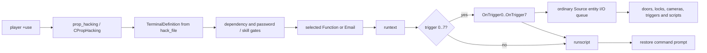
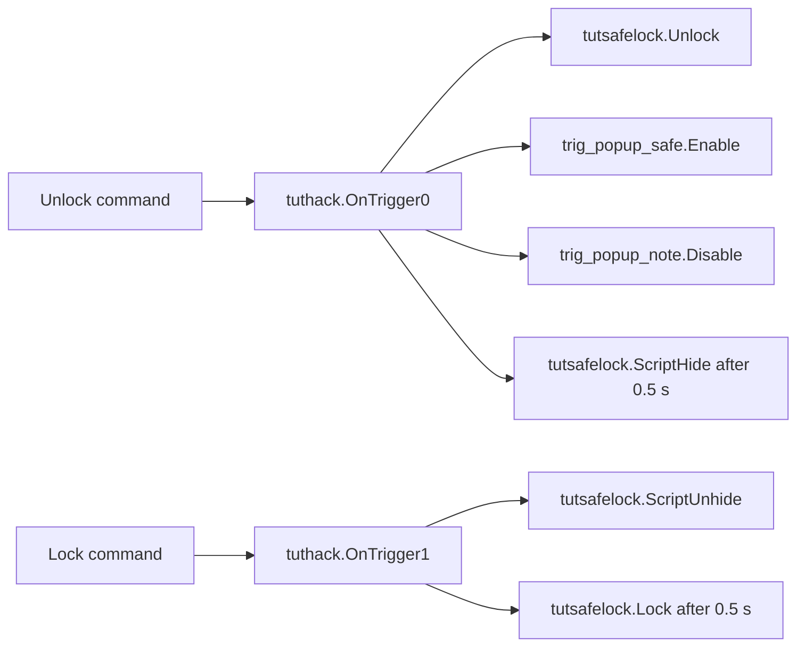

# VtMB computer terminals and hacking

This document owns the recovered behavior of VtMB's interactive computer terminals: the
`CBaseTerminal` / `CPropHacking` entity surface, the `TerminalDefinition` content model, entry and
exit, password and skill attempts, command execution, numbered outputs, email state and the
screensaver. Generic output delivery remains in `docs/vtmb/entity_io.md`; the Hacking feat remains
in `docs/vtmb/game_runtime.md`; sound resolution remains in `docs/vtmb/audio_pipeline.md`; the
serialized player record remains in `docs/vtmb/savegame_format.md`; and the map-specific tutorial
graph remains in `docs/vtmb/sp_tutorial_1-event-surface.md`.

The Unreal implementation and presentation counterpart is
`docs/architecture/computer-terminal-architecture.md`.

This is a VtMB behavior specification. Implementation priority and status live only in
`docs/project/roadmap.md`.

## 1. Evidence boundary

The native facts are recovered offline from the pinned retail `Vampire/dlls/vampire.dll` and
`Vampire/cl_dlls/client.dll`, both loaded at image base `0x10000000`. The content facts come from
the patch-first exported map and `vdata/hackterminals/` corpus that the project consumes.
Patch-first content is evidence for the active game data, not automatically an unchanged retail
authoring fact.

The reproducible extraction seeds and open questions live in
`research/cases/computer-terminals/`. Generated decompilation and game-derived data remain below
`$ELYSIUM_WORK_ROOT` and never enter Git.

No live game run is required to establish the static entity, data and script contracts. A live
capture may later be useful for presentation timing after the native state machine is recovered;
it is not a substitute for that recovery.

## 2. The system has three distinct layers



The physical map entity, the terminal content file and the ordinary Source I/O graph are separate
contracts. A terminal function may execute Python without firing an entity output, fire an output
without Python, do both, or do neither. The computer model itself does not encode the menu or the
world consequence.

## 3. Entity classes and fields

### 3.1 `CBaseTerminal`

`CBaseTerminal` has datamap `0x105af268`, ten records at `0x105af2ac`, built by
`FUN_10217650`.

| External name | Member | Offset | Role |
|---|---|---:|---|
| `start_enabled` | `m_bEnabled` | `+0x80c` | whether interaction is initially available |
| — | `m_bInUse` | `+0x80d` | saved live-use state |
| `textcolumns` | `m_nScreenColumns` | `+0x810` | terminal text width |
| `textrows` | `m_nScreenRows` | `+0x814` | terminal text height |
| `colorscheme` | `m_nColorScheme` | `+0x818` | presentation palette selector |
| — | `m_HackFlags` | `+0x81c` | replicated input-protocol bits described below |
| — | `m_nMaxInput` | `+0x820` | replicated maximum editable input length; zero means no extra cap |
| — | `m_bAllowDirKeys` | `+0x824` | replicated permission for cursor movement keys |
| — | `m_idxKeystrokeSnd` | `+0x828` | replicated client keystroke sound index |
| — | `m_szHackPWD[16]` | `+0x82c` | current password buffer/state |
| `Enable` | input handler `0x10218080` | — | enables the terminal |
| `Disable` | input handler `0x102180a0` | — | disables the terminal |

The class requests four typed computer sound events through its `soundgroup`: `typing`, `accept`,
`access` and `error` (`FUN_10217680`). The directory and event resolution are owned by
`docs/vtmb/audio_pipeline.md`. The cue sites are in §6.3.

`CBaseTerminal` is a `CBaseAnimating`. The screen-facing test `0x10218710` calls `GetAttachment`
non-virtually on `this` for the `screen` and `screen_axis` attachments, and the embedded scope-trace
string at `0x1054fb5c` names the owning method `CBaseAnimating::GetAttachment01`; a direct
compile-time-bound call to an unoverridden `CBaseAnimating` member is only legal on that chain.
Whether `CBaseVampireSkillEntity` — which §7 shows owns the terminal's skill outputs — joins the
same chain by single or multiple inheritance is unresolved: no `CBaseTerminal` constructor body is
recovered. The `CBaseAnimating` link alone is confirmed.

### 3.2 `CPropHacking`

`CPropHacking` has datamap `0x105af464`, eighteen records at `0x105af4ac`, built by
`FUN_10219770`; factory `0x102196a0` constructs it.

| External name | Member | Offset | Role |
|---|---|---:|---|
| `hack_file` | `m_sHackFile` | `+0x900` | `vdata/HackTerminals/*.txt` content path |
| `global_email` | `m_bHasGlobalEmail` | `+0xa10` | participates in player-global email state |
| `ss_delay` | `m_flSS_Delay` | `+0x9e4` | screensaver motion/update delay |
| `ss_start` | `m_flSS_Start` | `+0x9e8` | idle delay before the screensaver starts |
| — | `m_bSubdirUnlocked[5]` | `+0x986` | saved per-directory unlock state |
| — | `m_SubDirAttempts` | `+0x98c` | custom-saved per-directory attempt state |
| — | `m_EmailFlags[128]` | `+0xa28` | saved per-email state |
| — | `m_nEmailAttempts` | `+0xc28` | saved email-login attempt state |
| — | `m_bEmailUnlocked` | `+0xc2c` | saved email-login state |

`CPropHackingSS_Think` is registered at thunk `0x10014b82` and its body is `0x1021a740`; the
screensaver it drives is §6.4.

The server vtables are now bounded: `CBaseTerminal` is `0x1048ab34`, and `CPropHacking` is
`0x1048a5f4`. The shared interaction seam occupies slots 32, 34, 35, 39, 41, 42 and 43. The
corresponding base bodies are the use gate `0x102180c0`, availability predicate `0x10218690`,
use-capability result `0x10218660`, entry `0x102181a0`, input think `0x102182b0`, exit
`0x10218220` and active-use maintenance `0x10218320`. `CPropHacking` overrides entry with
`0x1021a5b0` and exit with `0x1021a6c0` while inheriting the common input and maintenance bodies.

`CBasePlayer::PlayerUse` at `0x10167850` is the dispatcher. It calls vtable offset `0x80` — slot 32,
the use gate — and on a pass dispatches offset `0x9c` (slot 39, entry). While a session is live the
same dispatcher routes offsets `0xac` (slot 43, active-use maintenance), `0xa4` (slot 41, input
think) and `0xa8` (slot 42, exit). Its target-acquisition fallback `thunk_FUN_10167470` derives a
cosine from a configured angle and calls the pick routine with range `0x42a00000` — 80.0 units — so
`+use` selection is a fixed 80-unit trace inside a cosine cone, not a sphere.

## 4. Map authoring contract

A `prop_hacking` combines ordinary entity fields with the terminal-specific fields above. The
important authored keys are:

| Group | Keys |
|---|---|
| body | `model`, `origin`, `angles`, `skin`, render and shadow fields |
| availability | `StartHidden`, `start_enabled` |
| presentation | `textcolumns`, `textrows`, `colorscheme`, `ss_delay`, `ss_start` |
| content | `hack_file`, `global_email` |
| skill | `difficulty`, `skilltype` |
| audio | `soundgroup` |

`StartHidden` and `start_enabled` are different gates. `StartHidden` is the base entity's complete
inert state: no render, collision, think or use. `start_enabled` is terminal-local availability on
an otherwise present computer.

The current 22-map export set contains twenty `prop_hacking` instances across twelve maps:

- nineteen author `start_enabled 1`; the patch-only `plus_computer` in `sm_bailbonds_1` starts
  disabled and hidden;
- all twenty use `soundgroup old_computer`;
- the normal grid is 36×24; the one patch-only variant uses 33×23;
- difficulties are 2–5;
- sixteen author `skilltype 2`, while four author `skilltype 1`;
- none authors `use_icon` or `locked_icon`.

The recovered skill table maps `skilltype 1` to registry id 0 (Intrusion/lockpicking) and
`skilltype 2` to registry id 2 (Hacking/Computers). The four terminal instances authored with
`skilltype 1` are therefore an evidence-backed anomaly; their values must not be silently
normalized before the native terminal caller establishes whether the field is consulted there.

`diceroll` is authored on many lockable and terminal entities but is absent from the retail module
as a case-insensitive string. It is a dead Hammer/FGD key, not a second switch for the skill roll.

## 5. `TerminalDefinition` content

`CPropHacking::LoadFromFile` at `0x1021cba0` reads the KeyValues tree named by `hack_file`.
`vdata/hackterminals/` contains 57 patch-first text files. Most have root `TerminalDefinition`;
`prop_keypad.txt` instead has root `keypad_strings` and is a separate keypad-title table consumed
by `CPropKeypad::LoadTextStrings` at `0x1021da40`. That loader selects a `keypad` record by
`TextID` and copies its `TitleText`. `CPropKeypad` installs the `CBaseTerminal` vtable during
construction before its own `0x1048b074` vtable, so it shares the terminal session/screen substrate
without sharing `CPropHacking`'s `TerminalDefinition` grammar.

The terminal grammar visible in the shipped files is:

```text
TerminalDefinition
{
    "screen saver"  "..."
    "brackets"      ".."
    "email_password" "..."
    "email_username" "..."

    LogonScreen { "line0" "..." ... }

    SubDir
    {
        "name" "..."
        "password" "..."
        "description" "..."
        "difficulty" "..."
        "dependency" "..."

        Function
        {
            "name" "..."
            "description" "..."
            "runtext" "..."
            "dependency" "..."
            "runscript" "..."
            "trigger" "0"
        }
    }

    Email
    {
        "subject" "..."
        "sender" "..."
        "body" "..."
        "dependency" "..."
        "runscript" "..."
        "autodelete" "1"
    }
}
```

The data's exact key is `"screen saver"` with a space. Earlier summaries spelling it
`screen_saver` are descriptive labels, not the authored token. The loader's exact normalization
or lookup spelling remains part of the static investigation.

`autodelete` appears in the shipped grammar but the loader never reads it; §9 has the evidence.
`brackets` is consumed only by the password prompt, not the screensaver; §6.4 has the evidence.

The shipped authoring guide embedded as `hack_charlimits.txt` states these practical limits:

| Field | Limit |
|---|---:|
| screensaver label | 64 characters |
| brackets | 2 |
| email username/password | 32 each |
| logon line | 30 |
| subdirectory/function name | 15 |
| description | 30 |
| run text / email body | 512 |
| dependency / script | 64 |
| trigger | one digit, 0–7 |

The comments also state up to five subdirectories, six functions per directory and eight terminal
outputs. The fixed native arrays corroborate the five-directory and eight-output limits; the
function limit still needs a native-array join.

## 6. Interaction lifecycle and client protocol

The control layer binds `E` to `+use`. On the server, the terminal's use gate requires:

- `start_enabled` / `m_bEnabled` at `+0x80c`;
- a requester with the player component expected by the terminal path;
- no different actor already held as the current user (the same current user is allowed through
  the gate);
- a positive `0x10218710` screen-facing test. It reads the model's `screen` and `screen_axis`
  **attachments** through `GetAttachment`, projects both the player view vector and the screen axis
  into the horizontal plane, and requires their dot product to exceed the constant at
  `_DAT_10457f54`, which is `0.7`. The test is attachment-driven; no bodygroup, material or brush
  participates. The same body is the shared subroutine behind the use gate, the availability
  predicate and `ObjectCaps`.

The stricter availability predicate rejects any already-owned terminal. These two checks explain
why `m_bInUse` and the current-user handle are separate pieces of exclusive-session state.

Base entry `0x102181a0` attaches the user, plays the `access` event, invokes two player-side mode
transitions, writes `m_bInUse = 1`, and clears the 16-byte terminal input buffer. One transition
sets the player byte at `+0x19f7`; the other ORs bit `0x1` into the player flags at `+0x1d60`.

While the session is active, `0x10218320` repeatedly derives the terminal/player bounds, writes the
player's origin through the player's own placement slot and calls `CBaseEntity::Relink` **on the
player**, then submits a non-empty input buffer. The player is therefore physically pinned to the
terminal's aligned use position every tick — the session moves the pawn, it does not merely lock a
camera. That is why the body carries no distance-cancellation branch: the player cannot drift out of
range while `m_bInUse` is true, so a distance rule would have nothing to catch.

The `CPropHacking` override initializes its content state, enters through that base body, loads
global email state when applicable, cancels idle screen-saver work, draws the initial screen and
attaches the player's Hacking interaction component. Base exit `0x10218220` clears client screen
state, invokes the complementary player transitions, writes `m_bInUse = 0`, releases the
screen/session handle and detaches the user. Exit clears both bit `0x1` and bit `0x8` from `+0x1d60`
although entry sets only `0x1`; bit `0x8` is raised outside the base body, consistent with the prop
override's Hacking-component attachment. The prop override saves global email first, then calls base
exit, re-arms the screen saver and clears the player's Hacking component.

The confirmed forced-exit path is the dispatcher's own release branch: `thunk_FUN_10167fd0` in
`CBasePlayer::PlayerUse` calls slot 42 on the held entity and clears the player's use handle. No
native site wiring player death, damage or map teardown to terminal exit is recovered, and
`CBaseTerminal` overrides no damage or kill virtual, so any such teardown would have to reach the
same generic player-side release rather than the terminal itself. This is an open question, not a
proof of absence.

Active input remains owned by the same server entity. `CPropHacking::AcceptCmd` at `0x1021a830`
caps the received command to sixteen bytes and routes it by the current logon/directory/password
state. In normal directory mode it tries the five built-ins first, then authored directories or
Functions in file order, then the invalid-command presentation. The built-ins are localized
`Hacking Strings` entries, not C++ literals: `QUIT` (index 33), `HELP` (34), `LIST` (35), `EMAIL`
(36), and `HOME_DIR` (17). Empty input redraws the directory. `HOME_DIR` returns to the root;
`LIST` redraws the current directory; `HELP` prints the help rows; `QUIT` exits through the player
terminal path; and `EMAIL` either enters email or starts its own password path. The client itself
still sends literal `quit` for Escape and `break` for Ctrl-C. In password mode `break` calls
`BeginInput`, starting or restarting the skill-mediated bypass, while any other input goes through
the case-insensitive password comparison. Email navigation is a separate hotkey state with its own
localized `NEXT`/`PREV`/`DEL`/`MENU`/`QUIT` commands; §9 owns it.

Because `quit` reaches the router as ordinary text, password mode compares it against the pending
password like any other guess. Leaving a password prompt is therefore not a router transition: it
is the dispatcher's release branch calling exit, described above.

### 6.1 Client character screen

The client class is `C_BaseTerminal`, registered through `DT_BaseTerminal`. This is not a named
VGUI terminal panel: the entity owns a character-cell screen rendered into the computer model's
screen texture.

- The default grid is 36×24. A 1,728-byte buffer at client `+0x7b4` holds 864 two-byte
  character/style cells; replicated columns and rows can reduce the active grid.
- `0x100c7720` creates or refreshes a 512×512 client-effect texture named `monitor`.
- `0x100c77f0` software-rasterizes the cell buffer, glyph table, selected color scheme and cursor
  into that texture.
- `m_bInUse`, columns, rows, color scheme, `m_HackFlags`, `m_nMaxInput`, keystroke sound and
  direction-key permission are replicated by `DT_BaseTerminal`.

The current 22-map export uses five distinct computer models across its twenty `prop_hacking`
instances. Every exported model assigns its display triangles to a separate material named
`screen`. This is a content fact about the present corpus; it does not establish how retail finds
or binds that surface beyond the native screen-facing and dynamic-texture paths above.

Client vtable `0x102334ac` slot 25 is the key-input body `0x100c7090`. It edits the command line and
cursor immediately in the local cell buffer, then sends a small authoritative command surface:

| Client action/state | Server command |
|---|---|
| Enter in normal line mode | `hackcmd <edited line>` |
| Escape in normal/raw mode | `hackcmd quit` |
| Ctrl-C chord | `hackcmd break` |
| each key while flag `0x4` is set | `hackcmd %c` |
| Enter/acknowledge while flag `0x1` is set | empty `hackcmd` submission |

`m_HackFlags` bit `0x4` is raw-character transport, bit `0x1` is continue/acknowledge mode and bit
`0x8` enables local keystroke sound. `m_bAllowDirKeys` gates arrows/home/end, and
`m_nMaxInput` gates further insertion. Server helpers `0x10219120`, `0x10219240` and `0x10219270`
respectively clear bits `0x1|0x4`, set `0x4`, and set `0x1`.

What remains open here is the exact meaning of the two player mode calls, the identity of the
generic use outputs around entry and exit, and whether damage, death or map teardown reach the
release branch. These are research questions, not implementation choices.

### 6.2 Selection feedback

No exported `prop_hacking` authors `use_icon` or `locked_icon`, and none needs to. Icon eligibility
is decided by `PlayerUseIconFilter` (`FUN_10342590`), which passes an entity when **any** of vtable
slot 32 (the use gate), slot 35 (`ObjectCaps` non-zero) or slot 34 (`IsUseable` non-zero) succeeds.
`CBaseTerminal::ObjectCaps` at `0x10218660` returns bit `0x2` when the §6 screen-facing test passes
and `0` otherwise, so a terminal becomes icon-eligible exactly when it becomes usable.

The client's use-icon HUD (`FUN_1005e4a0`, class string `CHudUseIcon`) reads the replicated player
field `m_targetEntityIcon`. Value `0x49` loads a named custom icon; a value below `0x4a` indexes a
fixed 74-entry table of stock icon material paths. Independently of that resolution the body
unconditionally creates `hud/new_ui/useicon` as a standing fallback material. An unauthored
`use_icon` therefore yields the plain default use icon — never a text hint and never an absent
prompt.

### 6.3 Terminal sound cues

The four `soundgroup` events are server-authoritative and fire at four distinct sites. The
dependency → runtext → `OnTriggerN` → `runscript` → prompt executor is itself silent: neither
`0x1021bec0` nor `0x1021c6d0` references any of them.

| Event | Site | Condition |
|---|---|---|
| `access` | base entry `0x102181a0` | once, on session entry |
| `accept` | `0x1021c890` (change directory) | entering a directory, whether reached by typing its name or by a successful password or skill bypass |
| `error` | `0x1021c3c0` (reject command) and `0x1021b5e0` (present password attempt) | an unmatched command, and every render of the password prompt including a failed retry |
| `typing` | `0x10218320` (active-use maintenance) and `0x10217b30` (`BeginInput`) | per batch of newly accepted characters during the server-side echo loop, and on each refresh of the randomized bypass buffer |

`error` does not distinguish an invalid command from a wrong password; both reach the same event
through different call sites. `typing` is not a per-keystroke cue.

The per-keystroke click is a separate client-local mechanism. `C_BaseTerminal`'s key-input body
`0x100c7090` gates on `m_HackFlags & 0x8` and a non-empty `m_idxKeystrokeSnd` string at client
`+0xf18`, then plays a locally pitch- and volume-randomized sound with no server round trip. It is
disjoint from the `soundgroup` events.

### 6.4 Screensaver

`CPropHackingSS_Think` at `0x1021a740` repositions one label; it does not scroll, bounce or animate
continuously. Each tick it:

1. measures the `"screen saver"` string held at `+0x904`;
2. picks a row with `RandomInt(1, textrows - 1)` and a column bounded by `textcolumns - labelLength`;
3. clears and positions the cursor through `thunk_FUN_10218ff0`;
4. picks one of two style setters at random through `RandomInt(0, 1)` — `thunk_FUN_10218ca0` or
   `thunk_FUN_10218b90`, each a distinct client style opcode;
5. prints the label through the same `thunk_FUN_10217ac0` → `thunk_FUN_102189e0` text path that
   ordinary directory and command output uses;
6. writes `next think = m_flSS_Delay + curtime`.

So the label teleports to a fresh random cell in one of two colors on every tick. The work is
server-side: the body lives in `vampire.dll` and pushes through the ordinary output path rather than
animating client-locally.

The two authored timers have separate roles. Exit `0x1021a6c0` re-arms the default think and sets
`next think = m_flSS_Start + curtime`, so `ss_start` is the idle delay before the **first** tick.
Each tick then reschedules itself `ss_delay` later. Entry `0x1021a5b0` clears the default think
outright, which is the screensaver cancellation, then draws the logon or directory screen.

`brackets` does not participate. It is loaded at `+0x984` as two characters plus a terminator, and
its only consumer is the password-attempt presenter `0x1021b5e0`, which wraps the pending
subdirectory or email name with those two characters in the prompt.

## 7. Passwords and hacking attempts

`CBaseVampireSkillEntity` owns the shared attempt state and outputs:

- `OnSkillAttemptBegin`;
- `OnSkillAttemptCycle`;
- `OnSkillSuccess`;
- `OnSkillFail`;
- `OnSkillBotch`.

The shared attempt body calls its Intrusion/Hacking helper with `doRoll=false`: it compares the
current feat rating to the selected difficulty and stores result tier 3 for pass or 1 for fail in
the same field used by `IsLocked()`. The retained generic result dispatch has a tier-0 botch branch,
but the normal `skilltype` 1/2 path cannot produce it. `Lock` writes 1; `Unlock` writes 3.
`skilltype 2` queries the Hacking feat, whose rating is Wits + Computer. Attempt pacing is exactly
`(5.0 - rating*0.25) / playerScale`; the player skill is reread on approach. The terminal-specific
caller and difficulty-selection join is the pending-target rule below.

Terminal files can author both a `password` and a `difficulty` on each `SubDir`; the entity also
carries its ordinary skill-entity `difficulty`. The selected pending target is explicit: `-2` is
root email and a non-negative value is a directory index. Root email always uses the entity
difficulty. A valid directory uses its own difficulty when that value is at least 1 and otherwise
falls back to the entity difficulty. An invalid pending index emits the retail diagnostic and
returns difficulty 0 rather than reading an unrelated row.

The password and skill paths are separate inputs that converge on one comparison. Ordinary text is
compared case-insensitively with the pending directory password (or the root email password).
Ctrl-C's `break` starts `CBaseTerminal::BeginInput`, which fires the skill-attempt begin path and
uses the shared deterministic Hacking attempt. While its timed progress is non-zero the visible
buffer retains the known prefix and randomizes the rest. A passing tier fills the real password;
a failing tier fills random characters. Completion sends that buffer through the same
`AcceptPassword` body as typed input.

Password acceptance enters and unlocks the pending directory. Failure increments exactly that
directory's `m_SubDirAttempts` entry (or the root-email counter), displays the failure state, and a
failed skill bypass returns to the root without exiting the terminal. No attempt-count lockout is
present in these bodies; another directory selection can retry. Thus password correctness, skill
resolution and function selection remain distinct transitions even though both unlock routes share
the final password-accept callback.

## 8. Function execution and numbered outputs

Each `CPropHacking` constructs eight outputs, `m_OnTrigger[0..7]`, beginning at `+0x840` with
stride `0x18`. These are command channels, not skill-result tiers.

A `Function` block's integer `trigger` defaults to `-1`. `0x1021b750` matches the command and calls
dependency evaluator `0x1021bec0`. An empty dependency passes; a non-empty dependency is evaluated
through `CDialogDependency::CallPyDialogFunc` with the active player, terminal and mode `0x102`.
A failed dependency returns before function effects.

On a passed dependency, executor `0x1021c6d0` performs this order:

1. print the function's `runtext`;
2. if `trigger` is 0–7, call the `COutputEvent` at `this + 0x840 + trigger*0x18`, passing the active
   user into the output fire path;
3. if `runscript` is non-empty, execute it through the same Python bridge with mode `0x100`;
4. print the prompt and return to command mode.

Step 2 **fires the output object**, which only enqueues its actions; it does not synchronously deliver
their target inputs. Step 3 then executes `runscript` inside the terminal input body. When this whole
transaction itself is being serviced from `CEventQueue`, the newly enqueued `OnTriggerN` actions
remain behind the current/equal-time cohort and normally deliver **after `runscript`**, later in the
same queue pass. This distinction is observable if the script mutates state read by a target input.
Neither effect is required: `trigger = -1` skips the output, and an empty script skips Python. The
terminal-specific sound ordering outside this executor remains open.

Once `OnTriggerN` fires, its map-authored wires use ordinary VtMB entity I/O. Each wire preserves
target, input, parameter, delay, fire count, Python payload, caller and activator as specified in
`docs/vtmb/entity_io.md`. A missing target is a legal no-op; an existing target with no matching
input is a different condition.

`runscript` is a second path. It executes a terminal-content statement in the shared Python game
namespace and does not require a numbered output. It must not be rewritten as an entity wire.

## 9. Emails and persistence

`email_username` is presentation text; `email_password` gates the mail area. The terminal saves 128
per-email integers plus email-login state and attempt count.

**`m_EmailFlags` is a bitmask, not a status enum.** Each of the 128 integers at `+0xa28` carries bit
`0x1` for *read* and bit `0x2` for *deleted*. The accessors are `FUN_1021a4b0` / `FUN_1021a530` for
read and `FUN_1021a4f0` / `FUN_1021a560` for deleted, each addressing `this + index*4 + 0xa28`.

**Reading and `runscript` both happen on open, and `runscript` fires exactly once.**
`0x1021bc90` renders the body, tests bit `0x1`, and only if it is unset executes the record's
`runscript` field through `CDialogDependency::CallPyDialogFunc` with mode `0x100` — the same mode
`Function.runscript` uses — then unconditionally sets bit `0x1`. The list renderer `0x1021c040`
reads the bit only to choose a bold or plain row; it never runs a script.

**A dependency hides a message rather than disabling it.** `0x1021bd80` rebuilds the visible index
table at `+0x9f8` and its count at `+0xa04` whenever the mail area is entered. A record is appended
only when it is not deleted **and** its dependency at `record+0x240` passes under mode `0x102`.
Hidden and deleted messages are absent from the table, so no selection, `NEXT` or `PREV` can reach
them.

**`autodelete` is inert.** `LoadFromFile` at `0x1021cba0` parses exactly five `Email` keys —
`subject`, `sender`, the body, `dependency` and `runscript` — into a `0x2c0`-byte record with no
remaining field, and no decompiled body tests such a value. Shipped content authors
`"autodelete" "1"` (for example in `haven_pc.txt`), but the retail engine never reads it. The only
deletion path is the player's `DEL` command through `0x1021bbf0`, which sets bit `0x2`.

**The mail area gates on a non-empty password only.** The `EMAIL` built-in in `0x1021aaa0` engages
only when root email content is present at `+0xa20`. It then measures `email_password` at `+0x944`:
when that string is non-empty *and* `m_bEmailUnlocked` at `+0xc2c` is false it starts the password
prompt with pending target `-2`; otherwise it enters the mail area directly, and entering always
sets `m_bEmailUnlocked`. Neither entry nor exit clears that flag, so it persists for the entity's
lifetime as saved state. `m_nEmailAttempts` at `+0xc28` is incremented on a failed root-email
attempt by `0x1021c560` and is never read back — email has no lockout, matching directory passwords.

**Email navigation is a hotkey state with its own localized strings.** `Hacking Strings` 24–28 are
`NEXT`, `PREV`, `DEL`, `MENU` and the in-mail `QUIT`, distinct from the directory-level entries in
§6. `0x1021b9c0` consumes them whenever the current directory is `-2`. With no message open it
first tries an integer selection, then matches `NEXT`/`PREV` as page paging. With a message open it
requires exactly one character and dispatches open-adjacent, delete, return-to-list, or — for
`QUIT`, from either state — a change to directory `-1`, back to the root.

**Global reconciliation overwrites in both directions, keyed by entity name.**
`LoadGlobalEmailState` `0x1021a2f0` and `SaveGlobalEmailState` `0x1021a3d0` both return immediately
unless `m_bHasGlobalEmail` is set. Otherwise they call the player's retrieve and store helpers keyed
by the terminal's entity name at `+0x26c`, compared with `Q_strncmp` over at most 64 bytes. Retrieve
creates a zeroed record when none exists and copies its 128 integers over the local array; store
copies the local array back over the record, and emits a `DevWarning` naming the terminal if no
record is found. There is no merge in either direction: entry is global-wins, exit is local-wins.
For a terminal with `global_email 0` both calls are skipped and `m_EmailFlags` is purely
per-entity saved state.

The player save's `m_GlobalEmailFlags` vector holds one such record per terminal entity name. The
byte layout belongs to `docs/vtmb/savegame_format.md`.

The patch script `vamputil.py` read-modify-writes `vdata/hackterminals/haven_pc.txt` to put the
player's name into the haven mail client. That filesystem behavior belongs to
`docs/vtmb/python_bridge.md`; the terminal consumer must tolerate the resulting patch-first file.

## 10. `sp_tutorial_1`: the worked terminal contract

The map contains two `prop_hacking` entities.

### 10.1 `tuthack`

`tuthack` is the load-bearing tutorial terminal:

| Field | Authored value |
|---|---|
| model | `models/scenery/furniture/computer/monitor_useable.mdl` |
| `start_enabled` | `1` |
| grid | 36×24 |
| `colorscheme` | `0` |
| `soundgroup` | `old_computer` |
| `difficulty` / `skilltype` | `2` / `2` |
| `hack_file` | `vdata/HackTerminals/tutorial_computer.txt` |
| screensaver start / delay | `5.0` / `1.5` |

The file presents a `Safe` directory with password `chopshop` and two functions:

| Function | Run text | Trigger |
|---|---|---:|
| `Unlock` | `Safe doors unlocked.` | 0 |
| `Lock` | `Safe doors locked.` | 1 |

The map wires them as follows:



This is the minimum complete acceptance transaction for a terminal implementation: `+use`, input
ownership, content parse, password or skill path, function execution, numbered output, ordinary
event-queue delivery, safe lock state and visible tutorial progression. The broader map graph is
owned by `docs/vtmb/sp_tutorial_1-event-surface.md`.

### 10.2 `beam_1_terminal`

`beam_1_terminal` uses a military-computer model and `soc_int_hack.txt`, with difficulty 5 and
`skilltype 2`. It authors no outgoing entity wires. Any useful effect must therefore come from its
content script path; a numbered trigger without a matching map output is a legal no-op.

## 11. Script-only contrast: `sp_theatre`

`sp_theatre` contains one unnamed, enabled `prop_hacking` using
`shrekhub2_terminal.txt`, difficulty 5, `skilltype 2`, a 36×24 grid and
`old_computer`. It has no outgoing entity wires.

Its meaningful command path is Python-driven. The gated `schrecknet` function authors:

```python
G.Shubs_Act = 2; G.Shubtwo_Camera == 3; mitSetQuestFive()
```

The middle expression is a comparison whose result is discarded, not an assignment.
`mitSetQuestFive()` sets the Mitnick quest to state 5. This terminal demonstrates why the remake
cannot require every useful computer command to own an `OnTriggerN` wire.

## 12. Faithful behavior invariants

- A `prop_hacking` remains one stable entity across body, UI session, skill state, output caller and
  persistence.
- `StartHidden`, `start_enabled` and `m_bInUse` remain separate states.
- Content is loaded from the authored `hack_file`; the model does not choose the terminal data.
- The client presents the grid as a model-bound character texture and sends `hackcmd` requests;
  the server terminal remains authoritative for command meaning and effects.
- Dependencies are evaluated through the shared game-script namespace.
- Password entry, hacking skill resolution and function selection remain separate transitions.
- `OnSkill*`, `OnUse*` and `OnTrigger0..7` are distinct output families.
- `runscript` remains a first-class path after numbered entity output execution.
- An authored numbered trigger with no matching output wire is a legal no-op.
- Delays, remaining fire counts, caller and activator survive delivery through the ordinary entity
  event queue.
- Email state is per terminal unless `global_email` deliberately promotes it to player state.
- The authored `skilltype` value is preserved, including the four current-map anomalies.
- `diceroll` remains inert unless new native evidence contradicts the full-image absence.
- One screen-facing rule — the `0.7` planar dot product over the `screen` and `screen_axis`
  attachments — governs the use gate, the availability predicate and icon eligibility alike.
- A terminal with no authored `use_icon` still presents the stock use icon.
- An active session holds the player at the terminal's aligned use position; distance does not end
  it.
- `autodelete` remains inert unless new native evidence contradicts the loader's key set.
- An email's read mark and its `runscript` are one transaction on first open, and the script never
  runs a second time.
- A dependency-failed or deleted email is absent from the visible list rather than shown disabled.
- Global email reconciliation overwrites: global wins on entry, local wins on exit, keyed by entity
  name and skipped entirely without `global_email`.
- The screensaver reprints one label at a random cell in one of two styles, on `ss_start` then
  `ss_delay`.
- The four `soundgroup` cues are server-authoritative; the per-keystroke click is client-local and
  separate.

## 13. Open research questions

| ID | Question | Evidence that closes it |
|---|---|---|
| TERM1 | Does `CBaseVampireSkillEntity` join `CBaseTerminal`'s chain by single or multiple inheritance? | the `CBaseTerminal` constructor body and its vtable installation order |
| TERM2 | Which generic use outputs does the pair `thunk_FUN_1020acb0` / `thunk_FUN_1020adc0` fire around entry and exit, and do player death, damage or map teardown reach the dispatcher's release branch? | the output-registry entry selected by `this+0x784` resolved to a datamap row, plus xrefs from the damage, kill and level-teardown paths to the player's use-release |
| TERM9 | What do the two player mode transitions mean — the byte at `+0x19f7` and flags `0x1` / `0x8` at `+0x1d60`? | the player-side readers of those fields and the state they suppress |

The research case answers these questions incrementally. A finding is confirmed only when its
native producer, state mutation and observable consumer are joined; an isolated field name or UI
string is a seed, not closure.
