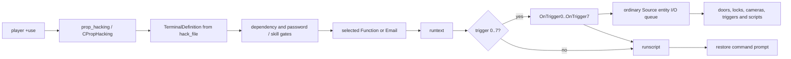
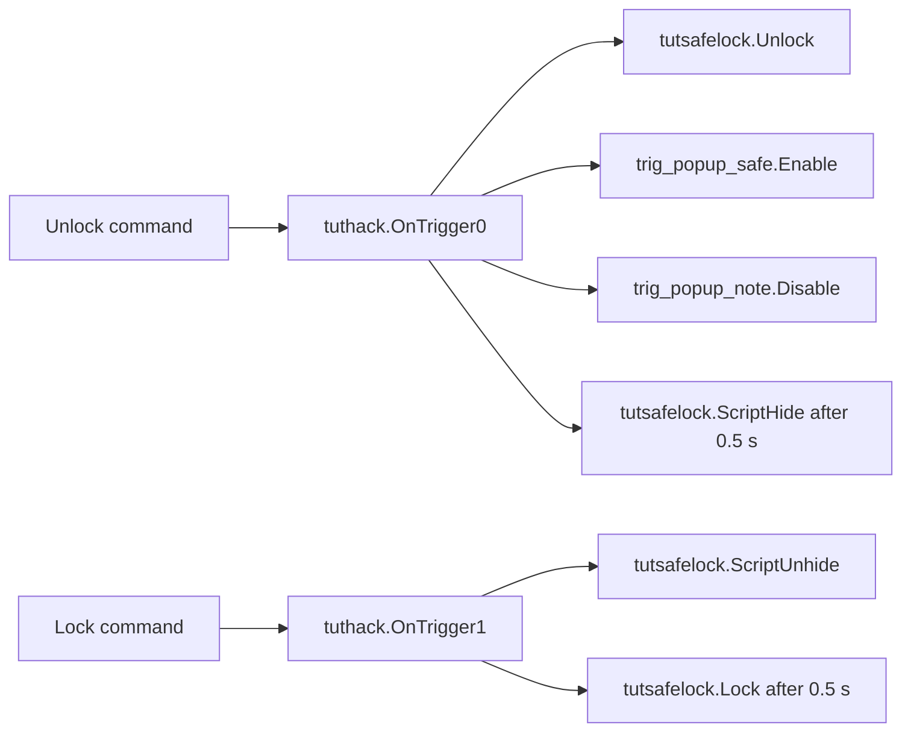

# VtMB computer terminals and hacking

This document owns the recovered behavior of VtMB's interactive computer terminals: the
`CBaseTerminal` / `CPropHacking` entity surface, the `TerminalDefinition` content model, entry and
exit, password and skill attempts, command execution, numbered outputs, email state and the
screensaver. Generic output delivery remains in `docs/vtmb/entity_io.md`; the Hacking feat remains
in `docs/vtmb/game_runtime.md`; sound resolution remains in `docs/vtmb/audio_pipeline.md`; the
serialized player record remains in `docs/vtmb/savegame_format.md`; and the map-specific tutorial
graph remains in `docs/vtmb/sp_tutorial_1-event-surface.md`.

This is a VtMB behavior specification. Implementation priority and status live only in
`docs/project/roadmap.md`.

## 1. Evidence boundary

The native facts are recovered offline from the pinned retail `Vampire/dlls/vampire.dll` and
`Vampire/cl_dlls/client.dll`, both loaded at image base `0x10000000`. The content facts come from
the patch-first exported map and `vdata/hackterminals/` corpus that the project consumes.
Patch-first content is evidence for the active game data, not automatically an unchanged retail
authoring fact.

The reproducible extraction seeds and open questions live in
`research/cases/computer-terminals/`. Generated decompilation and game-derived data remain below
`$ELYSIUM_WORK_ROOT` and never enter Git.

No live game run is required to establish the static entity, data and script contracts. A live
capture may later be useful for presentation timing after the native state machine is recovered;
it is not a substitute for that recovery.

## 2. The system has three distinct layers



The physical map entity, the terminal content file and the ordinary Source I/O graph are separate
contracts. A terminal function may execute Python without firing an entity output, fire an output
without Python, do both, or do neither. The computer model itself does not encode the menu or the
world consequence.

## 3. Entity classes and fields

### 3.1 `CBaseTerminal`

`CBaseTerminal` has datamap `0x105af268`, ten records at `0x105af2ac`, built by
`FUN_10217650`.

| External name | Member | Offset | Role |
|---|---|---:|---|
| `start_enabled` | `m_bEnabled` | `+0x80c` | whether interaction is initially available |
| — | `m_bInUse` | `+0x80d` | saved live-use state |
| `textcolumns` | `m_nScreenColumns` | `+0x810` | terminal text width |
| `textrows` | `m_nScreenRows` | `+0x814` | terminal text height |
| `colorscheme` | `m_nColorScheme` | `+0x818` | presentation palette selector |
| — | `m_HackFlags` | `+0x81c` | replicated input-protocol bits described below |
| — | `m_nMaxInput` | `+0x820` | replicated maximum editable input length; zero means no extra cap |
| — | `m_bAllowDirKeys` | `+0x824` | replicated permission for cursor movement keys |
| — | `m_idxKeystrokeSnd` | `+0x828` | replicated client keystroke sound index |
| — | `m_szHackPWD[16]` | `+0x82c` | current password buffer/state |
| `Enable` | input handler `0x10218080` | — | enables the terminal |
| `Disable` | input handler `0x102180a0` | — | disables the terminal |

The class requests four typed computer sound events through its `soundgroup`: `typing`, `accept`,
`access` and `error` (`FUN_10217680`). The directory and event resolution are owned by
`docs/vtmb/audio_pipeline.md`.

### 3.2 `CPropHacking`

`CPropHacking` has datamap `0x105af464`, eighteen records at `0x105af4ac`, built by
`FUN_10219770`; factory `0x102196a0` constructs it.

| External name | Member | Offset | Role |
|---|---|---:|---|
| `hack_file` | `m_sHackFile` | `+0x900` | `vdata/HackTerminals/*.txt` content path |
| `global_email` | `m_bHasGlobalEmail` | `+0xa10` | participates in player-global email state |
| `ss_delay` | `m_flSS_Delay` | `+0x9e4` | screensaver motion/update delay |
| `ss_start` | `m_flSS_Start` | `+0x9e8` | idle delay before the screensaver starts |
| — | `m_bSubdirUnlocked[5]` | `+0x986` | saved per-directory unlock state |
| — | `m_SubDirAttempts` | `+0x98c` | custom-saved per-directory attempt state |
| — | `m_EmailFlags[128]` | `+0xa28` | saved per-email state |
| — | `m_nEmailAttempts` | `+0xc28` | saved email-login attempt state |
| — | `m_bEmailUnlocked` | `+0xc2c` | saved email-login state |

`CPropHackingSS_Think` is registered at thunk `0x10014b82`. The complete screensaver transition
and rendering path remains open.

The server vtables are now bounded: `CBaseTerminal` is `0x1048ab34`, and `CPropHacking` is
`0x1048a5f4`. The shared interaction seam occupies slots 32, 34, 35, 39, 41, 42 and 43. The
corresponding base bodies are the use gate `0x102180c0`, availability predicate `0x10218690`,
use-capability result `0x10218660`, entry `0x102181a0`, input think `0x102182b0`, exit
`0x10218220` and active-use maintenance `0x10218320`. `CPropHacking` overrides entry with
`0x1021a5b0` and exit with `0x1021a6c0` while inheriting the common input and maintenance bodies.
The still-open class-chain question is above `CBaseTerminal` and at the player dispatcher, not the
terminal's own session seam.

## 4. Map authoring contract

A `prop_hacking` combines ordinary entity fields with the terminal-specific fields above. The
important authored keys are:

| Group | Keys |
|---|---|
| body | `model`, `origin`, `angles`, `skin`, render and shadow fields |
| availability | `StartHidden`, `start_enabled` |
| presentation | `textcolumns`, `textrows`, `colorscheme`, `ss_delay`, `ss_start` |
| content | `hack_file`, `global_email` |
| skill | `difficulty`, `skilltype` |
| audio | `soundgroup` |

`StartHidden` and `start_enabled` are different gates. `StartHidden` is the base entity's complete
inert state: no render, collision, think or use. `start_enabled` is terminal-local availability on
an otherwise present computer.

The current 22-map export set contains twenty `prop_hacking` instances across twelve maps:

- nineteen author `start_enabled 1`; the patch-only `plus_computer` in `sm_bailbonds_1` starts
  disabled and hidden;
- all twenty use `soundgroup old_computer`;
- the normal grid is 36×24; the one patch-only variant uses 33×23;
- difficulties are 2–5;
- sixteen author `skilltype 2`, while four author `skilltype 1`;
- none authors `use_icon` or `locked_icon`.

The recovered skill table maps `skilltype 1` to registry id 0 (Intrusion/lockpicking) and
`skilltype 2` to registry id 2 (Hacking/Computers). The four terminal instances authored with
`skilltype 1` are therefore an evidence-backed anomaly; their values must not be silently
normalized before the native terminal caller establishes whether the field is consulted there.

`diceroll` is authored on many lockable and terminal entities but is absent from the retail module
as a case-insensitive string. It is a dead Hammer/FGD key, not a second switch for the skill roll.

## 5. `TerminalDefinition` content

`CPropHacking::LoadFromFile` at `0x1021cba0` reads the KeyValues tree named by `hack_file`.
`vdata/hackterminals/` contains 57 patch-first text files. Most have root `TerminalDefinition`;
`prop_keypad.txt` instead has root `keypad_strings` and is a separate keypad-title table consumed
by `CPropKeypad::LoadTextStrings` at `0x1021da40`. That loader selects a `keypad` record by
`TextID` and copies its `TitleText`. `CPropKeypad` installs the `CBaseTerminal` vtable during
construction before its own `0x1048b074` vtable, so it shares the terminal session/screen substrate
without sharing `CPropHacking`'s `TerminalDefinition` grammar.

The terminal grammar visible in the shipped files is:

```text
TerminalDefinition
{
    "screen saver"  "..."
    "brackets"      ".."
    "email_password" "..."
    "email_username" "..."

    LogonScreen { "line0" "..." ... }

    SubDir
    {
        "name" "..."
        "password" "..."
        "description" "..."
        "difficulty" "..."
        "dependency" "..."

        Function
        {
            "name" "..."
            "description" "..."
            "runtext" "..."
            "dependency" "..."
            "runscript" "..."
            "trigger" "0"
        }
    }

    Email
    {
        "subject" "..."
        "sender" "..."
        "body" "..."
        "dependency" "..."
        "runscript" "..."
        "autodelete" "1"
    }
}
```

The data's exact key is `"screen saver"` with a space. Earlier summaries spelling it
`screen_saver` are descriptive labels, not the authored token. The loader's exact normalization
or lookup spelling remains part of the static investigation.

The shipped authoring guide embedded as `hack_charlimits.txt` states these practical limits:

| Field | Limit |
|---|---:|
| screensaver label | 64 characters |
| brackets | 2 |
| email username/password | 32 each |
| logon line | 30 |
| subdirectory/function name | 15 |
| description | 30 |
| run text / email body | 512 |
| dependency / script | 64 |
| trigger | one digit, 0–7 |

The comments also state up to five subdirectories, six functions per directory and eight terminal
outputs. The fixed native arrays corroborate the five-directory and eight-output limits; the
function limit still needs a native-array join.

## 6. Interaction lifecycle and client protocol

The control layer binds `E` to `+use`. On the server, the terminal's use gate requires:

- `start_enabled` / `m_bEnabled` at `+0x80c`;
- a requester with the player component expected by the terminal path;
- no different actor already held as the current user (the same current user is allowed through
  the gate);
- a positive `0x10218710` screen-facing test, which resolves the model's `screen` and
  `screen_axis` geometry and compares it with the player view.

The stricter availability predicate rejects any already-owned terminal. These two checks explain
why `m_bInUse` and the current-user handle are separate pieces of exclusive-session state.

Base entry `0x102181a0` attaches the user, plays the `access` event, invokes two player-side mode
transitions, writes `m_bInUse = 1`, and clears the 16-byte terminal input buffer. The
`CPropHacking` override initializes its content state, enters through that base body, loads global
email state when applicable, cancels idle screen-saver work, draws the initial screen and attaches
the player's Hacking interaction component. Base exit `0x10218220` clears client screen state,
invokes the complementary player transitions, writes `m_bInUse = 0`, releases the screen/session
handle and detaches the user. The prop override saves global email first, then calls base exit,
re-arms the screen saver and clears the player's Hacking component.

Active input remains owned by the same server entity. `CPropHacking::AcceptCmd` at `0x1021a830`
caps the received command to sixteen bytes and routes it by the current logon/directory/password
state. The complete built-in command vocabulary and forced-exit causes remain under investigation.

### 6.1 Client character screen

The client class is `C_BaseTerminal`, registered through `DT_BaseTerminal`. This is not a named
VGUI terminal panel: the entity owns a character-cell screen rendered into the computer model's
screen texture.

- The default grid is 36×24. A 1,728-byte buffer at client `+0x7b4` holds 864 two-byte
  character/style cells; replicated columns and rows can reduce the active grid.
- `0x100c7720` creates or refreshes a 512×512 client-effect texture named `monitor`.
- `0x100c77f0` software-rasterizes the cell buffer, glyph table, selected color scheme and cursor
  into that texture.
- `m_bInUse`, columns, rows, color scheme, `m_HackFlags`, `m_nMaxInput`, keystroke sound and
  direction-key permission are replicated by `DT_BaseTerminal`.

Client vtable `0x102334ac` slot 25 is the key-input body `0x100c7090`. It edits the command line and
cursor immediately in the local cell buffer, then sends a small authoritative command surface:

| Client action/state | Server command |
|---|---|
| Enter in normal line mode | `hackcmd <edited line>` |
| Escape in normal/raw mode | `hackcmd quit` |
| Ctrl-C chord | `hackcmd break` |
| each key while flag `0x4` is set | `hackcmd %c` |
| Enter/acknowledge while flag `0x1` is set | empty `hackcmd` submission |

`m_HackFlags` bit `0x4` is raw-character transport, bit `0x1` is continue/acknowledge mode and bit
`0x8` enables local keystroke sound. `m_bAllowDirKeys` gates arrows/home/end, and
`m_nMaxInput` gates further insertion. Server helpers `0x10219120`, `0x10219240` and `0x10219270`
respectively clear bits `0x1|0x4`, set `0x4`, and set `0x1`.

What remains open is the player-side dispatch into the terminal, selection feedback when no
`use_icon` is authored, the exact meaning of the player mode calls, ordering against generic
`OnUseBegin`/`OnUseEnd`, and which distance, damage, map-teardown or second-user conditions force
exit. These are research questions, not implementation choices.

## 7. Passwords and hacking attempts

`CBaseVampireSkillEntity` owns the shared attempt state and outputs:

- `OnSkillAttemptBegin`;
- `OnSkillAttemptCycle`;
- `OnSkillSuccess`;
- `OnSkillFail`;
- `OnSkillBotch`.

The shared roll stores its result in the same field used by `IsLocked()`. A result greater than 2
is success, zero is a botch, and 1–2 are ordinary failure. `Lock` writes 1; `Unlock` writes 3.
`skilltype 2` queries the Hacking feat, whose rating is Wits + Computer. Attempt pacing is
`(K1 - skillLevel*K2) / playerScale` and the player skill is reread on approach.

Terminal files can author both a `password` and a `difficulty` on each `SubDir`; some files also
carry a root-level difficulty. The native terminal path that selects entity difficulty versus
directory difficulty, begins/cycles an attempt, reveals or fills a password, and records
`m_SubDirAttempts` is not yet recovered. Password correctness, skill success and the typed command
parser must therefore remain separate concepts until their native join is proven.

## 8. Function execution and numbered outputs

Each `CPropHacking` constructs eight outputs, `m_OnTrigger[0..7]`, beginning at `+0x840` with
stride `0x18`. These are command channels, not skill-result tiers.

A `Function` block's integer `trigger` defaults to `-1`. `0x1021b750` matches the command and calls
dependency evaluator `0x1021bec0`. An empty dependency passes; a non-empty dependency is evaluated
through `CDialogDependency::CallPyDialogFunc` with the active player, terminal and mode `0x102`.
A failed dependency returns before function effects.

On a passed dependency, executor `0x1021c6d0` performs this order:

1. print the function's `runtext`;
2. if `trigger` is 0–7, call the `COutputEvent` at `this + 0x840 + trigger*0x18`, passing the active
   user into the output fire path;
3. if `runscript` is non-empty, execute it through the same Python bridge with mode `0x100`;
4. print the prompt and return to command mode.

Therefore `OnTriggerN` enters ordinary Source I/O before that Function's `runscript`. Neither is
required: `trigger = -1` skips the output, and an empty script skips Python. The terminal-specific
sound ordering outside this executor remains open.

Once `OnTriggerN` fires, its map-authored wires use ordinary VtMB entity I/O. Each wire preserves
target, input, parameter, delay, fire count, Python payload, caller and activator as specified in
`docs/vtmb/entity_io.md`. A missing target is a legal no-op; an existing target with no matching
input is a different condition.

`runscript` is a second path. It executes a terminal-content statement in the shared Python game
namespace and does not require a numbered output. It must not be rewritten as an entity wire.

## 9. Emails and persistence

An `Email` can be dependency-gated, can execute `runscript` when consumed, and can mark itself for
automatic deletion. `email_username` is presentation text; `email_password` gates the mail area.
The terminal saves 128 per-email integers plus email-login state and attempt count.

For `global_email` terminals, the player save also carries
`m_GlobalEmailFlags`, a vector of records keyed by terminal entity name; each record contains 128
integers of email state. The byte layout belongs to `docs/vtmb/savegame_format.md`.

The precise meaning of every email flag, when a message becomes read, when `runscript` fires, how
`autodelete` changes the array, and how local state reconciles with the player-global record remain
open.

The patch script `vamputil.py` read-modify-writes `vdata/hackterminals/haven_pc.txt` to put the
player's name into the haven mail client. That filesystem behavior belongs to
`docs/vtmb/python_bridge.md`; the terminal consumer must tolerate the resulting patch-first file.

## 10. `sp_tutorial_1`: the worked terminal contract

The map contains two `prop_hacking` entities.

### 10.1 `tuthack`

`tuthack` is the load-bearing tutorial terminal:

| Field | Authored value |
|---|---|
| model | `models/scenery/furniture/computer/monitor_useable.mdl` |
| `start_enabled` | `1` |
| grid | 36×24 |
| `colorscheme` | `0` |
| `soundgroup` | `old_computer` |
| `difficulty` / `skilltype` | `2` / `2` |
| `hack_file` | `vdata/HackTerminals/tutorial_computer.txt` |
| screensaver start / delay | `5.0` / `1.5` |

The file presents a `Safe` directory with password `chopshop` and two functions:

| Function | Run text | Trigger |
|---|---|---:|
| `Unlock` | `Safe doors unlocked.` | 0 |
| `Lock` | `Safe doors locked.` | 1 |

The map wires them as follows:



This is the minimum complete acceptance transaction for a terminal implementation: `+use`, input
ownership, content parse, password or skill path, function execution, numbered output, ordinary
event-queue delivery, safe lock state and visible tutorial progression. The broader map graph is
owned by `docs/vtmb/sp_tutorial_1-event-surface.md`.

### 10.2 `beam_1_terminal`

`beam_1_terminal` uses a military-computer model and `soc_int_hack.txt`, with difficulty 5 and
`skilltype 2`. It authors no outgoing entity wires. Any useful effect must therefore come from its
content script path; a numbered trigger without a matching map output is a legal no-op.

## 11. Script-only contrast: `sp_theatre`

`sp_theatre` contains one unnamed, enabled `prop_hacking` using
`shrekhub2_terminal.txt`, difficulty 5, `skilltype 2`, a 36×24 grid and
`old_computer`. It has no outgoing entity wires.

Its meaningful command path is Python-driven. The gated `schrecknet` function authors:

```python
G.Shubs_Act = 2; G.Shubtwo_Camera == 3; mitSetQuestFive()
```

The middle expression is a comparison whose result is discarded, not an assignment.
`mitSetQuestFive()` sets the Mitnick quest to state 5. This terminal demonstrates why the remake
cannot require every useful computer command to own an `OnTriggerN` wire.

## 12. Faithful behavior invariants

- A `prop_hacking` remains one stable entity across body, UI session, skill state, output caller and
  persistence.
- `StartHidden`, `start_enabled` and `m_bInUse` remain separate states.
- Content is loaded from the authored `hack_file`; the model does not choose the terminal data.
- The client presents the grid as a model-bound character texture and sends `hackcmd` requests;
  the server terminal remains authoritative for command meaning and effects.
- Dependencies are evaluated through the shared game-script namespace.
- Password entry, hacking skill resolution and function selection remain separate transitions.
- `OnSkill*`, `OnUse*` and `OnTrigger0..7` are distinct output families.
- `runscript` remains a first-class path after numbered entity output execution.
- An authored numbered trigger with no matching output wire is a legal no-op.
- Delays, remaining fire counts, caller and activator survive delivery through the ordinary entity
  event queue.
- Email state is per terminal unless `global_email` deliberately promotes it to player state.
- The authored `skilltype` value is preserved, including the four current-map anomalies.
- `diceroll` remains inert unless new native evidence contradicts the full-image absence.

## 13. Open research questions

| ID | Question | Evidence that closes it |
|---|---|---|
| TERM1 | What is the class chain above `CBaseTerminal`, and how does the player use dispatcher reach terminal vtable slot 32? | parent ctor/vtable joins and the call path from the player use dispatcher |
| TERM2 | Which exact player flags and generic `OnUseBegin`/`OnUseEnd` ordering surround confirmed terminal entry/exit, and what forces cancellation? | player-mode callees, generic-use output sites and distance/damage/teardown paths |
| TERM3 | How does client selection feedback work when no `use_icon` is authored? | server use-capability/icon virtuals plus the client context-icon selection path |
| TERM4 | What is the complete server built-in vocabulary and state transition table after the confirmed client `hackcmd` transport? | `AcceptCmd` comparisons for directory, function, email, password, break and quit commands |
| TERM5 | How are entity, directory and root difficulties combined with `skilltype`? | callers of the shared skill-attempt methods and reads/writes of `m_SubDirAttempts`/password state |
| TERM6 | Which terminal sounds surround the confirmed dependency → runtext → `OnTriggerN` → `runscript` → prompt order? | sound-event calls on the command and function execution paths |
| TERM7 | How do local and global email flags reconcile, and when do scripts/autodelete fire? | email-open/read/delete bodies and save/load reconciliation call sites |
| TERM8 | What does the screensaver think encode beyond the now-decoded input flags and maximum length? | the complete `CPropHackingSS_Think` body and screen-buffer updates |

The research case answers these questions incrementally. A finding is confirmed only when its
native producer, state mutation and observable consumer are joined; an isolated field name or UI
string is a seed, not closure.
