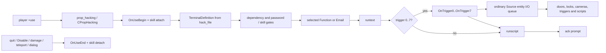
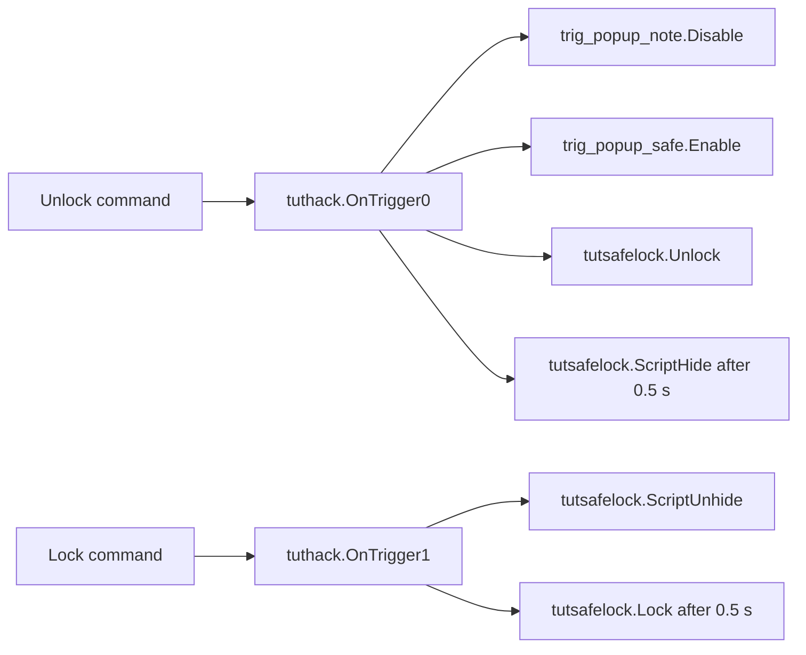

# VtMB computer terminals and hacking

This document owns the recovered behavior of VtMB's interactive computer terminals: the
`CBaseTerminal` / `CPropHacking` entity surface, the `TerminalDefinition` content model, entry and
exit, password and skill attempts, command execution, numbered outputs, email state and the
screensaver. Generic output delivery remains in `docs/vtmb/entity_io.md`; the Hacking feat remains
in `docs/vtmb/game_runtime.md` and `docs/vtmb/skills-and-checks.md`; sound resolution remains in
`docs/vtmb/audio_pipeline.md`; the serialized player record remains in
`docs/vtmb/savegame_format.md`; Python evaluation remains in `docs/vtmb/python_bridge.md`; and the
map-specific tutorial graph remains in `docs/vtmb/sp_tutorial_1-event-surface.md`.

The Unreal implementation and presentation counterpart is
`docs/architecture/computer-terminal-architecture.md`.

This is a VtMB behavior specification. Implementation priority and status live only in
`docs/project/roadmap.md`.

## 1. Evidence boundary

The native facts are recovered offline from the pinned retail `Vampire/dlls/vampire.dll` and
`Vampire/cl_dlls/client.dll`, both loaded at image base `0x10000000`. The content facts come from
the patch-first exported map and `vdata/hackterminals/` corpus that the project consumes.
Patch-first content is evidence for the active game data, not automatically an unchanged retail
authoring fact.

The reproducible extraction seeds live in `research/cases/computer-terminals/`. Generated
decompilation and game-derived data remain below `$ELYSIUM_WORK_ROOT` and never enter Git.

No live game run is required to establish the static entity, data and script contracts. A live
capture may later be useful for presentation timing; it is not a substitute for the recovered
state machine.

## 2. The system has three distinct layers



The physical map entity, the terminal content file and the ordinary Source I/O graph are separate
contracts. A terminal function may execute Python without firing an entity output, fire an output
without Python, do both, or do neither. The computer model itself does not encode the menu or the
world consequence.

## 3. Inheritance (TERM1)

**Single inheritance, contiguous layout.** `CBaseTerminal` is a `CBaseVampireSkillEntity`, which is
a `CBreakableProp` / `CBaseAnimating`. There is no multiple-inheritance join.

The constructor chain is recovered:

1. `CPropHacking` factory `0x102196a0` allocates `0xc30` bytes and calls `FUN_10219d40`.
2. `FUN_10219d40` calls `FUN_1020aa70` (`CBaseVampireSkillEntity` ctor), installs the
   `CBaseTerminal` vtable, constructs the eight `m_OnTrigger` outputs at `+0x840`, then installs
   the `CPropHacking` vtable (`0x1048a5f4`).
3. `FUN_1020aa70` calls `FUN_1018f1c0` (breakable-prop ctor), constructs the five skill outputs,
   installs `CBaseVampireSkillEntity`, and defaults `m_LastRoll = 1`, `m_vSkillType = 1`
   (Intrusion).
4. The matching destructor `CBaseTerminal::vfunc5` `0x10219f10` tears down the five skill outputs
   and `OnHealthChanged` / `OnBreak` before the animating destructor — identical to
   `CBaseVampireSkillEntity::vfunc5` `0x1020ab00`. `CPropHacking::vfunc5` `0x10219ee0` goes through
   `FUN_10219fa0`, which destroys content vectors, the eight trigger outputs, then the same skill
   outputs.

Field packing is the same chain, not a second base:

| End of | Last member | Next class starts |
|---|---|---|
| `CBaseVampireSkillEntity` | `m_OnSkillAttemptCycle` `+0x7f4` (`COutputEvent`, stride `0x18`) | `CBaseTerminal::m_bEnabled` `+0x80c` |
| `CBaseTerminal` | `m_szHackPWD[16]` `+0x82c` | `CPropHacking::m_OnTrigger[0]` `+0x840` |

`CBaseTerminal::vfunc39` `0x102181a0` calls `CBaseVampireSkillEntity::vfunc39` on `this` as a
`CBaseVampireSkillEntity *`. That is a single-inheritance upcast, not a second `this` adjustment.

`CPropKeypad` is a sibling leaf: it constructs through `CBaseTerminal` (same `+0x80c` terminal
block) and then installs vtable `0x1048b074`. It shares the session, screen and password-accept
virtuals. It does **not** share `TerminalDefinition` / `OnTrigger0..7`.

## 4. Entity classes and fields

### 4.1 `CBaseEntity` use outputs (TERM2, first half)

`OnUseBegin` / `OnUseEnd` are **`CBaseEntity` outputs**, not terminal-specific. Datamap builder
`FUN_100a22f0`; members `m_OnUseBegin` `+0x5c` and `m_OnUseEnd` `+0x74`.

The fire sites that every held-use class inherits are:

| Body | Address | Effect |
|---|---|---|
| use-begin | `FUN_100a4fe0` | `COutputEvent::FireOutput` on `m_OnUseBegin` with the player activator; stores the player's `EHANDLE` at `this+0x8c` |
| use-end | `FUN_100a5030` | fires `m_OnUseEnd`; writes `this+0x8c = 0xffffffff` |

`CBaseVampireSkillEntity::vfunc39` `0x1020acb0` (slot 39) starts with `FUN_100a4fe0`, then attaches
the Intrusion (`skilltype == 1` → feat id 0) or Hacking (`skilltype == 2` → feat id 2) interaction
component via `FUN_101e56e0`. `CBaseVampireSkillEntity::vfunc42` `0x1020adc0` (slot 42) starts with
`FUN_100a5030` and snapshots `m_nLastSkillLevel` from the same feat.

Those two bodies are the pair the old TERM2 question named (`thunk_FUN_1020acb0` /
`thunk_FUN_1020adc0`). They fire **`OnUseBegin` / `OnUseEnd`**, then attach/detach the skill
component selected by `m_vSkillType` at `+0x784`. They are not themselves the `OnTriggerN`
outputs.

### 4.2 `CBaseVampireSkillEntity`

Datamap `0x105aa150`. Skill block:

| External name | Member | Offset | Role |
|---|---|---:|---|
| `difficulty` | `m_nSkillDifficulty` | `+0x77c` | entity-level difficulty; `GetDifficulty` is vtable `+0x430` = `FUN_1020b1c0` |
| — | `m_LastRoll` | `+0x780` | result tier **and** lock state: `< 3` locked; `Lock` writes 1, `Unlock` writes 3 |
| `skilltype` | `m_vSkillType` | `+0x784` | `1` → Intrusion (feat id 0), `2` → Hacking (feat id 2); other values select no check |
| — | `m_flLastAttempt` | `+0x788` | `curtime` stamp of the last attempt / spawn |
| — | `m_nSkillAttempts` | `+0x78c` | incremented by success/fail/botch dispatch |
| — | `m_nLastSkillLevel` | `+0x790` | feat rating snapshotted on skill-entity exit |
| `OnSkillSuccess` | `m_OnSkillSuccess` | `+0x794` | fired by `FUN_1020b270` |
| `OnSkillFail` | `m_OnSkillFail` | `+0x7ac` | fired by `FUN_1020b2f0` |
| `OnSkillBotch` | `m_OnSkillBotch` | `+0x7c4` | fired by `FUN_1020b1f0`; unreachable on the skilltype 1/2 path |
| `OnSkillAttemptBegin` | `m_OnSkillAttemptBegin` | `+0x7dc` | fired by `BeginInput` `0x10217b30` |
| `OnSkillAttemptCycle` | `m_OnSkillAttemptCycle` | `+0x7f4` | fired by the shared attempt body `FUN_1020b090` |

`InputResetDifficulty` `0x1020abc0` writes `m_nSkillDifficulty` from an integer variant, clamped
to `[0, 10]`, then dispatches slot 272 (attempt-counter reset).

### 4.3 `CBaseTerminal`

Datamap `0x105af268`, ten records at `0x105af2ac`, builder `FUN_10217650`. Server vtable
`0x1048ab34`.

| External name | Member | Offset | Role |
|---|---|---:|---|
| `start_enabled` | `m_bEnabled` | `+0x80c` | whether interaction is initially available |
| — | `m_bInUse` | `+0x80d` | saved live-use state |
| `textcolumns` | `m_nScreenColumns` | `+0x810` | terminal text width; Spawn clamps to `[4, 36]` |
| `textrows` | `m_nScreenRows` | `+0x814` | terminal text height; Spawn clamps to `[2, 24]` |
| `colorscheme` | `m_nColorScheme` | `+0x818` | presentation palette selector (0–3 used by the client rasterizer) |
| — | `m_HackFlags` | `+0x81c` | replicated input-protocol bits (§8.1) |
| — | `m_nMaxInput` | `+0x820` | replicated maximum editable input length; zero means no extra cap |
| — | `m_bAllowDirKeys` | `+0x824` | replicated; Spawn zeros it; `CPropHacking` never raises it |
| — | `m_idxKeystrokeSnd` | `+0x828` | replicated client keystroke sound index; keypad spawn fills it, computers do not |
| `Enable` | `InputEnable` `0x10218080` | — | `m_bEnabled = 1` |
| `Disable` | `InputDisable` `0x102180a0` | — | `m_bEnabled = 0` (does **not** itself call exit; the next `PlayerUse` tick does) |

`m_szHackPWD[16]` at `+0x82c` is the live input / cracking buffer. Byte `+0x83c` is the
typed-versus-skill flag consumed by password fail (`0` = typed retry, non-zero = skill fail →
root). Neither `m_bAllowDirKeys` nor `m_idxKeystrokeSnd` is a datamap keyfield; they live in the
gap between `m_nMaxInput` and `m_szHackPWD` and ride the sendtable.

The class requests four typed computer sound events through its `soundgroup` during Precache
(slot 71, `FUN_10217680`): `accept`, `access`, `error`, `typing`. Those four indices are stored
in **process globals** `DAT_1074f754` / `DAT_1074f758` / `DAT_1074f75c` / `DAT_1074f760` — last
terminal to Precache wins. All current-export computers author `old_computer`, so the globals
agree. Cue sites are §14.

Spawn (vtable slot 103, the same slot as `CBaseEntity::Spawn`) is `FUN_10217880`. After the
skill-entity spawn it:

1. `SetSolid(SOLID_BBOX)` and copies the model's hull into the collision AABB;
2. `Relink`s;
3. clamps `m_nScreenColumns` into `[4, 36]` and `m_nScreenRows` into `[2, 24]`
   (`CMP 0x24 / 0x18` then a floor at 4 / 2);
4. zeros `m_HackFlags`, `m_nMaxInput` and `m_bAllowDirKeys`;
5. tail-calls slot 71 (`JMP dword ptr [vtable+0x11c]` at `0x10217a29`) — sound Precache
   `FUN_10217680`. The decompiler reported that jump as a damaged table; the listing is a
   single tail-call, not a dispatch to slot 104.

Slot 104 is the **Precache** virtual in this hierarchy (`CBaseCombatCharacter::Precache` on
NPCs; `CBreakableProp` / `CBaseTerminal` fill it with `0x1018fb50`). The entity factory
invokes it separately from Spawn. `CPropHacking` overrides it.

`CBaseTerminal` overrides no damage or kill virtual. Teardown of a live session always goes
through the player's use-release `FUN_10167fd0` (slot 42 on the held entity), not through the
terminal's own damage path. §7.3 lists every recovered caller of that release.

OnRestore (slot 130, `FUN_1020ac70`) calls `CBaseAnimating::OnRestore` and, when its extra
argument is non-zero, slot 272 — which zeros per-directory and email attempt counters and
`m_nSkillAttempts`.

### 4.4 `CPropHacking`

Datamap `0x105af464`, eighteen records at `0x105af4ac`, builder `FUN_10219770`; factory
`0x102196a0`; vtable `0x1048a5f4`. Allocated size `0xc30`.

| External name | Member | Offset | Role |
|---|---|---:|---|
| `OnTrigger0` … `OnTrigger7` | `m_OnTrigger[0..7]` | `+0x840`, stride `0x18` | command channels, not skill-result tiers |
| `hack_file` | `m_sHackFile` | `+0x900` | `vdata/HackTerminals/*.txt` content path |
| — | `m_bSubdirUnlocked[5]` | `+0x986` | saved per-directory unlock state; **five bytes only** |
| — | `m_SubDirAttempts` | `+0x98c` | growable saved per-directory attempt vector |
| `ss_delay` | `m_flSS_Delay` | `+0x9e4` | screensaver retick delay; Activate floors it at `2.0` if below `_DAT_10449400` |
| `ss_start` | `m_flSS_Start` | `+0x9e8` | idle delay before the **first post-exit** screensaver tick |
| `global_email` | `m_bHasGlobalEmail` | `+0xa10` | participates in player-global email state |
| — | `m_EmailFlags[128]` | `+0xa28` | saved per-email bitmask |
| — | `m_nEmailAttempts` | `+0xc28` | saved email-login attempt count; never read back |
| — | `m_bEmailUnlocked` | `+0xc2c` | saved email-login state |

Runtime content (not datamap keyfields):

| Offset | Role |
|---:|---|
| `+0x904` | `"screen saver"` label, `Q_strncpy` cap 64 |
| `+0x944` | `email_password`, cap 32 |
| `+0x964` | `email_username`, cap 32 |
| `+0x984` | `brackets`, cap 3 (two characters plus NUL); default rdata at `0x105b083c` |
| `+0x9a0` / `+0x9ac` | `SubDir` vector / count; record size `0xd4` |
| `+0x9b4` / `+0x9c0` | `Function` vector / count; record size `0x2b4` |
| `+0x9c8` / `+0x9d4` | `LogonScreen` line pointer vector / count |
| `+0x9dc` | current directory: `-1` root, `-2` mail, `>= 0` subdirectory index |
| `+0x9e0` | pending password target: `-1` none, `-2` root email, `>= 0` directory |
| `+0x9ec` | redraw-prompt flag; empty input and directory draw set it |
| `+0x9f0` / `+0x9f4` | mail-list cursor / open-message index (`-1` = list) |
| `+0x9f8` / `+0xa04` | visible (not deleted, dependency-passed) email index table / count |
| `+0xa0c` | mail-list page index (ten rows per page) |
| `+0xa14` / `+0xa20` | `Email` vector / count; record size `0x2c0` |

`CPropHackingSS_Think` is registered at thunk `0x10014b82`; body `0x1021a740`. Screensaver is §13.

Slot 104 (Precache) `0x1021a200` calls the breakable-prop model helper `0x1018fb50`, then
`CPropHacking::LoadFromFile` `0x1021cba0`, then **`m_vSkillType = 2`**. Authored `skilltype 1` on a
`prop_hacking` is overwritten here. The four current-map `skilltype 1` stamps are Hammer leftovers,
not a second feat path. (Keypads do not force this write.) The factory calls this virtual
separately from Spawn (slot 103); Spawn does not call it.

Activate (slot 113, `0x1021a270`) calls `CBaseEntity::Activate`, draws the logon/title through
`FUN_1021b140(this, NULL)`, arms `CPropHackingSS_Think`, sets `m_flNextThink = RandomFloat(0, 1)
+ curtime` — **not** `ss_start` — and floors `m_flSS_Delay` at `2.0` when it is below the rdata
minimum. `ss_start` is the re-arm delay used on **exit**, not first spawn.

Session-state init `FUN_1021a1c0` (constructor and every entry): `m_HackFlags = 8` (client
keystroke-sound bit), current directory `-1`, pending password `-1`, clear `m_szHackPWD`.

### 4.5 Interaction vtable (slots 32–43)

| Slot | Offset | `CBaseTerminal` | `CPropHacking` | Role |
|---:|---:|---|---|---|
| 32 | `+0x80` | `0x102180c0` | inherited | use gate |
| 33 | `+0x84` | base stub | `0x1021a590` | (prop override, 6 bytes) |
| 34 | `+0x88` | `0x10218690` | inherited | availability predicate (`IsUseable`) |
| 35 | `+0x8c` | `0x10218660` | inherited | `ObjectCaps` — bit `0x2` when the screen-facing test passes |
| 39 | `+0x9c` | `0x102181a0` | `0x1021a5b0` | entry |
| 41 | `+0xa4` | `0x102182b0` | inherited | input think (view from attachment `vfunc +0x300`, then echo) |
| 42 | `+0xa8` | `0x10218220` | `0x1021a6c0` | exit |
| 43 | `+0xac` | `0x10218320` | inherited | active-use maintenance (pin the pawn, echo) |

Password-accept virtuals on the terminal/keypad leaves (called from `FUN_10217f50`):

| Vtable offset | Slot | `CPropHacking` | Role |
|---|---:|---|---|
| `+0x448` | 274 | `0x1021cb60` | pending password string (subdir `+0x30`, or `email_password` when pending is `-2`) |
| `+0x44c` | 275 | `0x1021c4d0` | success → `FUN_1021c890` into the pending target |
| `+0x450` | 276 | `0x1021c560` | failure |
| `+0x454` | 277 | `0x1021c6a0` | cancel → redraw directory, pending `-1` |
| `+0x458` | 278 | `0x1021d610` | print the cracking / password line |
| `+0x430` | 268 | `0x1021cae0` | pending-target difficulty |
| `+0x42c` | 267 | shared `FUN_1020b090` | skill-attempt body |
| `+0x440` | 272 | `0x1021ca90` | zero `m_SubDirAttempts` and `m_nEmailAttempts`, then `m_nSkillAttempts = 0` |

## 5. Map authoring contract

A `prop_hacking` combines ordinary entity fields with the terminal-specific fields above. The
important authored keys are:

| Group | Keys |
|---|---|
| body | `model`, `origin`, `angles`, `skin`, render and shadow fields |
| availability | `StartHidden`, `start_enabled` |
| presentation | `textcolumns`, `textrows`, `colorscheme`, `ss_delay`, `ss_start` |
| content | `hack_file`, `global_email` |
| skill | `difficulty`, `skilltype` |
| audio | `soundgroup` |

The export references ten distinct `prop_hacking` models. Nine carry the `screen` material slot
and both `screen` / `screen_axis` attachments (`Elysium.Content.TerminalAttachments`). The tenth,
`models/scenery/furniture/Computer_New/monitor.mdl` (one entity, in `hw_warrens_5`), is the
decorative member of that set — the hackable ones are `monitor_hackable` /
`largemonitor_hackable` — and authors neither attachment nor the slot, so retail's cone reads
uninitialized stack on it (§7.2); the port refuses its session by name.
| outputs | `OnUseBegin`, `OnUseEnd`, `OnSkill*`, `OnTrigger0`…`OnTrigger7` |
| inputs | `Enable`, `Disable`, plus the inherited `CBaseEntity` / skill-entity inputs (`ResetDifficulty`, `ScriptHide`, …) |

`StartHidden` and `start_enabled` are different gates. `StartHidden` is the base entity's complete
inert state: no render, collision, think or use. `start_enabled` is terminal-local availability on
an otherwise present computer. `InputDisable` while a session is live does not call exit itself;
the next `PlayerUse` tick sees a failed use gate and runs `FUN_10167fd0`.

The patch-first export tree (`$ELYSIUM_WORK_ROOT/exports/<map>/<map>.ents`) contains **64**
`prop_hacking` instances on **34** maps. Earlier “20 on 12” figures were a 22-map subset of the
same corpus.

| Authored key | Census |
|---|---|
| `start_enabled` | 61 × `1`, 3 × `0` (`plus_computer`, `mitnick_computer`, one empty `hw_netcafe_1` stub) |
| `StartHidden` | 7 start hidden |
| `soundgroup` | 59 × `old_computer`, 2 × `tech_computer`, 2 × `elevator_button`, 1 blank |
| grid | 59 × 36×24; outliers `sinbin_hacking_terminal` 42×32, `la_chantry_1 haven_pc` 72×24, `la_skyline_1 haven_pc` 56×32, `plus_computer` 33×23. Spawn clamps columns to `[4,36]` and rows to `[2,24]`, so 42/56/72 become **36** and 32 becomes **24**. |
| `difficulty` | 0–8; mode 5 |
| `skilltype` | 51 × `2`, **12 × `1`**, 1 blank. Slot 104 still forces `2` on every computer. |
| `global_email` | `1` on the four `haven_pc` copies (`la_chantry_1`, `la_hub_1`, `la_skyline_1`, `sm_pawnshop_1`) |
| `use_icon` / `locked_icon` | none |
| `diceroll` | stamped on 34 rows; still a dead key |

Authored `skilltype 1` (Intrusion in the FGD, overwritten at Precache): `ch_fulab_1 server_terminal`,
`ch_shrekhub vent_terminal`, `hw_luckystar_1 plus_laptop`, `hw_warrens_5 mitnick_computer`,
`la_confession_1 plus_laptop`, one unnamed `la_museum_1`, `la_skyline_1 skyline_security`,
`sm_asylum_1 jeanette_laptop` / `therese_pc`, `sm_beachhouse_1 monitor_on`,
`sm_hub_1 bertrams_computer_on`, unnamed `sm_vamparena`.

`diceroll` is authored on many lockable and terminal entities but is absent from the retail module
as a case-insensitive string. It is a dead Hammer/FGD key, not a second switch for the skill
attempt.

### 5.1 Map I/O with other entities

Outgoing wires on the 64 instances (output **name** counts, not unique entities):

| Output | Wires | Typical targets |
|---|---:|---|
| `OnTrigger0` | 53 | Unlock / Enable / TurnOn / ScriptUnhide / Python `G.*` |
| `OnTrigger1` | 50 | Lock / Disable / TurnOff / ScriptHide |
| `OnTrigger2` | 37 | second device, camera relays, SOC “human” beam colour |
| `OnTrigger3` | 34 | cabinet / “vampire” beam colour |
| `OnTrigger4` | 3 | `hw_warrens_2` BreakerBox; `la_dane_1` rec-room Lock |
| `OnTrigger5` | 2 | `la_dane_1` `G.Dane_Cams = 1` |
| `OnTrigger6` | 1 | `la_dane_1` `G.Dane_Locks = 1` |
| `OnTrigger7` | 0 | unused in this corpus |
| `OnUseBegin` | 4 | `sinbin` camera unhide; `la_library_1` `useCard()`; `sm_medical_1` `G.Bank_Computer = 1`; plus `plus_computer` |
| `OnUseEnd` | 4 | `sinbin` camera hide; `ch_fulab_1 server_terminal` `barabusHaxxor()` / speak trigger; plus `plus_computer` |
| `OnSkillFail` | 4 | **only** `ch_fulab_1` (`hack_term_1`, `hack_term_2`, `server_terminal`): sequences and `G.Barrabus_Hacker` / `G.FuHack_fail` / `G.Barabus_Hack` |
| `OnSkillSuccess` / `OnSkillBotch` / `OnSkillAttempt*` | 0 | never authored on a computer |

A Function's `trigger` index selects among `OnTrigger0..7`. Session begin/end and skill-attempt
outputs are independent of that index. `OnSkillFail` on the fu-lab terminals is the one shipped
proof that the skill-output family is live on computers, not only on knobs.

Incoming wires that name a `prop_hacking` target (21):

| Map | Source | Output | Terminal | Input |
|---|---|---|---|---|
| `sm_bailbonds_1` | `table` | `OnNPCArrived` | `plus_computer` | `Enable` |
| `sm_bailbonds_1` | `computer` | `OnNPCArrived` | `plus_computer` | `Disable` |
| `sm_shreknet_1` | `lights_on` / `lights_off` | `OnTrigger` | `shrek_hub` | `ScriptUnhide` / `ScriptHide` |
| `sm_beachhouse_1` | `lights_on_relay` / `lights_off_relay` | `OnTrigger` | `monitor_on` | `ScriptUnhide` / `ScriptHide` |
| `sm_beachhouse_1` | two `prop_dynamic` | `OnBreak` | `monitor_on` | `Kill` |
| `hw_warrens_5` | `intersting_place` | `OnNPCArrived` / `OnNPCLeft` | `mitnick_computer` | `Skin` |
| `sp_soc_1` | `h_beam_hack` `OnBreak`; `h_beam_trigger` `OnTrigger` | | `h_beam_terminal` | `ScriptHide` |
| `sp_soc_2` | each `beam_N_hack` `OnBreak` and `beam_N_trigger` `OnTrigger` | | `beam_N_terminal` | `ScriptHide` |

`Enable`/`Disable` of a live session still end it on the next `PlayerUse` tick (§7.1). `ScriptHide`
is the generic hidden-state path in `docs/vtmb/entity_io.md` (blocks further inputs except
`ScriptUnhide`). `Kill` removes the entity; a held session then depends on `FUN_100db7a0` or a
stale-handle `PlayerUse` tick. `Skin` on `mitnick_computer` is a presentation swap, not a
terminal-class input.

Worked I/O graphs for `tuthack` and `sp_theatre` remain in §17–§18. SOC beam terminals are the
largest `OnTrigger0..3` fans (TurnOn/Off, Color, trigger flags, sounds). Museum security cameras
are the largest `OnTrigger0/1` Enable/Disable + NPC hide/unhide fan.

## 6. `TerminalDefinition` content

`CPropHacking::LoadFromFile` `0x1021cba0` constructs a KeyValues tree named `TerminalDefinition`
and reads `hack_file`. `vdata/hackterminals/` contains 57 patch-first text files. Most have root
`TerminalDefinition`; `prop_keypad.txt` instead has root `keypad_strings` and is a separate
keypad-title table consumed by `CPropKeypad::LoadTextStrings` `0x1021da40`.

The loader's exact keys and caps:

```text
TerminalDefinition
{
    "screen saver"   "..."          ; 64 bytes at +0x904
    "brackets"       ".."           ; 3 bytes at +0x984
    "email_password" "..."          ; 32 bytes at +0x944
    "email_username" "..."          ; 32 bytes at +0x964

    LogonScreen { "line0" "..." ... }   ; unbounded pointer vector at +0x9c8
                                        ; stops at the first missing/empty lineN

    SubDir
    {
        "name"         "..."        ; 16 bytes, Q_strnlwr
        "description"  "..."        ; 32 bytes
        "password"     "..."        ; 16 bytes
        "dependency"   "..."        ; 64 bytes at record +0x44
        "difficulty"   "..."        ; int, default 0, at record +0x40

        Function                    ; at most 20 per directory (i < 0x14)
        {
            "name"        "..."     ; 16 bytes, Q_strnlwr
            "description" "..."     ; 32 bytes
            "runtext"     "..."     ; 512 bytes at record +0x30
            "dependency"  "..."     ; 64 bytes at record +0x230
            "runscript"   "..."     ; 64 bytes at record +0x270
            "trigger"     "0"       ; int, default -1, at record +0x2b0
        }
    }

    Email                           ; unbounded; 0x2c0-byte records
    {
        "subject"     "..."         ; 32, default "this email has no subject"
        "sender"      "..."         ; 32, default "this email has no sender"
        "body"        "..."         ; 512, default "this email has no body"
        "dependency"  "..."         ; 64 at record +0x240
        "runscript"   "..."         ; 64 at record +0x280
    }
}
```

The data's exact key is `"screen saver"` with a space. `autodelete` appears in shipped files (for
example `haven_pc.txt`) and is **not** one of the five `Email` keys the loader reads. §12 has the
deletion path.

Several files also author `"difficulty"` on the **TerminalDefinition root** (`soc_int_hack`,
`soc_ext_hack`, `museum_computer_2`/`3`, `netcafe_computer` and `_2`/`_3`). `LoadFromFile` never
reads a root `difficulty`; only each `SubDir`'s `difficulty` and the entity keyfield
`m_nSkillDifficulty` participate.

Native limits versus the embedded authoring guide `hack_charlimits.txt`:

| Field | Guide | Loader |
|---|---:|---|
| screensaver label | 64 | 64 |
| brackets | 2 | 3-byte buffer (2 + NUL) |
| email username/password | 32 | 32 |
| subdirectory/function name | 15 | 16-byte buffer (15 + NUL), lowercased |
| description | 30 | 32-byte buffer |
| run text / email body | 512 | 512 |
| dependency / runscript | 64 | 64 |
| trigger | one digit 0–7 | `GetInt`, default `-1`; executor accepts 0–7 |
| subdirectories | 5 | **unbounded vector**; unlock flags are only five bytes at `+0x986` |
| functions per directory | 6 | **20** (`iStack_668 < 0x14`) |
| terminal outputs | 8 | 8 (`m_OnTrigger[0..7]`) |
| emails | (unspecified) | unbounded vector; flag array is 128 |

A sixth subdirectory parses and can be named, but `m_bSubdirUnlocked[index]` for `index >= 5`
writes past the five-byte array. That is a retail buffer; shipped files stay inside five.

`LoadFromFile` failure (`Warning("Could not load data for %s!!\n")`) still leaves `m_vSkillType = 2`.

The patch script `vamputil.py` read-modify-writes `vdata/hackterminals/haven_pc.txt` to put the
player's name into the haven mail client. That filesystem behavior belongs to
`docs/vtmb/python_bridge.md`; the terminal consumer must tolerate the resulting patch-first file.

## 7. Interaction lifecycle

### 7.1 `+use` dispatch

The control layer binds `E` to `+use` (`IN_USE` bit `0x20`). Server dispatcher
`CBasePlayer::PlayerUse` `0x10167850`:

1. If `m_hInteractiveUseTarget` (`player+0x1040`) is live, call slot 32 (use gate). **A failed
   gate immediately runs `FUN_10167fd0` (release / slot 42) and returns.** This is how
   `InputDisable`, a failed screen-facing test, or a lost player component ends a live session.
2. If no `IN_USE` edge/level and a target is still held, `FUN_10167e00` (maintenance). It runs
   from a **second site** as well: inside the `IN_USE` arm, for a held button with no rising edge
   — so maintenance runs every tick of a session regardless of the key. `FUN_10167e00`
   (`0x10167e00`) measures `d = |eye.x − p.x| + |eye.y − p.y|` (Manhattan XY) from the player's
   eye to the point clamped onto the held entity's collision box (`FUN_1013c8c0`) and compares it
   with slot 37, the entity's use range — `CBaseTerminal` inherits `CAISound::FUN_10026710` =
   `_DAT_104454c8` = **`80.0f`**. `range <= d` selects **slot 43 (the hull-sweep pin, the far
   arm)**; otherwise slot 36 (required weapon; terminals inherit none) picks **slot 41 (the near
   arm: view-angle snap)**, or slot 40 after a weapon switch. Once the player stands at the
   machine the near arm is what runs every tick.
3. On `IN_USE`, skip if a Protean-transform handle is live or `FUN_10167370` reports another
   exclusive session. Target acquisition: existing handle, then `FUN_104115b0`, then
   `FUN_10167470` (cosine cone, range `0x42a00000` = 80.0 units, with a second straight probe
   at `eye + forward * 160` — a separate reach from the cone), then `player+0x1cb8` /
   `+0x1cbc` fallbacks.
4. On a rising `IN_USE` edge with no current handle, `FUN_10167d70` re-checks slot 32, writes both
   handles (`player+0x1040` and `entity+0x8c`), and dispatches slot 39 (entry).
5. On a rising edge with a current handle, slot 44 (`+0xb0`) decides whether to release.
   `CBaseTerminal` inherits `CAISound::FUN_100267b0` = `return 1`, so a second `+use` press
   **always** releases a terminal. `vtmb_slot 44`: every entity class holds that base; the one
   entity override is `CGameSign::vfunc44 0x10212600` = `return 0`. The port's
   `FElysiumEntity::ReleasesOnSecondUse` defaults to true accordingly.

### 7.2 Use gate, availability, screen-facing

Use gate `0x102180c0` requires:

- `m_bEnabled`;
- a non-null requester with the player component at `param+0xa8` (`param_1[0x2a]`);
- either no current user at `this+0x8c`, or that user **is** the requester (re-entry of the same
  player is allowed; a different actor is rejected);
- a positive screen-facing test `FUN_10218710`.

Availability `0x10218690` is stricter: `m_bEnabled`, **no** current user at all, and the same
screen-facing test. `ObjectCaps` `0x10218660` returns bit `0x2` iff the screen-facing test
passes, else 0.

`FUN_10218710` (listing, not the overlapping decompiler stack) reads the model's `screen` and
`screen_axis` **attachments** through `CBaseAnimating::GetAttachment01` (`0x10092e20`;
scope-trace string `0x1054fb5c`). `GetAttachment01(name, &origin, &angles)` is
`GetAttachment02(LookupAttachment(name), …)`: the **name is resolved on every call**, nothing is
cached at Spawn or Precache, and on a miss `GetAttachment02` returns 0 and **writes neither
out-parameter**, so a model without either attachment makes the cone read uninitialized stack —
retail has no missing-attachment handling (the port refuses the session with a named content
error instead; §8.7). Screen-forward is `screen_axis.origin - screen.origin`, normalized in **3D**
(`VectorNormalize`), and only its `.xy` is used afterwards, **un-renormalized** — a `screen_axis`
with a Z offset shortens the XY part and widens the cone. Player vtable `+0x304` (slot 193, `FUN_100b4b40` on the common entity table)
writes **eye position** (`GetAbsOrigin` via `+0x364` plus `m_vecViewOffset`) into an out-vector.
`FUN_101d1120` then takes `(screen.origin, eye, normalized screen-forward)` and returns the 2D
XY cosine

```text
normalize(eye.xy - screen.origin.xy) · screen_forward.xy
```

That value must **strictly** exceed `_DAT_10457f54` = **`0.7f`** (`vampire.dll` `0x10457f54`; the
same cosine used by `CGameMovement` and `CWeaponMelee::RequestActivity`). `arccos(0.7) ≈ 45.6°`.
A zero-length XY eye vector (the eye exactly over the screen point) returns `0` and fails.
It is a **plan-view position cone in front of the screen**, not a view-vector facing test. No
bodygroup, material or brush participates.

Icon eligibility is `PlayerUseIconFilter` (`FUN_10342590`): pass when **any** of slot 32, slot 35
(non-zero) or slot 34 (non-zero) succeeds. A terminal is therefore icon-eligible exactly when it
is usable. The client's `CHudUseIcon` (`FUN_1005e4a0`) reads `m_targetEntityIcon`; value `0x49`
loads a named custom icon, a value below `0x4a` indexes the stock table, and the body
unconditionally creates `hud/new_ui/useicon` as fallback. An unauthored `use_icon` yields the
plain default use icon — never a text hint and never an absent prompt.

### 7.3 Entry and exit (OnUseBegin / OnUseEnd / player modes)

`CPropHacking` entry `0x1021a5b0`:

1. `FUN_1021a1c0` (flags, directory `-1`, pending `-1`, clear buffer);
2. `CBaseTerminal::vfunc39` `0x102181a0`:
   - `CBaseVampireSkillEntity::vfunc39` → **`OnUseBegin`** (`FUN_100a4fe0`) and skill-component
     attach for whatever `m_vSkillType` currently is (already forced to 2);
   - `FUN_101f5950` plays `access` (`DAT_1074f758`);
   - `FUN_1015ef40(player)` writes `CBasePlayer::m_bIsImmobilized` (`+0x19f7`) = 1;
   - `FUN_10181580(player, 1)` ORs bit `0x1` into `CBasePlayer::m_iVFlags` (`+0x1d60`);
   - `m_bInUse = 1`;
   - clear `m_szHackPWD`;
3. `LoadGlobalEmailState`;
4. `ThinkSet(NULL)` — screensaver cancellation;
5. `FUN_1021aca0` directory draw and `FUN_1021b410` prompt;
6. `FUN_10070470("Hacking", NULL, terminal, terminal, NULL)` creates a `camera_cinematic`
   (`0x10070470`), loads the `Hacking` shot from `vdata/camerashots/special-case.txt`, and binds
   the terminal as Named slots 1 and 2. `FUN_1017cef0(player, cam)` stores that camera at
   `player+0x1ec4` / `+0x19b4`. The shot sits on attachment `screen_axis`, looks at attachment
   `screen`, FOV 75, `ShowHud 1`, `DrawViewmodel 0` (`docs/vtmb/camera-view-modes.md`);
7. a scan of the global stat table (`DAT_10739d24`, count `DAT_10739d20`) for the stat whose
   type word is `2`, then `FUN_101e56e0(stat, player)` = `CVStat::GetEffectiveValue` — the
   player's effective Hacking value, whose `uint` return is **discarded** (`RET 4` follows).
   Dead work; not ported.

`FUN_10167d70` writes **both** handles (`player+0x1040`, `entity+0x8c`) before dispatching slot
39, and `FUN_10167fd0` dispatches slot 42 **before** clearing `entity+0x8c`, so both the entry and
the exit body can resolve the user (which is what lets exit's `FUN_10218820(this, 2, 0)` find its
recipient). In `FUN_1017cef0`, `player+0x1ec4` is the camera's **engine entity index** (`0` when
cleared) and `player+0x19b4` its **`CBaseHandle`** (`-1` when cleared); the function removes the
previous camera entity when it differs and carries `EFL` bit `0x4`. The `Hacking` shot is not a
snap: `MoveSpeed 300`, `MoveAccel 250`, `MaxTurnRate [200,200,200]`, `TurnAccel 180`,
`DistanceTolerance 1`, `AngularTolerance [1,1,1]` — an ease-in on entry and **no ease-out on
exit** (the camera entity is simply removed; nothing is saved and nothing is restored, the client
falls back to the player's own eye). Nothing on the entry path touches exposure, tonemapping or
any `mat_` cvar (`xposure` matches no string in any module): the port's exposure clamp is a named
modernization with no retail counterpart.

`CPropHacking` exit `0x1021a6c0`:

1. `SaveGlobalEmailState`;
2. `CBaseTerminal::vfunc42` `0x10218220`:
   - `FUN_10218820(this, 2, 0)` — hide the `InfoCtrl` HUD hint (§8.4);
   - `FUN_1015ef60(player)` writes `m_bIsImmobilized = 0`;
   - `FUN_101815b0(player, 1)` and `FUN_101815b0(player, 8)` clear **both** `m_iVFlags` bits `0x1`
     and `0x8` (entry only set `0x1`; bit `0x8` is the view-angle lock raised by signs and other
     held-use classes, cleared here defensively);
   - `m_bInUse = 0`;
   - `IEngineSoundServer003` (`DAT_1070b248`) slot 5 (`+0x14`) called with
     `engine->vfunc(0x8c)(terminal edict, 0)`. engine.dll `CEngineSoundServer::vfunc5`
     (`0x20002050`) → `FUN_200ef880(filter, entIndex, channel 0, flag arg2)` writes net message 6
     with sub-type 2 (the `SV_StartSound` id with no sample name), 11 bits of entity, 3 of channel
     and one flag bit; `vfunc5(ent, 0)` clears the use-channel bit, so it **stops every sound the
     terminal is playing**. Ported as `IElysiumAudio::CancelAudioOwner` on the terminal's cue owner;
   - `CBaseVampireSkillEntity::vfunc42` → **`OnUseEnd`** (`FUN_100a5030`) and skill-component
     detach;
3. `ThinkSet(CPropHackingSS_Think)`, `m_flNextThink = m_flSS_Start + curtime` (**unfloored**;
   the `2.0` floor is Activate-only, §13);
4. `FUN_1021b140(this, NULL)` (idle title);
5. current directory and pending password = `-1`;
6. `FUN_1017cef0(player, NULL)` — drop the `camera_cinematic` (and `FUN_101cd940` if its
   `EFL` bit `0x4` is set).

#### Player mode fields (TERM9)

`m_bIsImmobilized` (`CBasePlayer+0x19f7`) is a replicated sendtable bool. The query
`FUN_1015ef20` returns true when the byte is **0** (mobile).

| Writer | Effect |
|---|---|
| `FUN_1015ef40` (terminal / keypad / sign / dialog entry) | byte = 1 |
| `FUN_1015ef60` (matching exit) | byte = 0 |

Readers of the query:

- `CPlayerMove::SetupMove` `0x10186120` — if immobilized, mask the usercmd button word with
  `~DAT_10589050`, and later **zero wish velocity** (together with `FL_FROZEN` bit `0x40`);
- `CGameMovement::vfunc17` `0x101226b0` and `CGameMovement::Duck` `0x10126fd0`;
- `CBaseCombatWeapon::FUN_10253ea0` and `CWeaponMelee::ItemPostFrame` `0x103eaec0`.

So a terminal session **strips a button mask and zeroes wish movement**. It does not go through
`player_immobilize` / `m_iPlayerLocked` (`+0x2304`). Adjacent byte `+0x19f6` is a different latch
owned by `docs/vtmb/player-entity.md` (PostThink skip); terminals do not write it.

`m_iVFlags` (`CBasePlayer+0x1d60`):

| Bit | Terminal write | Readers |
|---|---|---|
| `0x1` | OR on entry, AND-clear on exit | `SetupMove`: when set, take origin from the special entity/animation path instead of the usercmd (the pin in slot 43 is what actually moves the pawn; this bit keeps SetupMove from fighting it). Compact-code 8 in `docs/vtmb/animation_and_movers.md` also reads bit 1 as a feeding-release activity select — a **second consumer of the same word**, not a terminal animation. |
| `0x8` | AND-clear on exit only | `SetupMove`, `CPlayerMove::RunCommand` `0x101874a0`, `CBasePlayer::ProcessUsercmds` `0x1016aaf0`: when set, ignore usercmd viewangles and keep the stored eye angles. Raised by `CGameSign` use-begin `FUN_10212810` together with immobilized + bit `0x1`. Terminals do not set it; they still clear it. |

Active-use slot 43 `0x10218320` (the **far** arm of §7.1 step 2; listing read 2026-09-07,
`$ELYSIUM_WORK_ROOT/_terminal_explore/slice-bc-decompiles.md` §1) has one early-out, a NULL user.
It reads the player origin (slot `+0x364`) and the terminal origin, the player's collision
`OBBMins`/`OBBMaxs`, and inlines `Ray_t::Init(start = playerOrigin, end = (terminal.x,
terminal.y, **player.z**), mins/maxs = the player's own OBB)` — an XY-only hull sweep at the
player's own height (`Ray_t` here is the unaligned 12-byte-Vector layout with a fourth
Bloodlines-only bool at `+0x33`, set when `sqrt(ext.x² + ext.y²) > 1e-6`). It installs
`CTraceFilterSimple(player, COLLISION_GROUP_PLAYER = 3)` (`FUN_101d3190`) and traces with
`0x0201400b` = **`MASK_PLAYERSOLID`** (`SOLID | WINDOW | GRATE | MOVEABLE | PLAYERCLIP | MONSTER`),
so the terminal's own `SOLID_BBOX` is what stops the sweep. Then, **unconditionally** — there is
no start-solid test and `trace.fraction` is never read; the only conditional in the tail guards a
debug overlay line on the shared debug ConVar `0x10738964` — it writes the player's origin to
`trace.endpos` through slot 216 (`+0x360`, `SetAbsOrigin`) and `CBaseEntity::Relink`s **the
player**. The hull is swept toward the computer until contact: the session holds the pawn against
the terminal, and distance never ends it. A non-empty `m_szHackPWD` then runs the echo / cracking
stepper `FUN_10217d60`.

The **near** arm, slot 41 `0x102182b0`, calls slot 192 (`+0x300`) on the terminal —
`CAISound::FUN_10027160` = **`WorldSpaceCenter()`**, the collision-OBB centre, not an attachment
— and hands it to `FUN_10178590(player, target)`: `dir = target − EyePosition()`,
`VectorNormalize`, `VectorAngles`, `FUN_10178550(player, angles)` — it **snaps the player's eye
angles at the terminal's bounds centre every tick** while the player is within 80 units. Terminals
never set `m_iVFlags` bit `0x8`, so the usercmd view angles still arrive each tick and this
re-snaps over them. It likewise steps `FUN_10217d60` when the buffer is live.

### 7.4 Forced-exit paths (TERM2, second half)

`FUN_10167fd0` is the one release: slot 42 on the held entity, `entity+0x8c = -1`, optional
weapon holster/restore, `m_hInteractiveUseTarget = -1`.

Recovered callers:

| Site | Address | When |
|---|---|---|
| `CBasePlayer::PlayerUse` | `0x10167850` | use-gate fail while held; slot-44 release on a second `+use` press |
| `CPropHacking` builtin `QUIT` | `FUN_1021aaa0` | localized `Hacking Strings` index 33 |
| `CPropKeypad::vfunc273` | `0x1021deb0` | quit token or the second keypad cancel token |
| `CBasePlayer::vfunc142` | `0x10163020` | **`OnTakeDamage`**: releases the held use **before** applying damage. Any damage interrupts a terminal session, not only death. |
| `CBasePlayer::FUN_10178280` | `0x10178280` | starting a dialogue: release, then immobilize and holster |
| `CPointTeleport::InputTeleport` | `0x1018dc00` | teleport of the player |
| `FUN_100db7a0` | `0x100db7a0` | engine callback: one argument → release the local player; two arguments → release only if the held entity's edict index matches `atoi(arg1)` (entity-removed / level-transition helper) |
| `CGameSign::InputOpenWindow` / `InputCloseWindow` / sign slot 41 | `0x102126c0` / `0x10212790` / `0x10212c00` | sign session steals or ends use |
| `CWeaponGravityGun::vfunc327` | `0x1014dd50` | physcannon |
| `CPhysicsPropContested::vfunc39` | `0x10192e60` | contested-prop use |
| `FUN_10170090` | `0x10170090` | (player helper that also releases) |
| `CPropSign::vfunc41` | `0x10211e00` | sign use-think |
| `CPropKeypad::vfunc41` | `0x1021de70` | keypad use-think |
| `FUN_102252f0` | `0x102252f0` | slot 41 of `CPropDoorknob`, `CPropPadlock`, `CPropDoorknobElectronic`, `CItemContainerLock` |
| `FUN_10224fa0` | `0x10224fa0` | lock-family helper (no recovered caller) |
| `FUN_1040e9c0` / `FUN_10410bf0` | `0x1040e9c0` / `0x10410bf0` | NPC melee-approach bodies: release, restore the weapon, return |

All 28 `thunk_FUN_10167fd0` hits route through thunk `0x10014a6a` into the one body, and
`PlayerUse` carries **two** release sites in its own body.

There is no terminal-local death, kill or `UpdateOnRemove` override. Killing the computer while
the player is in session relies on `FUN_100db7a0` (edict match) or on the next `PlayerUse` tick
seeing a stale handle. Map travel goes through the one-argument arm of `FUN_100db7a0`.

## 8. Client protocol

### 8.1 `C_BaseTerminal` and `hackcmd`

The client class is `C_BaseTerminal`, registered through `DT_BaseTerminal`. This is not a named
VGUI terminal panel: the entity owns a character-cell screen rasterized into a 512×512
client-effect texture named `monitor` (`FUN_100c7720` creates/refreshes; `FUN_100c77f0`
software-rasterizes the cell buffer, glyph table, selected color scheme and cursor). Default
active grid 36×24; a 1,728-byte buffer at client `+0x7b4` holds 864 two-byte character/style
cells. Color scheme is clamped to `0..3` (`client+0xf08`).

Replicated: `m_bInUse`, columns, rows, color scheme, `m_HackFlags`, `m_nMaxInput`, keystroke
sound, direction-key permission.

The patch-first export uses ten computer models across its 64 `prop_hacking` instances (37×
`monitor_useable.mdl`, then laptops, military computers, `Computer_New` monitors, one sewer
screen, one apple monitor). Every exported model in that set assigns its display triangles to a
separate material named `screen`. That is a content fact about the present corpus.

Client input is two functions, not one.

**Key-down** is vtable `0x102334ac` slot 25, `0x100c7090`. Backtick (`0x60`) returns 0 (unhandled,
so the console can take it). Not-in-use (`+0xf04 == 0`) also returns 0. Ctrl (`0x85`) latches a
chord; the next `c` (`0x63`) sends `hackcmd break`. Printable ASCII `0x20..0x7e` returns 1
**without inserting** — the key is eaten so it does not reach the player, and the character
path below does the insert.

**Character insert** is `FUN_100c6d50` (wrapper `FUN_100c6b10` skips a null `this`). Entity-message
type 3 (`FUN_100c82e0`) is what **registers** that wrapper with the engine (`vtable +0x2c`); type 3
from `FUN_10219120` is therefore “enter line-edit”, not only “clear ack/raw bits”. It ignores
backtick, not-in-use, and the control codes `8` / `9` / `10` / `13` / `27`. Otherwise it inserts
`param_1` at the cursor in the `+0xed8` line, rasterizes through `FUN_100c8060`, and plays the
local keystroke click when flag `0x8` and `m_idxKeystrokeSnd` are set. `m_HackFlags` bit `0x2`
restricts insert to digits `'0'..'9'`. In ack mode (bit `0x1`) the only character it still
forwards is `0xa9` → empty `hackcmd`.

Key-down specials:

| Client action/state | Server command |
|---|---|
| Enter (`0x0d` / `0xa9`) in normal line mode | `hackcmd <edited line>` |
| Escape (`0x1b`) in normal/raw mode | `hackcmd quit` |
| Ctrl-C chord | `hackcmd break` |
| each key while flag `0x4` is set | `hackcmd %c` |
| Enter / `0xa9` / Escape while flag `0x1` is set | `"hackcmd "` at client `0x102b7210` |
| arrows / home / end | local cursor only, and only if `m_bAllowDirKeys` |
| backspace (`0x7f`) | local delete |

`m_HackFlags` bit `0x4` is raw-character transport, bit `0x1` is continue/acknowledge mode, bit
`0x8` enables the local keystroke click. `m_nMaxInput` gates further insertion. Server helpers:

| Helper | Address | Effect |
|---|---|---|
| `FUN_10219120` | `0x10219120` | entity-message type 3, then `m_HackFlags &= ~0x5` (clear `0x1\|0x4`) |
| `FUN_10219240` | `0x10219240` | that, then set `0x4` |
| `FUN_10219270` | `0x10219270` | that, then set `0x1` |

The per-keystroke click in `0x100c7090` additionally requires a non-empty `m_idxKeystrokeSnd`
string at client `+0xf18`. `CPropKeypad` spawn `0x1021d9d0` fills that index from the named sound
`Environmental Electronic pad key…`. `CPropHacking` never writes `+0x828`. Computers therefore
raise flag `0x8` on entry (`FUN_1021a1c0`) but the client click has nothing to play; the
server-side `typing` soundgroup event is a different cue (§14).

`hackcmd` is a server `ConCommand` registered at `FUN_100dace0` (`cvar_hackcmd` at `0x106e7340`,
help `"Command to current hacking console"`). The callback label `LAB_1000eab6` is not a
recovered function start. The only consumer of the command string is
`CPropHacking::AcceptCmd` `0x1021a830` (and the keypad's slot-273 equivalent).

#### 8.1.1 The client line editor, line by line (TERM20, 2026-09-07)

- Both input bodies (`0x100c7090` key-down, `FUN_100c6d50` char insert) return early unless the
  local line editor is **active** (`+0xe88`). Entity-message type 3 (`FUN_100c82e0`) activates it
  only when it is not already active: it saves the cursor's whole row into `+0xe90`, records the
  cursor column as the edit origin `+0xe8c`, clears the local line `+0xed8`, sets `+0xe88 = 1`.
  Type 4 (clear) and scroll (`FUN_100c8210`) clear `+0xe88`.
- Arm order in `0x100c7090`: Ctrl chord (latched `0x85` then `c` → `hackcmd break`) → raw mode
  (`m_HackFlags & 0x4`: `hackcmd %c` per key) → acknowledge (`0x1`: Enter **and** Escape send
  `DAT_102b7210` = `"hackcmd "` with the trailing space; Escape is *not* `quit` there) → the line
  editor (Enter sends the line, Escape sends `hackcmd quit`, Backspace edits, printables are
  eaten so they never reach the movement binds; backtick is left unhandled).
- `m_nMaxInput == 0` is unlimited: `if (m_nMaxInput != 0 && strlen(line) >= m_nMaxInput) return;`
  in both bodies. `m_bAllowDirKeys` is `CBaseTerminal+0x824`, replicated, and `CBaseTerminal::Spawn`
  `0x10217880` is its **only writer** in `vampire.dll` — it is never raised, so arrows/Home/End are
  always ignored.
- `FUN_100c6d50` refuses only `0x60` and `8/9/10/13/27`; the `0x20..0x7e` range is the key-down
  eat, not a character-path check. Every keystroke restores the saved row and re-walks the whole
  line through put-char from the edit origin, **inside**
  `if (strlen(line) + editOrigin < columns - rightMargin)`: an over-long keystroke is discarded
  whole — the local editor never wraps and never scrolls. Password characters are inserted
  literally; there is no masking.
- `CBaseTerminal::Spawn` also clamps columns `[4,36]` and rows `[2,24]` and zeroes `m_HackFlags` /
  `m_nMaxInput`; `m_nColorScheme` (`+0x818`, 4 bits) is clamped `0..3` on the client only.

### 8.2 Server → client screen messages

Screen mutation is an entity message (filter `CEntityMessageFilter`) with a type byte:

| Type | Producer | Payload | Role |
|---:|---|---|---|
| 1 | `FUN_10218ff0` | two coords | set cursor |
| 2 | `FUN_102189e0` via `FUN_10217ac0` | string, chunked at 250 bytes | print |
| 3 | `FUN_10219120` | — | leave ack/raw mode |
| 4 | `FUN_10218db0` | — | clear cells |
| 5 | `FUN_10218ca0` | — | style A |
| 6 | `FUN_10218b90` | — | style B |
| 7 | `FUN_10218ec0` | extra coords | reset/clear screen |
| 9 | `FUN_102192a0` | one character | per-character echo during cracking |

`FUN_10218820(this, type, value)` is **not** a screen message: it is the `InfoCtrl` HUD hint
usermessage (§8.4). `FUN_10217ac0` `vsnprintf`s into a 512-byte scratch at `DAT_1074f178` and
then type-2 prints it — ordinary C formatting, so a `%c` given a NUL byte terminates the string
there (§8.5 shows this on the tutorial's empty `brackets`).

`FUN_1021b140` is the title/logon box: types 7+4 clear, centers either the `LogonScreen` lines
(when the title pointer is null) or a single title string, with a one-cell margin.

### 8.3 Client screen buffer (TERM15)

The client screen is a real character terminal, not a list of lines. `C_BaseTerminal` owns a
cell buffer at `+0x7b4` with a **fixed stride of 36 cells (`0x48` bytes) per row** regardless of
the replicated column count; the active grid is `+0x7ac` columns × `+0x7b0` rows. Each cell is a
`ushort`: the low 7 bits are the ASCII code, bit `0x80` is the **style bit** (inverse/alternate
palette), and a high byte selects an extended glyph from a 45-entry table at `0x102b7110`. Cursor
column is `+0xe78`, cursor row `+0xe7c`, the **left margin** `+0xe80` (where a newline returns to),
the current style byte `+0xe74`, and `+0x7a8` is the dirty flag that re-rasterizes.

`FUN_100c8060` is put-char, the one consumer of every printed byte (type-2 prints, type-9 echoes and
the local line editor all land here):

| Byte | Effect |
|---|---|
| `0x7f` | backspace: clear the cell under the cursor; if the cursor is at or left of the margin, move to the last column of the previous row, else one column left |
| `0x0d` / `0x0a` | newline: row + 1, column = margin; if the row reaches `rows - 1`, scroll one row (`FUN_100c8210(1)`) and stay on `rows - 1` |
| `0x1b..0x7e` | printable: if column `>= columns`, emit a newline first (**wrap**); write `char \| style`; column + 1 |
| `>= 0x80` | extended glyph: same wrap; high byte is the glyph index, low byte the style |
| anything else | ignored |

`FUN_100c8210(n)` is scroll-up: `n >= rows` clears everything (`FUN_100c7f50`); otherwise it
`memmove`s rows `n..` to the top, fills the vacated bottom rows with `style | ' '`, moves the
cursor row up by `n` (clamped) and clears the edit flag at `+0xe88`.

`FUN_100c77f0` is the software rasterizer (`CTextConsoleProxy::vfunc1` → `FUN_100c7720` refresh):
512×512 RGBA, 14×16-pixel glyphs from a bitmap table at `0x10232ee8`, the four colour schemes as
`0x14`-byte records at `0x10233378` selected by `+0xf08` clamped to `0..3`, the style bit XOR-ing
the foreground/background pair, and the cursor drawn as glyph `0x44` at `(+0xe78, +0xe7c)` only
while in use with the line editor active (`+0xe88` set and flag bit 1 at `+0xf00`). A blank row
between glyph rows is a half-intensity blend of its neighbours (the retail "scanline").

The consequence for a port: the server's screen messages (§8.2) are a stream into this put-char,
so the authority must own an equivalent cell grid with wrap, scroll, margin and style, and the
screensaver, prompts and directory draws are cursor writes into it. The 14×16 glyphs, the four
palettes and the blended scanline are presentation and are not reproduced.

### 8.4 The `InfoCtrl` HUD hint (TERM16)

`FUN_10218820(this, type, value)` sends the **`InfoCtrl`** usermessage (id `DAT_10726070`,
registered at `FUN_10350340`, shared with `CGameText::InputDisplayWindow` / `InputCloseWindow`)
reliably to the current user, with a type byte and an integer. The client handler `FUN_10055d30`
(a `CHud…` element drawing one line bottom-centre in the HUD font, as `03-password-prompt.png`
shows) resolves:

| Type | Client effect |
|---:|---|
| 0, 2 | hide |
| 1 | show the raw string carried in the message (`CGameText`) |
| 3 | show `Hacking_Strings[0]` "Press CTRL-C to use the Hacking feat" |
| 4 | `Hacking_Strings[37]` "Difficulty: " + value |
| 5 | `Hacking_Strings[40]` "Making hack attempt at skill " + value |
| 6 | `Hacking_Strings[38]` "Skill too low to make hack attempt at difficulty " + value |

Terminal producers (listings): `CBaseTerminal::vfunc42` exit → `(2, 0)`; `AcceptCmd` before the
mail and directory routers → `(2, 0)`; typed submit `FUN_10217f50` → `(2, 0)`; the password
prompt `FUN_1021b5e0` → `(3, 0)` on **every** render, first and retry; `BeginInput` → `(5,
rating)` after the `typing` cue; password fail `0x1021c560` → `(2, 0)`, then on the skill-flagged
arm `(6, GetDifficulty())` before returning to root. No terminal body sends type 4. The hint
therefore reads "Press CTRL-C…" for the whole password prompt, switches to "Making hack attempt at
skill N" while the cracking buffer runs, and clears on the next accepted line or on exit.

### 8.5 Draw bodies confirmed against retail captures

Six owner captures of `tuthack` (widescreen retail) are under
`$ELYSIUM_WORK_ROOT/_terminal_explore/retail-shots/`. Joined with the listings:

**Title box `FUN_1021b140(this, title)`.** Types 7 + 4 clear, then `FUN_1021b2b0` draws a rule row
(`+` at column 0 and `columns - 1`, `-` between), `FUN_1021b330(text, margin)` draws a framed row
(`|` at both edges, text at the margin), and the sequence is: rule, empty framed row, one framed
row per title line, empty framed row, rule — **five rows** for a one-line title. The margin is
`(columns - longestLine - 2) / 2`, floored at 1 when that is below 3, so the title is centred.
With `title == NULL` the `LogonScreen` lines are the body ("Welcome, Jack."); otherwise the single
string (a directory `description`, "Password required", "PASSWORD FAILED", "Help information").

**Directory draw `FUN_1021aca0`.** Title box (root: logon lines; directory: its `description`);
if emails exist, string 31 "You have %d emails, %d are unread."; root: string 43 "Home menu",
directory: string 44 "Menu" with the directory name first-letter-uppercased (format at
`0x105b0630`); blank; string 2 "Available menus:"; entries indented (`0x105a1eec`): string 30
`email` if emails exist, string 17 `home` when not at root, then every *other* directory whose
dependency passes, by its lowercased name; blank; string 3 "Available commands:"; the current
directory's dependency-passing functions; **at root only**, string 34 `help` and string 33 `quit`.
Sets the redraw-prompt flag. `01-home-menu.png` is this body verbatim: `safe` under menus,
`help` / `quit` under commands.

**Prompt `FUN_1021b410`.** Requires a live user. Cursor set (type 1) to the prompt row (row 22 in
the capture), string 42 "Type menu or command: "; cursor set to the next row; then the format at
`0x105b064c` (`%c%s %s%c`-shaped) with the brackets around the directory name (root: string 17
`home`), clears the digits-only flag and leaves ack/raw mode (`FUN_10219120`). The typed line and
`_` cursor sit on row 23. With the patch's empty `brackets` the `%c` NUL truncates that prefix to
nothing, which is why the capture's input row is bare.

**Password prompt `FUN_1021b5e0(this, retry)`.** Title 14 / 15; if pending `>= 0`, print
`"\n%s %c%s%c\n\n"` with string 13, `brackets[0]`, the directory name, `brackets[1]` — with empty
brackets the first `%c` is NUL, so the output stops after "…this subdirectory. " and the trailing
newlines never print; on retry, string 21 `[Press "ENTER" to go back]` follows on the same wrapped
line (`04-password-failed.png`); clear the digits-only flag; cursor to `(0, rows - 1)`; string 12
"Password: "; `FUN_10219120`; play `error`; `InfoCtrl(3)`. The screenshots confirm the wrap of the
notify text at column 36 and the prompt on the last row.

**Help.** Title 20, then strings 8–11 each printed with a blank row between, wrapped by put-char
(`05-help.png`).

**Screensaver.** `06-screensaver.png` shows the label in the alternate style (style 6, inverse
block) at a random cell, and the stock `+use` icon for a terminal is a monitor pictogram from the
stock table (§7.2), not the generic hand.

### 8.6 Draw bodies line by line (TERM17)

Full listings, the format-string literals read out of the pinned module bytes, and a per-body
port checklist are in `$ELYSIUM_WORK_ROOT/_terminal_explore/slice-a-decompiles.md`. The facts a
port needs:

**The clear helper.** There is no separate string-clear. `FUN_1021b140` *is* the reset: it opens
with `FUN_10218ec0(this, 1, 1)` (type 7) and `FUN_10218db0(this)` (type 4). Bodies that draw
without a title box (help rows, the prompt, the cracking row) never clear and simply append at the
cursor. Client side: type 7 (`FUN_100c7e60`) writes **only** the left margin `+0xe80` and the right
margin `+0xe84`, decrementing both while `left + right >= columns - 2` — it clears nothing;
type 4 (`FUN_100c7f50`) fills all 864 cells with `style | ' '` and moves the cursor to
(left margin, row 0). §8.2's "reset/clear screen" for type 7 and §8.5's "types 7 + 4 clear" are
corrected by this: **7 sets margins, 4 clears**. Type 1 (`FUN_100c7ec0`) clamps the row to
`rows - 1` and sets the column to `clamp(leftMargin + x, 0, columns - 1)` — **the server's column
argument is relative to the left margin**, so `(0, rows - 1)` lands on column 1 inside a title-box
screen. The client also accepts a type 8 (put `0x7f`); no terminal or keypad body sends it.

**Type-2 prints are word-wrapped.** `FUN_100c7fb0` is not a put-char loop: per word (a run of
non-space, non-newline bytes) it emits a newline first when
`cursorCol + wordLen > columns - rightMargin` **and** `leftMargin + wordLen < columns - rightMargin`,
then feeds the word to put-char, then the delimiter — swallowing a space that falls at or past
`columns - rightMargin`. Put-char's hard column wrap (§8.3) is only the fallback for a word too
long for a fresh line. With the box margins `(1, 1)` the text column band is 1…34.

| Body | Draw order (top to bottom) |
|---|---|
| `FUN_1021b2b0` rule row `0x1021b2b0` | zero a 40-byte buffer, `memset(buf, '-', columns - 3)`, then `buf[0] = '+'` and `buf[columns - 3] = '+'` (`0x1021b2e7`, `0x1021b2eb`): `'+' + (columns-4)×'-' + '+'`, **`columns - 2` bytes** (34 on a 36-column screen, 32 dashes), print it **as a format string**, then print `"\n"`. It is drawn from the current column, which after the type-4 clear is the left margin, so the corners sit at columns 1 and 34. |
| `FUN_1021b330` framed row `0x1021b330` | spaces for `columns - 3`, `'|'` at index 0 and `columns - 3`, then `memcpy(buf + margin, text, min(strlen(text), 40 - margin))` — long text overwrites the right `'|'` — print, then `"\n"`. |
| `FUN_1021b140` title box `0x1021b140` | type 7 `(1,1)`; type 4; margin = `(columns - longest - 2) / 2`, floored to 1 when `<= 2` **only on the LogonScreen branch**; rule, empty framed row, body rows, empty framed row, rule. |
| `FUN_1021b030` help `0x1021b030` | title box with string 20; then strings 8, 9, 10, 11, each printed as `"\n%s\n"` (`0x105b0644`) and each skipped when empty; `field_0x9ec = 1`. No ack mode — the prompt returns through the reprint flag. |
| `FUN_1021c3c0` invalid `0x1021c3c0` | `error` cue **first**; title `"%s: %s"` (`0x105b06f0`) of string 5 and the typed line (bare string 5 for an empty line); `"\n%s\n"` string 6; `"%s\n"` (`0x1053e080`) string 7; cursor `(0, rows-1)`; string 18 printed raw; `FUN_10219270` ack. |
| `FUN_1021c890` enter dir/mail `0x1021c890` | guard `target > subdirCount`; `+0x9dc = target`, `+0x9e0 = -1`. `-1`: directory draw + prompt. `-2`: title 16, then string **39 formatted with `email_password`**, cursor `(0, rows-1)`, string 18, ack, `m_bEmailUnlocked = 1`. First unlock of subdir *i*: flag set, title 16, then `"\n%s %c%s%c"` (`0x105b06f8`) of {string **19 formatted with `SubDir[i].password`**, `brackets[0]`, `SubDir[i].name`, `brackets[1]`}, cursor `(0, rows-1)`, string 18, ack. Already unlocked: directory draw + prompt. Every arm ends with the `accept` cue. |
| `FUN_1021c6d0` function executor `0x1021c6d0` | guard `0 <= idx <= functionCount`; title box with the **current directory's** `description` (`+0x10`); `"\n"`; the function's `runtext` (`+0x30`) printed **as a format string**; `trigger` `0…7` fires `m_OnTrigger[t]`; then `runscript` through `CallPyDialogFunc`; then cursor `(0, rows-1)`, string 18, ack. Silent. |
| `FUN_1021b410` prompt `0x1021b410` | `Q_strncpy(key, player+0x2078, 8)`; cursor `(0, rows-2)`; string 42; cursor `(0, rows-1)`; `"%c%s@%s%c "` (`0x105b064c`) of {`brackets[0]`, the bound `+use` key name, the directory name or string 17, `brackets[1]`}; clear `m_HackFlags 0x2`; `FUN_10219120`. |
| `FUN_10217d60` cracking stepper `0x10217d60` | no user → clear `m_szHackPWD[0]` and stop. Running: `shown = (1 - remaining/total) * strlen(m_szHackPWD)`; a 16-byte frame of the real prefix plus `FUN_10217200(digitsOnly)` filler; `vfunc278(frame)`. Done (`FUN_1020b040 == 0.0`): `typing` cue, one type-9 `0x7f` per character, print the real buffer, `FUN_10217f50(this, 1, buffer)`. |
| `CPropHacking::vfunc278` `0x1021d610` | cursor `(0, rows-1)`; `"%s%s     "` (`0x105b0888`) of string 12 and the frame. Overwrite, never clear; the five spaces are the erase. (`CBaseTerminal::vfunc278` `0x10217f20` is a bare print.) |
| `FUN_1021aaa0` builtins `0x1021aaa0` | empty line → `FUN_1021aca0` + `field_0x9ec = 1`; then `Q_strnicmp(Hacking_Strings[i], line, 16)` in the order **33 quit → 34 help → 35 list → 36 email → 17 home**. The `email` arm is skipped entirely when `+0xa20 == 0`, so control falls through to `home`. No whitespace trimming anywhere. |

Format strings, all consumed by `FUN_10217ac0` (`Q_vsnprintf` into the 512-byte scratch):

| Address | Literal | Body |
|---|---|---|
| `0x10547e40` | `"\n"` | rule row, framed row, function executor |
| `0x1053e080` | `"%s\n"` | invalid command (string 7) |
| `0x105a1eec` | `"   %s\n"` | directory draw — every list entry |
| `0x105a4944` | `"%s:\n"` | directory draw — "Available menus:" |
| `0x105a4a70` | `"\n\n"` | directory draw — after the email count |
| `0x105b0628` | `"\n%s:\n"` | directory draw — "Available commands:" |
| `0x105b0630` | `"%s %s\n\n"` | directory draw — in-directory header, **name first, string 44 second** ("Security Menu") |
| `0x105b063c` | `"%s\n\n"` | directory draw — root header (string 43) |
| `0x105b0644` | `"\n%s\n"` | help rows 8–11; invalid command (string 6) |
| `0x105b064c` | `"%c%s@%s%c "` | prompt input row |
| `0x105b065c` | `"\n%s %c%s%c\n\n"` | password prompt notify (via `Q_snprintf` into 128 bytes, then printed) |
| `0x105b06f0` | `"%s: %s"` | invalid-command title |
| `0x105b06f8` | `"\n%s %c%s%c"` | first-unlock body |
| `0x105b0888` | `"%s%s     "` | cracking row |
| `0x105b083c` | `"[]"` | the rdata default for `brackets` (the patch file authors it empty) |

Three corrections to §8.5, all from the listings: the prompt literal is `"%c%s@%s%c "` and its
first `%s` is the player's bound `+use` key name truncated to 8 bytes (a `user@host` prompt,
`[E@home] `), not a space; the in-directory header prints the name **before** string 44; and the
box rows are `columns - 2` wide starting at the margin, so the corners sit at columns 1 and 34 of
a 36-column screen. One content fact the listings settle: strings 19 and 39 take a `%s`, and the
argument is the **password** — `SubDir[i].password` (record `+0x30`, `0x1021c98c`) and
`email_password` (`+0x944`, `0x1021c8ed`) — so retail echoes the accepted password back at the
player ("Password accepted: <letmein>            Entering menu.").

`CPropHacking::AcceptCmd` `0x1021a830`, confirmed against the listing: `field_0x9ec = 0` is written
**before** the `m_szHackPWD` guard branches, so a dropped line still clears the reprint flag; the
cap is `if (strlen(line) > 16) line[16] = 0`, applied in place; there is no whitespace trim on any
path; and the arms are tested state-first — mail (`+0x9dc == -2`), then no-password
(`+0x9e0 == -1`), then password-pending — with string comparison happening only inside the middle
arm, in the order builtins → subdirectory names → the current directory's function names →
invalid. `FUN_1021b750` compares with `Q_strnicmp(name, line, 16)` against names the loader already
lowercased, as `if (Q_strnicmp(name, line, 16) == 0 && dependency(dep)) goto unlock;` inside the
subdirectory loop: a matched name whose dependency fails **does not stop the scan** — the loop
continues over the remaining subdirectories and then over the current directory's function names,
and only a complete miss ends as an invalid command. (An earlier reading of this section claimed
the opposite; the listing settles it.)

### 8.7 Port divergences (named modernizations, owner-reviewed 2026-09-07)

The authority port (`Source/ElysiumUE/Private/Substrate/ElysiumTerminal.cpp`,
`ElysiumTerminalScreenBuffer.cpp`) reproduces every arm above. The deliberate divergences:

| Divergence | Retail | Port | Why |
|---|---|---|---|
| Cleared cell bytes | type 4 / scroll fill each cell with `(style << 8) \| style \| 0x20` (client `FUN_100c7f50`), so a blank default-style cell is `0x80A0` | `style \| ' '` (`0x00A0`) | the high byte is a rasterizer glyph-table index the port does not carry; the character and style bits read identically, and no draw body reads the high byte back |
| Content as format strings | `runtext`, directory descriptions, framed-row text and the pre-formatted notify are passed to `Q_vsnprintf` **as the format**, so a `%` in authored content is undefined | authored strings are printed literally; only the recovered format literals (§8.6) are formatted, through the port's `%s`/`%d`/`%c`/`%%` subset with C's NUL-on-`%c` truncation | no shipped `.txt` carries a `%` outside strings 19/31/39/45–47; the hazard is not a behaviour |
| `FUN_1021c890` guard | `target > count` only, so `target == count` reads one record past the table | `target >= count` refuses | unreachable from the router; refusing is the only defined answer |
| Sixth `subdir` | loaded into a five-byte flag array (overrun) | the parser rejects the file with a named error | no shipped file has six; a corrupted one fails loud |
| Pin trace mask | `MASK_PLAYERSOLID` (`0x0201400b`), stopped by the terminal's own `SOLID_BBOX` | two sweeps of the pawn's hull — its movement channel for world solidity and `ELYSIUM_USE_CHANNEL` where the registered use anchor stands in for the terminal's box — the nearer contact wins (`AElysiumMapActor::SweepPlayerHullToward`) | placed prop bodies are not solid to the pawn in this port |
| Missing `screen` / `screen_axis` | the cone reads uninitialized stack (§7.2) | one warning naming entity, model and part at spawn; the session is refused (`FElysiumTerminal::ResolveScreenAttachments`) | undefined in retail |
| Exposure during the shot | none (§7.3) | `FElysiumShotPresentation::bClampExposure` for the handle's lifetime (`ElysiumCam::SolveExposureClamp`) | Unreal's auto-exposure reacts to the emissive panel; retail had no auto-exposure |
| Gate bodies | slots 32 / 34 / 35 are three bodies and `PlayerUseIconFilter` ORs them | three virtuals off one `FacesScreen` (`CanPlayerFocus`, `CanBeUsed`, `HasUseIconCaps`); the world walks candidates once for focus and once for the icon union | faithful (the earlier single-predicate reading was wrong) |
| `m_bEnabled` and the box | `Disable` removes the terminal from slots 32/34 only; `SOLID_BBOX` stays, so a disabled terminal still stops the pin and still draws the icon from the cone | the use anchor tracks dormancy only, never `start_enabled` | faithful |
| Unresolvable `Hacking` shot | `FUN_10070470` returns NULL, `FUN_1017cef0(player, NULL)`, the session continues cameraless | one warning naming entity and shot; the session continues with no handle | faithful (supersedes the plan's refusal line) |
| The one box | reach clamp, `WorldSpaceCenter()` snap target and the sweep stop all read `ent+0x274/0x284` | all three read the registered use-anchor box (`GetUseBodyWorldBounds`), not the visual's render bounds | faithful |
| `screen saver` length | `Q_strncpy` into a 64-byte field (`+0x904`) | truncated to 63 characters at parse | faithful |
| Exit and the crack buffer | `vfunc42` does not touch `m_szHackPWD` (entry-only `FUN_1021a1c0`) | same | faithful (an earlier port cleared it on exit) |
| Ctrl+C | a latched `0x85` key then `c` | `IsControlDown()` on the `C` key-down | one chord, same command |
| Raw-mode character | the raw key code | the translated character from `OnKeyChar` | non-US layouts type what the player sees |
| Character path range | `FUN_100c6d50` inserts anything but `0x60` and `8/9/10/13/27` (`0x7f` then reads as a backspace, `>0x7e` as a glyph index) | `0x20..0x7e` only | no glyph table to index |
| `colorscheme` clamp | client rasterizer clamps `0..3` | clamped at spawn and published on the view | one clamp site |
| Right margin and style on the view | client-local state | published by the authority so the local editor composes with them | the authority owns the buffer here |
| Mail footer strings 45–47 | no compiled-in fallback — `FUN_10219400` leaves the slots NULL and `Q_vsnprintf` takes a NULL format | `ElysiumHackingStrings::GetOrEmpty` draws a blank footer row | a crash hazard is not a behaviour |
| Raw mode keys | `hackcmd %c` with the raw key code for every key-down (Enter, Backspace, arrows included) | the translated printable only; other keys are a named seam until `CPropKeypad` (the only content that raises `0x4`) is ported | the port has no VtMB key codes |
| Screensaver randomness | engine `RandomInt` / `RandomFloat` (the shared global) | `ElysiumRng::Stream(EElysiumRngStream::Terminal)`, shared with the cracking filler, seeded per session | deterministic tests; draw order preserved |
| Two think functions | `CPropHackingSS_Think` and the cracking stepper on one `m_flNextThink` via `ThinkSet` | one `Think()` dispatcher: cracking buffer first, else the screensaver when no user is bound; entry sets never-think, exit re-arms at `ss_start` | one clock, same order |
| Idle glass | the client entity owns the cell buffer for the entity's lifetime | the authority publishes an idle view per terminal with a body when its revision changes; the presentation redraws the world-lifetime projection only then and only while the body rendered recently | no per-frame work on idle machines, as retail |
| `m_iVFlags` bits `0x1` / `0x8` | origin from the special path; view-angle lock | no counterpart; the view lock the port needs is the pushed shot | the pin and the shot already own what the bits guarded |

The client's acknowledge restriction (only an empty `hackcmd` leaves `m_HackFlags & 0x1`) is a
widget rule in retail and stays one in the port (slice E); the authority's `AcceptCmd` port
routes any line, as `0x1021a830` does.

## 9. Command router

`CPropHacking::AcceptCmd` `0x1021a830`:

1. If `m_szHackPWD[0] != 0`, return immediately — a live cracking / typed buffer owns the
   session; new `hackcmd` lines are ignored.
2. Cap the received string at 16 bytes (NUL at index 16).
3. `field_0x9ec = 0`.
4. Branch on state:
   - **Mail** (`+0x9dc == -2`): `FUN_10218820(this, 2, 0)` (hide the hint), then `FUN_1021b9c0`.
     On a miss, redraw the list (`FUN_1021c040`).
   - **Directory** (`+0x9e0 == -1`): `FUN_10218820(this, 2, 0)`, then builtins `FUN_1021aaa0`. On a miss,
     `FUN_1021b750` (subdir / function match). On a miss, invalid-command `FUN_1021c3c0`.
   - **Password** (pending `+0x9e0 != -1`): `hackcmd break` → `BeginInput` `0x10217b30`; anything
     else → `FUN_10217f50(this, 0, line)` (typed password).
5. If `field_0x9ec` is set, the user handle is live, and pending is `-1`, reprint the prompt
   (`FUN_1021b410`).

`FUN_1021aaa0` builtins, matched with `Q_strnicmp` against `Hacking Strings` (resolver
`FUN_10219400`):

| Index | Key | Empty / match |
|---:|---|---|
| (empty input) | — | `FUN_1021aca0` redraw, `field_0x9ec = 1` |
| 33 (`0x21`) | `STRING_QUIT` | `FUN_10167fd0` — **player release**, not a router-internal exit |
| 34 (`0x22`) | `STRING_HELP` | `FUN_1021b030` (title index 20 plus help rows 8–11) |
| 35 (`0x23`) | `STRING_LIST` | `FUN_1021aca0` |
| 36 (`0x24`) | `STRING_EMAIL` | only if `+0xa20 != 0`. Non-empty `email_password` and `m_bEmailUnlocked == 0` → password pending `-2` (`FUN_1021c390`). Otherwise `FUN_1021c890(this, -2)` |
| 17 (`0x11`) | `STRING_HOME_DIR` | `FUN_1021c890(this, -1)` |

If the `Hacking Strings` table is shorter than the requested index, `FUN_10219400` falls back to
the `STRING_*` **key names** themselves (48 compiled-in labels, else `"Unrecognized Command"`).

`FUN_1021b750` function/directory match, from **any** current directory (mail is excluded by the
router):

1. Walk every `SubDir`. Name match (`Q_strnicmp` 16) **and** dependency pass:
   - password non-empty and `m_bSubdirUnlocked[i] == 0` → `FUN_1021c390(this, i)` (prompt);
   - else mark unlocked and `FUN_1021c890(this, i)`.
2. If current directory `+0x9dc` is a valid index, walk that directory's up-to-20 function
   indices. Name match **and** dependency pass → `FUN_1021c6d0`.

Directory names are therefore reachable from sibling directories, not only from root.
`HOME_DIR` is the explicit return-to-root builtin.

Invalid command `FUN_1021c3c0` plays `error`, prints `STRING_INVALID_FUNC1/2/3`, prints
`STRING_CONTINUE` (index 18), and sets ack mode (`FUN_10219270`).

Ack mode is how **every** completed Function, first-time directory unlock, mail-area entry and
invalid command returns to the player: the client must send an empty `hackcmd` (Enter) before
the next line is accepted. Empty input in directory mode just redraws.

## 10. Passwords and hacking attempts

Pending target is `+0x9e0`. `FUN_1021c390` stores it and calls `FUN_1021b5e0(this, 0)` (first
prompt). `FUN_1021b5e0`:

- title `STRING_PASSWORD_PROMPT` (14) or, on retry, `STRING_INVALID_PASSWORD` (15);
- if pending `>= 0`, print `STRING_PASSWORD_NOTIFY` wrapped with `brackets[0]` / `brackets[1]`
  around the subdirectory name (`"%s %c %s %c"`);
- on retry, also `STRING_PASSWORD_EXIT` (21);
- clear `m_HackFlags` bit `0x2`;
- print `STRING_LOGIN_PROMPT` (12);
- `FUN_10219120` (leave ack/raw);
- **play `error`** — including the first presentation of the prompt.

Typed submit `FUN_10217f50(this, skillFlag, line)`:

1. `FUN_10218820(this, 2, 0)` (hide the HUD hint); store `skillFlag` at `+0x83c`;
2. empty line, **or** a 4-character `Q_strnicmp` against `"quit"` at `0x105aff54` → slot 277
   (cancel: redraw directory, pending `-1`). The keypad uses the same `"quit"` token and a second
   token `"exit"` at `0x105b09ec` as full-string (`count 0x10`) session quits. Client Escape sends
   `hackcmd quit`. Password mode therefore does **not** treat `quit` as a guess;
3. else `Q_strnicmp` against slot 274's password (16 bytes, case-insensitive) → slot 275 success
   or slot 276 failure;
4. clear `m_szHackPWD`.

Success `0x1021c4d0` is `FUN_1021c890` into the pending target. `FUN_1021c890`:

- reject if the index is `>` subdirectory count (`-1` / `-2` pass);
- write `+0x9dc`, pending `-1`;
- `-1`: root draw + prompt;
- `-2`: mail. Title `STRING_VALID_PASSWORD` (16) and `STRING_EMAIL_PASSWORD_ACCEPTED` (39),
  `STRING_CONTINUE`, ack mode, **`m_bEmailUnlocked = 1`**;
- else if not yet unlocked: mark `m_bSubdirUnlocked[i]`, print accepted-password copy
  (`STRING_VALID_PASSWORD` / `STRING_PASSWORD_ACCEPTED`), ack mode;
- else: directory draw + prompt;
- **always** play `accept` (`DAT_1074f754`).

Failure `0x1021c560`:

- pending `-2` → `m_nEmailAttempts++`; else increment `m_SubDirAttempts[i]` when `i` is in range;
- `FUN_10218820(this, 2, 0)` — the HUD hint is hidden **unconditionally** (`0x1021c58d`);
- if `+0x83c == 0` (typed): `FUN_1021b5e0(this, 1)` (retry prompt, which plays `error` again and
  raises hint 3 again);
- else (skill): slot `+0x430` is `GetDifficulty` (`0x1021c5d5`), whose result feeds
  `FUN_10218820(this, 6, difficulty)` ("Skill too low to make hack attempt at difficulty N",
  `0x1021c5e0`), then `FUN_1021c890(this, -1)` back to root **without leaving the terminal**.
  There is **no** screen clear on this arm — the directory draw's own title box is the only reset.

No attempt-count lockout exists in these bodies. `m_nEmailAttempts` is never read back.

### 10.1 Skill bypass (`hackcmd break`)

`BeginInput` `0x10217b30`:

1. fire `OnSkillAttemptBegin`;
2. slot `+0x42c` = shared attempt `FUN_1020b090`:
   - `m_flLastAttempt = curtime`;
   - `skilltype == 1` → Intrusion helper `FUN_101e7ea0(..., doRoll=0)`;
   - `skilltype == 2` → Hacking helper `FUN_101e8100(..., doRoll=0)`;
   - store `m_LastRoll`; fire `OnSkillAttemptCycle`;
   - `m_LastRoll > 2` → `FUN_1020b270` (`OnSkillSuccess`, `m_nSkillAttempts++`);
   - `m_LastRoll == 0` → `FUN_101cebc0` then `FUN_1020b1f0` (`OnSkillBotch`);
   - else → `FUN_1020b2f0` (`OnSkillFail`);
3. `FUN_101e8100` with `doRoll=0` is `rating >= GetDifficulty() ? 3 : 1`. Feat id 2 is Wits +
   Computer (`FUN_101e56e0`). The botch arm is retained and unreachable on this path, matching
   `docs/vtmb/skills-and-checks.md`;
4. pending-target difficulty `0x1021cae0`: `-2` and a directory whose own difficulty is `< 1`
   fall back to `FUN_1020b1c0` (entity `m_nSkillDifficulty`). An out-of-range pending index
   `DevMsg`s `"%s has invalid difficulty for subdir: %d\n"` and returns 0;
5. if `m_LastRoll < 3`, per character of the real password: store one `FUN_10217200(digitsOnly)`
   draw in `m_szHackPWD[i]`, draw a **second** random character and send it as a type-9 echo
   (`FUN_102192a0`) — the stored buffer and the echoed characters differ. Each type-9 zeroes the
   client's left margin (`C_BaseTerminal::vfunc10` cases 8/9: `this[0xe80] = 0`), so the cracking
   row that follows is drawn at column 0, not at the box margin. If `>= 3`, copy the real
   password (`Q_strncpy`, 16) with no echoes;
6. play `typing`; `FUN_101e56e0` again (rating only); `FUN_10218820(this, 5, rating)` — HUD
   hint "Making hack attempt at skill %d".

The visible cracking stepper `FUN_10217d60` (from slots 41 and 43 while the buffer is live):

- no user → clear the buffer;
- remaining time is `FUN_1020b040`: `FUN_1020aea0` does `FILD rating; FMUL 0.25f; FSUBR 5.0f;
  FDIV m_flSpeedScale` (`CBasePlayer+0x1488`, `_DAT_1044bef8 = 0.25`, `_DAT_10454110 = 5.0`),
  then `FADD m_flLastAttempt; FSUB curtime`, clamp at 0. That is **the same cycle** as the held
  lock attempt in `docs/vtmb/skills-and-checks.md` and `docs/vtmb/entity_io.md`:
  `(5.0 - rating*0.25) / m_flSpeedScale` seconds. A `skilltype` that is neither 1 nor 2 leaves
  the initial `FLD 1.0` on the FPU, so the duration becomes `(5.0 - 0.25) / scale`. Computers
  have been forced to skilltype 2, so the rating is Hacking;
- while remaining `> 0`: copy the known prefix, randomize the rest, slot 278 prints it;
- at 0: play `typing`, one type-9 echo per character, print the buffer, `FUN_10217f50(this, 1,
  buffer)` (skill-flagged accept).

A passing tier therefore types the real password into `AcceptPassword`; a failing tier types
random characters and takes the skill-fail arm (root, stay in session). Password correctness,
skill resolution and function selection remain distinct transitions.

## 11. Function execution and numbered outputs

Dependency `FUN_1021bec0`: empty or null passes. Otherwise
`CDialogDependency::CallPyDialogFunc` `FUN_100ea2d0` with mode `0x102` (`Py_eval_input`), the
active player and the terminal. The result passes only as a non-zero Python **int** — the integer
identity gate in `docs/vtmb/python_bridge.md`, not general truthiness. A failed or non-integer
dependency `DevMsg`s `FAILED dependency` and returns before effects; a pass `DevMsg`s `PASSED`.

Executor `FUN_1021c6d0`:

1. `FUN_1021b140` with the current directory's description (`SubDir+0x10`);
2. print a newline, then the function's `runtext` (`Function+0x30`);
3. if `trigger` is 0–7, `FUN_100cd660` on `this + 0x840 + trigger*0x18` (`(trigger*3 + 0x108)*8`),
   activator = the current user at `+0x8c`, caller = `this`. This **enqueues** the `COutputEvent`;
   it does not synchronously deliver target inputs;
4. if `runscript` (`Function+0x270`) is non-empty, `CallPyDialogFunc` with mode `0x100`
   (`Py_file_input`) — synchronous, inside this body. The return value is discarded;
5. cursor to `textrows - 1`, print `STRING_CONTINUE` (18), `FUN_10219270` (ack mode).

When this whole transaction is already being serviced from `CEventQueue`, the newly enqueued
`OnTriggerN` actions remain behind the current/equal-time cohort and normally deliver **after
`runscript`**, later in the same queue pass. Observable if the script mutates state a target
input reads. `runscript` may itself call `entity_input_function` → `AcceptInput` synchronously
(`docs/vtmb/python_bridge.md`); that path has no depth cap other than CPython's.

`trigger = -1` (the loader default) skips the output. An empty script skips Python. An authored
numbered trigger with no matching map wire is a legal no-op: `FireOutput` of an empty
`COutputEvent` enqueues nothing. The executor is silent: neither `0x1021bec0` nor `0x1021c6d0`
plays `access` / `accept` / `error` / `typing`.

Once `OnTriggerN` fires, its map-authored wires use ordinary VtMB entity I/O. Each wire preserves
target, input, parameter, delay, fire count, Python payload, caller and activator as specified in
`docs/vtmb/entity_io.md`. A missing target is a legal no-op; an existing target with no matching
input is a different condition.

`runscript` is a second path. It executes a terminal-content statement in the shared Python game
namespace (`pc` / `npc` bound through `FUN_100ea2d0`) and does not require a numbered output. It
must not be rewritten as an entity wire.

## 12. Emails and persistence

`email_username` is presentation text; `email_password` gates the mail area. The terminal saves
128 per-email integers plus email-login state and attempt count.

**`m_EmailFlags` is a bitmask, not a status enum.** Each of the 128 integers at `+0xa28` carries
bit `0x1` for *read* and bit `0x2` for *deleted*. Accessors: `FUN_1021a4b0` / `FUN_1021a530`
(test / set read) and `FUN_1021a4f0` / `FUN_1021a560` (test / set deleted), each addressing
`this + index*4 + 0xa28`; an out-of-range index is **not clamped**: the testers return false
(`XOR AL,AL` at `0x1021a4d3`) and the setters are no-ops.

**A dependency hides a message rather than disabling it.** `FUN_1021bd80` rebuilds the visible
index table at `+0x9f8` whenever the list is drawn. A record is appended only when it is not
deleted **and** its dependency at `record+0x240` passes under mode `0x102`. Hidden and deleted
messages are absent from the table, so no selection, `NEXT` or `PREV` can reach them.

**Reading and `runscript` both happen on open, and `runscript` fires exactly once.**
`FUN_1021bc90` selects the visible row, stores the **clamped visible row** at `+0x9f0` and the
real email index at `+0x9f4`, renders the body (`FUN_1021c260`), tests bit `0x1`, and only if it
is unset executes `record+0x280` through `CallPyDialogFunc` mode `0x100`, then `FUN_1021a530`
sets bit `0x1`. `[n]ext` / `[p]rev` message (`FUN_1021bc20` / `FUN_1021bc60`) walk `+0x9f0`, not
`+0x9f4`. The list renderer `FUN_1021c040` uses the bit only to bracket an unread row's `[%d]`
between entity messages **type 6** (client style byte `0x00`) and **type 5** (`0x80`) — reverse
video on the bracketed number only (`0x1021c0ce` / `0x1021c0e4`); it never runs a script. Ten
rows per page, page at `+0xa0c`. Two retail off-by-ones: `[n]ext` page uses `count / 10`
(integer), so a count that is an exact multiple of 10 has a reachable empty page; and
`FUN_1021bd80` never re-clamps `+0xa0c`, so deleting the last row of the last page strands the
player on an empty page. The `accept` cue is played by `FUN_1021c890`'s tail (entering the mail
area, returning to root), not by the list draw. Full listings:
`$ELYSIUM_WORK_ROOT/_terminal_explore/slice-g-decompiles.md`.

**The open-message hotkey row scrolls.** `"%s, %s, %s, %s, %s: "` renders as
`[n]ext, [p]rev, [d]elete, [m]enu, [q]uit: ` (42 characters), which does not fit a 36-column
screen inside the (1,1) margins the title box leaves: the client's word wrap breaks `[q]uit:` onto
the last row and that newline, landing on `rows-1`, scrolls the whole message up one row.
`haven_pc.txt` authors 53 `Email` blocks (eight headers carry a trailing `// added by wesp`
comment).

**`autodelete` is inert.** The only deletion path is the player's `DEL` command through
`FUN_1021bbf0` → `FUN_1021a560` (set bit `0x2`).

**The mail area gate.** The `email` builtin (§9) matches only when the email record count
`+0xa20` is non-zero; the password prompt fires when `strlen(email_password) != 0 &&
m_bEmailUnlocked == 0`, else the area opens directly. Every shipped email-bearing file (22 of
them) authors a non-empty `email_password`, so the "straight in" branch is unreachable in retail
content (the in-file comment `// not used for log in` contradicts the code). The mail-area
password crack rolls against the **entity keyfield `difficulty`** (`m_nSkillDifficulty`), never a
per-mail value, because vfunc268 `0x1021cae0` short-circuits on pending `-2`. Entering always sets
`m_bEmailUnlocked`. Neither entry nor exit of the terminal session clears that flag, so it
persists for the entity's lifetime as saved state.

**Email navigation is a hotkey state.** `FUN_1021b9c0` runs only while `+0x9dc == -2`. Commands
are matched as **one character** against `(Hacking Strings[i] + 1)` — the first character of the
localized word after a leading byte (typically a space or bracket):

| Index | Key | List (`+0x9f4 == -1`) | Open message |
|---:|---|---|---|
| (integer `1..count`) | — | open that visible row (`atoi` of the whole line) | — (no numeric selection in the open state) |
| 24 | `STRING_NEXT_CMD` | `FUN_1021c000` page forward | `FUN_1021bc20` next message |
| 25 | `STRING_PREV_CMD` | `FUN_1021bfd0` page back | `FUN_1021bc60` previous message |
| 26 | `STRING_DEL_CMD` | — | delete current, then list |
| 27 | `STRING_MENU_CMD` | — | list (`FUN_1021c040`) |
| 28 | `STRING_QUIT_CMD` | `FUN_1021c890(this, -1)` root | same |

Two input regimes. The **list state has no length check**: `next`, `n` and `nonsense` all page
forward, and `atoi` runs on the whole line. The **open state** requires the input length to be
exactly 1, because the client is then in `m_HackFlags & 4` single-key mode (client `0x100c7090`
sends `hackcmd %c` per keypress). `ESC` in an open message sends the literal `hackcmd quit`
(4 bytes), which fails the length-1 test and lands on the **list**, not root. The typed or
localized `[q]uit` from either state returns to the root directory, not out of the terminal. Any
unmatched key or line in either state returns `0` and `AcceptCmd` draws the list.

**Global reconciliation overwrites in both directions, keyed by entity name.**
`LoadGlobalEmailState` `0x1021a2f0` and `SaveGlobalEmailState` `0x1021a3d0` both return
immediately unless `m_bHasGlobalEmail` is set. Otherwise they call
`CBasePlayer::RetrieveGlobalEmailFlags` `0x1016eec0` / `StoreGlobalEmailFlags` `0x1016f0f0`.

Each player record is `0x240` bytes: a 64-byte name at `+0x00` and 128 ints at `+0x40`. Lookup
is `Q_strncmp` over the **longer** of the two name lengths (`MAX(strlen(a), strlen(b))`,
`0x1016f19b`) — an exact-name compare, not a prefix match. Retrieve creates a
zeroed record (`Q_strncpy` name, cap 64) when none exists and copies 128 ints over the local
array. Store copies the local array over the record, and `DevWarning("Could not save email for
terminal %s")` if no record is found — there is no create-on-store. No merge in either
direction: entry is global-wins, exit is local-wins. For `global_email 0` both calls are skipped
and `m_EmailFlags` is purely per-entity saved state.

The player save's `m_GlobalEmailFlags` vector holds one such record per terminal entity name.
Only **four** entities in the whole game set `global_email 1`, all named `haven_pc`, all in the
player havens; and only the 128 flags cross — `m_bEmailUnlocked` and `m_nEmailAttempts` are
per-entity, so the haven password is re-prompted in each haven map. The byte layout belongs to
`docs/vtmb/savegame_format.md`.

## 13. Screensaver

`CPropHackingSS_Think` `0x1021a740` repositions one label; it does not scroll, bounce or animate
continuously. Each tick:

1. type 7 with margins **`(0, 0)`** (`FUN_10218ec0`; this resets the `(1,1)` the title box set
   — type 7 clears nothing) then the type 4 clear (`FUN_10218db0`);
2. measure `"screen saver"` at `+0x904`;
3. `RandomInt(1, textrows - 1)` and `RandomInt(1, max(0, textcolumns - labelLength))` — the label
   never sits on row 0 or column 0;
4. type-1 cursor `FUN_10218ff0(this, column, row)` — column first, margin-relative (margin 0
   here, so absolute);
5. `RandomInt(0, 1)` selects style 5 (`FUN_10218ca0`) or style 6 (`FUN_10218b90`);
6. type-2 print of the label through `FUN_10217ac0`, i.e. **as a format string**;
7. style 5 again (reset);
8. `m_flNextThink = m_flSS_Delay + curtime`.

The work is server-side and pushes through the ordinary entity-message path. `brackets` do not
participate.

Two timers: Activate (`CPropHacking::vfunc113` `0x1021a270`) arms the **first** tick at
`RandomFloat(0, 1) + curtime`, and only **after** that first schedule floors `m_flSS_Delay` to
`2.0f` when the authored value was below `_DAT_10449400` (a double `2.0`). Exit re-arms at
`m_flSS_Start + curtime`, unfloored. Each tick then reschedules itself `m_flSS_Delay` later. Entry
cancels the think outright (`ThinkSet(NULL)`); the think body itself carries **no `m_bInUse`
guard**.

## 14. Terminal sound cues

The four `soundgroup` events are server-authoritative. Precache `FUN_10217680` (slot 71) resolves
the entity's `soundgroup` handle into `this+0xb4` and caches the four event indices in process
globals. Playback is `FUN_101f5950(&DAT_1074b330, this, index, 2, 1.0, 1.25)`.

| Event | Site | Condition |
|---|---|---|
| `access` | base entry `0x102181a0` | once, on session entry |
| `accept` | `FUN_1021c890` | every directory / mail change, including first unlock and `HOME_DIR` |
| `error` | `FUN_1021c3c0` (invalid command) and `FUN_1021b5e0` (password prompt) | unmatched command; **every** render of the password prompt including the first |
| `typing` | `BeginInput` `0x10217b30` and cracking complete inside `FUN_10217d60` | start of a skill bypass, and the flush of the completed buffer |

`error` does not distinguish an invalid command from a password prompt. `typing` is not a
per-keystroke cue; per-character client echoes are entity-message type 9. The client-local
keystroke click is §8.1 and is silent on `prop_hacking` because `m_idxKeystrokeSnd` is never
filled.

The Function executor is silent.

## 15. `CPropKeypad` (shared substrate, different grammar)

`prop_keypad` is not a `TerminalDefinition` computer. It shares `CBaseTerminal` session, screen,
`hackcmd` and `FUN_10217f50`. Differences that a terminal implementation must not accidentally
inherit:

- Spawn `0x1021d9d0` fills `m_idxKeystrokeSnd` from a named environmental sound, loads
  `keypad_strings` by `text_id` (`LoadTextStrings` `0x1021da40` copies `TitleText` into
  `+0x840`), and does **not** force `skilltype = 2`;
- slot 273 `0x1021deb0` is the command entry: `"quit"` at `0x105aff54` or `"exit"` at
  `0x105b09ec` → `FUN_10167fd0` then redraw; any other line → `FUN_10217f50` then redraw. There
  is no directory router;
- slot 275 `0x1021dc40` fires `OnCorrectPassword` (`+0x888`) and sets `m_bIsUnlocked`;
- slot 276 `0x1021dcc0` fires `OnIncorrectPassword` (`+0x8a0`) and looks up `error` (the play is
  not in this body);
- slot 277 `0x1021df90` is **redraw**, not directory-cancel: title at `+0x840`, unlocked banner
  (`STRING_VALID_PASSWORD`), or invalid-password + login prompt;
- entry `0x1021ddf0` is base terminal entry plus redraw plus the same `camera_cinematic`
  `"Hacking"` shot.

## 16. Localized `Hacking Strings` indices

`FUN_10219400` reads `vdata` table `"Hacking_Strings"` (underscore, `0x105b03b4`). Compiled-in fallback names, in order
0…47:

| i | Key | Typical consumer |
|---:|---|---|
| 0 | `STRING_PRESS_HACK_KEY` | (prompt helper) |
| 1 | `STRING_CHANGE_SUBDIR` | |
| 2 | `STRING_AVAIL_SUBDIR` | directory draw |
| 3 | `STRING_AVAIL_FUNCS` | directory draw |
| 4 | `STRING_NO_FUNCS` | |
| 5–7 | `STRING_INVALID_FUNC1/2/3` | invalid command |
| 8–11 | `STRING_HELP1`…`HELP4` | `HELP` builtin |
| 12 | `STRING_LOGIN_PROMPT` | password prompt, cracking print |
| 13 | `STRING_PASSWORD_NOTIFY` | password prompt wrap |
| 14 | `STRING_PASSWORD_PROMPT` | first password title |
| 15 | `STRING_INVALID_PASSWORD` | retry title; keypad fail row |
| 16 | `STRING_VALID_PASSWORD` | mail-area title; keypad unlocked |
| 17 | `STRING_HOME_DIR` | builtin + directory listing |
| 18 | `STRING_CONTINUE` | ack prompt after Function / unlock / error |
| 19 | `STRING_PASSWORD_ACCEPTED` | first-unlock body |
| 20 | `STRING_HELP_TITLE` | `HELP` title |
| 21 | `STRING_PASSWORD_EXIT` | retry extra line |
| 22–23 | `STRING_FROM_HEADER` / `STRING_SUBJECT_HEADER` | mail body |
| 24–28 | `STRING_NEXT_CMD` / `PREV` / `DEL` / `MENU` / `QUIT_CMD` | mail hotkeys |
| 29–31 | `STRING_EMAIL_TITLEBAR` / `EMAIL_DIR` / `EMAIL_COUNT` | mail list / directory row |
| 32–36 | `STRING_QUIT_MESSAGE` / `QUIT` / `HELP` / `LIST` / `EMAIL` | builtins 33–36 |
| 37–38 | `STRING_DIFFICULTY` / `STRING_SKILLINSUFFICIENT` | |
| 39 | `STRING_EMAIL_PASSWORD_ACCEPTED` | mail-area entry |
| 40 | `STRING_MAKING_HACK_ATTEMPT` | |
| 41 | `STRING_CURRENT_SUBDIR` | |
| 42 | `STRING_TYPE_PROMPT` | `FUN_1021b410` uses the player's bound `+use` key name (`player+0x2078`) |
| 43–44 | `STRING_HOME_MENU` / `STRING_MENU` | root versus in-directory header |
| 45–47 | (list footer keys; **no compiled-in fallback** — `FUN_10219400` leaves the three slots NULL, so a short table hands `Q_vsnprintf` a NULL format for every footer row) | mail list `FUN_1021c040` |

## 17. `sp_tutorial_1`: the worked terminal contract

The map contains two `prop_hacking` entities.

### 17.1 `tuthack`

| Field | Authored value |
|---|---|
| model | `models/scenery/furniture/computer/monitor_useable.mdl` |
| `start_enabled` | `1` |
| grid | 36×24 |
| `colorscheme` | `0` |
| `soundgroup` | `old_computer` |
| `difficulty` / `skilltype` | `2` / `2` (skilltype would be forced to 2 even if authored otherwise) |
| `hack_file` | `vdata/HackTerminals/tutorial_computer.txt` |
| screensaver start / delay | `5.0` / `1.5` (delay is above the 2.0 floor) |

The file presents a `Safe` directory with password `chopshop` and two functions:

| Function | Run text | Trigger |
|---|---|---:|
| `Unlock` | `Safe doors unlocked.` | 0 |
| `Lock` | `Safe doors locked.` | 1 |

The map wires them as follows (zero-time `OnTrigger0` order is reverse-lump, then the delayed
hide — `docs/vtmb/sp_tutorial_1-event-surface.md`):



This is the minimum complete acceptance transaction: `+use`, `OnUseBegin`, input ownership,
content parse, password or skill path, function execution, numbered output, ordinary event-queue
delivery, safe lock state and visible tutorial progression.

### 17.2 `beam_1_terminal`

`beam_1_terminal` uses a military-computer model and `soc_int_hack.txt`, with difficulty 5 and
`skilltype 2`. It authors no outgoing entity wires. Any useful effect must therefore come from its
content script path; a numbered trigger without a matching map output is a legal no-op.

## 18. Script-only contrast: `sp_theatre`

`sp_theatre` contains one unnamed, enabled `prop_hacking` using `shrekhub2_terminal.txt`,
difficulty 5, `skilltype 2`, a 36×24 grid and `old_computer`. It has no outgoing entity wires.

Its meaningful command path is Python-driven. The gated `schrecknet` function authors:

```python
G.Shubs_Act = 2; G.Shubtwo_Camera == 3; mitSetQuestFive()
```

The middle expression is a comparison whose result is discarded, not an assignment.
`mitSetQuestFive()` sets the Mitnick quest to state 5. This terminal demonstrates why the remake
cannot require every useful computer command to own an `OnTriggerN` wire.

## 19. Faithful behavior invariants

- A `prop_hacking` remains one stable entity across body, UI session, skill state, output caller
  and persistence. Inheritance is
  `CBaseAnimating` → `CBreakableProp` → `CBaseVampireSkillEntity` → `CBaseTerminal` →
  `CPropHacking`.
- `StartHidden`, `start_enabled` and `m_bInUse` remain separate states. `Disable` during a
  session ends it on the next `PlayerUse` tick via the use-gate → `FUN_10167fd0` path.
- `OnUseBegin` / `OnUseEnd` fire from the skill-entity slot 39/42 bodies that terminal
  entry/exit call. `OnSkill*` fire from the attempt dispatch. `OnTrigger0..7` fire from the
  Function executor. The three families are distinct.
- Content is loaded from the authored `hack_file`; the model does not choose the terminal data.
- Slot 104 forces `m_vSkillType = 2`. Authored `skilltype 1` on a computer is inert.
- `diceroll` remains inert.
- Spawn clamps the grid to columns `[4, 36]` and rows `[2, 24]`. 36×24 is the ceiling, and the
  usual authored value.
- The client presents the grid as a model-bound character texture and sends `hackcmd` requests;
  the server terminal remains authoritative for command meaning and effects.
- Dependencies are evaluated through the shared game-script namespace as a non-zero Python int.
- Password entry, hacking skill resolution and function selection remain separate transitions.
- `hackcmd quit` at a password prompt cancels the prompt (slot 277). `QUIT` in directory mode
  goes through `FUN_10167fd0`. Neither compares `quit` against the pending password.
- `runscript` remains a first-class path after numbered entity output **enqueue**.
- An authored numbered trigger with no matching output wire is a legal no-op.
- Delays, remaining fire counts, caller and activator survive delivery through the ordinary
  entity event queue.
- Email state is per terminal unless `global_email` deliberately promotes it to player state.
- An email's read mark and its `runscript` are one transaction on first open, and the script
  never runs a second time.
- A dependency-failed or deleted email is absent from the visible list rather than shown
  disabled.
- Global email reconciliation overwrites: global wins on entry, local wins on exit, keyed by
  entity name (shorter-length `Q_strncmp`) and skipped entirely without `global_email`.
- The screensaver reprints one label at a random cell in one of two styles. First spawn tick is
  `RandomFloat(0,1)+curtime`; post-exit first tick is `ss_start`; then `ss_delay` (floored at
  2.0).
- The four `soundgroup` cues are server-authoritative; the per-keystroke click is client-local,
  requires `m_idxKeystrokeSnd`, and is silent on `prop_hacking`.
- One screen-facing rule — XY cosine of (eye − `screen` origin) against normalized
  (`screen_axis.origin − screen.origin`), threshold `0.7f` at `_DAT_10457f54` — governs the use
  gate, the availability predicate and icon eligibility alike. It is a position cone, not a
  view-vector test.
- A terminal with no authored `use_icon` still presents the stock use icon.
- An active session holds the player at the terminal's aligned use position (`m_bIsImmobilized`,
  `m_iVFlags` bit `0x1`, slot 43 origin write). Distance does not end it. Damage, dialog start,
  teleport, `QUIT`, a failed use gate, and the engine release callback do.
- `autodelete` remains inert unless new native evidence contradicts the loader's key set.
- `m_bAllowDirKeys` stays 0 on computers; arrow/home/end do not move the client cursor.
- At most 20 functions per subdirectory; unlock flags are five bytes; a sixth subdirectory is a
  retail overrun.

## 20. Closed residual questions

TERM1–TERM3 and TERM9 were closed in the sections above. The five leftovers that used to sit
here are closed from listings and from the pinned module bytes:

| ID | Finding |
|---|---|
| TERM10 | `0x105aff54` is `"quit"`. `0x105b09ec` is `"exit"` (keypad-only second quit token). |
| TERM11 | `0x10217a29` is `JMP [vtable+0x11c]` — Spawn tail-calls sound Precache (slot 71). Slot 104 is the Precache virtual; `CPropHacking` overrides it with `LoadFromFile`. The factory invokes it separately from Spawn. |
| TERM12 | `FUN_1020aea0` is `(5.0 - rating*0.25) / m_flSpeedScale` (`+0x1488`). Same cycle as held locks. Constants: `_DAT_10454110 = 5.0f`, `_DAT_1044bef8 = 0.25f`. |
| TERM13 | Slot 25 (`0x100c7090`) is key-down: specials + eat printables. `FUN_100c6d50` is the character-insert path into `+0xed8`. Empty `hackcmd` is the literal `"hackcmd "` at client `0x102b7210`. |
| TERM14 | Screen test is `normalize(eye.xy - screen.origin.xy) · screen_forward.xy > 0.7f`. Eye is slot 193 (`GetAbsOrigin + m_vecViewOffset`). `_DAT_10457f54 = 0.7f`. Not a view-vector test. |
| TERM15 | The client screen is a cell terminal: `FUN_100c8060` put-char (wrap at `columns`, newline to the margin, scroll at `rows - 1`, backspace), `FUN_100c8210` scroll-up, `FUN_100c77f0` rasterizer; cells are `char \| 0x80 style`, stride 36 (§8.3). |
| TERM16 | `FUN_10218820` is the `InfoCtrl` HUD hint (type, value): 2 hide, 3 "Press CTRL-C…", 5 "Making hack attempt at skill N", 6 "Skill too low… difficulty N"; client handler `FUN_10055d30` (§8.4). Draw bodies `FUN_1021b140` / `FUN_1021aca0` / `FUN_1021b410` / `FUN_1021b5e0` joined to owner captures (§8.5). |
| TERM19 | Slice B/C listings (`slice-bc-decompiles.md`): the hull-sweep pin `0x10218320` is the far arm (eye ≥ 80 Manhattan XY units from the terminal's box), unconditional `SetAbsOrigin(endpos)` + `Relink`, mask `MASK_PLAYERSOLID`; the near arm `0x102182b0` snaps the player's eye angles at `WorldSpaceCenter()`; attachments are looked up by name per call; the cone forward is 3D-normalized with `.xy` used raw, strict `> 0.7`; a second `+use` always releases; the camera is removed on exit with no restore and no ease-out; no exposure change exists; the screensaver's type 7 is `(0,0)`, its floor Activate-only, its think unguarded. |
| TERM20 | The client line editor (§8.1.1): activation by type 3 with a saved row and edit origin; arm order Ctrl → raw → acknowledge → line; acknowledge Enter/Escape send `"hackcmd "`; `m_nMaxInput 0` unlimited; `m_bAllowDirKeys` never raised; no wrap — an over-long keystroke is discarded; no password masking. |
| TERM18 | Port review 2026-09-07 against the listings: `FUN_1021b750` continues past a dependency-blocked name match; `0x1021c560` hides the HUD hint unconditionally, raises hint 6 with `GetDifficulty` on the skill arm and never clears the screen; `0x10217b30` echoes a second random draw per character (type 9, margin to 0) on the sub-3 roll; `thunk_FUN_10218820` has exactly six callers (`0x10217b30`, `0x10217f50`, `CBaseTerminal::vfunc42`, `AcceptCmd`, `0x1021b5e0`, `0x1021c560`) — no hint on entry; `AcceptCmd` never tests `m_HackFlags & 0x1` (the acknowledge restriction is client-side); the prompt's key name is copied without a case fold; the rule row is `columns - 2` bytes. |
| TERM17 | Draw bodies line by line (§8.6). Type 7 (`FUN_10218ec0`/client `FUN_100c7e60`) sets the two margins and clears nothing; type 4 clears. Type-2 prints are word-wrapped by client `FUN_100c7fb0` inside `[left, columns - right)`. Type-1 columns are margin-relative (client `FUN_100c7ec0`). Box rows are `columns - 2` wide from the margin (`FUN_1021b2b0`/`FUN_1021b330`); the prompt literal is `"%c%s@%s%c "` with the bound `+use` key name; strings 19/39 echo the accepted password. |

A finding is confirmed only when its native producer, state mutation and observable consumer are
joined; an isolated field name or UI string is a seed, not closure.
