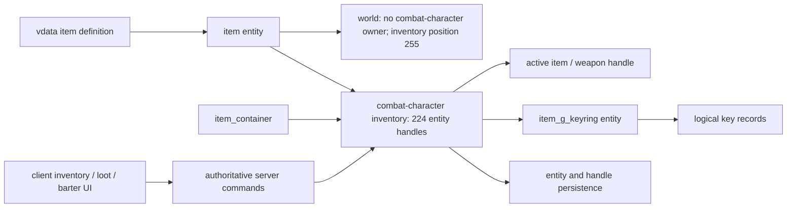

# VtMB inventory, items, containers and barter

This document owns the recovered behavior of VtMB's inventory system: carried-item storage,
item identity, stacking, equipment, ammunition, pickup and drop, the keyring, loot containers,
barter transfers, inventory predicates, and persistence. The map-specific worked example is
`docs/vtmb/sp_tutorial_1-event-surface.md`; the Python binding inventory and current remake
backing are in `docs/vtmb/script_api.md`; implementation status remains in
`docs/project/roadmap.md`.

This is a behavior specification, not an implementation description. The inventory runtime in
roadmap 9.8 remains unimplemented.

## 1. Evidence boundary

The native behavior below was recovered offline from these pinned retail modules, loaded at the
default `0x10000000` image base:

| Module | Size | SHA-256 |
|---|---:|---|
| `Vampire/dlls/vampire.dll` | 7,860,281 | `c546f4de2003624d72f54d03805e0dbe1d8157231adcc62368ff53fe6e48a76f` |
| `Vampire/cl_dlls/client.dll` | 3,428,425 | `e88beae0dd03af06493c71c5e8d87a6993b54e590cb6ad37cd3513c588582870` |

The native analysis is corroborated by decoded tutorial saves and joined to the current
patch-first exported `sp_tutorial_1` map, Python, dialogue and `vdata/items/` corpus. A
patch-first value is evidence for the content the project currently consumes, not automatically
a stock-retail authoring fact. In particular, the patch item files contain explicit Wesp edits.
The reproducible, hash-gated extraction seeds live in `research/cases/inventory/`; generated
decompilation and decoded game data remain outside Git.

No live game run or capture was required. The resulting contract closes the reverse-engineering
prerequisite for roadmap 9.8; it does not close the implementation task or roadmap 9.10's vendor
price formula.

## 2. The ownership model

Inventory is not a bag of class names. A combat character owns an array of item-entity handles,
and an ordinary carried item remains a full server entity. Players, NPCs and item containers all
reuse this model.

The relevant recovered fields are:

| Owner | Field | Offset | Meaning |
|---|---|---:|---|
| combat character | `m_hMyWeapons[224]` | `+0x1624` | carried ordinary item-entity handles |
| combat character | active weapon handle | `+0x19a4` | currently equipped/active weapon used by the exact equipment predicate |
| item | classname | `+0x11c` | script, trigger and transfer identity |
| item | `m_iInvenPos` | `+0x73c` | compact inventory position; `255` means not assigned to a carried slot |
| item | `m_iAmmoTypes[0]` | `+0x744` | primary ammunition type |
| item | `m_iMagazineCurAmts[0]` | `+0x74c` | primary loaded-magazine count |
| stackable item | `m_iItemCount` | `+0x8d0` | stack quantity |

Lookup and removal iterate all 224 handles. `Inventory_Remove` compacts the remaining ordering,
repairs their inventory positions and clears affected handles. The datamap input named
`Inventory_Remove` accepts an **entity**, only detaches/reindexes it, and is not the same operation
as Python `RemoveItem(classname)`, which also destroys the final entity.

Decoded save state confirms this entity model. A loose tutorial lockpick has no owner,
`m_iInvenPos=255`, and `CBaseCombatWeaponDefaultTouch`; after pickup the same entity is owned by
the player with `m_iInvenPos=30` and carried state. Other observed records include the safe's key
owned by the safe at position 128, the player's keyring at 28, a tire iron at 1, and a `.38` at 7.
The save container's entity-table and handle behavior is specified in
`docs/vtmb/savegame_format.md`.

## 3. The keyring is one entity with logical records

Collected keys are the deliberate exception to ordinary one-entity-per-item storage. The player
carries one ordinary `item_g_keyring` entity; that entity owns a dynamic array at `+0x914`, with
its count at `+0x920`. Each key record is `0xc0` bytes and begins with a `0x60`-byte classname
field.

Key lookup compares that field case-insensitively (`Q_strnicmp`, maximum `0x60` bytes). Removal
memmoves the later records over the match, decrements the count, and sends the owning player's
client a keyring-removal user message containing the removed index. Consequently:

- `HasItem(keyClass)` searches the 224 ordinary slots first, then the keyring records;
- `RemoveItem(keyClass)` removes an ordinary entity first, then falls back to a keyring record;
- a collected key must survive save/restore as keyring state even though it is no longer an
  ordinary standalone item entity;
- the keyring entity itself remains a normal carried item and is separately governed by its item
  data (`is_droppable=0`, `permanent_inventory=1`).

The exact byte-level save codec for the key-record array was not separately decoded. The required
behavior is the observed logical membership and removal semantics, not a byte-for-byte save port.

## 4. Item data is authoritative policy

The current patch-first corpus contains 244 `vdata/items/` definitions. `system/items.txt`
declares eleven semantic item types: `Weapon_Melee`, `Weapon_Firearm`, `Weapon_Thrown`, `Ammo`,
`Armor`, `Money`, `Jewelry`, `Generic`, `Powerup`, `Bloodpack`, and `Hidden`. Its inventory layout
declares eight sections: hidden `None`, six displayed sections (`Weapon_Melee`, `Weapon_Ranged`,
`Weapon_Thrown`, `Armor`, `Generic`, `Powerups`), and hidden `Hidden`.

The 244 current definitions break down as follows after preserving their hidden flag:

| Type | Current patch-first files |
|---|---:|
| Generic | 106 |
| Powerup | 63 |
| Weapon_Firearm | 16 visible + 1 hidden |
| Weapon_Melee | 15 visible + 3 hidden |
| Armor | 13 |
| Hidden | 10 unmarked + 9 explicitly hidden |
| Weapon_Thrown | 5 |
| Bloodpack | 3 |

### The `ItemTypes` block joins each type to a section

`ItemTypes` authors four columns per type, and the section join is **not** the type's own spelling —
four of the eleven file elsewhere. `Ammo` files under the undisplayed `None` and is therefore never
browsable; `Money`, `Jewelry` and `Bloodpack` all file under `Generic`.

| Type | `InventorySection` | `IsWielded` | `IsWorn` | `IsWeapon` |
|---|---|:--:|:--:|:--:|
| `Weapon_Melee` | `Weapon_Melee` | 1 | 0 | 1 |
| `Weapon_Firearm` | `Weapon_Ranged` | 1 | 0 | 1 |
| `Weapon_Thrown` | `Weapon_Thrown` | 1 | 0 | 1 |
| `Ammo` | `None` | 0 | 0 | 0 |
| `Armor` | `Armor` | 0 | 1 | 0 |
| `Money` | `Generic` | 0 | 0 | 0 |
| `Jewelry` | `Generic` | 0 | 1 | 0 |
| `Generic` | `Generic` | 0 | 0 | 0 |
| `Powerup` | `Powerups` | 0 | 0 | 0 |
| `Bloodpack` | `Generic` | 0 | 0 | 1 |
| `Hidden` | `Hidden` | 1 | 0 | 1 |

`IsWorn` is what distinguishes carried from worn, and it is authored on the type rather than on the
item: armour and jewellery answer it and nothing else does.

The section list is ordered, and that order is addressable. `InventorySections` declares `None`,
`Weapon_Melee`, `Weapon_Ranged`, `Weapon_Thrown`, `Armor`, `Generic`, `Powerups`, `Hidden` in that
sequence, and the `slotN` selection verbs (`docs/vtmb/controls.md`) index it offset by one, because
`slot1` addressed a `Disciplines` section the shipped file keeps commented out. So `slot2` is
`Weapon_Melee` through `slot7` for `Powerups`. Two further sections — `Weapon` and `Maintenance` —
are commented out beside `Disciplines`, which is what makes the file its own layout documentation.

### `bucket` and `bucket_position` are the authored selection order

Every `item_w_*` record and 87 non-weapon records author `bucket` and `bucket_position`. `bucket` is
the selection **column** — `0` for the melee families, `1` for ranged and thrown — and
`bucket_position` orders the entries inside it. Shipped examples: `item_w_fists` is `0`/`0`,
`item_w_tire_iron` `0`/`3`, `item_w_katana` `0`/`6`, `item_w_thirtyeight` `1`/`1`,
`item_w_supershotgun` `1`/`8`.

This is the ordering the retail weapon-selection element cycles in, and it is the one recoverable
part of that element: the class exists by RTTI name and its layout does not
(`docs/vtmb/vtmb-ui.md` § 3). Records sharing a position exist — several melee weapons author
`bucket_position 3` — so the pair is an ordering, not a unique key. A record authoring neither key
takes `0`/`0`; `item_g_bloodpack` is one such.

An item record names **four** model roles, and they are not interchangeable: `viewmodel` (first
person), `playermodel` (the loose ground model), `wieldmodel_m`/`wieldmodel_f` (the geometry a
character of that sex holds) and `infomodel`. A melee weapon nulls its `viewmodel`, so the model a
wielder carries is never the one that lies on the floor. The four roles, the equip transaction, the
`anim_prefix` key, the per-weapon mount bones and the shipped wield-model corpus are owned by
`docs/vtmb/wielded_weapons.md`.

The filename prefix is only a convention; it is not a sufficient type system. Runtime policy
comes from the parsed item record and class behavior. In the current patch-first files, 22 items
explicitly set `is_stackable=1`, 39 explicitly set `is_droppable=0`, and 29 explicitly set
`permanent_inventory=1`. These keys are distinct:

- `is_stackable` selects quantity behavior and `m_iItemCount`;
- `is_droppable` is consulted by the ordinary player drop predicate;
- `permanent_inventory` governs longer-lived inventory/storage policy and is not a synonym for
  “cannot drop.”

The keyring, armor and intrinsic weapons provide explicit non-droppable examples. Do not infer
stock behavior from patch-added values: the current tire-iron definition, for example, explicitly
marks it stackable with a limit of ten in a Wesp-authored edit.

## 5. Acquisition, stacking, equipment, removal and drop

### 5.1 Acquisition and equipment

A loose item is an unslotted world entity with default weapon/item touch handling. Successful
pickup passes that entity into the combat-character add/equip route: it acquires an owner and a
compact inventory position rather than being replaced by a classname token. Item-data policy and
class behavior decide whether it can be accepted or merged.

**Remaster divergence — explicit owner call:** loose items retain that retail touch ingress and
also expose the same acquisition transaction through the camera-targeted `+use` seam. The open-hand
context icon advertises the action, making tabletop items reachable and giving keyboard, mouse and
controller input one semantic pickup action; this does not replace or duplicate item ownership.

Player `GiveNamedItem` creates and spawns the named entity, then invokes the same item/weapon equip
path. `Weapon_Equip` calls `Inventory_Add`, performs the active-weapon switch for wieldable items,
and invokes the item's equip callback. Python `GiveItem` reaches this player-only service through
the receiver's player component.

### 5.2 Stack removal and destructive script removal

For a stackable ordinary item with `m_iItemCount >= 2`, Python `RemoveItem` decrements the count.
For a non-stackable item, or the last item in a stack, it detaches/reindexes the item and removes
the entity. If no ordinary classname matches, it attempts keyring-record removal. It returns
Python `None` whether or not an item matched.

### 5.3 Player drop is a different operation

The client emits `inven_drop <slot>` or `inven_drop_curr`; the server resolves the player's item
and invokes the combat-character drop virtual. Unless forced, the path checks the item's
`IsDroppable` policy.

- Dropping a non-stackable item or the last stack member clears active/last references as needed,
  holsters and detaches it, removes it from the compact inventory, and places a world item.
- Dropping from a stack of at least two decrements the carried count and creates/spawns a separate
  world entity of the same classname.

Thus script `RemoveItem` destroys the final ordinary entity, while player drop preserves an item
in the world. They must not share a “delete item” implementation shortcut.

## 6. Python `Character` inventory methods

All item names below are classnames. Invalid combat-character receivers raise `AttributeError`;
successful mutation wrappers return Python `None`.

| Method | Retail behavior |
|---|---|
| `HasItem(item)` | Case-insensitive search of all 224 ordinary slots, then case-insensitive keyring lookup; returns boolean. |
| `GiveItem(item)` | Player-only call to `GiveNamedItem(item, 0)`; creates/finds and equips/adds through the item path. A failed grant logs “Could not give item.” |
| `RemoveItem(item)` | Case-insensitive ordinary lookup; decrements a multi-count stack or destroys the final entity, then falls back to keyring-record removal. Returns `None` even on no match. |
| `HasWeaponEquipped(item)` | Compares the active weapon's classname to the supplied string with an exact, case-sensitive comparison; returns boolean. It does not mean merely “owned.” |
| `AmmoCount(item)` | Finds the owned ordinary item. A stackable item returns `m_iItemCount`; a non-stackable item returns its primary loaded-magazine count; no item returns zero. |
| `GiveAmmo(item, amount)` | Requires the named owned item. A stackable item adds directly to `m_iItemCount`; a non-stackable item adds `amount` to the combat character's reserve pool for the item's primary ammo type. |
| `StartBarter(arg0, arg1)` | On an NPC, the authored `StartBarter(0,0)` path opens vendor barter. Container use selects loot mode through the same lower service. |

The `GiveAmmo` wrapper contains no visible clamp of its own; class/data services may still impose
limits. `AmmoCount` and `GiveAmmo` are intentionally asymmetric for firearms: the former reports
the **loaded magazine**, while the latter grants **reserve ammunition**.

For the patch-first `.38`, item data names ammo type `ThirtyeightRound` and a magazine/default/drop
size of six. The tutorial relies on the asymmetry: when the player owns `item_w_thirtyeight` and
`AmmoCount(...) == 0`, dialogue grants six reserve rounds.

## 7. Containers and authoritative transfers

`item_container` is a `CBaseCombatCharacter`; its contents are the same 224-slot item-entity
inventory, not a separate list of names. Map keys `equip0` through `equip11` are twelve authored
spawn seeds, not the storage limit. On spawn, each non-empty key creates and dispatches a real
item entity and adds/equips it into the container.

The recovered inputs are:

| Input | Behavior |
|---|---|
| `SpawnItemInContainer(classname)` | Creates and spawns the named item, validates `Inventory_Add`, and equips/adds it to the container. |
| `AddEntityToContainer(targetname)` | Resolves all case-insensitive/wildcard target-name matches and moves each matching item only if it has no combat-character owner. |
| `DeleteItems` | Iterates all 224 slots, removes/destroys every contained entity, marks it unslotted, clears the array and active/last handles. It is not a transfer. |

Use is exclusive: a container holds one current-user handle. Opening for a player calls the lower
barter service in loot mode (`showloot`) and opens the mover; using it again closes the mover,
sends `hidebarter`, and releases that user.

The client loot/barter panel emits `vbarter <verb> <slot>`. Server `CmdBarter` owns the actual
mutation:

| Verb | Transfer | Economy | Container output |
|---|---|---|---|
| `Take` | target/container → player | none | `OnItemRemove` |
| `Give` | player → target/container | none | `OnItemInsert` |
| `Buy` | vendor → player | applies buy price/money service | transfer path |
| `Sell` | player → vendor | applies sell price/money service | transfer path |

Each path handles full-entity transfer and stack split/merge. The server does not trust a client
panel to mutate ownership. The exact buy/sell price formula belongs to roadmap 9.10 and remains
outside this closed inventory case.

## 8. `trigger_inventory_check`

`trigger_inventory_check` is a specialized `CBaseTrigger`. After the base touch filter accepts an
entering entity, `StartTouch` requires the player component, then searches the player's ordinary
224-slot inventory and keyring case-insensitively for the authored `itemname`. A match fires
`OnPlayerHasItem`.

It evaluates on an accepted **entry**, not continuously while the player remains inside. The
class does not disable or consume itself; one-shot behavior must be authored in the map's output
graph. It tests membership, not stack quantity.

## 9. Client presentation and command boundary

The retail client exposes `slot1` through `slot8`, `toggleinven`, `showinventory`,
`inven_drop`, `inven_drop_curr`, the `showbarter` / `hidebarter` handlers, and the `vbarter` verbs.
Its hotkey UI stores ten hotkey type/data pairs, and its barter UI stores the target entity index.
These are presentation and command-selection records; the server remains authoritative for item
state.

The authored inventory layout exposes the six displayed categories listed in section 4. Existing
retail action data exposes category commands for melee (2), ranged (3), armor/clothing (5), and
general (6). Although commands 1–8 are registered, this investigation did not invent category
semantics for otherwise unmapped slots and did not settle the separate `vhotkey` one-frame
deferral question in RE36.

## 10. `sp_tutorial_1` as the worked contract

The patch-first tutorial joins every important inventory edge:

| Beat | Authored state and required result |
|---|---|
| Lockpick | Loose `item_g_lockpick tut_lockpicks` starts as a world entity. `spawnLockpicks()` removes a currently carried lockpick, if present, before spawning/relocating the loose entity. Pickup must make `HasItem` see it. |
| Safe and key | `item_container_animated tutsafe` authors `equip0=item_k_tutorial_chopshop_stairs_key`; spawn materializes a real contained item. Taking it transfers ownership to the player, fires `OnItemRemove`, sets `G.Tut_Key=1`, and enables `trig_jack_teleport_3`. |
| Safe lock | `item_container_lock tutsafelock` requires a key, has difficulty 5 / skill type 1, is parented to the safe, and authors `delete_key=0`; successful use must not silently consume the key. |
| Tire iron | Disabled `trig_popup_tireiron_check` tests `item_w_tire_iron` on player entry. A match opens popup 35, disables itself immediately, and disables the ordinary popup trigger after 0.5 seconds. The map supplies the one-shot behavior. |
| `.38` grant | Jack dialogue grants `item_w_thirtyeight`; later branches remove it or retain it. |
| `.38` ammo | `ammo_container` authors five separate `.38` item entities. `trig_more_ammo` destroys its current contents on touch and, after 0.1 seconds, spawns exactly one new `.38` item into it. `tutorial.py` grants 12 reserve rounds; Jack dialogue conditionally grants six when the owned gun's loaded magazine is empty. |
| Optional hunter cache | `container_hunter` authors five weapon entities; its loot UI uses the same container/barter transfer path. Hunter dialogue's `StartBarter(0,0)` uses vendor mode instead. |

There is one patch-first authored mismatch: `spawnKeycard()` finds `tutsafelock` and invokes
`SpawnItemInContainer` on that lock, although the input belongs to the container, not the attached
lock. Treat this as a dangling/non-fatal authored call unless separate evidence demonstrates a
forwarding path; do not silently retarget it to `tutsafe` as a “fix.”

## 11. Faithful remake invariants

Roadmap 9.8 can implement against the following closed invariants:

1. One authoritative service owns item entities, compact owner slots, stack counts, active item,
   reserve ammo, keyring records and transfer operations.
2. Ordinary item identity is entity + classname; collected-key identity is a record in the
   carried keyring. Script and trigger queries see both.
3. Pickup, give, drop, destructive removal, and container transfer are distinct operations with
   distinct entity-lifetime effects.
4. Item data, not classname prefix or UI category, decides stackability, droppability,
   permanence, ammunition and wieldability.
5. `AmmoCount` reports a firearm's loaded magazine; `GiveAmmo` increases its reserve pool.
6. Containers own real item entities and use the server barter transport for take/give; client UI
   only requests mutations.
7. Inventory trigger evaluation is player-only, case-insensitive, entry-driven, and map-owned for
   one-shot policy.
8. Save/restore preserves entity ownership/slot state, active state, stack/magazine/reserve state,
   and logical keyring membership without duplicating or re-consuming items.

The remaining work is implementation and acceptance, not additional inventory-model discovery.
Price calculation remains economy work; exact UI skin/layout remains UI work; individual weapon
combat behavior remains weapon/animation work.
